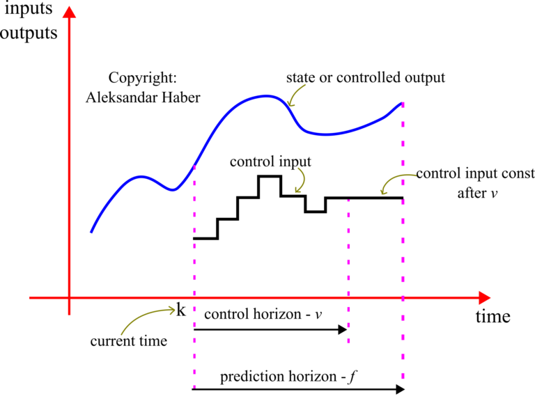

# 模型预测控制

## 模型预测控制形式

考虑线性系统

$$
\begin{equation}
\begin{array}{l}
    x_{k+1} = Ax_k + B u_k \\
    z_k = Cx_k
\end{array}
\end{equation}
$$

其中, $x_k \in \mathbb{R}^n$ 为状态(state), $u_k \in \mathbb{R}^m$ 为控制输入(control input), $z_k \in \mathbb{R}^p$ 为输出(output). $A$, $B$, $C$ 分别为系统矩阵(system matrix), 输入矩阵(input matrix), 输出矩阵(output matrix). 在当前的问题表述中, 输出 $\mathbf{z}_{k}$ 并不一定是观测输出, 也就是说，它不必等于测量得到的输出.

在我们的建模中, $\mathbf{z}_k$ 实际上是一组应当跟踪给定参考轨迹的状态变量。我们假设状态向量 $\mathbf{x}_{k}$ 是完全已知的。换言之，我们假定已经精确重建了状态向量.在后续的教程中, 我们将考虑状态向量不可直接观测的情形。在那种情况下, 我们会将状态重建器（也称为观测器）与 MPC 算法相结合.

接下来, 我们需要引入下列记号, 图中亦有说明.

* 预测时域的长度记为 $f$, 它表示未来用于预测状态轨迹行为的时域, 由用户选择, 在某些情况下也可视为调节参量.

* 控制时域的长度记为 $v$, 它表示未来允许控制输入变化的时域, 我们引入限制 $v \le f$, 控制时域之后的控制输入保持常值并等于控制时域内的最后一个取值, 在后文中将更加清楚, 控制时域由用户选择, 在某些情况下也可视为调节参量.

* $\mathbf{u}_{k+i|k},\ i=0,1,2,3,\ldots,v-1$ 表示在时刻 $k$ 计算并用于时刻 $k+i$ 的控制输入, 该控制输入由 MPC 问题的解确定, 在此需注意控制输入向量仅在 $k+v$ 之前变化, 此后保持常值并等于 $\mathbf{u}_{k+v-1|k}$, 后文会进一步说明.

* $\mathbf{x}_{k+i|k},\ i=0,1,2,3,\ldots,f$ 表示在时刻 $k$ 得到的对应时刻 $k+i$ 的状态向量预测.

* $\mathbf{z}_{k+i|k},\ i=0,1,2,3,\ldots,f$ 表示在时刻 $k$ 得到的对应时刻 $k+i$ 的输出向量预测.

模型预测控制器的目标是在时刻 $k$ 确定一组控制输入 $\mathbf{u}_{k+i|k},\ i=0,1,2,3,\ldots,v-1$, 使系统输出 $\mathbf{z}_{k+i},\ i=1,2,3,\ldots,f$ 在预测时域内跟随给定输出轨迹（期望控制轨迹）. 这是通过利用当前状态 $\mathbf{x}_{k}$ 以及系统模型矩阵 $A,B,C$ 预测输出轨迹 $\mathbf{z}_{k+i|k},\ i=0,1,2,3,\ldots,f$, 并最小化期望轨迹与预测轨迹之间的差异来实现的. 后续将进一步阐明.

设当前处于时刻 $k$, 希望对直到时刻 $k+f$ 的状态与输出进行预测. 另设时刻 $k$ 的状态完全已知, 即 $\mathbf{x}_{k}$ 已知. 由式 (1) 可得在时刻 $k+1$

$$
\begin{equation}
\begin{array}{c}
    x_{k+1|k} = A x_{k} + B u_{k|k} \\
    \mathbf{z}_{k+1|k} = C x_{k+1|k} = C A x_{k} + C B u_{k|k}
\end{array}{c}
\end{equation}
$$
