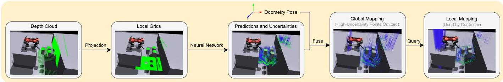

# AME

<video width="1080" controls src="../public/projects/ame/g1-stacks-ame2.mp4"></video>

## 算法详解

传统的腿足运动方法分为两大类，每类都有显著的局限性。依赖于显式地形映射和经典控制的基于模型的方法通常提供可解释性，但缺乏动态机动所需的敏捷性，并受限于计算约束。相反，端到端学习方法可以实现卓越的敏捷性，但通常在对未见环境的泛化方面表现不佳，并且其决策过程缺乏可解释性。
AME-2提出了第三条路径：一个基于学习的框架，它既保留了显式映射的可解释性优势，又实现了端到端方法的敏捷性和鲁棒性。该系统结合了三个关键创新：用于处理地形信息的基于注意力的神经网络架构、轻量级不确定性感知映射管道，以及促进实际部署的师生训练方案。

### 模型架构

AME-2的核心在于其基于注意力的地图编码架构，该架构处理高程地图以提取地形感知特征用于控制决策。该系统通过专用编码器处理本体感受信息（机器人状态、速度、关节位置）以及地形数据。

AME-2编码器通过以下几个阶段运行：

* 局部特征提取：一个CNN处理高程地图以生成点对点的局部特征，捕捉精细的地形细节。
* 全局上下文：一个MLP后接最大池化操作，提取代表整体地形特征的全局特征。
* 注意力机制：全局特征与本体感受信息结合形成一个用于多头注意力的查询向量，该向量根据相关性对局部特征进行加权。
* 特征整合：加权的局部特征与全局特征拼接，形成最终的地图嵌入。

这种架构允许机器人动态地将注意力集中在显著的地形区域，同时保持对更广阔环境上下文的感知。

### 基于学习的高度映射

AME-2 的一个关键组件是其轻量级、感知不确定性的映射管线，它将原始深度传感器数据转换为适用于实时控制的仰角图。该映射系统解决了几个关键挑战：处理传感器噪声、管理遮挡以及为板载部署保持计算效率。

映射网络使用CNN架构，可以预测仰角估计及其相关不确定性。该网络使用贝叶斯学习和修改后的β-NLL损失函数进行训练：

$$L = sg[\hat{\sigma}(X)] \cdot \lVert \hat{h}(X) - h\rVert^{2}_{2} + \beta\cdot\lVert\hat{\sigma}-\sigma_{tarfet}\rVert^{2}_{2}$$

其中 $sg[\cdot]$ 表示停止梯度算子，防止不适当地优化不确定性以最小化数据拟合项。这鼓励网络提供可靠的不确定性估计，特别是对于遮挡或噪声区域。
系统采用概率赢者通吃融合而非标准贝叶斯融合，以防止在反复观察但始终遮挡的区域出现过度自信。局部预测根据其精度融合到全局地图中，不确定性较高的预测对最终仰角估计的影响较小。

### 训练方法

AME-2 采用复杂的教师-学生训练方案，旨在弥合仿真与现实之间的差距。教师策略首先使用地面真实仰角图和完美的本体感受信息进行训练，学习在不同地形上的敏捷运动技能。然后，学生策略学习使用神经映射管线来复制这些行为。

训练公式使用目标达成目标而非简单的速度跟踪，鼓励发展穿越地形的行为。奖励函数结合了：

* 任务奖励：朝向目标的姿态和航向跟踪
* 正则化：稳定性、平滑动作和能效
* 安全约束：避免关节限制并保持平衡

学生训练目标结合了多个损失项：

$$L_{student} = L_{PPO} + \lambda_{action} L_{action} + \lambda_{repr} L_{repr}$$

其中 $L_{PPO}$ 是标准 PPO 损失，$L_{action}$ 从教师那里提取动作，而 $L_{repr}$ 通过均方误差强制教师和学生地图嵌入之间的相似性。
训练过程中广泛的领域随机化包括机器人动力学变化、传感器噪声模拟和映射误差，以增强模拟到现实的迁移鲁棒性。

## MDP

### Rewards

| 奖励                       | 公式                                                         | 权重                 | 函数名称 |
| -------------------------- | ------------------------------------------------------------ | -------------------- | -------- |
| Linear velocity tracking   | $exp({-\lVert v^{*}_{xy, j} - v_{xy, j}\rVert})$             | 5.0                  | -        |
| Angular velocity tracking  | $exp({-\lVert \omega^{*}_{z, j} - \omega_{z, j}\rVert})$     | 3.0                  | -        |
| Termination peanlty        | $-n_{termination}$                                           | 200                  | -        |
| Collision peanlty          | $-n_{collision, j}$                                          | 1                    | -        |
| Action rate                | $-\lVert a_{jt} = a_{jt-1}\rVert^2$                          | $5.0 \times 10^{-3}$ | -        |
| Joint acceleration penalty | $-\lVert \ddot{q}_{j}\rVert^{2}$                             | $2.5 \times 10^{-7}$ | -        |
| Joint torque penalty       | $-\lVert \tau_{j} \rVert^{2}$                                | $2.0 \times 10^{-5}$ | -        |
| Joint position limits      | $-\max(\lvert q_j \rvert - 0.9q_{lim, j}, \; 0)$             | 1.0                  | -        |
| Joint velocity limits      | $-\max(\lvert \dot{q}_j \rvert - 0.9\dot{q}_{lim, j}, \; 0)$ | 1.0                  | -        |
| Joint torque limits        | $-\max(\lvert \tau_j \rvert - 0.9\tau_{lim, j}, \; 0)$       | 0.2                  | -        |
| Linear velocity penalty    | $-v_{z, i^{*}}^{2}$                                          | 1.0                  | -        |
| Angular velocity penalty   | $-\lVert \omega_{xy, i}\rVert^{2}$                           | $5.0 \times 10^{-2}$ | -        |
| Contact force penalty      | $-max(\lVert F_f\rVert - 700, 0)$                            | $2.5 \times 10^{-5}$ | -        |
| Foot slippage penalty      | $-c_{f}^{*}\lVert v_f\rVert$                                 | 0.5                  | -        |
| Joint deviation penalty    | $max(\lVert q_j - q_{0, j}\rVert^{2}-0.25, 0.0)$             | -                    | -        |
| No fly                     | $-n_{zero\_contact}$                                         | -                    | -        |
| Straight body              | $-\lVert g_i\rVert^2$                                        | -                    | -        |

### Observations

| Observation          | 公式          | Shape                 | Actor | Critic |
| -------------------- | ------------- | --------------------- | ----- | ------ |
| Base linear velocity | $v_b$         |                       | N     | Y      |
| Angular velocity     | $\omega_b$    |                       | Y     | Y      |
| Gravity vector       | $g_b$         |                       | Y     | Y      |
| Joint positions      | $q_j$         |                       | Y     | Y      |
| Joint velocities     | $\dot{q}_j$   |                       | Y     | Y      |
| Previous actions     | $a_{t-1}$     |                       | Y     | Y      |
| Velocity commands    | $V_{command}$ |                       | Y     | Y      |
| vector map scans     | $m$           | $L \times W \times 3$ | Y     | Y      |

### Sim2Real(域随机化)

1. startup
   1. randomize rigid body material
   2. randomize bass mass
   3. randomize base com
2. reset
   1. apply external force torque
   2. reset root state uniform
   3. reset joints by scale
3. interval
   1. push by setting velocity

## 不同地形下仿真演示

<video controls src="../public/projects/ame/g1-rails-ame2.mp4" title="Title"></video>
<video controls src="../public/projects/ame/g1-pyramid_stairs-ame2.mp4" title="Title"></video>
<video controls src="../public/projects/ame/g1-hf_gaps-ame2.mp4" title="Title"></video>