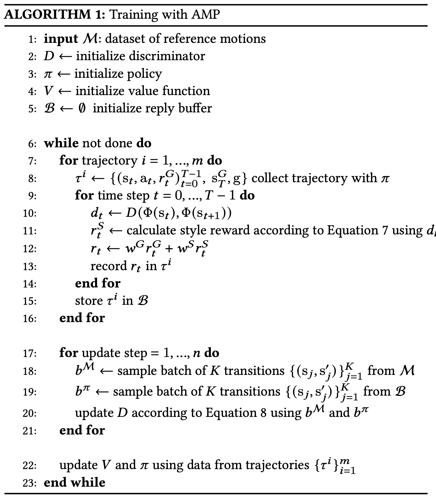
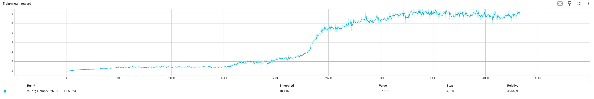
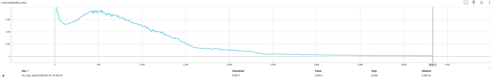

# AMP

<video width="1080" controls src="..//public/projects/luwu/amp-demo.mp4"></video>

AMP（Adversarial Motion Priors，对抗性运动先验）是一种基于 GAN 和强化学习RL的运动控制框架，核心是通过对抗模仿从非结构化运动数据中学习风格特征，让物理模拟角色或真实机器人在完成任务的同时，呈现自然、风格化的运动。

传统运动控制方法存在两大痛点，一个是手动设计负担重，需精心设计模仿目标（如轨迹跟踪误差）和动作选择机制，难以适配大规模非结构化运动数据。另一个则是运动自然度不足，纯 RL 仅关注任务完成度，生成的运动机械僵硬；传统模仿学习依赖固定轨迹，缺乏灵活性。AMP 本质是对抗学习和强化学习的融合框架，其创新在于无需手动设计模仿规则和动作选择器，用对抗性判别器学习运动数据的风格先验，用 RL 训练控制策略，最终实现任务目标（如导航、击球）和风格模仿（如人类行走、僵尸步态）的双重目标。

## AMP 的原理

AMP 解决的核心问题是在强化学习训练中，智能体的动作容易出现不自然的输出，比如机器人走路姿势僵硬、角色动画卡顿，原因是传统 RL 只优化任务奖励（比如类似于走到终点这种任务），忽略了运动的自然性先验（比如人类走路的关节角度规律），其有以下三大核心组件：

1. 运动数据集 M：主要包含非结构化运动片段，如人类 mocap 数据、关键帧动画等。使用时无需标注技能类别或时序同步信息，仅需提供关节角度、身体姿态的时间序列等运动序列。
2. 控制策略 π：输入为关节位置、速度角色等状态和目标位置、速度指令等的任务目标，输出为机器人动作，如关节目标角度，核心是通过 RL 学习完成任务并贴合风格的行为，通过 RL 学习最大化任务奖励和风格奖励的累积回报，实现做得对和做得像的统一。
3. 对抗性判别器 D：核心组件，目标是区分来自 M的真实运动数据和来自π的策略生成的运动。与传统 GAN 不同，D 基于状态转移（
） 而非单帧状态进行训练，避免依赖运动数据中的动作标签。

AMP 基础思路为，首先构建运动先验模型，用生成对抗网络从真实的自然运动数据中学习运动的概率分布，这个分布就是运动先验，代表合理、自然的动作应该长什么样。然后将先验融入强化学习，在 RL 训练过程中，引入对抗损失，让智能体生成的动作不仅要满足任务奖励，还要尽可能贴近 GAN 学到的自然运动分布，从而平衡任务完成度和动作自然度。

AMP 的数学框架围绕 GAN 损失和 RL 奖励损失的联合优化展开，**核心损失**函数为：

$$
L_{total} = L_{RL} + \lambda \cdot L_{GAN}
$$

其中 $\lambda > 0$ 是平衡系数，控制自然先验的约束强度。

**判别器**的目标是**区分真实动作和生成动作**，采用标准 GAN 的对数损失，GAN 损失 $L_D$ 公式为：

$$
L_D = -\mathbb{E}_{a_{real}} \sim p_{data}[\log D_{\phi}(a_{real})] - \mathbb{E}_{a_t \sim \pi_{\theta}}[\log(1 - D_{\phi}(a_t))]
$$

**生成器**的目标是欺骗判别器，让生成的动作被判别为真实，同时还要优化任务奖励。GAN 生成器的对抗损失：

$$
L_G = -\mathbb{E}_{a_t \sim \pi_{\theta}}[\log D_{\phi}(a_t)]
$$

**PPO 算法**的损失函数即 RL 策略优化损失 $L_{RL}$，其形式为：

$$
L_{PPO} = \mathbb{E}\left[\min\left(r_t(\theta)\hat{A}_t, \; clip\big(r_t(\theta), 1-\epsilon, 1+\epsilon\big)\hat{A}_t\right)\right]
$$

其中，$r_t(\theta) = \frac{\pi_{\theta_{old}}}(a_t \mid s_t){\pi_{\theta}(a_t \mid s_t)}$ 是策略更新的比率；$\hat{A}_t$ 是优势函数，衡量动作 $a_t$ 的好坏；$\epsilon$ 是 PPO 的剪切系数，防止策略更新幅度过大。

AMP 的关键是将 $\log D_{\phi}(a_t)$ 作为额外的奖励项融入优势函数 $\hat{A}_t$，即：

$$
\hat{A}_t = A_{task}, t + \lambda \cdot \log D_{\phi}(a_t)
$$

这样，智能体在优化任务的同时，会主动学习更自然的动作。

### AMP 的基本设计逻辑

AMP 的设计逻辑围绕非结构化运动数据驱动，对抗模仿学习，强化学习的融合展开，核心是通过数据预处理、网络架构搭建、联合训练、推理部署四步闭环，实现任务执行与风格模仿的统一。



#### 数据预处理

* **数据采集**：收集多样化原始运动数据，来源包括人类动作捕捉(mocap)数据、艺术家关键帧动画、机器人轨迹优化结果等。数据形式为状态序列，包含关节角度、根节点速度、端点位置等连续帧信息。
* **数据适配与增强**：
  + 运动重定向：将人类或通用动捕数据通过优化映射到目标主体，保证运动相似度的同时满足 kinematic 约束。
  + 标准化处理：对数据进行归一化，去除异常帧，并通过镜像、时间缩放、反向播放等方式增强数据多样性。
  + 特征提取：提前提取运动的核心特征，如根节点的线性/角速度、关节局部旋转与速度、端点 3D 位置，所有特征基于主体局部坐标系。
* **数据初始化适配**：训练时采用参考状态初始化策略，将角色/机器人的初始状态随机采样自运动数据集，同时设置早期终止条件。

#### 网络架构设计

AMP 无传统 GAN 的生成器，而是以 **RL 策略网络**为**核心执行单元**，以**对抗判别器**为**风格评估单元**。

* **RL 策略网络（$\pi$）**：输入为实时状态（关节位置/速度、根节点姿态、地面接触状态等）和任务目标（目标位置、速度指令等），输出为动作指令（关节目标角度、力矩参数）。网络结构采用 MLP，通常包含 2-3 个隐藏层（如 1024→512 神经元），激活函数为 ReLU，策略输出服从高斯分布。
* **对抗判别器（D）**：输入为状态转移 $(s_t, s_{t+1})$ 而非动作序列或单帧状态，解决运动数据中动作标签不可得的问题，同时捕捉运动的动态特征。输出为连续值分数（接近 1 表示真实运动，-1 表示生成运动）。网络结构与策略网络架构一致，采用最小二乘损失优化，避免梯度饱和。

#### 联合训练流程

* **初始化配置**：初始化策略网络 $\pi$、价值函数 $V$、判别器 $D$、回放缓冲区 $B$，设定超参数（$w^G = 0.5$，$w^S = 0.5$，梯度惩罚系数 $w^{GP} = 10$，PPO 裁剪阈值 $0.02$，折扣因子 $\gamma$ 对单风格模仿设为 $0.95$，对复杂任务设为 $0.99$）。
* **轨迹收集与奖励计算**：用当前策略 $\pi$ 生成轨迹，记录状态 $s_t$、动作 $a_t$、任务奖励 $r^G$。将状态转移输入判别器 $D$ 得到相似度分数，通过公式 $r^S = \max\left[0, \; 1 - 0.25\big(D(s_t, s_{t+1}) - 1\big)^2\right]$ 转换为 $[0, 1]$ 区间的风格奖励。总奖励 $r = w^G \cdot r^G + w^S \cdot r^S$。
* **交替更新**：
  + 先更新判别器 $D$：从运动数据集 $M$ 采样真实状态转移 $b_M$，从回放缓冲区 $B$ 采样生成状态转移 $b_\pi$。损失采用最小二乘损失 + 梯度惩罚。
  + 更新策略 $\pi$ 与价值函数 $V$：从回放缓冲区采样轨迹，用 GAE($\lambda$) 计算优势函数，TD($\lambda$) 更新价值函数 $V$，用 PPO 算法更新策略 $\pi$。
* **动态调优**：可动态调整 $w^G$ 与 $w^S$，如初期增大 $w^S$ 让策略先学习风格，后期增大 $w^G$ 优先保证任务完成度。
* **多风格适配（Multi-AMP）**：通过 one-hot 风格选择器切换不同判别器 $D^i$，每个风格对应独立的缓冲区 $B^i$，实现多风格并行训练与实时切换。

#### 推理阶段

训练完成后，策略 $\pi$ 根据实时状态与任务目标自动生成符合风格的动作，无需手动选择运动片段或调整参数。判别器冻结，风格通过训练习得的策略内隐式保留。

### 稳定对抗训练的核心设计

* **最小二乘判别器**：采用最小二乘损失替代交叉熵损失，避免 sigmoid 函数在输出极端值时的梯度饱和问题，让策略 $\pi$ 在训练全程都能获得有效梯度反馈。
* **梯度惩罚**：在判别器的损失函数中加入额外惩罚项，对真实运动样本的观察特征 $\phi(s, s')$ 计算梯度的 L2 范数，惩罚非零梯度，防止策略偏离真实运动分布。
* **细粒度观察特征**：包含根节点动态（线性速度和角速度）、关节细节（局部旋转和局部速度）、端点特征（手、脚等的 3D 位置），完整覆盖整体-局部-端点的运动动态信息，让判别器能精准区分真实运动的自然动态与生成运动的机械动态。

## 实验设置

### MDP

### Observations

Observations 分成三部分: actor, critic 和 discriminator 的输入，分别对应强化学习中的策略网络、价值网络和对抗判别器。

1. Actor Observations

| Name                    | Description                                  |
| ----------------------- | -------------------------------------------- |
| base_ang_vel            | 机器人基座的角速度                           |
| root_local_rot_tan_norm | 机器人根节点的局部旋转，使用 tanh 归一化表示 |
| velocity_commands       | 机器人接收到的速度指令，包含线速度和角速度   |
| joint_pos               | 机器人所有关节的当前角度位置                 |
| joint_vel               | 机器人所有关节的当前角速度                   |

2. Critic Observations

| Name                    | Description                                  |
| ----------------------- | -------------------------------------------- |
| base_lin_vel            | 机器人基座的线速度                           |
| base_ang_vel            | 机器人基座的角速度                           |
| root_local_rot_tan_norm | 机器人根节点的局部旋转，使用 tanh 归一化表示 |
| velocity_commands       | 机器人接收到的速度指令，包含线速度和角速度   |
| joint_pos               | 机器人所有关节的当前角度位置                 |
| joint_vel               | 机器人所有关节的当前角速度                   |
| actions                 | 机器人所有关节的动作指令                     |
| key_body_pos_b          | 机器人关键身体部位（如手、脚等）的 3D 位置   |

3. Discriminator Observations

| Name         | Description                  |
| ------------ | ---------------------------- |
| base_ang_vel | 机器人基座的角速度           |
| joint_pos    | 机器人所有关节的当前角度位置 |
| joint_vel    | 机器人所有关节的当前角速度   |

### Event

| Stage    | Event Name                    | Description                                                                                      |
| -------- | ----------------------------- | ------------------------------------------------------------------------------------------------ |
| statrup  | randomize_rigid_body_material | 在仿真环境启动时，随机化机器人和地面的物理材质属性，如摩擦系数、弹性等，以增加训练的鲁棒性。     |
| startup  | randomize_rigid_body_mass     | 在仿真环境启动时，随机化机器人各个部件的质量属性，以增加训练的鲁棒性。                           |
| reset    | apply_external_force_torque   | 在环境重置时，向机器人施加随机的外部力或力矩，以增加训练的鲁棒性。                               |
| reset    | reset_from_ref                | 在环境重置时，将机器人的状态随机初始化为运动数据集中的一个参考状态，以增加训练的多样性和稳定性。 |
| interval | push_by_setting_velocity      | 在训练过程中，定期根据预设的速度指令向机器人施加推力，以引导其学习特定的运动模式。               |

### Rewards

| Name                 | Description                                                                                                                  |
| -------------------- | ---------------------------------------------------------------------------------------------------------------------------- |
| track_lin_vel_xy_exp | 线速度跟踪奖励，基于机器人在水平面上的线速度与目标速度的指数距离计算，鼓励机器人以正确的速度移动。                           |
| track_ang_vel_z_exp  | 角速度跟踪奖励，基于机器人绕垂直轴的角速度与目标角速度的指数距离计算，鼓励机器人以正确的角速度旋转。                         |
| lin_vel_z_l2         | 垂直线速度奖励，基于机器人在垂直方向上的线速度的 L2 范数计算，鼓励机器人保持适当的垂直运动。                                 |
| ang_vel_xy_l2        | 水平角速度奖励，基于机器人绕水平轴的角速度的 L2 范数计算，鼓励机器人保持适当的水平旋转。                                     |
| dof_torques_l2       | 关节力矩奖励，基于机器人所有关节的力矩指令的 L2 范数计算，鼓励机器人使用较小的力矩来完成任务。                               |
| action_rate_l2       | 动作变化率奖励，基于机器人所有关节的动作指令与前一时间步的动作指令之间的 L2 范数计算，鼓励机器人动作平滑。                   |
| feet_air_time        | 脚部空中时间奖励，基于机器人脚部离地的时间计算，鼓励机器人保持适当的步态和空中时间。                                         |
| undesired_contacts   | 不期望接触奖励，基于机器人与环境中不期望接触的数量计算，鼓励机器人避免与环境中的障碍物或地面发生不必要的接触。               |
| flat_orientation_l2  | 平坦姿态奖励，基于机器人根节点的局部旋转与水平姿态之间的 L2 范数计算，鼓励机器人保持平坦的姿态。                             |
| dof_pos_limits       | 关节位置限制奖励，基于机器人所有关节的当前角度位置与预设的关节位置限制之间的 L2 范数计算，鼓励机器人保持在合理的关节范围内。 |

### Terminations

| Name            | Description                                                                      |
| --------------- | -------------------------------------------------------------------------------- |
| time_out        | 当训练环境中的时间步数达到预设的最大值时，训练回合结束。                         |
| base_contact    | 当机器人基座与地面发生接触时，训练回合结束。                                     |
| base_height     | 当机器人基座的高度低于预设的最小值时，训练回合结束。                             |
| bad_orientation | 当机器人根节点的局部旋转与水平姿态之间的 L2 范数超过预设的阈值时，训练回合结束。 |

## AMP 训练

### AMP 关键参数

| 参数名称           | 值          | 备注                     |
| ------------------ | ----------- | ------------------------ |
| learning rate      | 0.0001      | -                        |
| 判别器 hidden dims | [1024, 512] | MLP                      |
| style reward scale | 5.0         | 风格奖励的权重           |
| task style lerp    | 0.3         | 任务奖励和风格奖励的平衡 |
| loss type          | LSGAN       | 最小二乘 GAN             |

### 训练结果

<video width="1080" controls src="..//public/projects/luwu/amp-demo.mp4"></video>

#### 关键曲线







## 附录

### Unitree G1 Joints

| Index | Joint Name                  |
| ----- | --------------------------- |
| 0     | left_hip_pitch_joint        |
| 1     | right_hip_pitch_joint       |
| 2     | waist_yaw_joint             |
| 3     | left_hip_roll_joint         |
| 4     | right_hip_roll_joint        |
| 5     | waist_roll_joint            |
| 6     | left_hip_yaw_joint          |
| 7     | right_hip_yaw_joint         |
| 8     | waist_pitch_joint           |
| 9     | left_knee_joint             |
| 10    | right_knee_joint            |
| 11    | left_shoulder_pitch_joint   |
| 12    | right_shoulder_pitch_joint  |
| 13    | left_ankle_pitch_joint      |
| 14    | right_ankle_pitch_joint     |
| 15    | left_shoulder_roll_joint    |
| 16    | right_shoulder_roll_joint   |
| 17    | left_ankle_roll_joint       |
| 18    | right_ankle_roll_joint      |
| 19    | left_shoulder_yaw_joint     |
| 20    | right_shoulder_yaw_joint    |
| 21    | left_elbow_joint            |
| 22    | right_elbow_joint           |
| 23    | left_wrist_roll_joint       |
| 24    | right_wrist_roll_joint      |
| 25    | left_wrist_pitch_joint      |
| 26    | right_wrist_pitch_joint     |
| 27    | left_wrist_yaw_joint        |
| 28    | right_wrist_yaw_joint       |

### Agent Config

```yaml
seed: 42
device: cuda:0
num_steps_per_env: 24
max_iterations: 50000
empirical_normalization: {}
obs_groups:
  policy:
  - policy
  critic:
  - critic
  discriminator:
  - disc
  discriminator_demonstration:
  - disc_demo
clip_actions: null
check_for_nan: true
save_interval: 200
experiment_name: g1_amp
run_name: ''
logger: tensorboard
neptune_project: isaaclab
wandb_project: isaaclab
resume: false
load_run: .*
load_checkpoint: model_.*.pt
class_name: AMPRunner
actor: {}
critic: {}
algorithm:
  class_name: PPOAMP
  num_learning_epochs: 5
  num_mini_batches: 4
  learning_rate: 0.0001
  schedule: adaptive
  gamma: 0.99
  lam: 0.95
  entropy_coef: 0.01
  desired_kl: 0.01
  max_grad_norm: 1.0
  optimizer: adam
  value_loss_coef: 1.0
  use_clipped_value_loss: true
  clip_param: 0.2
  normalize_advantage_per_mini_batch: false
  share_cnn_encoders: false
  rnd_cfg: null
  symmetry_cfg:
    use_data_augmentation: true
    use_mirror_loss: true
    data_augmentation_func: luwu.tasks.tracking.amp.mdp.symmetry.g1:compute_symmetric_states
    mirror_loss_coeff: 0.1
  amp_cfg:
    disc_obs_buffer_size: 100
    grad_penalty_scale: 10.0
    disc_trunk_weight_decay: 0.0001
    disc_linear_weight_decay: 0.01
    disc_learning_rate: 0.0001
    disc_max_grad_norm: 1.0
    amp_discriminator:
      hidden_dims:
      - 1024
      - 512
      activation: elu
      style_reward_scale: 5.0
      task_style_lerp: 0.3
    loss_type: LSGAN
policy:
  class_name: ActorCritic
  init_noise_std: 1.0
  noise_std_type: scalar
  state_dependent_std: false
  actor_obs_normalization: false
  critic_obs_normalization: false
  actor_hidden_dims:
  - 512
  - 256
  - 128
  critic_hidden_dims:
  - 512
  - 256
  - 128
  activation: elu
```
