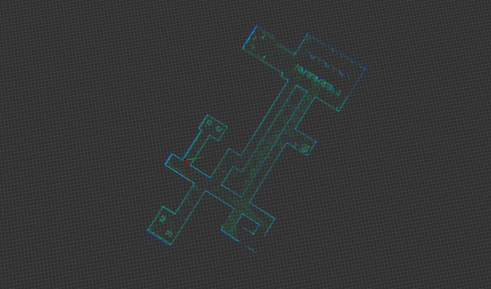
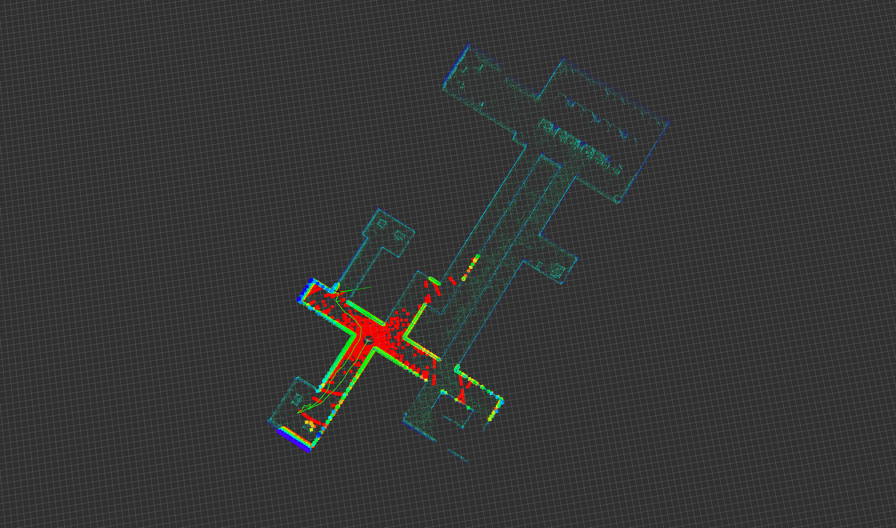

# 人形机器人

## 运动控制

<video width="1080" controls src="../../public/projects/humanoid/g1_mlp_default_mujoco.mp4"></video>
<video width="1080" controls src="../../public/projects/humanoid/g1_mlp_default_gazebo.mp4"></video>

## 定位与建图

<video width="1080" controls src="../../public/projects/humanoid/indoor1.mp4"></video>

## 路径规划与避障

<video width="1080" controls src="../../public/projects/humanoid/astar.mp4"></video>
