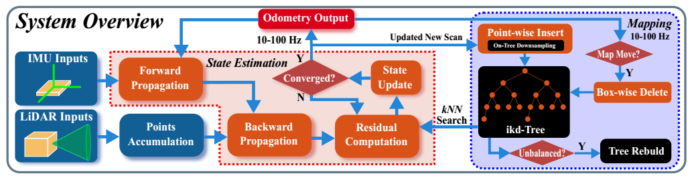
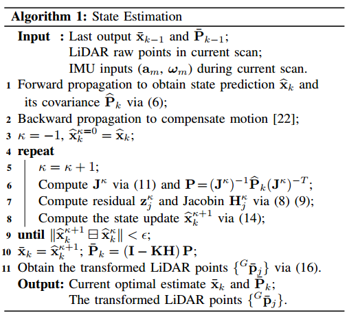

# 宇树人形机器人 G1 基于 FAST-LIO 的定位与建图

## 1. 宇树机器人 G1 硬件介绍

宇树 G1 是一款仿人形机器人平台，在其头部倒装有一台激光雷达（如 Livox 系列固态激光雷达），同时机身内置惯性测量单元（IMU）。这种倒装安装方式会导致直接使用传感器数据进行建图时，得到的点云和 IMU 数据是倒立的。

G1 的里程计数据以较高频率发布（如 500Hz 和 20Hz），包含位置、速度、欧拉角、角速度及四元数信息。在建图与定位方案中，G1 采用 **FAST-LIO / FAST-LIO2** 作为核心的激光雷达-惯性紧耦合里程计算法。

---

## 2. FAST-LIO 算法

FAST-LIO（Fast LiDAR-Inertial Odometry）是一种计算高效且鲁棒的激光雷达-惯性里程计框架，通过紧耦合的迭代扩展卡尔曼滤波器（Iterated Extended Kalman Filter, iEKF）融合 LiDAR 特征点与 IMU 数据，能够在快速运动、噪声大或特征稀疏的环境中实现稳健导航。

### 2.1 算法原理

#### 2.1.1 状态模型

系统状态定义在流形 $\mathcal{M} = SO(3) \times \mathbb{R}^{15}$ 上，维度为 18：

$$
\mathbf{x} \doteq \left[ {}^{G}\mathbf{R}_I^{T}, \ {}^{G}\mathbf{p}_I^{T}, \ {}^{G}\mathbf{v}_I^{T}, \ \mathbf{b}_\omega^{T}, \ \mathbf{b}_\mathbf{a}^{T}, \ {}^{G}\mathbf{g}^{T} \right]^{T} \in \mathcal{M}
$$

其中：
* ${}^{G}\mathbf{R}_I$：IMU 在世界坐标系下的姿态（旋转矩阵）
* ${}^{G}\mathbf{p}_I$：IMU 在世界坐标系下的位置
* ${}^{G}\mathbf{v}_I$：IMU 在世界坐标系下的速度
* $\mathbf{b}_\omega, \mathbf{b}_\mathbf{a}$：陀螺仪和加速度计的偏置
* ${}^{G}\mathbf{g}$：世界坐标系下的重力矢量

#### 2.1.2 前向传播（IMU 预测）

每接收一个 IMU 测量值，系统按照离散运动学模型进行状态和协方差的前向传播。传播时将过程噪声置零：

$$
\hat{\mathbf{x}}_{i+1} = \hat{\mathbf{x}}_i \boxplus (\Delta t \cdot \mathbf{f}(\hat{\mathbf{x}}_i, \mathbf{u}_i, \mathbf{0}))
$$

协方差传播使用误差状态线性化模型：

$$
\hat{\mathbf{P}}_{i+1} = \mathbf{F}_{\tilde{\mathbf{x}}} \hat{\mathbf{P}}_i \mathbf{F}_{\tilde{\mathbf{x}}}^T + \mathbf{F}_{\mathbf{w}} \mathbf{Q} \mathbf{F}_{\mathbf{w}}^T
$$

传播持续到当前 LiDAR 扫描结束时刻 $t_k$，得到预测状态 $\hat{\mathbf{x}}_k$ 和协方差 $\hat{\mathbf{P}}_k$。

#### 2.1.3 后向传播与运动畸变补偿

由于 LiDAR 点云中的各个点在不同时刻采样，导致点云存在运动畸变。为了将所有特征点补偿到扫描结束时刻 $t_k$，FAST-LIO 采用后向传播：

从 $\hat{\mathbf{x}}_k$ 开始，以 LiDAR 特征点的采样频率逆向递推，计算每个特征点相对于扫描结束时刻的相对位姿 $^{I_k}\check{\mathbf{T}}_{I_j}$。然后利用已知的外参 $^{I}\mathbf{T}_L$ 将局部坐标系下的点投影到 $L_k$ 坐标系：

$$
^{L_k}\mathbf{p}_{f_j} = ^{I}\mathbf{T}_L^{-1} \cdot ^{I_k}\check{\mathbf{T}}_{I_j} \cdot ^{I}\mathbf{T}_L \cdot ^{L_j}\mathbf{p}_{f_j}
$$

补偿后的点云可以视为同一时刻 $t_k$ 采样。

#### 2.1.4 残差计算

将补偿后的特征点 $^{L_k}\mathbf{p}_{f_j}$ 通过当前估计的状态 $\hat{\mathbf{x}}_k^{\kappa}$ 变换到全局坐标系：

$$
^{G}\hat{\mathbf{p}}_{f_j}^{\kappa} = ^{G}\hat{\mathbf{T}}_k^{\kappa} \cdot ^{I}\mathbf{T}_L \cdot ^{L_k}\mathbf{p}_{f_j}
$$

对于每个特征点，在已有地图中搜索最近的平面（或边缘），计算点到面（或点到线）的残差：

$$
\mathbf{z}_j^{\kappa} = \mathbf{G}_j \left( ^{G}\hat{\mathbf{p}}_{f_j}^{\kappa} - ^{G}\mathbf{q}_j \right)
$$

其中 $\mathbf{G}_j = \mathbf{u}_j^T$（平面）或 $\mathbf{G}_j = [\mathbf{u}_j]_{\wedge}$（边缘），$\mathbf{u}_j$ 为法向量或边缘方向。

#### 2.1.5 迭代状态更新（iEKF）

将残差模型线性化后，与 IMU 先验（预测状态）构成最大后验估计问题：

$$
\min_{\tilde{\mathbf{x}}_k^{\kappa}} \left( \| \mathbf{x}_k \boxminus \hat{\mathbf{x}}_k \|_{\hat{\mathbf{P}}_k^{-1}}^2 + \sum_{j=1}^{m} \| \mathbf{z}_j^{\kappa} + \mathbf{H}_j^{\kappa} \tilde{\mathbf{x}}_k^{\kappa} \|_{\mathbf{R}_j^{-1}}^2 \right)
$$

通过迭代求解，状态更新公式为：

$$
\hat{\mathbf{x}}_k^{\kappa+1} = \hat{\mathbf{x}}_k^{\kappa} \boxplus \left( - \mathbf{K} \mathbf{z}_k^{\kappa} - (\mathbf{I} - \mathbf{K} \mathbf{H}) (\mathbf{J}^{\kappa})^{-1} (\hat{\mathbf{x}}_k^{\kappa} \boxminus \hat{\mathbf{x}}_k) \right)
$$

#### 2.1.6 高效的卡尔曼增益计算

传统卡尔曼增益 $\mathbf{K} = \mathbf{P} \mathbf{H}^T (\mathbf{H} \mathbf{P} \mathbf{H}^T + \mathbf{R})^{-1}$ 需要求逆一个维度等于测量数量的矩阵，计算量巨大。FAST-LIO 利用矩阵求逆引理，推导出等价形式：

$$
\mathbf{K} = (\mathbf{H}^T \mathbf{R}^{-1} \mathbf{H} + \mathbf{P}^{-1})^{-1} \mathbf{H}^T \mathbf{R}^{-1}
$$

新公式中只需要求逆状态维度（18）的矩阵，而测量维度（特征点数量）往往上千，因此大幅降低了计算复杂度。

### 2.2 算法伪代码

---

## 3. 定位与建图结果

<video width="1080" controls src="../../public/projects/humanoid/indoor1.mp4"></video>
