# 人形机器人运动控制

## 算法

使用 PPO 算法, 其中神经网络架构使用 MLP, 激活函数使用 ELU. 具体参数如下:

```python
class G1RoughCfgPPO(LeggedRobotCfgPPO):
    class policy:
        init_noise_std = 0.8
        # For mlp, for gazebo
        actor_hidden_dims = [512, 256, 128]
        critic_hidden_dims = [512, 256, 128]
        activation = "elu"  # can be elu, relu, selu, crelu, lrelu, tanh, sigmoid

    class algorithm(LeggedRobotCfgPPO.algorithm):
        entropy_coef = 0.01

    class runner(LeggedRobotCfgPPO.runner):
        policy_class_name = "ActorCritic"
        max_iterations = 10000
        run_name = ""
        experiment_name = "g1"
```

## 实验

相比于默认模型, 增大了 tracking_lin_vel, tracking_ang_vel 和 alive 奖励的权重, 让机器人更好地跟着指令和避免摔倒. 同时惩罚 ang_vel_xy, orientation 和 action_rate 的权重也增加了, 让机器人更好地保持身体的稳定. 其他奖励的权重保持不变.

| Reward            | 默认    | tracking |
| ----------------- | ------- | -------- |
| tracking_lin_vel  | 1.0     | 2.0      |
| tracking_ang_vel  | 0.5     | 1.0      |
| lin_vel_z         | -2.0    | -2.0     |
| ang_vel_xy        | -0.05   | -0.1     |
| orientation       | -1.0    | -1.5     |
| base_height       | -10.0   | -10.0    |
| dof_acc           | -2.5e-7 | -2.5e-7  |
| dof_vel           | -1e-3   | -1e-3    |
| feet_air_time     | 0.0     | 0.0      |
| collision         | 0.0     | 0.0      |
| action_rate       | -0.01   | -0.05    |
| dof_pos_limits    | -5.0    | -5.0     |
| alive             | 0.15    | 0.2      |
| hip_pos           | -1.0    | -1.0     |
| contact_no_vel    | -0.2    | -0.2     |
| feet_swing_height | -20.0   | -20.0    |
| contact           | 0.18    | 0.18     |

### 单项 reward

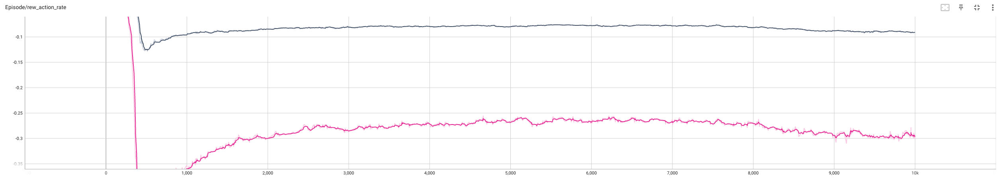

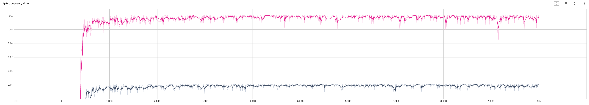

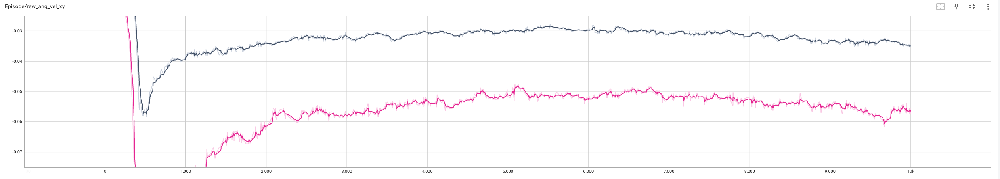

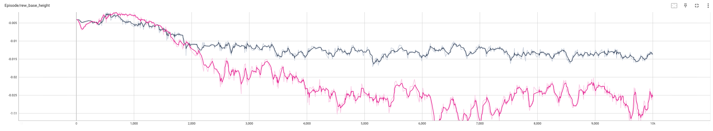

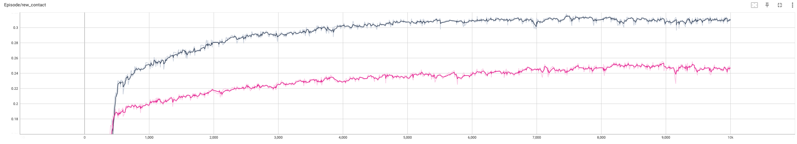

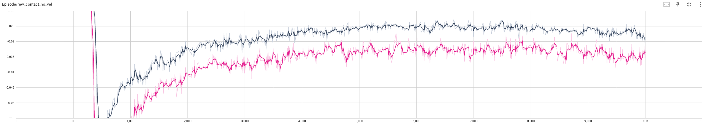

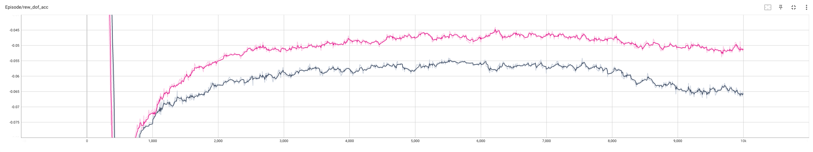

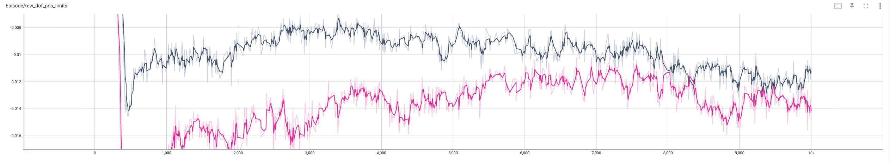

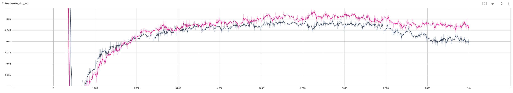

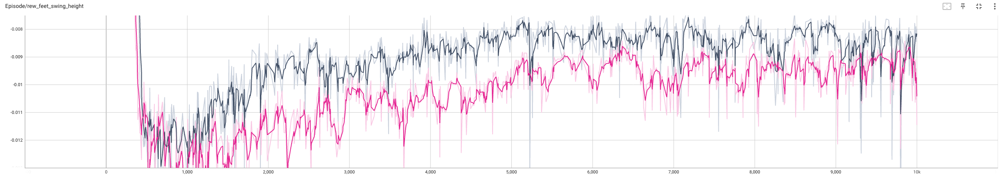

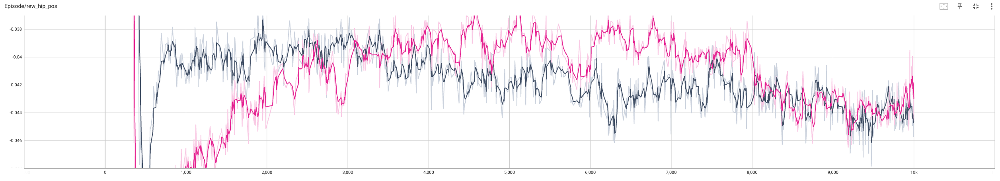

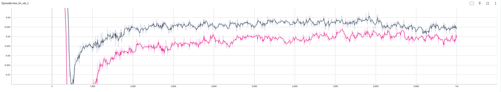

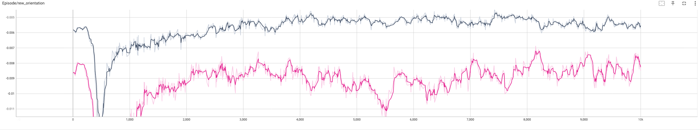

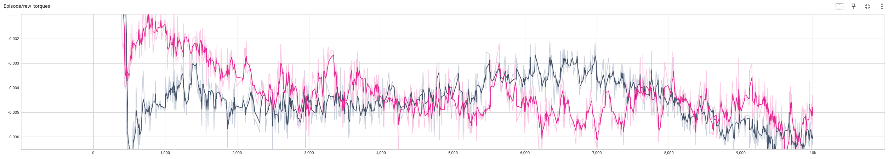

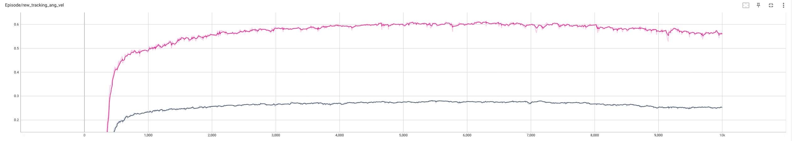

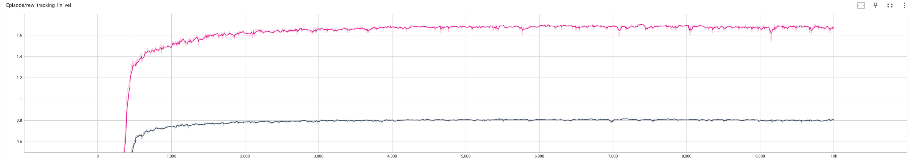

### 损失

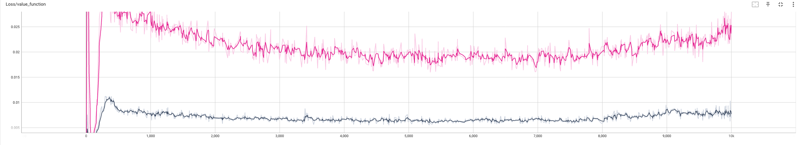

### 平均 reward

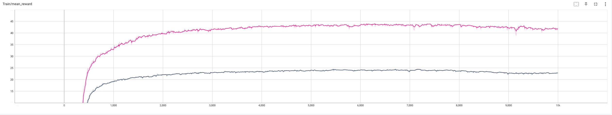

## Demo

<video width="1080" controls src="../../public/projects/humanoid/g1_mlp_default_mujoco.mp4"></video>
<video width="1080" controls src="../../public/projects/humanoid/g1_mlp_default_gazebo.mp4"></video>

## 附录

### 50 系显卡与 IsaacGym 兼容问题

由于 Nvidia rtx 50 系列显卡的算力升级到 `sm_120` , 支持 `sm_120` 的 pytorch 需要 python 3.10 之后的版本, 而 IsaacGym 由于已经停止维护, 需要 python 3.8 的环境, 导致 IsaacGym 无法在 50 系显卡上使用. 目前的解决方案是重新编译 pytorch. 具体参考这个 [Isaacgym_ws](https://github.com/Renkunzhao/Isaacgym_ws.git), 里面有已经编译好的 pytroch 2.3.0 版本, 无需自行编译.
