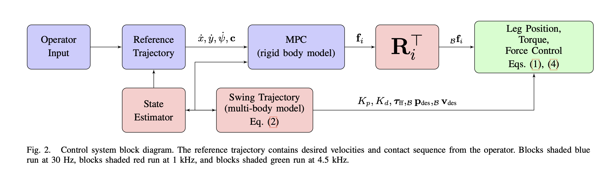
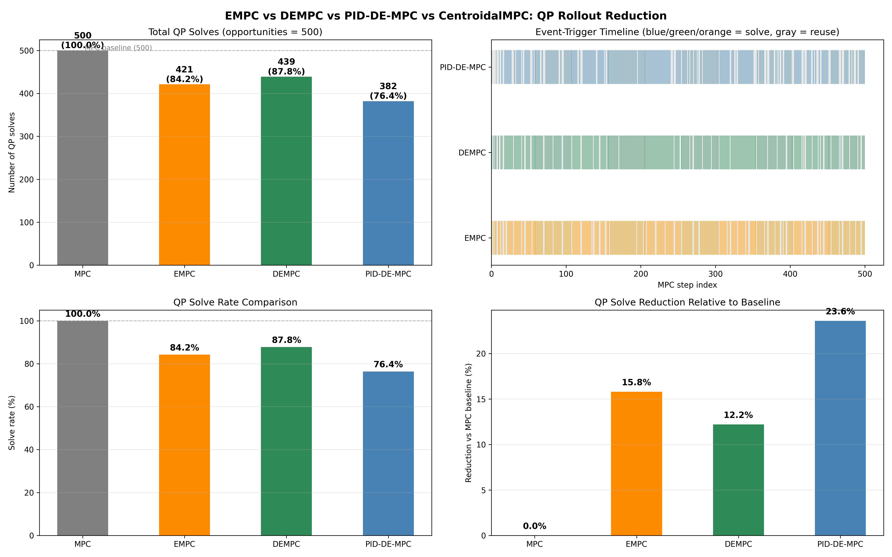
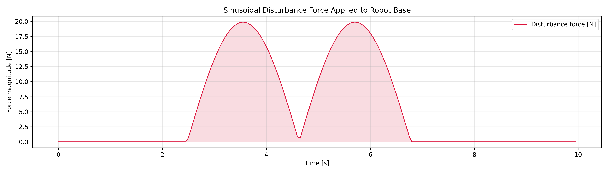
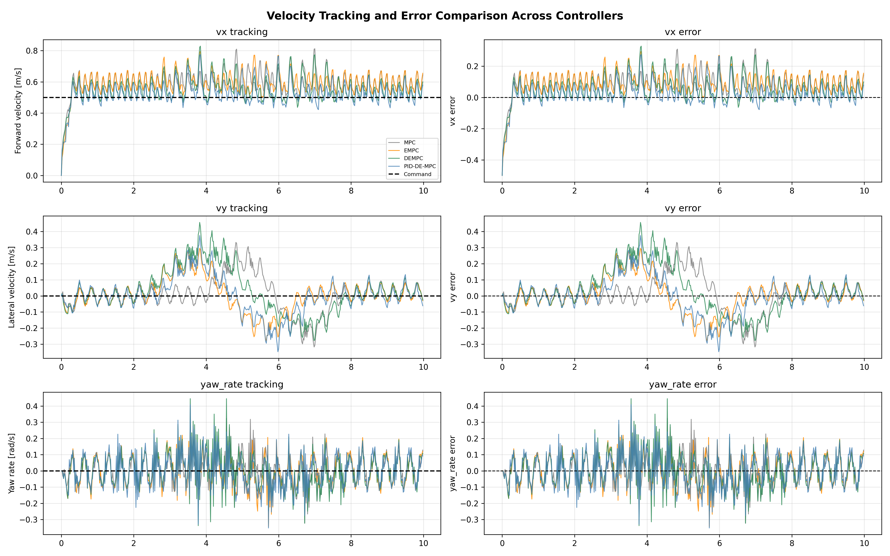
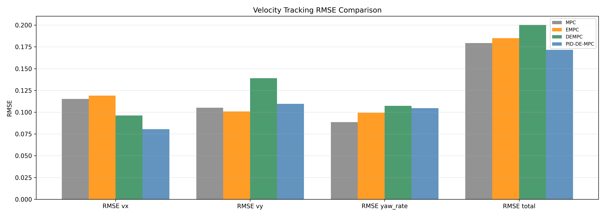
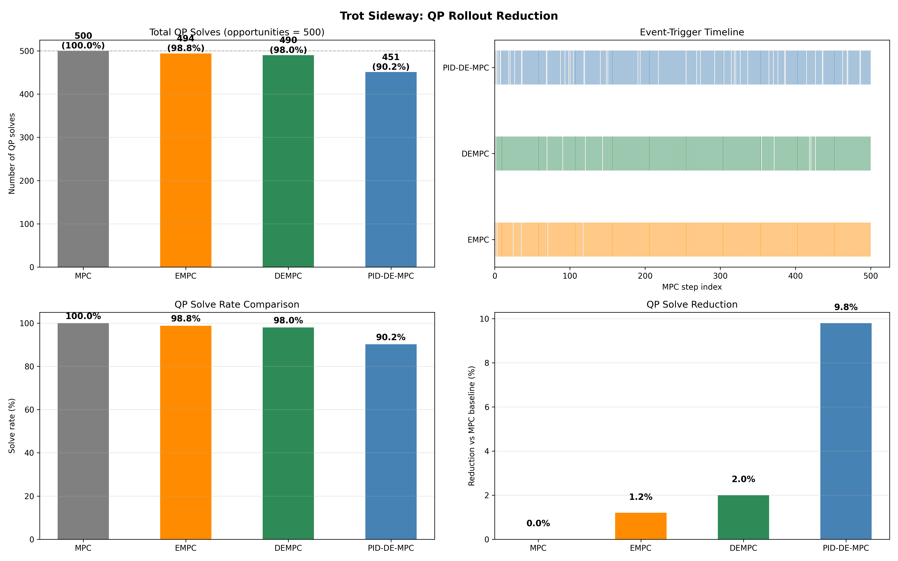
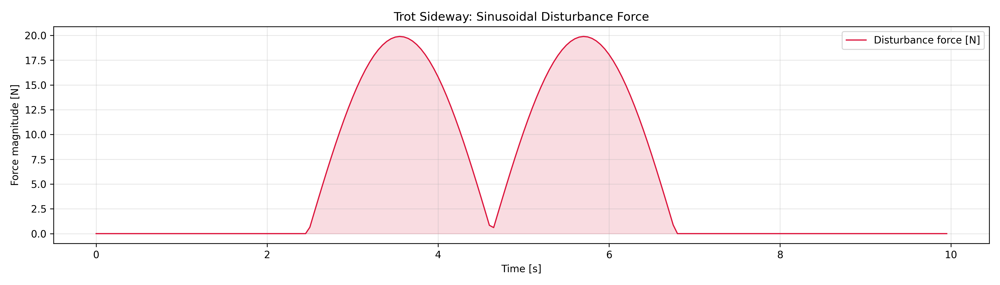
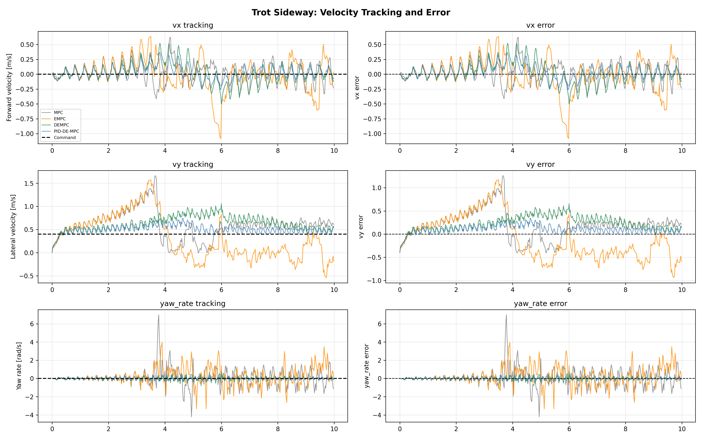

# MPC 四足机器人运动控制

## 1. 简介

模型预测控制（MPC）是四足机器人运动控制的主流方法——它在滚动时域上规划地面反作用力，同时满足摩擦锥和接触约束。然而，在每个控制周期（30–50 Hz）求解二次规划（QP）带来了巨大的计算负担，尤其对于机载嵌入式处理器而言。

本项目实现了Sun等人（2025）提出的**PID-DE-MPC**框架，通过以下三个思路来降低在线计算量，同时保持鲁棒性：

1. **事件触发MPC** — 仅当状态预测误差超过阈值时才重新求解QP；否则将上一时刻的解平移后复用。
2. **扩张状态观测器（ESO）** — 实时估计作用在质心上的外部扰动，将估计值作为前馈补偿施加到地面反作用力上。
3. **PID型动态触发机制** — 事件触发阈值利用状态误差的比例、积分和微分项进行自适应调节，使触发条件比静态阈值更加智能。

同时实现了两个简化基线算法用于对比：

| 控制器 | 事件触发机制 | 扰动观测器 |
| --- | --- | --- |
| **MPC**（基线） | 无 — 每步求解 | 无 |
| **EMPC** | 静态 `‖e‖ > 0.8` | 无 |
| **DEMPC** | 静态 `‖e‖ > 0.8` | ESO + 前馈补偿 |
| **PID-DE-MPC** | PID自适应 | ESO + 前馈补偿 |

## 系统建模与模型预测控制

控制器基于[[Di Carlo et al., 2018]](https://dspace.mit.edu/bitstream/handle/1721.1/138000/convex_mpc_2fix.pdf)提出的凸MPC框架，该框架最初在MIT Cheetah 3上验证。

### 控制架构

#### 机器人平台与约定

四足机器狗每条腿具有三个扭矩控制关节（内收/外展、髋、膝），最大关节扭矩 250 Nm，最高转速 21 rad/s。电机扭矩通过电流环闭环控制，无直接的力/力矩传感器。

机体坐标系下的变量以左下标 $\mathcal{B}$ 标记，无下标者为世界坐标系向量。向量为粗体小写（如 $\mathbf{a}$），矩阵为粗体大写（如 $\mathbf{A}$），标量为斜体小写（如 $a$）。$\mathbf{1}_n$ 表示 $n \times n$ 单位矩阵。

#### 状态机与步态调度

控制器采用固定时序的足部触地和离地行为。当某脚处于摆动相时，执行摆动腿控制器；当处于支撑相时，执行地面力控制器。步态（站立、小跑、束缚、gallop 等）由上层状态机根据操作指令和接触检测结果切换。

#### 摆动腿控制

摆动腿在笛卡尔空间内规划轨迹，并采用反馈+前馈的关节扭矩控制：

$$\pmb{\tau}_i = \mathbf{J}_i^\top \left[ \mathbf{K}_p(\pmb{\delta}\mathbf{p}_{i, \mathrm{ref}} - \pmb{\delta}\mathbf{p}_i) + \mathbf{K}_d(\pmb{\delta}\mathbf{v}_{i, \mathrm{ref}} - \pmb{\delta}\mathbf{v}_i) \right] + \pmb{\tau}_{i, \mathrm{ff}}$$

其中 $\mathbf{J}_i$ 为足部雅可比，$\mathbf{K}_p, \mathbf{K}_d$ 为对角正定增益矩阵，$\pmb{\tau}_{i, \mathrm{ff}}$ 通过操作空间惯性矩阵、参考加速度及科里奥利/重力项计算。为保证不同腿构型下闭环自然频率恒定，$\mathbf{K}_p$ 按 $K_{p, i} = \omega_i^2 \Lambda_{i, i}$ 自适应调整，$\Lambda_{i, i}$ 为腿沿第 $i$ 轴的表观质量。

落脚点规划采用启发式：$\mathbf{p}^{\mathrm{des}} = \mathbf{p}^{\mathrm{ref}} + \mathbf{v}^{\mathrm{CoM}} \Delta t / 2$，其中 $\Delta t$ 为触地时间，$\mathbf{v}^{\mathrm{CoM}}$ 为质心水平投影速度。

#### 1.4 地面力控制

支撑相时，关节扭矩直接由 MPC 解得的地面反作用力映射得到：

$$\pmb{\tau}_i = \mathbf{J}_i^\top \mathbf{R}^\top \mathbf{f}_i$$

其中 $\mathbf{R}$ 为机体至世界的旋转矩阵，$\mathbf{f}_i$ 为 MPC 输出的期望力。

### 简化机器人动力学模型

#### 单刚体动力学

预测控制器将机器人视为一个受接触力作用的单刚体，忽略腿部惯性（腿重约占总重 10%）。世界坐标系下的刚体运动方程为：

$$\ddot{\mathbf{p}} = \frac{\sum_i \mathbf{f}_i}{m} - \mathbf{g}, \quad \frac{\mathrm{d}}{\mathrm{d}t}(\mathbf{I}\boldsymbol{\omega}) = \sum_i \mathbf{r}_i \times \mathbf{f}_i, \quad \dot{\mathbf{R}} = [\boldsymbol{\omega}]_\times \mathbf{R}$$

其中 $\mathbf{p}$ 为质心位置，$m$ 为质量，$\mathbf{g}$ 为重力加速度，$\mathbf{I}$ 为惯性张量，$\boldsymbol{\omega}$ 为角速度，$\mathbf{R}$ 为旋转矩阵，$\mathbf{r}_i$ 为接触点相对质心的位置向量。

#### 小角度近似与角速度简化

采用 Z‑Y‑X 欧拉角 $\boldsymbol{\Theta}=[\phi, \theta, \psi]^\top$ 表示姿态。在小滚转/俯仰角假设下，欧拉角速率与角速度的关系可近似为：

$$\dot{\boldsymbol{\Theta}} \approx \mathbf{R}_z^\top(\psi) \boldsymbol{\omega}$$

同时忽略刚体转动中的进动/章动项，即 $\frac{\mathrm{d}}{\mathrm{d}t}(\mathbf{I}\boldsymbol{\omega}) \approx \mathbf{I}\dot{\boldsymbol{\omega}}$。世界坐标系中的惯性张量近似为 $\hat{\mathbf{I}} = \mathbf{R}_z(\psi) \, {}_\mathcal{B}\mathbf{I} \, \mathbf{R}_z(\psi)^\top$。

#### 状态空间形式

综合上述近似，系统的连续时间动力学可写为线性时变状态空间方程：

$$\dot{\mathbf{x}}(t) = \mathbf{A}_c(\psi)\, \mathbf{x}(t) + \mathbf{B}_c(\mathbf{r}_1, \dots, \mathbf{r}_n, \psi)\, \mathbf{u}(t)$$

状态向量 $\mathbf{x} \in \mathbb{R}^{13}$ 包含滚转、俯仰、偏航角、角速度、质心位置、质心速度等，控制输入 $\mathbf{u} = [\mathbf{f}_1^\top, \dots, \mathbf{f}_n^\top]^\top$ 为各脚接触力。矩阵 $\mathbf{A}_c$ 和 $\mathbf{B}_c$ 仅依赖于偏航角 $\psi$ 和接触点位置 $\mathbf{r}_i$，因此若已知参考轨迹，可预先计算，实现线性时变离散化。

### 模型预测控制问题

#### 问题形式

在离散时间域上，建立长度为 $k$ 的预测时域标准 MPC 问题：

$$
\begin{aligned}
\min_{\mathbf{x}, \mathbf{u}} \quad & \sum_{i=0}^{k-1} \left( \|\mathbf{x}_{i+1}-\mathbf{x}_{i+1, \mathrm{ref}}\|_{\mathbf{Q}_i} + \|\mathbf{u}_i\|_{\mathbf{R}_i} \right) \\
\text{s.t.} \quad & \mathbf{x}_{i+1} = \mathbf{A}_i \mathbf{x}_i + \mathbf{B}_i \mathbf{u}_i, \quad i=0, \dots, k-1 \\
& \underline{\mathbf{c}}_i \leq \mathbf{C}_i \mathbf{u}_i \leq \overline{\mathbf{c}}_i, \quad \mathbf{D}_i \mathbf{u}_i = 0
\end{aligned}
$$

其中 $\mathbf{Q}_i, \mathbf{R}_i$ 为半正定加权矩阵，$\mathbf{A}_i, \mathbf{B}_i$ 为离散化系统矩阵。不等式约束 $\mathbf{C}_i$ 用于限制摩擦锥和法向力范围，等式约束 $\mathbf{D}_i$ 将非触地脚对应的力强制为零。

#### 力约束

每只触地脚需满足：

* 法向力范围：$f_{\min} \leq f_z \leq f_{\max}$
* 摩擦锥（金字塔近似）：$-\mu f_z \leq f_x \leq \mu f_z, \; -\mu f_z \leq f_y \leq \mu f_z$

实际参数见表 I（如 $\mu=0.6$，$f_{\min}=10\, \text{N}$，$f_{\max}=666\, \text{N}$）。

#### 参考轨迹生成

参考轨迹仅包含非零的 $xy$ 速度、$xy$ 位置、$z$ 位置、偏航角和偏航率。其余状态（滚转、俯仰及其导数、$z$ 速度）设为零。参考轨迹时长为 0.3–0.5 秒，每 0.03–0.05 秒重新计算一次，以应对机器人状态扰动。

#### 离散化与 QP 凝聚

利用零阶保持法将连续系统离散化，得到时变离散模型 $\mathbf{x}[n+1] = \hat{\mathbf{A}}\, \mathbf{x}[n] + \hat{\mathbf{B}}[n]\, \mathbf{u}[n]$。为加速求解，采用“凝聚”技巧消除状态变量，将整个预测时域内的状态表示为初始状态和控制序列的线性函数：

$$\mathbf{X} = \mathbf{A}_{\mathrm{qp}}\mathbf{x}_0 + \mathbf{B}_{\mathrm{qp}}\mathbf{U}$$

代入目标函数后，得到关于 $\mathbf{U}$ 的二次规划问题：

$$\min_{\mathbf{U}} \frac{1}{2} \mathbf{U}^\top \mathbf{H} \mathbf{U} + \mathbf{U}^\top \mathbf{g}$$

其中 $\mathbf{H} = 2(\mathbf{B}_{\mathrm{qp}}^\top \mathbf{L} \mathbf{B}_{\mathrm{qp}} + \mathbf{K})$，$\mathbf{L}, \mathbf{K}$ 为状态偏差和力幅值的对角权重矩阵。求解后，取 $\mathbf{U}$ 的前 $3n$ 个元素作为当前时刻的期望地面反作用力。

#### 实现参数

MPC 的时域长度为一个步态周期（0.33–0.5 s），离散时间步数 10–16。求解频率 25–50 Hz。使用 qpOASES 求解器，在机载 Intel i7（2011）上典型求解时间 <1 ms（参见图 4）。所有代码在 C++ 中实现，依赖 Eigen3 线性代数库。

---

## Unitree Go2机器人

### 物理参数

Go2 是一款12自由度的电驱动四足机器人。URDF模型位于 `models/URDF/go2_description/` 。通过Pinocchio提取的关键参数：

| 参数 | 符号 | 数值 |
| --- | --- | --- |
| 总质量 | $m$ | ~12 kg |
| 基座惯量 (xx) | $I_{xx}$ | 0.0245 kg·m² |
| 基座惯量 (yy) | $I_{yy}$ | 0.0981 kg·m² |
| 基座惯量 (zz) | $I_{zz}$ | 0.107 kg·m² |
| 摩擦系数 | $\mu$ | 0.8 |
| 腿数 | — | 4 |
| 每条腿关节数 | — | 3 (髋侧摆、髋前摆、膝) |

### 状态空间模型

质心动力学以零阶保持器在时间步长 $\Delta t$ 下离散化：

$$
\mathbf{x}_{k+1} = \mathbf{A}_d\, \mathbf{x}_k + \mathbf{B}_{d, k}\, \mathbf{u}_k + \mathbf{g}_d
$$

其中 $\mathbf{A}_d \in \mathbb{R}^{12\times 12}$ 为（常值）离散时间状态矩阵，$\mathbf{B}_{d, k} \in \mathbb{R}^{12\times 12}$ 为时变输入矩阵（依赖于足端位置和偏航角），$\mathbf{g}_d \in \mathbb{R}^{12}$ 为离散重力向量。

**状态向量**（12自由度）：

$$
\mathbf{x} = [p_x, p_y, p_z, \ \phi, \theta, \psi, \ v_x, v_y, v_z, \ \omega_x, \omega_y, \omega_z]^T
$$

**控制输入**（12个力，每条腿3个）：

$$
\mathbf{u} = [f_{FL, x}, f_{FL, y}, f_{FL, z}, \ f_{FR, x}, f_{FR, y}, f_{FR, z}, \ f_{RL, x}, f_{RL, y}, f_{RL, z}, \ f_{RR, x}, f_{RR, y}, f_{RR, z}]^T
$$

**腿部构型**（站立姿态）：每条腿初始关节角度为 `[0.0, 0.9, -1.8]` rad（髋侧摆、髋前摆、膝）。

## 实验结果

我们在MuJoCo物理仿真中对四种控制器在三种运动场景下进行了对比。每个场景运行10秒，使用3 Hz小跑步态（0.6占空比）。MPC以48 Hz运行（步态周期 / 16），腿部控制器以200 Hz运行，物理仿真以1000 Hz运行。仿真中施加随机脉冲踢击扰动（2–3次，70–100 N 侧向力，0.03 s 持续时间），用于测试抗扰能力。

### 前向小跑 — 0.5 m/s

| 控制器 | 求解次数 | 求解率 | 缩减 | RMSE_vx | RMSE_vy | RMSE_yaw | RMSE_total |
| --- | --- | --- | --- | --- | --- | --- | --- |
| **MPC** | 500 | 100.0% | — | 0.1152 | 0.1051 | 0.0885 | 0.1793 |
| **EMPC** | 421 | 84.2% | 15.8% | 0.1190 | 0.1008 | 0.0993 | 0.1849 |
| **DEMPC** | 439 | 87.8% | 12.2% | 0.0962 | 0.1390 | 0.1073 | 0.2003 |
| **PID-DE-MPC** | 382 | 76.4% | 23.6% | 0.0804 | 0.1096 | 0.1047 | 0.1716 |

PID-DE-MPC 以最低的RMSE（0.1716）将QP求解次数减少23.6%。

<video width="320" controls src="../public/projects/mpc/ex11_pid_de_mpc.mp4"></video>

### 侧向小跑 — 0.4 m/s 侧向

| 控制器 | 求解次数 | 求解率 | 缩减 | RMSE_vx | RMSE_vy | RMSE_yaw | RMSE_total |
| --- | --- | --- | --- | --- | --- | --- | --- |
| **MPC** | 500 | 100.0% | — | 0.1692 | 0.3551 | 0.9616 | 1.0389 |
| **EMPC** | 494 | 98.8% | 1.2% | 0.2655 | 0.4745 | 0.9777 | 1.1187 |
| **DEMPC** | 490 | 98.0% | 2.0% | 0.1683 | 0.2791 | 0.1763 | 0.3705 |
| **PID-DE-MPC** | 451 | 90.2% | 9.8% | 0.1087 | 0.1385 | 0.1208 | 0.2135 |

PID-DE-MPC 以最低的RMSE（0.2135）将QP求解次数减少9.8%。

<video width="320" controls src="../public/projects/mpc/ex12_pid_de_mpc.mp4"></video>

### 旋转小跑 — 4.0 rad/s 偏航

| 控制器 | 求解次数 | 求解率 | 缩减 | RMSE_vx | RMSE_vy | RMSE_yaw | RMSE_total |
| --- | --- | --- | --- | --- | --- | --- | --- |
| **MPC** | 500 | 100.0% | — | 0.0507 | 0.0898 | 0.4916 | 0.5023 |
| **EMPC** | 494 | 98.8% | 1.2% | 0.0463 | 0.0844 | 0.5128 | 0.5218 |
| **DEMPC** | 492 | 98.4% | 1.6% | 0.0758 | 0.1614 | 0.5158 | 0.5458 |
| **PID-DE-MPC** | 471 | 94.2% | 5.8% | 0.0840 | 0.1374 | 0.5219 | 0.5462 |

PID-DE-MPC 将QP求解次数减少5.8%，RMSE基本持平（0.5462 vs 0.5023）。

<video width="320" controls src="../public/projects/mpc/ex13_pid_de_mpc.mp4"></video>

