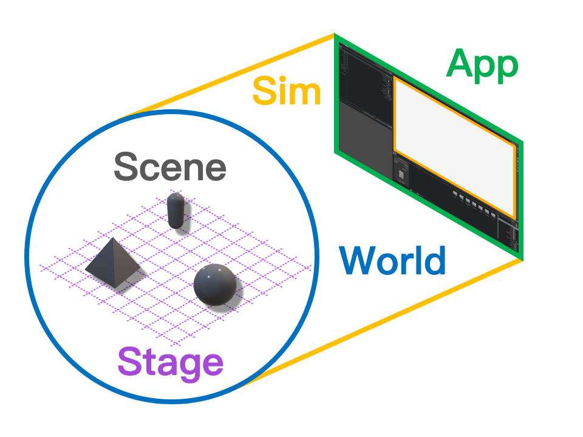
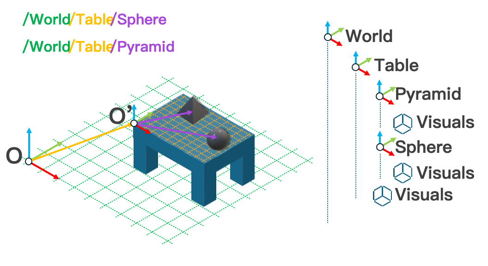

# 环境设计背景

在完成项目安装之后，我们可以开始设计环境。传统强化学习（RL）问题中，环境负责使用智能体生成的动作来更新“世界”的状态，并最终计算并返回观测与奖励信号。然而，Isaac Sim 和 Isaac Lab 在仿真机制方面还有一些独特的概念需要了解。传统的强化学习描述假设“世界”已然存在，而我们并没有这样的奢侈；我们必须自行定义这个世界，并弄清如何构建它以及它将如何融入仿真，这直接决定了能否成功。

## App、Sim、World、Stage 与 Scene

**World** 由笛卡尔坐标系的原点以及定义该坐标系的单位所确定。多大或多小？多近或多远？这些问题的答案只能相对于某个上下文参考坐标系来定义，而这个参考系正是构成世界的基础。

在结构层级上，“世界”之上是 **Simulation** 和 **Application**。**Application** 是“负责所有其他事务的主体”：它管理资源，并在我们结束时启动或销毁仿真。当我们使用模板启动训练时（见 template-generator），屏幕上出现带有训练中的 cartpole 视口的窗口就是 Application 窗口。但 Application 并不由图形界面所定义，即便在无头模式下运行，所有仿真依旧由 Application 统筹。

**Simulation** 控制世界的“规则”。它定义物理定律，例如时间与重力的行为，并决定渲染的频率。如果说 Application 承载 Simulation，那么 Simulation 就承载 World。Simulation 通过把一次时间推进划分为许多专门的子步骤来治理时间推进，每个子步骤负责将世界更新为一个状态。Isaac Lab 中的许多 API 都被刻意设计为挂接到这些不同的子步骤，你经常会看到形如 ` `_pre_XYZ_step`  ` 和 `  `_post_XYZ_step`  ` 的函数，其中 `  `XYZ_step`  ` 是这些子步骤的名称之一，比如 `  `physics_step`  ` 或 `  `render_step` `。

在结构层级上，“世界”之下是 **Stage** 和 **Scene**。如果 World 为 Simulation 提供空间上下文，那么 **Stage** 则为 World 提供组合上下文。假设我们想要在一个房间里模拟一张摆好餐具的餐桌：房间就是这里的“世界”，我们将世界的原点选在房间的一个角落。餐桌在房间中的位置由该原点到我们选定为餐桌局部原点的某一点的向量决定。对于我们这些智能体而言，以房间角落为参考讨论食物或餐具的位置并不方便；使用相对于餐桌的坐标更为合适。然而，仿真仍然需要这些全局坐标来正确推进下一时间步，因此我们必须定义如何组合这两个坐标系。

这正是 Stage 的作用：仿真中的一切都是 [USD primitive](https://openusd.org/release/glossary.html#usdglossary-prim)，Stage 将这些 primitive 的关系组织成一棵树，其上下文由树中的相对路径定义。Stage 上的每个 primitive 都有一个名称，因此也有一条路径，例如 ` `/room/table/food`  ` 或 `  `/room/table/utensils`  `。这些关系由树中节点的“父级”和“子级”定义：` table ` 是 ` room ` 的子节点，却是 ` food` 的父节点。父节点的组合属性会应用到所有子节点上，但子 primitive 可以在必要时覆盖父节点的属性，这在材质等场景中很常见。

有了这套词汇，我们终于可以讨论 Isaac Lab 中极为关键的 **Scene**。深度学习的根基在于数据分析，即便是在机器人学习中也如此，数据仍然通过机器人上的传感器获得。为了让机器人学会任何任务，部署机器人、收集数据并重置机器人以采集更多数据所需的时间都是根本瓶颈。Isaac Sim 让我们无需真实机器人就能接触到机器人；Isaac Lab 则提供了 **vectorization**，也就是高效地并行模拟多个训练流程，从而成倍提升数据生成速率并相应加速训练。Scene 管理那些与向量化过程相关的 Stage 上的 primitive，这些 primitive 被称为 **simulation entities**。

继续前面的摆餐桌例子：假设我们想要训练一个机器人来摆放餐具。机器人、餐桌以及桌上的所有物品都可以注册到环境的 Scene 中。我们可以指定需要的副本数量，Scene 会在 Stage 上自动构建并运行这些副本。这些副本会被放在 Stage 上的新坐标位置上，从而定义新的参考框架，用于计算观测和奖励。每个 Scene 副本都存在于 Stage 上，并由同一个 World 进行仿真。相比为每个副本运行独立仿真，这种方式效率更高，但也可能导致副本之间产生意料之外的交互，因此在调试时务必要牢记这一点。

既然我们已经理解了这些机制，现在就可以回头审视模板项目为我们生成的代码了！

