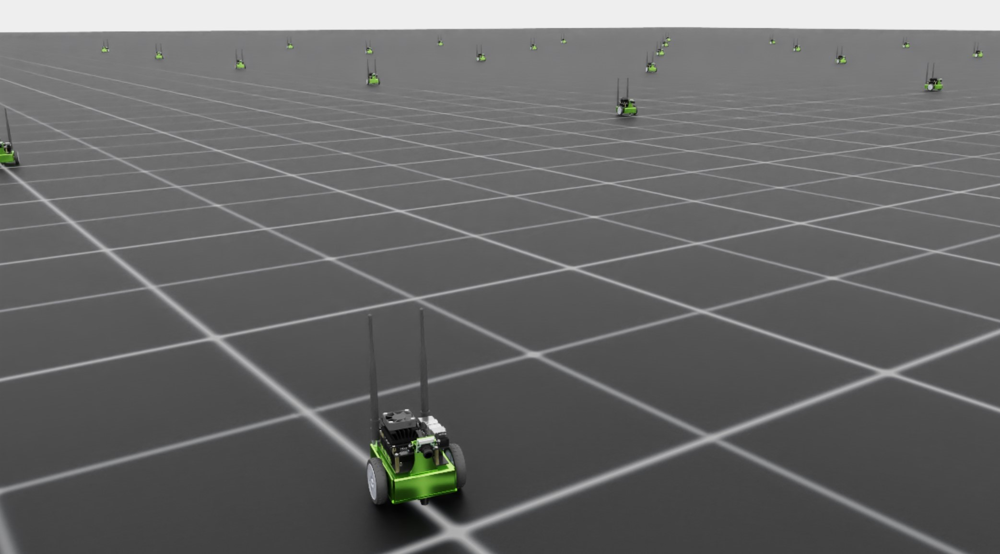

# 设计环境

在充分理解项目及其结构后, 我们可以开始修改代码以满足 Jetbot 训练的需求. 模板采用 **direct** 工作流, 这意味着环境类会集中管理所有这些细节. 我们需要编写的代码包括：

1. 定义机器人
2. 定义训练仿真并管理克隆
3. 将智能体的动作施加到机器人上
4. 计算并返回奖励与观测
5. 管理重置与终止状态

第一步, 我们的目标是让环境训练管线能够加载并运行. 为演示方便, 这一部分会使用一个占位的奖励信号. 你可以在[这里](https://github.com/isaac-sim/IsaacLabTutorial/tree/jetbot-intro-1-1)找到相关修改的代码.

## 定义机器人

随着项目发展, 我们可能会有许多需要训练的机器人. 我们有意在教程的 `extension` 中新增一个名为 `robots` 的 `module` , 在其中以单独的 Python 脚本保存机器人定义. 前往 `isaac_lab_tutorial/source/isaac_lab_tutorial/isaac_lab_tutorial` , 创建一个名为 `robots` 的新文件夹. 在该文件夹内新建 `__init__.py` 和 `jetbot.py` . `__init__.py` 用来标记这是一个 Python 模块, 我们可以按常规方式导入 `jetbot.py` 的内容.

`jetbot.py` 的内容相当简洁：

```python
import isaaclab.sim as sim_utils
from isaaclab.assets import ArticulationCfg
from isaaclab.actuators import ImplicitActuatorCfg
from isaaclab.utils.assets import ISAAC_NUCLEUS_DIR

JETBOT_CONFIG = ArticulationCfg(
    spawn=sim_utils.UsdFileCfg(usd_path=f"{ISAAC_NUCLEUS_DIR}/Robots/NVIDIA/Jetbot/jetbot.usd"),
    actuators={"wheel_acts": ImplicitActuatorCfg(joint_names_expr=[".*"], damping=None, stiffness=None)},
)
```

此文件的唯一目的, 是为我们的配置提供一个独立的作用域. 关于机器人配置的细节, 可参见 [tutorial-add-new-robot](https://isaac-sim.github.io/IsaacLab/main/source/tutorials/01_assets/add_new_robot.html#tutorial-add-new-robot), 但对本次讲解最值得注意的是该 `ArticulationCfg` 的 `spawn` 参数中的 `usd_path` . Jetbot 资源可通过公开托管的 nucleus 服务器获取, 其路径由 `ISAAC_NUCLEUS_DIR` 指定, 当然也可以使用任意有效的 USD 路径, 包括本地路径.

## Environment Configuration

前往环境配置文件 `isaac_lab_tutorial/source/isaac_lab_tutorial/isaac_lab_tutorial/tasks/direct/isaac_lab_tutorial/isaac_lab_tutorial_env_cfg.py` , 将其内容替换为：

```python
from isaac_lab_tutorial.robots.jetbot import JETBOT_CONFIG

from isaaclab.assets import ArticulationCfg
from isaaclab.envs import DirectRLEnvCfg
from isaaclab.scene import InteractiveSceneCfg
from isaaclab.sim import SimulationCfg
from isaaclab.utils import configclass

@configclass
class IsaacLabTutorialEnvCfg(DirectRLEnvCfg):
    # env
    decimation = 2
    episode_length_s = 5.0
    # - spaces definition
    action_space = 2
    observation_space = 3
    state_space = 0
    # simulation
    sim: SimulationCfg = SimulationCfg(dt=1 / 120, render_interval=decimation)
    # robot(s)
    robot_cfg: ArticulationCfg = JETBOT_CONFIG.replace(prim_path="/World/envs/env_.*/Robot")
    # scene
    scene: InteractiveSceneCfg = InteractiveSceneCfg(num_envs=100, env_spacing=4.0, replicate_physics=True)
    dof_names = ["left_wheel_joint", "right_wheel_joint"]
```

这里的环境配置与之前基本相同, 但将 `cartpole` 换成了 Jetbot. `decimation` , `episode_length_s` , `action_space` , `observation_space` 和 `state_space` 是基类 `DirectRLEnvCfg` 的成员, 在每个 `DirectRLEnv` 中都必须定义. 这些空间参数默认被解释为给定整数维度的向量, 但也可以定义为 [gymnasium spaces](https://gymnasium.farama.org/api/spaces/).

请注意动作空间和观测空间的不同. 作为环境设计者, 这些由我们决定. 对 Jetbot 而言, 我们希望直接控制机器人的关节, 其中只有两个关节被驱动(因此动作空间为 2). 观测空间被选择为 3, 是因为此处我们仅向智能体提供 Jetbot 的线速度；稍后在环境开发中会调整这些设置. 我们的策略不需要维护内部状态, 因此 `state` 空间为 0.

## Attack of the clones

配置完成后, 就该补全环境的细节, 从初始化和场景搭建开始. 前往环境定义文件 `isaac_lab_tutorial/source/isaac_lab_tutorial/isaac_lab_tutorial/tasks/direct/isaac_lab_tutorial/isaac_lab_tutorial_env.py` , 将 `__init__` 和 `_setup_scene` 方法替换为：

```python
class IsaacLabTutorialEnv(DirectRLEnv):
    cfg: IsaacLabTutorialEnvCfg

    def __init__(self, cfg: IsaacLabTutorialEnvCfg, render_mode: str | None = None, **kwargs):
        super().__init__(cfg, render_mode, **kwargs)

        self.dof_idx, _ = self.robot.find_joints(self.cfg.dof_names)

    def _setup_scene(self):
        self.robot = Articulation(self.cfg.robot_cfg)
        # add ground plane
        spawn_ground_plane(prim_path="/World/ground", cfg=GroundPlaneCfg())
        # clone and replicate
        self.scene.clone_environments(copy_from_source=False)
        # add articulation to scene
        self.scene.articulations["robot"] = self.robot
        # add lights
        light_cfg = sim_utils.DomeLightCfg(intensity=2000.0, color=(0.75, 0.75, 0.75))
        light_cfg.func("/World/Light", light_cfg)
```

可以看到, `_setup_scene` 没有变化, `__init__` 仅用于从机器人获取关节索引(记得 `setup` 在 `super` 中已被调用).

接下来需要定义动作, 观测与奖励的处理方式. 先将 `_pre_physics_step` 和 `_apply_action` 的内容替换为：

```python
def _pre_physics_step(self, actions: torch.Tensor) -> None:
    self.actions = actions.clone()

def _apply_action(self) -> None:
    self.robot.set_joint_velocity_target(self.actions, joint_ids=self.dof_idx)
```

在环境中施加动作被分成 `_pre_physics_step` 和 `_apply_action` 两步. 物理仿真相对策略查询进行了简化, 意味着策略每次给出动作后可能执行多个物理步. `_pre_physics_step` 在仿真步发生前调用, 让我们将从策略获取数据的过程与对物理仿真的更新解耦. `_apply_action` 则真正把动作施加到 `stage` 上的机器人, 然后仿真才向前推进.

接下来是观测与奖励, 本例仅依赖 Jetbot 在机体坐标系下的线速度. 将 `_get_observations` 和 `_get_rewards` 的内容替换为：

```python
def _get_observations(self) -> dict:
    self.velocity = self.robot.data.root_com_lin_vel_b
    observations = {"policy": self.velocity}
    return observations

def _get_rewards(self) -> torch.Tensor:
    total_reward = torch.linalg.norm(self.velocity, dim=-1, keepdim=True)
    return total_reward
```

机器人在 Isaac Lab API 中以 `Articulation` 对象存在, 该对象包含一个数据类 `ArticulationData` , 保存 `stage` 上具体机器人的数据. 谈及 `scene` 实体(如机器人)时, 可以指代存在于每个 `scene` 的“机器人”这一整体, 也可以指 `stage` 上某个具体克隆. `ArticulationData` 记录的就是这些克隆的具体数据, 包括各种运动学向量(如 `root_com_lin_vel_b` )和参考向量(如 `robot.data.FORWARD_VEC_B` ).

注意在 `_apply_action` 中调用的是 `self.robot(Articulation)` 的一个方法, 施加的动作是形状为 `[num_envs, num_actions]` 的二维张量, 意味着我们一次性对 所有 `stage` 上的机器人施加动作. 而在获取观测时, 需要所有机器人的机体坐标系线速度, 于是访问 `self.robot.data` 获取. `root_com_lin_vel_b` 是 `ArticulationData` 的属性, 负责将质心线速度从世界坐标系转换到机体坐标系. Isaac Lab 期望返回的观测是一个字典, 其中 policy 用于策略模型, critic 用于价值模型(在非对称 actor-critic 训练时). 由于此处未使用非对称 actor-critic, 仅需定义 policy.

奖励相对直观. 对每个 `scene` 克隆, 需要计算一个奖励值并以形状 `[num_envs, 1]` 的张量返回. 此处占位做法是：奖励等于 Jetbot 在机体坐标系下线速度的模. 使用这样的奖励与观测, 智能体应会学会让 Jetbot 前进或后退, 训练开始后不久方向会随机确定.

最后, 完善处理终止与重置的部分. 将 `_get_dones` 和 `_reset_idx` 的内容替换为：

```python
def _get_dones(self) -> tuple[torch.Tensor, torch.Tensor]:
    time_out = self.episode_length_buf >= self.max_episode_length - 1

    return False, time_out

def _reset_idx(self, env_ids: Sequence[int] | None):
    if env_ids is None:
        env_ids = self.robot._ALL_INDICES
    super()._reset_idx(env_ids)

    default_root_state = self.robot.data.default_root_state[env_ids]
    default_root_state[:, :3] += self.scene.env_origins[env_ids]

    self.robot.write_root_state_to_sim(default_root_state, env_ids)
```

与动作类似, 终止与重置也分两步处理. `_get_dones` 的目标只是标记哪些环境需要被重置, 以及原因. 传统强化学习中, 一轮 episode 结束通常有两种方式：智能体进入终止状态, 或 episode 达到最大时长. Isaac Lab 已在幕后管理了时长跟踪. 配置参数 `episode_length_s` 定义了最大时长(秒), `episode_length_buf` 和 `max_episode_length` 分别存放各个 `scene` 已执行的步数(允许环境异步运行)与由 `episode_length_s` 转换而来的最大步数. `time_out` 通过比较当前缓冲与最大值, 返回达到时长上限的 `scene` . 由于当前环境只是占位示例, 没有定义终止状态, 因此第一个张量直接返回 `False` (借助 pytorch 自动投射为正确形状).

`_reset_idx` 接收一个布尔张量指示哪些 `scene` 需要重置, 并执行重置. 这是 `DirectRLEnv` 中另一个直接调用 `super` 的方法, 用于管理与 `episode` 时长相关的内部缓冲. 对 `env_ids` 指定的环境, 先取出默认的 `root` 状态, 将机器人重置到该状态, 并根据对应 `scene` 的原点进行位置偏移. 这是克隆流程的结果：起初只有一个机器人及其在世界坐标系下的默认状态. 自定义环境时别忘了这一步！

完成这些修改后, 当你使用模板的 `train.py` 启动任务时, 就能看到 Jetbot 逐渐学会向前行驶.


