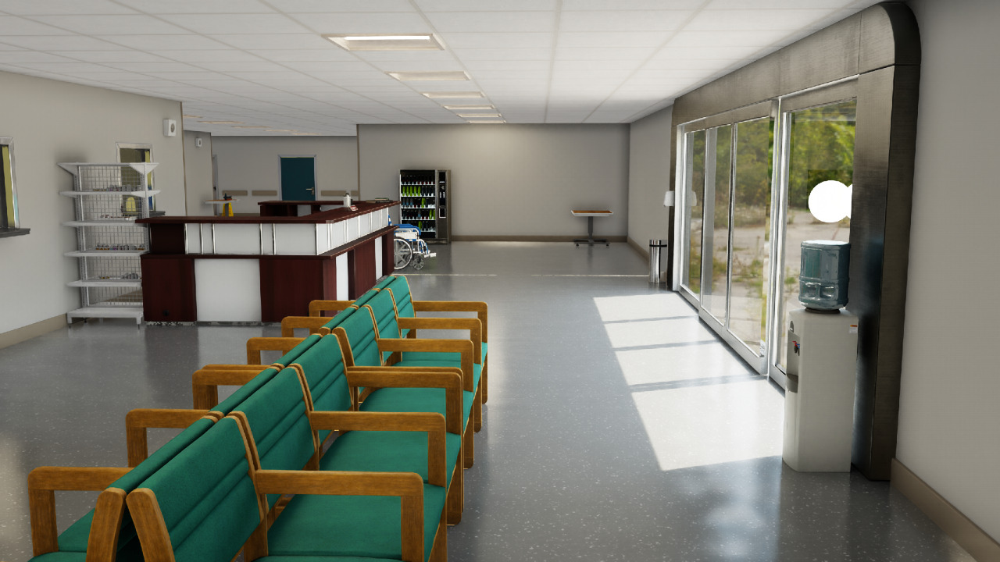
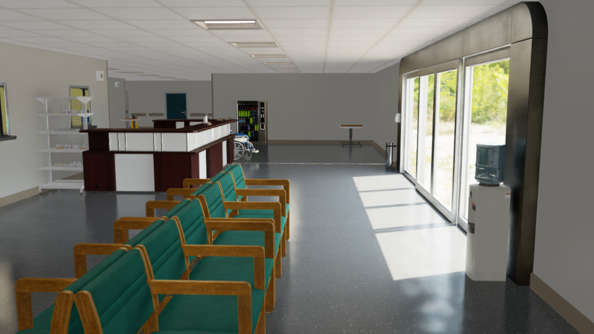
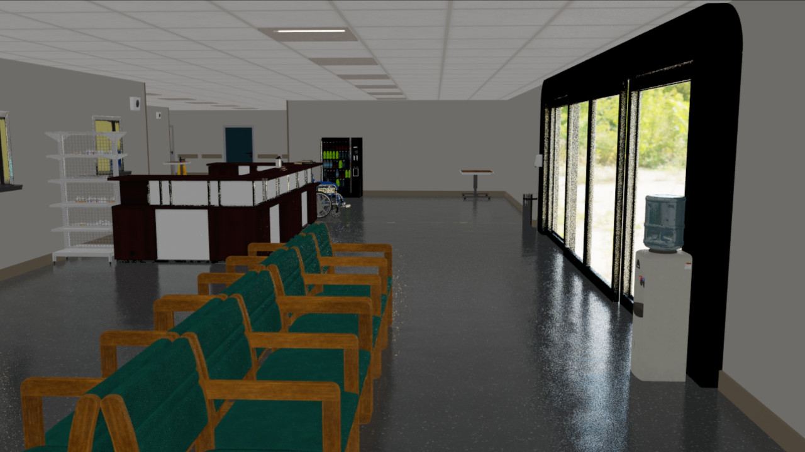

# 配置渲染设置

Isaac Lab 提供了 3 种预设渲染模式：performance、balanced 和 quality。
你可以通过命令行参数或在脚本中选择模式，并按需自定义设置。
你可以调整并细化渲染配置，以为你的工作流取得理想的平衡。

## 选择渲染模式

渲染模式可以通过 2 种方式选择。

1. 在 `sim.RenderCfg` 中使用输入类参数 `rendering_mode`

```python
    # for an example of how this can be used, checkout the tutorial script
    # scripts/tutorials/00_sim/set_rendering_mode.py
    render_cfg = sim_utils.RenderCfg(rendering_mode="performance")
```

2. 使用 `--rendering_mode` 命令行参数（其优先级高于 `sim.RenderCfg` 中的 `rendering_mode` 参数）

```bash
    ./isaaclab.sh -p scripts/tutorials/00_sim/set_rendering_mode.py --rendering_mode {performance/balanced/quality}
```

注意， `rendering_mode` 的默认值为 `balanced` 。
但是，如果启动器参数 `--enable_cameras` 未设置，则不会应用默认的 `rendering_mode` ，而是使用 kit 的默认渲染设置。

下面是 `set_rendering_mode.py` 脚本的渲染示例。
为便于评估渲染效果，示例场景包含了一些反射、半透明效果、直接光照与环境光照，以及多种材质类型。

* Quality 模式



* Balanced 模式



* Performance 模式



## 覆盖特定渲染设置

可以通过 `sim.RenderCfg` 类覆盖预设渲染设置。

有 2 种方式提供覆盖预设的设置。

1. `sim.RenderCfg` 支持使用“更易用”的设置名来覆盖特定设置，这些设置名会映射到更底层的 RTX 设置。
    例如：

```python
    render_cfg = sim_utils.RenderCfg(
        rendering_mode="performance",
        # user friendly setting overwrites
        enable_translucency=True, # defaults to False in performance mode
        enable_reflections=True, # defaults to False in performance mode
        dlss_mode="3", # defaults to 1 in performance mode
    )
```

用户友好设置列表。

| 设置名 | 说明 |
| --- | --- |
| enable_translucency | Bool。启用高光透射表面（例如玻璃）的半透明效果，会牺牲部分性能。 |
| enable_reflections | Bool。启用反射，会牺牲部分性能。 |
| enable_global_illumination | Bool。启用 Diffused Global Illumination，会牺牲部分性能。 |
| antialiasing_mode | Literal["Off", "FXAA", "DLSS", "TAA", "DLAA"]。<br><br>DLSS：通过 AI 从低分辨率输入生成更高分辨率帧以提升性能。DLSS 会采样多张低分辨率图像，并利用运数据与前序帧的反馈来重建接近原生质量的图像。<br><br>DLAA：一种基于 AI 的抗锯齿技术，提供更高图像质量。DLAA 使用与 DLSS 相同的 Super Resolution 技术，通过重建原生分辨率图像最大化图像质量。 |
| enable_dlssg | Bool。启用 DLSS-G（DLSS Frame Generation），通过 AI 生成更多帧来提升性能。该特性需要 Ada Lovelace 架构 GPU，并且由于额外的线程相关活动，也可能降低性能。 |
| enable_dl_denoiser | Bool。启用 DL 去噪器，可提升渲染质量，但会牺牲性能。 |
| dlss_mode | Literal[0, 1, 2, 3]。用于 DLSS 抗锯齿时，选择性能/质量折中模式。有效值为 0（Performance）、1（Balanced）、2（Quality）或 3（Auto）。 |
| enable_direct_lighting | Bool。启用来自光源的直接光照贡献。 |
| samples_per_pixel | Int。定义每像素的 Direct Lighting 采样数。更高的值会提升直接光照质量，但会牺牲性能。 |
| enable_shadows | Bool。启用阴影，会牺牲性能。禁用后，光源将不会投射阴影。 |
| enable_ambient_occlusion | Bool。启用环境光遮蔽，会牺牲部分性能。 |

2. 为了获得更强的控制能力，`sim.RenderCfg` 允许你通过 `carb_settings` 参数覆盖任意 RTX 设置。
    你可以在仓库中 `apps/rendering_modes` 目录下的渲染模式预设文件中找到 RTX 设置示例。

    此外，RTX 文档在这里：https://docs.omniverse.nvidia.com/materials-and-rendering/latest/rtx-renderer.html。

`carb_settings` 的用法示例：

    

```python
    render_cfg = sim_utils.RenderCfg(
        rendering_mode="quality",
        # carb setting overwrites
        carb_settings={
            "rtx.translucency.enabled": False,
            "rtx.reflections.enabled": False,
            "rtx.domeLight.upperLowerStrategy": 3,
        }
    )
```

## 当前限制

出于性能方面的考虑，我们默认使用 DLSS 进行去噪，这通常能提供更好的性能。
这可能导致渲染质量降低，且在较低分辨率时尤为明显。
因此，我们建议每个 tile 或每个相机的分辨率至少为 100 x 100。
对于更低分辨率的渲染，我们建议将 `sim.RenderCfg` 中的 `antialiasing_mode` 属性设置为 `DLAA` ，并且也可以考虑启用 `enable_dl_denoiser` 。
这两项设置都有助于提升渲染质量，但也会带来性能成本。
你也可以在 `sim.RenderCfg` 中指定更多的渲染参数。
