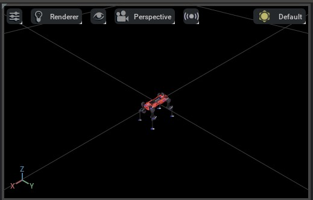
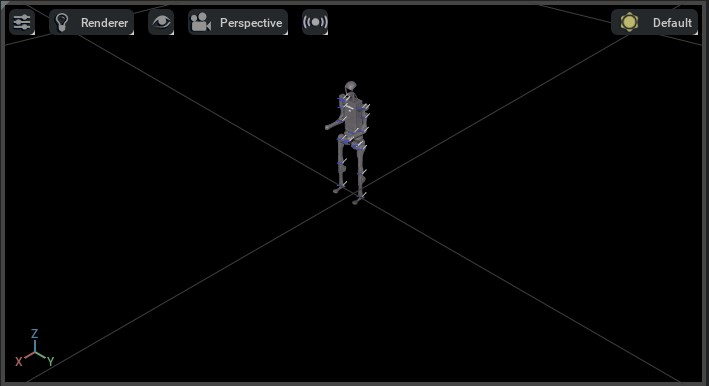

# 导入新的资产

NVIDIA Omniverse 依赖 Universal Scene Description（USD）文件格式来导入与导出资产（assets）。USD 是由 Pixar Animation Studios 开发的开源文件格式，是一种针对大规模、复杂数据集优化的场景描述格式。尽管这种格式在影视与动画行业被广泛使用，但在机器人社区中相对不那么常见。

为此，NVIDIA 开发了多种导入器，允许你将其他文件格式的资产导入并转换为 USD。这些导入器以 Omniverse Kit 扩展（extension）的形式提供：

* **URDF Importer** - 从 URDF 文件导入资产。
* **MJCF Importer** - 从 MJCF 文件导入资产。
* **Mesh Importer** - 从多种网格文件格式导入资产，包括 OBJ、FBX、STL 和 glTF。

NVIDIA 推荐的工作流是使用上述导入器将资产转换为其 USD 表示。一旦资产以 USD 格式存在，你就可以使用 Omniverse Kit 编辑该资产，并将其导出为其他文件格式。Isaac Sim 默认包含这些导入器；你也可以在 Omniverse Kit 中手动启用它们。

在大规模仿真中使用资产时，一个重要的注意事项是确保资产为 [instanceable](https://openusd.org/dev/api/_usd__page__scenegraph_instancing.html) 格式。这样可以高效地将资产加载到内存中，并在一个场景里多次复用。否则，资产可能会被重复加载到内存中，从而导致性能问题。
关于 instanceable 资产的更多细节，请参阅 Isaac Sim 的 [documentation](https://docs.isaacsim.omniverse.nvidia.com/latest/isaac_lab_tutorials/tutorial_instanceable_assets.html)。

## 使用 URDF 导入器

如果要在 GUI 中使用 URDF 导入器，请参阅 [URDF importer](https://docs.isaacsim.omniverse.nvidia.com/latest/importer_exporter/ext_isaacsim_asset_importer_urdf.html) 的文档。若要在 Python 脚本中使用 URDF 导入器，我们提供了一个名为 `convert_urdf.py` 的工具脚本。该脚本会创建一个 `sim.converters.UrdfConverterCfg` 的实例，并将其传入 `sim.converters.UrdfConverter` 类。

URDF 导入器有多种可配置参数，用于控制导入器的行为。导入器配置参数的默认值定义在 `sim.converters.UrdfConverterCfg` 类中，下面列出了这些参数。我们将一些常用的修改项作为命令行参数暴露出来，在调用 `convert_urdf.py` 时可以直接设置，并在列表中用 `*` 标注。若要查看完整参数列表，请参阅 [URDF importer](https://docs.isaacsim.omniverse.nvidia.com/latest/importer_exporter/ext_isaacsim_asset_importer_urdf.html) 文档。

*`sim.converters.UrdfConverterCfg.fix_base`* - 是否固定机器人的基座。

    这取决于你的机器人是浮动基座（floating-base）还是固定基座（fixed-base）。命令行参数为 `--fix-base` ：设置后导入器会固定基座；否则默认为浮动基座。

* `sim.converters.UrdfConverterCfg.root_link_name` - PhysX articulation root 所放置的 link 名称。
*`sim.converters.UrdfConverterCfg.merge_fixed_joints`* - 是否合并固定关节。

    通常应当设置为 `True` 以降低资产复杂度。命令行参数为 `--merge-joints` ：设置后导入器会合并固定关节；否则默认不合并。

* `sim.converters.UrdfConverterCfg.joint_drive` - 机器人关节驱动（joint drives）的配置。
    - `sim.converters.UrdfConverterCfg.JointDriveCfg.drive_type` - 关节的驱动类型。
        取值可以是 `"acceleration"` 或 `"force"` 。我们建议在大多数情况下使用 `"force"` 。

    - `sim.converters.UrdfConverterCfg.JointDriveCfg.target_type` - 关节的目标类型。
        取值可以是 `"none"` 、 `"position"` 或 `"velocity"` 。我们建议在大多数情况下使用 `"position"` 。
        设置为 `"none"` 会禁用驱动并将关节增益设为 0.0。

    - `sim.converters.UrdfConverterCfg.JointDriveCfg.gains` - 关节驱动的刚度与阻尼增益。
        我们支持两种设置增益的方式：

        - `sim.converters.UrdfConverterCfg.JointDriveCfg.PDGainsCfg` - 直接设置刚度与阻尼。
        - `sim.converters.UrdfConverterCfg.JointDriveCfg.NaturalFrequencyGainsCfg` - 使用系统期望的固有频率响应来设置增益。

关于配置参数的更详细信息，请参阅 `sim.converters.UrdfConverterCfg` 的文档。

### 示例用法

在本示例中，我们使用 ANYmal-D 机器人的预处理 URDF 文件。若要查看预处理后的 URDF，请参阅 [anymal.urdf](https://github.com/isaac-orbit/anymal_d_simple_description/blob/master/urdf/anymal.urdf)。预处理后的 URDF 与原始 URDF 的主要差异包括：

* 我们从 URDF 中移除了 `<gazebo>` 标签。URDF 导入器不支持该标签。
* 我们从 URDF 中移除了 `<transmission>` 标签。URDF 导入器不支持该标签。
* 我们移除了 URDF 中的多种碰撞体（collision bodies），以降低资产的复杂度。
* 我们将所有关节的阻尼与摩擦参数修改为 `0.0`。这能确保我们可以对关节进行 effort-control，而不会由 PhysX 额外添加阻尼。
* 我们在固定关节上添加了 `<dont_collapse>` 标签。这能确保导入器不会合并这些固定关节。

下面展示了克隆仓库并运行转换器的步骤：

```bash
# clone a repository with URDF files
git clone git@github.com:isaac-orbit/anymal_d_simple_description.git

# go to top of the Isaac Lab repository
cd IsaacLab
# run the converter
./isaaclab.sh -p scripts/tools/convert_urdf.py \
    ../anymal_d_simple_description/urdf/anymal.urdf \
    source/isaaclab_assets/data/Robots/ANYbotics/anymal_d.usd \
    --merge-joints \
    --joint-stiffness 0.0 \
    --joint-damping 0.0 \
    --joint-target-type none
```

执行上述脚本会在 `source/isaaclab_assets/data/Robots/ANYbotics/` 目录下创建一个 USD 文件：

* `anymal_d.usd` - 这是主资产文件。

如果要以 headless 模式运行脚本，可以添加 `--headless` 标志。这样不会打开 GUI，并会在转换完成后退出脚本。

你可以在打开的窗口里按下播放键（play）来在场景中查看资产。资产应当在重力作用下下落。如果资产“炸开”，那么 URDF 中可能存在自碰撞（self-collisions）。



## 使用 MJCF 导入器

与 URDF 导入器类似，MJCF 导入器也提供 GUI 界面。更多细节请参阅 [MJCF importer](https://docs.isaacsim.omniverse.nvidia.com/latest/importer_exporter/ext_isaacsim_asset_importer_mjcf.html)。若要在 Python 脚本中使用 MJCF 导入器，我们提供了一个名为 `convert_mjcf.py` 的工具脚本。该脚本会创建一个 `sim.converters.MjcfConverterCfg` 的实例，并将其传入 `sim.converters.MjcfConverter` 类。

导入器配置参数的默认值定义在 `sim.converters.MjcfConverterCfg` 类中。下面列出了这些配置参数。我们将一些常用的修改项作为命令行参数暴露出来，在调用 `convert_mjcf.py` 时可以直接设置，并在列表中用 `*` 标注。若要查看完整参数列表，请参阅 [MJCF importer](https://docs.isaacsim.omniverse.nvidia.com/latest/importer_exporter/ext_isaacsim_asset_importer_mjcf.html) 文档。

* `sim.converters.MjcfConverterCfg.fix_base*` - 是否固定机器人的基座。

    这取决于你的机器人是浮动基座（floating-base）还是固定基座（fixed-base）。命令行参数为 `--fix-base` ：设置后导入器会固定基座；否则默认为浮动基座。

* `sim.converters.MjcfConverterCfg.make_instanceable*` - 是否创建 instanceable 资产。
    通常应当设置为 `True` 。命令行参数为 `--make-instanceable` ：设置后导入器会创建 instanceable 资产；否则默认创建非 instanceable 资产。

* `sim.converters.MjcfConverterCfg.import_sites*` - 是否解析 MJCF 中的 `<site>` 标签。
    通常应当设置为 `True` 。命令行参数为 `--import-sites` ：设置后导入器会解析 `<site>` 标签；否则默认不解析。

### 示例用法

在本示例中，我们使用 Unitree 的 H1 人形机器人在 [mujoco_menagerie](https://github.com/google-deepmind/mujoco_menagerie/tree/main/unitree_h1) 中提供的 MuJoCo 模型。

下面展示了克隆仓库并运行转换器的步骤：

```bash
# clone a repository with URDF files
git clone git@github.com:google-deepmind/mujoco_menagerie.git

# go to top of the Isaac Lab repository
cd IsaacLab
# run the converter
./isaaclab.sh -p scripts/tools/convert_mjcf.py \
    ../mujoco_menagerie/unitree_h1/h1.xml \
    source/isaaclab_assets/data/Robots/Unitree/h1.usd \
    --import-sites \
    --make-instanceable
```

执行上述脚本会在 `source/isaaclab_assets/data/Robots/Unitree/` 目录下创建 USD 文件：

* `h1.usd` - 主资产文件，包含所有非网格（non-mesh）数据。
* `Props/instanceable_assets.usd` - 网格数据文件。



## 使用 Mesh 导入器

Omniverse Kit 包含一个使用 ASSIMP 库的网格转换工具，可从多种网格格式（例如 OBJ、FBX、STL、glTF 等）导入资产。该资产转换工具以 Omniverse Kit 扩展的形式提供。更多细节请参阅 [asset converter](https://docs.omniverse.nvidia.com/extensions/latest/ext_asset-converter.html) 文档。
不过，与 Isaac Sim 的 URDF 和 MJCF 导入器不同，资产转换工具不支持创建 instanceable 资产。这意味着如果同一个资产在场景中被多次使用，它会被多次加载到内存中。

因此，我们提供了一个名为 `convert_mesh.py` 的工具脚本，它会使用资产转换工具导入资产，然后将其转换为 instanceable 资产。在内部，该脚本会创建一个 `sim.converters.MeshConverterCfg` 的实例，并将其传入 `sim.converters.MeshConverter` 类。由于网格文件不包含任何物理信息，配置类会接受不同的物理属性（例如质量、碰撞形状等）作为输入。更多细节请参阅 `sim.converters.MeshConverterCfg` 的文档。

### 示例用法

我们使用一个立方体（cube）的 OBJ 文件来演示网格转换器的用法。下面展示了克隆仓库并运行转换器的步骤：

```bash
# clone a repository with URDF files
git clone git@github.com:NVIDIA-Omniverse/IsaacGymEnvs.git

# go to top of the Isaac Lab repository
cd IsaacLab
# run the converter
./isaaclab.sh -p scripts/tools/convert_mesh.py \
    ../IsaacGymEnvs/assets/trifinger/objects/meshes/cube_multicolor.obj \
    source/isaaclab_assets/data/Props/CubeMultiColor/cube_multicolor.usd \
    --make-instanceable \
    --collision-approximation convexDecomposition \
    --mass 1.0
```

导入后，你可能需要按下 `F` 键来缩放并聚焦到资产上。

与 URDF 和 MJCF 转换器类似，执行上述脚本会在 `source/isaaclab_assets/data/Props/CubeMultiColor/` 目录下创建两个 USD 文件。此外，如果你在打开的窗口里按下播放键（play），应当能看到资产在重力作用下下落。

* 如果你没有设置 `--mass` 标志，则不会为资产添加刚体（rigid body）属性；资产会以静态（static）资产的形式导入。
* 如果你也没有设置 `--collision-approximation` 标志，则资产同样不会具备碰撞体（collider）属性；资产会以可视化（visual）资产的形式导入。


