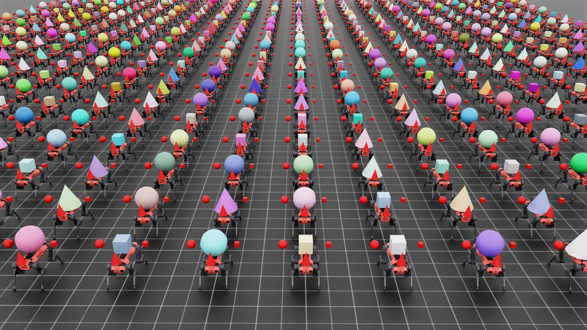

# 生成多个资产（Spawning Multiple Assets）

典型的生成（spawn）配置（在 `tutorial-spawn-prims` 教程中介绍，原 RST 交叉引用： `tutorial-spawn-prims` ）会将同一个资产（或 USD primitive）复制到由表达式解析出的不同 prim path 下。
例如，如果用户指定在 `"/World/Table_.*/Object"` 下生成资产，那么同一个资产会在 `"/World/Table_0/Object"` 、 `"/World/Table_1/Object"` 等路径处被创建。

不过，我们也支持通过两种机制进行“多资产生成”（multi-asset spawning）：

1. 刚体对象集合（Rigid object collections）。这允许用户在每个环境中生成多个刚体对象，并通过统一 API 访问/修改它们，从而提升性能。
2. 在同一个 prim path 下生成不同资产。这允许用户构建多样化仿真，其中每个环境都具有不同的资产。

本指南将介绍如何使用上述两种机制。

示例脚本 `multi_asset.py` 用作参考，位于 `IsaacLab/scripts/demos` 目录中。

<details>
<summary>multi_asset.py 的代码</summary>

```python
# Copyright (c) 2022-2025, The Isaac Lab Project Developers (https://github.com/isaac-sim/IsaacLab/blob/main/CONTRIBUTORS.md).
# All rights reserved.
#
# SPDX-License-Identifier: BSD-3-Clause

"""This script demonstrates how to spawn multiple objects in multiple environments.

.. code-block:: bash

    # Usage
    ./isaaclab.sh -p scripts/demos/multi_asset.py --num_envs 2048

"""

from __future__ import annotations

"""Launch Isaac Sim Simulator first."""

import argparse

from isaaclab.app import AppLauncher

# add argparse arguments
parser = argparse.ArgumentParser(description="Demo on spawning different objects in multiple environments.")
parser.add_argument("--num_envs", type=int, default=512, help="Number of environments to spawn.")
# append AppLauncher cli args
AppLauncher.add_app_launcher_args(parser)
# parse the arguments
args_cli = parser.parse_args()

# launch omniverse app
app_launcher = AppLauncher(args_cli)
simulation_app = app_launcher.app

"""Rest everything follows."""

import random

from pxr import Gf, Sdf

import isaaclab.sim as sim_utils
from isaaclab.assets import (
    Articulation,
    ArticulationCfg,
    AssetBaseCfg,
    RigidObject,
    RigidObjectCfg,
    RigidObjectCollection,
    RigidObjectCollectionCfg,
)
from isaaclab.scene import InteractiveScene, InteractiveSceneCfg
from isaaclab.sim import SimulationContext
from isaaclab.sim.utils.stage import get_current_stage
from isaaclab.utils import Timer, configclass
from isaaclab.utils.assets import ISAACLAB_NUCLEUS_DIR

##
# Pre-defined Configuration
##

from isaaclab_assets.robots.anymal import ANYDRIVE_3_LSTM_ACTUATOR_CFG  # isort: skip

##
# Randomization events.
##

def randomize_shape_color(prim_path_expr: str):
    """Randomize the color of the geometry."""
    # get stage handle
    stage = get_current_stage()
    # resolve prim paths for spawning and cloning
    prim_paths = sim_utils.find_matching_prim_paths(prim_path_expr)
    # manually clone prims if the source prim path is a regex expression
    with Sdf.ChangeBlock():
        for prim_path in prim_paths:
            # spawn single instance
            prim_spec = Sdf.CreatePrimInLayer(stage.GetRootLayer(), prim_path)

            # DO YOUR OWN OTHER KIND OF RANDOMIZATION HERE!
            # Note: Just need to acquire the right attribute about the property you want to set
            # Here is an example on setting color randomly
            color_spec = prim_spec.GetAttributeAtPath(prim_path + "/geometry/material/Shader.inputs:diffuseColor")
            color_spec.default = Gf.Vec3f(random.random(), random.random(), random.random())

##
# Scene Configuration
##

@configclass
class MultiObjectSceneCfg(InteractiveSceneCfg):
    """Configuration for a multi-object scene."""

    # ground plane
    ground = AssetBaseCfg(prim_path="/World/defaultGroundPlane", spawn=sim_utils.GroundPlaneCfg())

    # lights
    dome_light = AssetBaseCfg(
        prim_path="/World/Light", spawn=sim_utils.DomeLightCfg(intensity=3000.0, color=(0.75, 0.75, 0.75))
    )

    # rigid object
    object: RigidObjectCfg = RigidObjectCfg(
        prim_path="/World/envs/env_.*/Object",
        spawn=sim_utils.MultiAssetSpawnerCfg(
            assets_cfg=[
                sim_utils.ConeCfg(
                    radius=0.3,
                    height=0.6,
                    visual_material=sim_utils.PreviewSurfaceCfg(diffuse_color=(0.0, 1.0, 0.0), metallic=0.2),
                ),
                sim_utils.CuboidCfg(
                    size=(0.3, 0.3, 0.3),
                    visual_material=sim_utils.PreviewSurfaceCfg(diffuse_color=(1.0, 0.0, 0.0), metallic=0.2),
                ),
                sim_utils.SphereCfg(
                    radius=0.3,
                    visual_material=sim_utils.PreviewSurfaceCfg(diffuse_color=(0.0, 0.0, 1.0), metallic=0.2),
                ),
            ],
            random_choice=True,
            rigid_props=sim_utils.RigidBodyPropertiesCfg(
                solver_position_iteration_count=4, solver_velocity_iteration_count=0
            ),
            mass_props=sim_utils.MassPropertiesCfg(mass=1.0),
            collision_props=sim_utils.CollisionPropertiesCfg(),
        ),
        init_state=RigidObjectCfg.InitialStateCfg(pos=(0.0, 0.0, 2.0)),
    )

    # object collection
    object_collection: RigidObjectCollectionCfg = RigidObjectCollectionCfg(
        rigid_objects={
            "object_A": RigidObjectCfg(
                prim_path="/World/envs/env_.*/Object_A",
                spawn=sim_utils.SphereCfg(
                    radius=0.1,
                    visual_material=sim_utils.PreviewSurfaceCfg(diffuse_color=(1.0, 0.0, 0.0), metallic=0.2),
                    rigid_props=sim_utils.RigidBodyPropertiesCfg(
                        solver_position_iteration_count=4, solver_velocity_iteration_count=0
                    ),
                    mass_props=sim_utils.MassPropertiesCfg(mass=1.0),
                    collision_props=sim_utils.CollisionPropertiesCfg(),
                ),
                init_state=RigidObjectCfg.InitialStateCfg(pos=(0.0, -0.5, 2.0)),
            ),
            "object_B": RigidObjectCfg(
                prim_path="/World/envs/env_.*/Object_B",
                spawn=sim_utils.CuboidCfg(
                    size=(0.1, 0.1, 0.1),
                    visual_material=sim_utils.PreviewSurfaceCfg(diffuse_color=(1.0, 0.0, 0.0), metallic=0.2),
                    rigid_props=sim_utils.RigidBodyPropertiesCfg(
                        solver_position_iteration_count=4, solver_velocity_iteration_count=0
                    ),
                    mass_props=sim_utils.MassPropertiesCfg(mass=1.0),
                    collision_props=sim_utils.CollisionPropertiesCfg(),
                ),
                init_state=RigidObjectCfg.InitialStateCfg(pos=(0.0, 0.5, 2.0)),
            ),
            "object_C": RigidObjectCfg(
                prim_path="/World/envs/env_.*/Object_C",
                spawn=sim_utils.ConeCfg(
                    radius=0.1,
                    height=0.3,
                    visual_material=sim_utils.PreviewSurfaceCfg(diffuse_color=(1.0, 0.0, 0.0), metallic=0.2),
                    rigid_props=sim_utils.RigidBodyPropertiesCfg(
                        solver_position_iteration_count=4, solver_velocity_iteration_count=0
                    ),
                    mass_props=sim_utils.MassPropertiesCfg(mass=1.0),
                    collision_props=sim_utils.CollisionPropertiesCfg(),
                ),
                init_state=RigidObjectCfg.InitialStateCfg(pos=(0.5, 0.0, 2.0)),
            ),
        }
    )

    # articulation
    robot: ArticulationCfg = ArticulationCfg(
        prim_path="/World/envs/env_.*/Robot",
        spawn=sim_utils.MultiUsdFileCfg(
            usd_path=[
                f"{ISAACLAB_NUCLEUS_DIR}/Robots/ANYbotics/ANYmal-C/anymal_c.usd",
                f"{ISAACLAB_NUCLEUS_DIR}/Robots/ANYbotics/ANYmal-D/anymal_d.usd",
            ],
            random_choice=True,
            rigid_props=sim_utils.RigidBodyPropertiesCfg(
                disable_gravity=False,
                retain_accelerations=False,
                linear_damping=0.0,
                angular_damping=0.0,
                max_linear_velocity=1000.0,
                max_angular_velocity=1000.0,
                max_depenetration_velocity=1.0,
            ),
            articulation_props=sim_utils.ArticulationRootPropertiesCfg(
                enabled_self_collisions=True, solver_position_iteration_count=4, solver_velocity_iteration_count=0
            ),
            activate_contact_sensors=True,
        ),
        init_state=ArticulationCfg.InitialStateCfg(
            pos=(0.0, 0.0, 0.6),
            joint_pos={
                ".*HAA": 0.0,  # all HAA
                ".*F_HFE": 0.4,  # both front HFE
                ".*H_HFE": -0.4,  # both hind HFE
                ".*F_KFE": -0.8,  # both front KFE
                ".*H_KFE": 0.8,  # both hind KFE
            },
        ),
        actuators={"legs": ANYDRIVE_3_LSTM_ACTUATOR_CFG},
    )

##
# Simulation Loop
##

def run_simulator(sim: SimulationContext, scene: InteractiveScene):
    """Runs the simulation loop."""
    # Extract scene entities
    # note: we only do this here for readability.
    rigid_object: RigidObject = scene["object"]
    rigid_object_collection: RigidObjectCollection = scene["object_collection"]
    robot: Articulation = scene["robot"]
    # Define simulation stepping
    sim_dt = sim.get_physics_dt()
    count = 0
    # Simulation loop
    while simulation_app.is_running():
        # Reset
        if count % 250 == 0:
            # reset counter
            count = 0
            # reset the scene entities
            # object
            root_state = rigid_object.data.default_root_state.clone()
            root_state[:, :3] += scene.env_origins
            rigid_object.write_root_pose_to_sim(root_state[:, :7])
            rigid_object.write_root_velocity_to_sim(root_state[:, 7:])
            # object collection
            object_state = rigid_object_collection.data.default_object_state.clone()
            object_state[..., :3] += scene.env_origins.unsqueeze(1)
            rigid_object_collection.write_object_link_pose_to_sim(object_state[..., :7])
            rigid_object_collection.write_object_com_velocity_to_sim(object_state[..., 7:])
            # robot
            # -- root state
            root_state = robot.data.default_root_state.clone()
            root_state[:, :3] += scene.env_origins
            robot.write_root_pose_to_sim(root_state[:, :7])
            robot.write_root_velocity_to_sim(root_state[:, 7:])
            # -- joint state
            joint_pos, joint_vel = robot.data.default_joint_pos.clone(), robot.data.default_joint_vel.clone()
            robot.write_joint_state_to_sim(joint_pos, joint_vel)
            # clear internal buffers
            scene.reset()
            print("[INFO]: Resetting scene state...")

        # Apply action to robot
        robot.set_joint_position_target(robot.data.default_joint_pos)
        # Write data to sim
        scene.write_data_to_sim()
        # Perform step
        sim.step()
        # Increment counter
        count += 1
        # Update buffers
        scene.update(sim_dt)

def main():
    """Main function."""
    # Load kit helper
    sim_cfg = sim_utils.SimulationCfg(dt=0.005, device=args_cli.device)
    sim = SimulationContext(sim_cfg)
    # Set main camera
    sim.set_camera_view([2.5, 0.0, 4.0], [0.0, 0.0, 2.0])

    # Design scene
    scene_cfg = MultiObjectSceneCfg(num_envs=args_cli.num_envs, env_spacing=2.0, replicate_physics=False)
    with Timer("[INFO] Time to create scene: "):
        scene = InteractiveScene(scene_cfg)

    with Timer("[INFO] Time to randomize scene: "):
        # DO YOUR OWN OTHER KIND OF RANDOMIZATION HERE!
        # Note: Just need to acquire the right attribute about the property you want to set
        # Here is an example on setting color randomly
        randomize_shape_color(scene_cfg.object.prim_path)

    # Play the simulator
    sim.reset()
    # Now we are ready!
    print("[INFO]: Setup complete...")
    # Run the simulator
    run_simulator(sim, scene)

if __name__ == "__main__":
    # run the main execution
    main()
    # close sim app
    simulation_app.close()
```

</details>

该脚本会创建多个环境（environments），并且每个环境都包含：

* 一个刚体对象集合，包含一个圆锥（cone）、一个立方体（cube）和一个球体（sphere）
* 一个刚体对象：可能是圆锥、立方体或球体之一，随机选择
* 一个关节体（articulation）：可能是 ANYmal-C 或 ANYmal-D 机器人之一，随机选择



## 刚体对象集合（Rigid Object Collections）

你可以在每个环境中生成多个刚体对象，并通过统一的 `(env_ids, obj_ids)` API 来访问/修改它们。
虽然用户也可以通过逐个生成的方式来创建多个刚体对象，但该 API 更易用，并且更高效，因为它在内部使用单个 physics view 来处理所有对象。

```python
# object collection
object_collection: RigidObjectCollectionCfg = RigidObjectCollectionCfg(
    rigid_objects={
        "object_A": RigidObjectCfg(
            prim_path="/World/envs/env_.*/Object_A",
            spawn=sim_utils.SphereCfg(
                radius=0.1,
                visual_material=sim_utils.PreviewSurfaceCfg(diffuse_color=(1.0, 0.0, 0.0), metallic=0.2),
                rigid_props=sim_utils.RigidBodyPropertiesCfg(
                    solver_position_iteration_count=4, solver_velocity_iteration_count=0
                ),
                mass_props=sim_utils.MassPropertiesCfg(mass=1.0),
                collision_props=sim_utils.CollisionPropertiesCfg(),
            ),
            init_state=RigidObjectCfg.InitialStateCfg(pos=(0.0, -0.5, 2.0)),
        ),
        "object_B": RigidObjectCfg(
            prim_path="/World/envs/env_.*/Object_B",
            spawn=sim_utils.CuboidCfg(
                size=(0.1, 0.1, 0.1),
                visual_material=sim_utils.PreviewSurfaceCfg(diffuse_color=(1.0, 0.0, 0.0), metallic=0.2),
                rigid_props=sim_utils.RigidBodyPropertiesCfg(
                    solver_position_iteration_count=4, solver_velocity_iteration_count=0
                ),
                mass_props=sim_utils.MassPropertiesCfg(mass=1.0),
                collision_props=sim_utils.CollisionPropertiesCfg(),
            ),
            init_state=RigidObjectCfg.InitialStateCfg(pos=(0.0, 0.5, 2.0)),
        ),
        "object_C": RigidObjectCfg(
            prim_path="/World/envs/env_.*/Object_C",
            spawn=sim_utils.ConeCfg(
                radius=0.1,
                height=0.3,
                visual_material=sim_utils.PreviewSurfaceCfg(diffuse_color=(1.0, 0.0, 0.0), metallic=0.2),
                rigid_props=sim_utils.RigidBodyPropertiesCfg(
                    solver_position_iteration_count=4, solver_velocity_iteration_count=0
                ),
                mass_props=sim_utils.MassPropertiesCfg(mass=1.0),
                collision_props=sim_utils.CollisionPropertiesCfg(),
            ),
            init_state=RigidObjectCfg.InitialStateCfg(pos=(0.5, 0.0, 2.0)),
        ),
    }
)
```

使用 `assets.RigidObjectCollectionCfg` 配置来创建集合。
其中 `assets.RigidObjectCollectionCfg.rigid_objects` 属性是一个字典，字典的 value 为 `assets.RigidObjectCfg` 对象；字典的 key 则作为集合中每个刚体对象的唯一标识符。

## 在相同 prim path 下生成不同资产

你可以在每个环境的同一个 prim path 下，生成不同的资产与 USD，使用的 spawner 包括 `sim.spawners.wrappers.MultiAssetSpawnerCfg` 与 `sim.spawners.wrappers.MultiUsdFileCfg` ：

* 我们将 `assets.RigidObjectCfg` 中的 spawn 配置设置为 `sim.spawners.wrappers.MultiAssetSpawnerCfg`：

  

```python
  # rigid object
  object: RigidObjectCfg = RigidObjectCfg(
      prim_path="/World/envs/env_.*/Object",
      spawn=sim_utils.MultiAssetSpawnerCfg(
          assets_cfg=[
              sim_utils.ConeCfg(
                  radius=0.3,
                  height=0.6,
                  visual_material=sim_utils.PreviewSurfaceCfg(diffuse_color=(0.0, 1.0, 0.0), metallic=0.2),
              ),
              sim_utils.CuboidCfg(
                  size=(0.3, 0.3, 0.3),
                  visual_material=sim_utils.PreviewSurfaceCfg(diffuse_color=(1.0, 0.0, 0.0), metallic=0.2),
              ),
              sim_utils.SphereCfg(
                  radius=0.3,
                  visual_material=sim_utils.PreviewSurfaceCfg(diffuse_color=(0.0, 0.0, 1.0), metallic=0.2),
              ),
          ],
          random_choice=True,
          rigid_props=sim_utils.RigidBodyPropertiesCfg(
              solver_position_iteration_count=4, solver_velocity_iteration_count=0
          ),
          mass_props=sim_utils.MassPropertiesCfg(mass=1.0),
          collision_props=sim_utils.CollisionPropertiesCfg(),
      ),
      init_state=RigidObjectCfg.InitialStateCfg(pos=(0.0, 0.0, 2.0)),
  )
  ```

  该配置允许你定义一个可被生成为刚体对象的不同资产列表。
  当 `sim.spawners.wrappers.MultiAssetSpawnerCfg.random_choice` 设为 True 时，会从列表中随机选择一个资产，并在指定 prim path 下生成。

* 类似地，我们将 `assets.ArticulationCfg` 中的 spawn 配置设置为 `sim.spawners.wrappers.MultiUsdFileCfg`：

  

```python
  # articulation
  robot: ArticulationCfg = ArticulationCfg(
      prim_path="/World/envs/env_.*/Robot",
      spawn=sim_utils.MultiUsdFileCfg(
          usd_path=[
              f"{ISAACLAB_NUCLEUS_DIR}/Robots/ANYbotics/ANYmal-C/anymal_c.usd",
              f"{ISAACLAB_NUCLEUS_DIR}/Robots/ANYbotics/ANYmal-D/anymal_d.usd",
          ],
          random_choice=True,
          rigid_props=sim_utils.RigidBodyPropertiesCfg(
              disable_gravity=False,
              retain_accelerations=False,
              linear_damping=0.0,
              angular_damping=0.0,
              max_linear_velocity=1000.0,
              max_angular_velocity=1000.0,
              max_depenetration_velocity=1.0,
          ),
          articulation_props=sim_utils.ArticulationRootPropertiesCfg(
              enabled_self_collisions=True, solver_position_iteration_count=4, solver_velocity_iteration_count=0
          ),
          activate_contact_sensors=True,
      ),
      init_state=ArticulationCfg.InitialStateCfg(
          pos=(0.0, 0.0, 0.6),
          joint_pos={
              ".*HAA": 0.0,  # all HAA
              ".*F_HFE": 0.4,  # both front HFE
              ".*H_HFE": -0.4,  # both hind HFE
              ".*F_KFE": -0.8,  # both front KFE
              ".*H_KFE": 0.8,  # both hind KFE
          },
      ),
      actuators={"legs": ANYDRIVE_3_LSTM_ACTUATOR_CFG},
  )
  ```

  与前面类似，该配置允许你选择不同的 USD 文件来表示关节体（articulated）资产。

## 注意事项

### 资产结构需要相似

当使用同一个 physics 接口（刚体对象类或关节体类）来生成并处理多个资产时，必须确保所有 prim 位置上的资产具有相似结构。
如果是关节体（articulation），这意味着它们必须具有相同的 link 和 joint 数量、相同数量的碰撞体（collision bodies），并且这些对象的名称也要一致。
如果不满足这些条件，prim 的物理解析可能会受到影响并失败。

该功能的主要目的，是让用户能够创建同一资产的随机化版本，例如具有不同 link 长度的机器人，或具有不同碰撞体形状的刚体对象。

### 在交互式场景中禁用 physics replication

默认情况下，标志 `scene.InteractiveScene.replicate_physics` 为 True。该标志会告知物理引擎：各个仿真环境互为拷贝，因此只需解析第一个环境即可理解整个仿真场景，从而加速场景解析。

然而，当在不同环境中生成不同资产时，这一假设不再成立。因此必须禁用 `scene.InteractiveScene.replicate_physics` 。

```python
# Design scene
scene_cfg = MultiObjectSceneCfg(num_envs=args_cli.num_envs, env_spacing=2.0, replicate_physics=False)
with Timer("[INFO] Time to create scene: "):
    scene = InteractiveScene(scene_cfg)
```

## 代码执行

要以多环境并启用随机化资产的方式运行脚本，使用以下命令：

```bash
./isaaclab.sh -p scripts/demos/multi_asset.py --num_envs 2048
```

该命令会以 2048 个环境运行仿真，每个环境都会随机选择资产。
要停止仿真，你可以关闭窗口，或在终端中按 `Ctrl+C` 。
