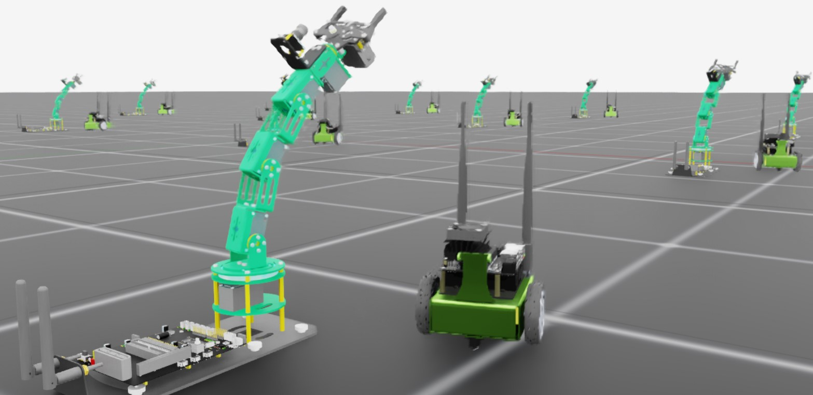

# 在 Isaac Lab 中添加新机器人

在 Isaac Lab 中对一个新机器人进行仿真与训练，通常需要经过多个步骤：首先把机器人导入 Isaac Sim，并把资产（USD articulation）调到适合仿真的状态。
这部分在 Isaac Sim 官方文档中有更系统的介绍：

* Isaac Sim Importer / Exporter：<https://docs.isaacsim.omniverse.nvidia.com/latest/importer_exporter/importers_exporters.html>

当机器人资产已经导入并完成基础调参之后，我们需要在 Isaac Lab 里定义一套“接口”，用来在多环境（multiple environments）中克隆机器人、驱动关节，以及在不同工作流/训练框架下都能可靠地复位（reset）机器人状态。

本教程将围绕“如何在 Isaac Lab 中添加一个新机器人”展开。关键步骤是创建一个 `AssetBaseCfg` （更具体地说，通常是 `ArticulationCfg` ），它用于描述 USD 中的机器人关节/驱动/初始状态等信息，从而把 USD articulation 与 Isaac Lab 中的学习与控制算法对接起来。

## 对应代码

该教程对应 Isaac Lab 仓库中的脚本： `scripts/tutorials/01_assets/add_new_robot.py` 。

```python
# Copyright (c) 2022-2025, The Isaac Lab Project Developers (https://github.com/isaac-sim/IsaacLab/blob/main/CONTRIBUTORS.md).
# All rights reserved.
#
# SPDX-License-Identifier: BSD-3-Clause

import argparse

from isaaclab.app import AppLauncher

# add argparse arguments
parser = argparse.ArgumentParser(
    description="This script demonstrates adding a custom robot to an Isaac Lab environment."
)
parser.add_argument("--num_envs", type=int, default=1, help="Number of environments to spawn.")
# append AppLauncher cli args
AppLauncher.add_app_launcher_args(parser)
# parse the arguments
args_cli = parser.parse_args()

# launch omniverse app
app_launcher = AppLauncher(args_cli)
simulation_app = app_launcher.app

import numpy as np
import torch

import isaaclab.sim as sim_utils
from isaaclab.actuators import ImplicitActuatorCfg
from isaaclab.assets import AssetBaseCfg
from isaaclab.assets.articulation import ArticulationCfg
from isaaclab.scene import InteractiveScene, InteractiveSceneCfg
from isaaclab.utils.assets import ISAAC_NUCLEUS_DIR

JETBOT_CONFIG = ArticulationCfg(
    spawn=sim_utils.UsdFileCfg(usd_path=f"{ISAAC_NUCLEUS_DIR}/Robots/NVIDIA/Jetbot/jetbot.usd"),
    actuators={"wheel_acts": ImplicitActuatorCfg(joint_names_expr=[".*"], damping=None, stiffness=None)},
)

DOFBOT_CONFIG = ArticulationCfg(
    spawn=sim_utils.UsdFileCfg(
        usd_path=f"{ISAAC_NUCLEUS_DIR}/Robots/Yahboom/Dofbot/dofbot.usd",
        rigid_props=sim_utils.RigidBodyPropertiesCfg(
            disable_gravity=False,
            max_depenetration_velocity=5.0,
        ),
        articulation_props=sim_utils.ArticulationRootPropertiesCfg(
            enabled_self_collisions=True, solver_position_iteration_count=8, solver_velocity_iteration_count=0
        ),
    ),
    init_state=ArticulationCfg.InitialStateCfg(
        joint_pos={
            "joint1": 0.0,
            "joint2": 0.0,
            "joint3": 0.0,
            "joint4": 0.0,
        },
        pos=(0.25, -0.25, 0.0),
    ),
    actuators={
        "front_joints": ImplicitActuatorCfg(
            joint_names_expr=["joint[1-2]"],
            effort_limit_sim=100.0,
            velocity_limit_sim=100.0,
            stiffness=10000.0,
            damping=100.0,
        ),
        "joint3_act": ImplicitActuatorCfg(
            joint_names_expr=["joint3"],
            effort_limit_sim=100.0,
            velocity_limit_sim=100.0,
            stiffness=10000.0,
            damping=100.0,
        ),
        "joint4_act": ImplicitActuatorCfg(
            joint_names_expr=["joint4"],
            effort_limit_sim=100.0,
            velocity_limit_sim=100.0,
            stiffness=10000.0,
            damping=100.0,
        ),
    },
)

class NewRobotsSceneCfg(InteractiveSceneCfg):
    """Designs the scene."""

    # Ground-plane
    ground = AssetBaseCfg(prim_path="/World/defaultGroundPlane", spawn=sim_utils.GroundPlaneCfg())

    # lights
    dome_light = AssetBaseCfg(
        prim_path="/World/Light", spawn=sim_utils.DomeLightCfg(intensity=3000.0, color=(0.75, 0.75, 0.75))
    )

    # robot
    Jetbot = JETBOT_CONFIG.replace(prim_path="{ENV_REGEX_NS}/Jetbot")
    Dofbot = DOFBOT_CONFIG.replace(prim_path="{ENV_REGEX_NS}/Dofbot")

def run_simulator(sim: sim_utils.SimulationContext, scene: InteractiveScene):
    sim_dt = sim.get_physics_dt()
    sim_time = 0.0
    count = 0

    while simulation_app.is_running():
        # reset
        if count % 500 == 0:
            # reset counters
            count = 0
            # reset the scene entities to their initial positions offset by the environment origins
            root_jetbot_state = scene["Jetbot"].data.default_root_state.clone()
            root_jetbot_state[:, :3] += scene.env_origins
            root_dofbot_state = scene["Dofbot"].data.default_root_state.clone()
            root_dofbot_state[:, :3] += scene.env_origins

            # copy the default root state to the sim for the jetbot's orientation and velocity
            scene["Jetbot"].write_root_pose_to_sim(root_jetbot_state[:, :7])
            scene["Jetbot"].write_root_velocity_to_sim(root_jetbot_state[:, 7:])
            scene["Dofbot"].write_root_pose_to_sim(root_dofbot_state[:, :7])
            scene["Dofbot"].write_root_velocity_to_sim(root_dofbot_state[:, 7:])

            # copy the default joint states to the sim
            joint_pos, joint_vel = (
                scene["Jetbot"].data.default_joint_pos.clone(),
                scene["Jetbot"].data.default_joint_vel.clone(),
            )
            scene["Jetbot"].write_joint_state_to_sim(joint_pos, joint_vel)
            joint_pos, joint_vel = (
                scene["Dofbot"].data.default_joint_pos.clone(),
                scene["Dofbot"].data.default_joint_vel.clone(),
            )
            scene["Dofbot"].write_joint_state_to_sim(joint_pos, joint_vel)
            # clear internal buffers
            scene.reset()
            print("[INFO]: Resetting Jetbot and Dofbot state...")

        # drive around
        if count % 100 < 75:
            # Drive straight by setting equal wheel velocities
            action = torch.Tensor([[10.0, 10.0]])
        else:
            # Turn by applying different velocities
            action = torch.Tensor([[5.0, -5.0]])

        scene["Jetbot"].set_joint_velocity_target(action)

        # wave
        wave_action = scene["Dofbot"].data.default_joint_pos
        wave_action[:, 0:4] = 0.25 * np.sin(2 * np.pi * 0.5 * sim_time)
        scene["Dofbot"].set_joint_position_target(wave_action)

        scene.write_data_to_sim()
        sim.step()
        sim_time += sim_dt
        count += 1
        scene.update(sim_dt)

def main():
    """Main function."""
    # Initialize the simulation context
    sim_cfg = sim_utils.SimulationCfg(device=args_cli.device)
    sim = sim_utils.SimulationContext(sim_cfg)
    sim.set_camera_view([3.5, 0.0, 3.2], [0.0, 0.0, 0.5])
    # Design scene
    scene_cfg = NewRobotsSceneCfg(args_cli.num_envs, env_spacing=2.0)
    scene = InteractiveScene(scene_cfg)
    # Play the simulator
    sim.reset()
    # Now we are ready!
    print("[INFO]: Setup complete...")
    # Run the simulator
    run_simulator(sim, scene)

if __name__ == "__main__":
    main()
    simulation_app.close()
```

## 代码讲解

从本质上讲，机器人在仿真里通常是一个带有关节驱动（joint drives）的 articulation。要让机器人动起来，你需要为驱动设置目标值（target），并推进仿真时间。
但如果只用“逐个关节设目标”来做控制会非常繁琐：一方面控制复杂行为很困难；另一方面当你需要把机器人复制到多个环境并行仿真时，工作量会成倍增长。

为了解决这些问题，Isaac Lab 提供了一组“配置（configuration）类”，用于声明：

* USD 场景里哪些部分需要被克隆到每个环境中
* 哪些关节/执行器需要被 agent 控制
* 如何初始化与复位（reset）机器人
* 以及其他与物理/求解器相关的参数

同一个机器人资产可以有多种配置方式，取决于你需要对资产做多少“仿真侧的细调”。为了展示这种灵活性，官方教程脚本导入了两个机器人：

* `Jetbot`：配置相对最小化
* `Dofbot`：配置更详细，包含额外的物理属性与初始状态

### Jetbot：最小化配置示例

Jetbot 是一个简单的两轮差速底盘，上面带相机。它在 Isaac Sim 里常被用作演示/示例资产，因此通常可以直接使用。
在 Isaac Lab 中引入它，首先需要定义一个描述机器人 articulation 的配置（ `ArticulationCfg` ）。

```python
import isaaclab.sim as sim_utils
from isaaclab.actuators import ImplicitActuatorCfg
from isaaclab.assets import AssetBaseCfg
from isaaclab.assets.articulation import ArticulationCfg
from isaaclab.scene import InteractiveScene, InteractiveSceneCfg
from isaaclab.utils.assets import ISAAC_NUCLEUS_DIR

JETBOT_CONFIG = ArticulationCfg(
    spawn=sim_utils.UsdFileCfg(usd_path=f"{ISAAC_NUCLEUS_DIR}/Robots/NVIDIA/Jetbot/jetbot.usd"),
    actuators={"wheel_acts": ImplicitActuatorCfg(joint_names_expr=[".*"], damping=None, stiffness=None)},
)

```

在这种最小配置里，通常只有两个必需项： `spawn` 与 `actuators` 。

#### `spawn` ：指定要生成的 USD 资产

`spawn` 需要一个 `SpawnerCfg` ，用于告诉仿真“要从哪个 USD 资产生成这个机器人”。
Isaac Lab 的仿真工具模块（ `isaaclab.sim` ）提供了 `USDFileCfg` ，它接收 USD 路径并生成所需的 `SpawnerCfg` 。

在官方示例中， `jetbot.usd` 位于 Isaac Sim 的资产库（Isaac Assets）路径下，例如： `Robots/Jetbot/jetbot.usd` 。
关于 Isaac Assets 的说明可参考：

* <https://docs.isaacsim.omniverse.nvidia.com/latest/assets/usd_assets_overview.html>

#### `actuators` ：声明要控制的执行器/关节

`actuators` 是一个由“执行器名称 → 执行器配置”组成的字典，用来声明机器人哪些部位会被 agent 控制。
不同的执行器模型会影响关节状态向目标值演化的方式。Isaac Lab 提供了多种 actuator 配置，用于匹配常见的执行器模型，或支持你实现自定义模型。

在 Jetbot 的示例里，由于轮子执行器足够简单，通常用 `ImplicitActuatorCfg` 并采用默认行为即可。

执行器字典里的关节匹配可以使用不同精细度的正则表达式：

* 当关节很少、且直接沿用 USD 资产里的默认参数时，可以用 `.*` 匹配所有关节
* 也可以用更具体的正则把不同关节分组并配置不同参数

::: tip 说明
对于隐式执行器（implicit actuator），通常需要提供 stiffness 与 damping；如果设为 `None` ，则会使用 USD 资产中定义的默认值。
:::

### Dofbot：更完整的配置示例

Dofbot 是一个带多关节的机械臂，因此在配置上通常会更“讲究”。
与 Jetbot 的最小配置相比，两个更显著的差异是：

1. 额外指定了与物理行为相关的属性配置
2. 额外指定了 articulation 的初始状态 `init_state`

```python
DOFBOT_CONFIG = ArticulationCfg(
    spawn=sim_utils.UsdFileCfg(
        usd_path=f"{ISAAC_NUCLEUS_DIR}/Robots/Yahboom/Dofbot/dofbot.usd",
        rigid_props=sim_utils.RigidBodyPropertiesCfg(
            disable_gravity=False,
            max_depenetration_velocity=5.0,
        ),
        articulation_props=sim_utils.ArticulationRootPropertiesCfg(
            enabled_self_collisions=True, solver_position_iteration_count=8, solver_velocity_iteration_count=0
        ),
    ),
    init_state=ArticulationCfg.InitialStateCfg(
        joint_pos={
            "joint1": 0.0,
            "joint2": 0.0,
            "joint3": 0.0,
            "joint4": 0.0,
        },
        pos=(0.25, -0.25, 0.0),
    ),
    actuators={
        "front_joints": ImplicitActuatorCfg(
            joint_names_expr=["joint[1-2]"],
            effort_limit_sim=100.0,
            velocity_limit_sim=100.0,
            stiffness=10000.0,
            damping=100.0,
        ),
        "joint3_act": ImplicitActuatorCfg(
            joint_names_expr=["joint3"],
            effort_limit_sim=100.0,
            velocity_limit_sim=100.0,
            stiffness=10000.0,
            damping=100.0,
        ),
        "joint4_act": ImplicitActuatorCfg(
            joint_names_expr=["joint4"],
            effort_limit_sim=100.0,
            velocity_limit_sim=100.0,
            stiffness=10000.0,
            damping=100.0,
        ),
    },
)
```

#### 物理属性： `rigid_props` 与 `articulation_props`

`USDFileCfg` 对刚体与机器人等资产提供了一些特殊参数。

* `rigid_props`：期望一个 `RigidBodyPropertiesCfg`，用于配置机器人各 link 作为“物理对象”时的行为
* `articulation_props`：用于配置 articulation 根部以及求解器相关属性（例如关节求解/稳定性），通常期望一个 `ArticulationRootPropertiesCfg`

更完整的可配置项可以参考 Isaac Lab 中 `isaaclab.sim.schemas` 提供的配置类型。

#### 初始状态： `init_state`

`ArticulationCfg` 可以包含 `init_state` ，它定义了机器人在生成或被 Isaac Lab 复位时使用的“用户定义初始状态”。

需要特别注意的是：

* 初始关节角 `joint_pos` 通常用一个“USD 关节名 → 浮点值”的字典表示（这里的 key 是 USD joint 名称，而不是 actuator 名称）
* 初始位置 `pos` 的坐标系是“环境（environment）坐标系”

也就是说，如果设置 `pos = (0.25, -0.25, 0.0)` ，它表示相对于“环境原点”的偏移，而不是相对于世界坐标系的偏移。

### 将机器人加入场景并驱动仿真

有了 Jetbot 与 Dofbot 的配置之后，就可以把它们作为 scene entity 加入到 `InteractiveSceneCfg` 中，并使用 direct workflow 的方式与它们交互：

* 在场景配置里登记两个 articulation 配置
* 在仿真循环中：按需更新目标、推进仿真、刷新 scene entity 的状态

```python
class NewRobotsSceneCfg(InteractiveSceneCfg):
    """Designs the scene."""

    # Ground-plane
    ground = AssetBaseCfg(prim_path="/World/defaultGroundPlane", spawn=sim_utils.GroundPlaneCfg())

    # lights
    dome_light = AssetBaseCfg(
        prim_path="/World/Light", spawn=sim_utils.DomeLightCfg(intensity=3000.0, color=(0.75, 0.75, 0.75))
    )

    # robot
    Jetbot = JETBOT_CONFIG.replace(prim_path="{ENV_REGEX_NS}/Jetbot")
    Dofbot = DOFBOT_CONFIG.replace(prim_path="{ENV_REGEX_NS}/Dofbot")
```

```python
def run_simulator(sim: sim_utils.SimulationContext, scene: InteractiveScene):
    sim_dt = sim.get_physics_dt()
    sim_time = 0.0
    count = 0

    while simulation_app.is_running():
        # reset
        if count % 500 == 0:
            # reset counters
            count = 0
            # reset the scene entities to their initial positions offset by the environment origins
            root_jetbot_state = scene["Jetbot"].data.default_root_state.clone()
            root_jetbot_state[:, :3] += scene.env_origins
            root_dofbot_state = scene["Dofbot"].data.default_root_state.clone()
            root_dofbot_state[:, :3] += scene.env_origins

            # copy the default root state to the sim for the jetbot's orientation and velocity
            scene["Jetbot"].write_root_pose_to_sim(root_jetbot_state[:, :7])
            scene["Jetbot"].write_root_velocity_to_sim(root_jetbot_state[:, 7:])
            scene["Dofbot"].write_root_pose_to_sim(root_dofbot_state[:, :7])
            scene["Dofbot"].write_root_velocity_to_sim(root_dofbot_state[:, 7:])

            # copy the default joint states to the sim
            joint_pos, joint_vel = (
                scene["Jetbot"].data.default_joint_pos.clone(),
                scene["Jetbot"].data.default_joint_vel.clone(),
            )
            scene["Jetbot"].write_joint_state_to_sim(joint_pos, joint_vel)
            joint_pos, joint_vel = (
                scene["Dofbot"].data.default_joint_pos.clone(),
                scene["Dofbot"].data.default_joint_vel.clone(),
            )
            scene["Dofbot"].write_joint_state_to_sim(joint_pos, joint_vel)
            # clear internal buffers
            scene.reset()
            print("[INFO]: Resetting Jetbot and Dofbot state...")

        # drive around
        if count % 100 < 75:
            # Drive straight by setting equal wheel velocities
            action = torch.Tensor([[10.0, 10.0]])
        else:
            # Turn by applying different velocities
            action = torch.Tensor([[5.0, -5.0]])

        scene["Jetbot"].set_joint_velocity_target(action)

        # wave
        wave_action = scene["Dofbot"].data.default_joint_pos
        wave_action[:, 0:4] = 0.25 * np.sin(2 * np.pi * 0.5 * sim_time)
        scene["Dofbot"].set_joint_position_target(wave_action)

        scene.write_data_to_sim()
        sim.step()
        sim_time += sim_dt
        count += 1
        scene.update(sim_dt)
```



::: warning 提示
官方示例中你可能会看到类似“并非所有 actuator 都已配置”的警告。这在该教程里是预期行为，因为示例没有处理夹爪（gripper）的控制与配置。
:::

