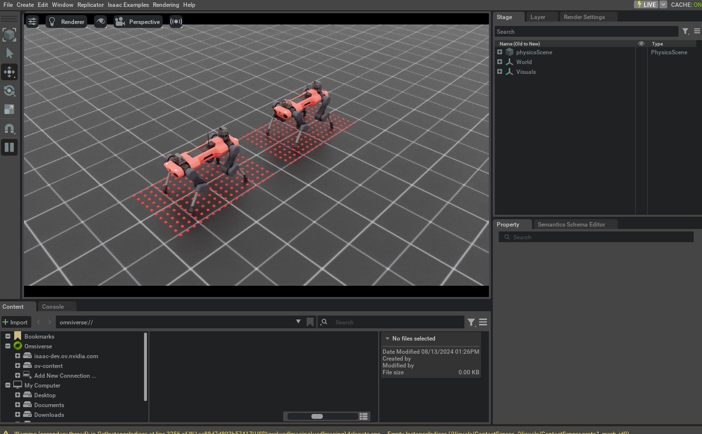

# 在机器人上添加传感器

资产（asset）相关的类可以帮助我们创建并模拟机器人的物理实体，而传感器则用于获取环境信息。传感器通常以低于仿真频率的频率更新，并可用于获取不同的本体感觉（proprioceptive）与外感知（exteroceptive）信息。例如，相机传感器可用于获取环境的视觉信息，接触传感器可用于获取机器人与环境之间的接触信息。

在本教程中，我们将了解如何为机器人添加不同类型的传感器。我们将使用 ANYmal-C 机器人作为示例。ANYmal-C 是一台具有 12 个自由度的四足机器人：它有 4 条腿，每条腿 3 个自由度。该机器人包含以下传感器：

* 机器人头部的相机传感器，用于提供 RGB-D 图像
* 高度扫描（height scanner）传感器，用于提供地形高度信息
* 机器人足端的接触传感器，用于提供接触信息

本教程延续自上一节 [create-scene](create-scene.md)（对应 :ref: `tutorial-interactive-scene` ），我们在其中学习了 `scene.InteractiveScene` 类。

## 代码

本教程对应 `scripts/tutorials/04_sensors` 目录下的 `add_sensors_on_robot.py` 脚本。

<details>
<summary>add_sensors_on_robot.py 的代码</summary>

```python
# Copyright (c) 2022-2025, The Isaac Lab Project Developers (https://github.com/isaac-sim/IsaacLab/blob/main/CONTRIBUTORS.md).
# All rights reserved.
#
# SPDX-License-Identifier: BSD-3-Clause

"""
This script demonstrates how to add and simulate on-board sensors for a robot.

We add the following sensors on the quadruped robot, ANYmal-C (ANYbotics):

* USD-Camera: This is a camera sensor that is attached to the robot's base.
* Height Scanner: This is a height scanner sensor that is attached to the robot's base.
* Contact Sensor: This is a contact sensor that is attached to the robot's feet.

.. code-block:: bash

    # Usage
    ./isaaclab.sh -p scripts/tutorials/04_sensors/add_sensors_on_robot.py --enable_cameras

"""

"""Launch Isaac Sim Simulator first."""

import argparse

from isaaclab.app import AppLauncher

# add argparse arguments
parser = argparse.ArgumentParser(description="Tutorial on adding sensors on a robot.")
parser.add_argument("--num_envs", type=int, default=2, help="Number of environments to spawn.")
# append AppLauncher cli args
AppLauncher.add_app_launcher_args(parser)
# parse the arguments
args_cli = parser.parse_args()

# launch omniverse app
app_launcher = AppLauncher(args_cli)
simulation_app = app_launcher.app

"""Rest everything follows."""

import torch

import isaaclab.sim as sim_utils
from isaaclab.assets import ArticulationCfg, AssetBaseCfg
from isaaclab.scene import InteractiveScene, InteractiveSceneCfg
from isaaclab.sensors import CameraCfg, ContactSensorCfg, RayCasterCfg, patterns
from isaaclab.utils import configclass

##
# Pre-defined configs
##
from isaaclab_assets.robots.anymal import ANYMAL_C_CFG  # isort: skip

@configclass
class SensorsSceneCfg(InteractiveSceneCfg):

    """Design the scene with sensors on the robot."""

    # ground plane
    ground = AssetBaseCfg(prim_path="/World/defaultGroundPlane", spawn=sim_utils.GroundPlaneCfg())

    # lights
    dome_light = AssetBaseCfg(
        prim_path="/World/Light", spawn=sim_utils.DomeLightCfg(intensity=3000.0, color=(0.75, 0.75, 0.75))
    )

    # robot
    robot: ArticulationCfg = ANYMAL_C_CFG.replace(prim_path="{ENV_REGEX_NS}/Robot")

    # sensors
    camera = CameraCfg(
        prim_path="{ENV_REGEX_NS}/Robot/base/front_cam",
        update_period=0.1,
        height=480,
        width=640,
        data_types=["rgb", "distance_to_image_plane"],
        spawn=sim_utils.PinholeCameraCfg(
            focal_length=24.0, focus_distance=400.0, horizontal_aperture=20.955, clipping_range=(0.1, 1.0e5)
        ),
        offset=CameraCfg.OffsetCfg(pos=(0.510, 0.0, 0.015), rot=(0.5, -0.5, 0.5, -0.5), convention="ros"),
    )
    height_scanner = RayCasterCfg(
        prim_path="{ENV_REGEX_NS}/Robot/base",
        update_period=0.02,
        offset=RayCasterCfg.OffsetCfg(pos=(0.0, 0.0, 20.0)),
        ray_alignment="yaw",
        pattern_cfg=patterns.GridPatternCfg(resolution=0.1, size=[1.6, 1.0]),
        debug_vis=True,
        mesh_prim_paths=["/World/defaultGroundPlane"],
    )
    contact_forces = ContactSensorCfg(
        prim_path="{ENV_REGEX_NS}/Robot/.*_FOOT", update_period=0.0, history_length=6, debug_vis=True
    )

def run_simulator(sim: sim_utils.SimulationContext, scene: InteractiveScene):

    """Run the simulator."""
    # Define simulation stepping
    sim_dt = sim.get_physics_dt()
    sim_time = 0.0
    count = 0

    # Simulate physics
    while simulation_app.is_running():
        # Reset
        if count % 500 == 0:
            # reset counter
            count = 0
            # reset the scene entities
            # root state
            # we offset the root state by the origin since the states are written in simulation world frame
            # if this is not done, then the robots will be spawned at the (0, 0, 0) of the simulation world
            root_state = scene["robot"].data.default_root_state.clone()
            root_state[:, :3] += scene.env_origins
            scene["robot"].write_root_pose_to_sim(root_state[:, :7])
            scene["robot"].write_root_velocity_to_sim(root_state[:, 7:])
            # set joint positions with some noise
            joint_pos, joint_vel = (
                scene["robot"].data.default_joint_pos.clone(),
                scene["robot"].data.default_joint_vel.clone(),
            )
            joint_pos += torch.rand_like(joint_pos) * 0.1
            scene["robot"].write_joint_state_to_sim(joint_pos, joint_vel)
            # clear internal buffers
            scene.reset()
            print("[INFO]: Resetting robot state...")
        # Apply default actions to the robot
        # -- generate actions/commands
        targets = scene["robot"].data.default_joint_pos
        # -- apply action to the robot
        scene["robot"].set_joint_position_target(targets)
        # -- write data to sim
        scene.write_data_to_sim()
        # perform step
        sim.step()
        # update sim-time
        sim_time += sim_dt
        count += 1
        # update buffers
        scene.update(sim_dt)

        # print information from the sensors
        print("-------------------------------")
        print(scene["camera"])
        print("Received shape of rgb   image: ", scene["camera"].data.output["rgb"].shape)
        print("Received shape of depth image: ", scene["camera"].data.output["distance_to_image_plane"].shape)
        print("-------------------------------")
        print(scene["height_scanner"])
        print("Received max height value: ", torch.max(scene["height_scanner"].data.ray_hits_w[..., -1]).item())
        print("-------------------------------")
        print(scene["contact_forces"])
        print("Received max contact force of: ", torch.max(scene["contact_forces"].data.net_forces_w).item())

def main():

    """Main function."""

    # Initialize the simulation context
    sim_cfg = sim_utils.SimulationCfg(dt=0.005, device=args_cli.device)
    sim = sim_utils.SimulationContext(sim_cfg)
    # Set main camera
    sim.set_camera_view(eye=[3.5, 3.5, 3.5], target=[0.0, 0.0, 0.0])
    # Design scene
    scene_cfg = SensorsSceneCfg(num_envs=args_cli.num_envs, env_spacing=2.0)
    scene = InteractiveScene(scene_cfg)
    # Play the simulator
    sim.reset()
    # Now we are ready!
    print("[INFO]: Setup complete...")
    # Run the simulator
    run_simulator(sim, scene)

if __name__ == "__main__":
    # run the main function
    main()
    # close sim app
    simulation_app.close()
```

</details>

## 代码讲解

与前面的教程类似，我们此前通过场景配置（scene configuration）向场景中添加资产；同样地，传感器也通过场景配置添加到场景中。所有传感器都继承自 `sensors.SensorBase` 类，并通过各自的配置类进行配置。每个传感器实例都可以定义自己的更新周期（update period），即该传感器更新的频率。更新周期以秒为单位，通过 `sensors.SensorBaseCfg.update_period` 属性进行设置。

根据指定的路径以及传感器类型，传感器会被挂载到场景中的 prim 上。它们可能对应一个在场景中创建的 prim，也可能附着在一个已有 prim 上。例如，相机传感器会在场景中创建一个对应的 prim；而对于接触传感器，“启用接触报告（contact reporting）”则是刚体 prim 上的一个属性。

下面我们将介绍本教程中使用的不同传感器及其配置方式。关于它们的更多说明，请参考 `sensors` 模块。

### 相机传感器

相机通过 `sensors.CameraCfg` 进行定义。它基于 USD Camera 传感器，不同类型的数据通过 Omniverse Replicator API 采集。由于它在场景中有对应的 prim，因此会在指定的 prim path 下创建该 prim。

相机传感器的配置包含以下参数：

* `sensors.CameraCfg.spawn`：要创建的 USD 相机类型，可以是 `sim.spawners.sensors.PinholeCameraCfg` 或 `sim.spawners.sensors.FisheyeCameraCfg`。
* `sensors.CameraCfg.offset`：相机传感器相对于父 prim 的偏移。
* `sensors.CameraCfg.data_types`：要采集的数据类型，可以是 `rgb`、`distance_to_image_plane`、`normals`，或 USD Camera 传感器支持的其他类型。

为了将一个 RGB-D 相机传感器挂载到机器人头部，我们需要指定相对于机器人基坐标系（base frame）的 offset。该 offset 以相对基坐标系的平移与旋转来表达，并由 `sensors.CameraCfg.OffsetCfg.convention` 指定使用哪种约定。

下面展示本教程使用的相机传感器配置。我们将 update period 设置为 0.1s，这意味着相机以 10Hz 更新。prim path 表达式设为 `{ENV_REGEX_NS}/Robot/base/front_cam` ，其中 `{ENV_REGEX_NS}` 是环境命名空间， `"Robot"` 是机器人名称， `"base"` 是相机挂载的 prim 名称， `"front_cam"` 是与相机传感器关联的 prim 名称。

```python
camera = CameraCfg(

    prim_path="{ENV_REGEX_NS}/Robot/base/front_cam",
    update_period=0.1,
    height=480,
    width=640,
    data_types=["rgb", "distance_to_image_plane"],
    spawn=sim_utils.PinholeCameraCfg(
        focal_length=24.0, focus_distance=400.0, horizontal_aperture=20.955, clipping_range=(0.1, 1.0e5)
    ),
    offset=CameraCfg.OffsetCfg(pos=(0.510, 0.0, 0.015), rot=(0.5, -0.5, 0.5, -0.5), convention="ros"),
)
```

### 高度扫描器

高度扫描器（height-scanner）通过 NVIDIA Warp 的射线投射（ray-casting）核实现为虚拟传感器。借助 `sensors.RayCasterCfg` ，我们可以指定要投射的射线模式，以及射线要投射到哪些网格（mesh）上。由于它是虚拟传感器，因此不会在场景中创建对应的 prim；相反，它会附着在场景中的某个 prim 上，并以该 prim 来确定传感器的位置。

在本教程中，基于 ray-cast 的高度扫描器被附着在机器人的基坐标系（base frame）上。射线模式通过 `sensors.RayCasterCfg.pattern` 属性指定。对于均匀网格（uniform grid）模式，我们使用 `sensors.patterns.GridPatternCfg` 来指定 pattern。由于我们只关心高度信息，因此无需考虑机器人的 roll 与 pitch；因此我们将 `sensors.RayCasterCfg.ray_alignment` 设置为 "yaw"。

对于高度扫描器，你可以可视化射线击中网格的位置点。这可以通过将 `sensors.SensorBaseCfg.debug_vis` 设置为 true 来实现。

高度扫描器的完整配置如下：

```python
height_scanner = RayCasterCfg(

    prim_path="{ENV_REGEX_NS}/Robot/base",
    update_period=0.02,
    offset=RayCasterCfg.OffsetCfg(pos=(0.0, 0.0, 20.0)),
    ray_alignment="yaw",
    pattern_cfg=patterns.GridPatternCfg(resolution=0.1, size=[1.6, 1.0]),
    debug_vis=True,
    mesh_prim_paths=["/World/defaultGroundPlane"],
)
```

### 接触传感器

接触传感器（contact sensor）封装了 PhysX 的接触报告（contact reporting）API，用于获取机器人与环境之间的接触信息。由于它依赖 PhysX，接触传感器要求在机器人的刚体上启用接触报告 API。你可以在资产配置中将 `sim.spawners.RigidObjectSpawnerCfg.activate_contact_sensors` 设置为 true 来启用。

通过 `sensors.ContactSensorCfg` ，可以指定我们希望获取接触信息的 prim。还可以设置额外的标志位，以获取更多接触信息，例如接触滞空时间（contact air time）、经过过滤的 prim 之间的接触力等。

在本教程中，我们将接触传感器挂载到机器人的足端。机器人足端的命名为 `"LF_FOOT"` 、 `"RF_FOOT"` 、 `"LH_FOOT"` 、 `"RH_FOOT"` 。我们使用一个正则表达式 `".*_FOOT"` 来简化 prim path 的指定；该正则会匹配所有以 `"_FOOT"` 结尾的 prim。

我们将 update period 设置为 0，使传感器以与仿真相同的频率更新。此外，对于接触传感器，我们还可以指定要存储的接触信息历史长度（history length）。在本教程中，我们将历史长度设为 6，这意味着会保存最近 6 个仿真步的接触信息。

接触传感器的完整配置如下：

```python
contact_forces = ContactSensorCfg(

    prim_path="{ENV_REGEX_NS}/Robot/.*_FOOT", update_period=0.0, history_length=6, debug_vis=True
)
```

### 运行仿真循环

与使用资产时类似，传感器的缓冲区（buffers）与物理句柄（physics handles）只有在仿真开始播放后才会初始化。因此，在创建场景之后调用 `sim.reset()` 非常重要。

```python
# Play the simulator
sim.reset()
```

除此之外，仿真循环与之前的教程类似。传感器会作为场景更新的一部分进行更新，并会根据各自的 update period 在内部完成缓冲区更新。

传感器数据可以通过其 `data` 属性访问。作为示例，下面展示如何访问本教程中创建的不同传感器的数据：

```python
# print information from the sensors
print("-------------------------------")
print(scene["camera"])
print("Received shape of rgb   image: ", scene["camera"].data.output["rgb"].shape)
print("Received shape of depth image: ", scene["camera"].data.output["distance_to_image_plane"].shape)
print("-------------------------------")
print(scene["height_scanner"])
print("Received max height value: ", torch.max(scene["height_scanner"].data.ray_hits_w[..., -1]).item())
print("-------------------------------")
print(scene["contact_forces"])
print("Received max contact force of: ", torch.max(scene["contact_forces"].data.net_forces_w).item())
```

## 代码运行

现在我们已经过了一遍代码，接下来运行脚本并查看结果：

```bash
./isaaclab.sh -p scripts/tutorials/04_sensors/add_sensors_on_robot.py --num_envs 2 --enable_cameras
```

该命令会打开一个 stage，其中包含地面、光源以及两台四足机器人。
在机器人周围，你应该能看到红色球体，用于表示射线击中网格的位置点。
此外，你还可以将视口（viewport）切换到相机视角，以查看相机传感器采集到的 RGB 图像。
关于如何将视口切换到相机视角的更多信息，请参考 [这里](https://youtu.be/htPbcKkNMPs?feature=shared)。



要停止仿真，你可以直接关闭窗口，或在终端中按下 `Ctrl+C` 。

在本教程中，我们介绍了如何创建并使用不同的传感器；在 `sensors` 模块中还有更多可用传感器。
在 `scripts/tutorials/04_sensors` 目录下，我们提供了使用这些传感器的最小示例。为完整起见，这些脚本可以通过以下命令运行：

```bash
# Frame Transformer
./isaaclab.sh -p scripts/tutorials/04_sensors/run_frame_transformer.py

# Ray Caster
./isaaclab.sh -p scripts/tutorials/04_sensors/run_ray_caster.py

# Ray Caster Camera
./isaaclab.sh -p scripts/tutorials/04_sensors/run_ray_caster_camera.py

# USD Camera
./isaaclab.sh -p scripts/tutorials/04_sensors/run_usd_camera.py --enable_cameras
```
