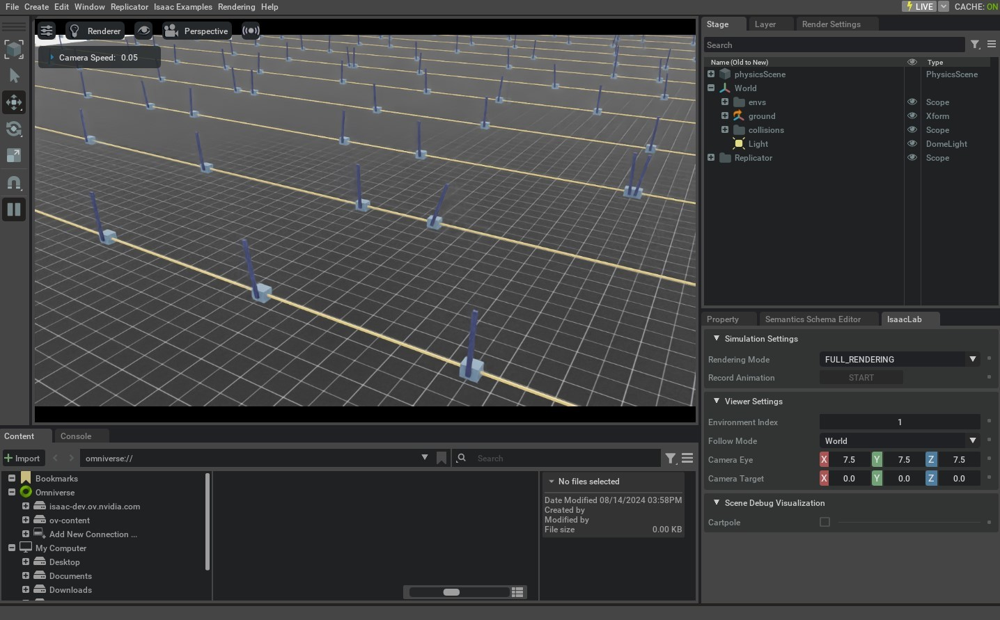

# 创建 Direct Workflow 的强化学习环境（Direct Workflow RL Environment）

除了更强调“通过配置类组织环境组件”的 `envs.ManagerBasedRLEnv` 之外，Isaac Lab 还提供了 `isaaclab.envs.DirectRLEnv` ，用于以更“直接”的方式编写 RL 环境脚本。

在 direct workflow 中，你不会再用一组 Manager 类来拼装奖励与观测；相反，任务脚本会**直接实现完整的奖励函数与观测函数**。这种写法带来两个显著特点：

* 你可以更自由地控制实现细节（例如充分利用 PyTorch JIT 等特性）。
* 框架抽象层更少，代码组织更“平铺直叙”，更容易定位“观测从哪里来、奖励怎么算、何时重置”等逻辑。

本教程将使用 direct workflow 版本的 cartpole 环境来构建“保持杆竖直平衡”的任务。我们会通过实现场景创建、动作施加、重置、奖励与观测等函数，来完成任务定义。

## 代码

本教程使用的 cartpole 环境位于 `isaaclab_tasks.direct.cartpole` 模块。

```python
# Copyright (c) 2022-2025, The Isaac Lab Project Developers (https://github.com/isaac-sim/IsaacLab/blob/main/CONTRIBUTORS.md).
# All rights reserved.
#
# SPDX-License-Identifier: BSD-3-Clause

from __future__ import annotations

import math
import torch
from collections.abc import Sequence

from isaaclab_assets.robots.cartpole import CARTPOLE_CFG

import isaaclab.sim as sim_utils
from isaaclab.assets import Articulation, ArticulationCfg
from isaaclab.envs import DirectRLEnv, DirectRLEnvCfg
from isaaclab.scene import InteractiveSceneCfg
from isaaclab.sim import SimulationCfg
from isaaclab.sim.spawners.from_files import GroundPlaneCfg, spawn_ground_plane
from isaaclab.utils import configclass
from isaaclab.utils.math import sample_uniform

@configclass
class CartpoleEnvCfg(DirectRLEnvCfg):
    # env
    decimation = 2
    episode_length_s = 5.0
    action_scale = 100.0  # [N]
    action_space = 1
    observation_space = 4
    state_space = 0

    # simulation
    sim: SimulationCfg = SimulationCfg(dt=1 / 120, render_interval=decimation)

    # robot
    robot_cfg: ArticulationCfg = CARTPOLE_CFG.replace(prim_path="/World/envs/env_.*/Robot")
    cart_dof_name = "slider_to_cart"
    pole_dof_name = "cart_to_pole"

    # scene
    scene: InteractiveSceneCfg = InteractiveSceneCfg(
        num_envs=4096, env_spacing=4.0, replicate_physics=True, clone_in_fabric=True
    )

    # reset
    max_cart_pos = 3.0  # the cart is reset if it exceeds that position [m]
    initial_pole_angle_range = [-0.25, 0.25]  # the range in which the pole angle is sampled from on reset [rad]

    # reward scales
    rew_scale_alive = 1.0
    rew_scale_terminated = -2.0
    rew_scale_pole_pos = -1.0
    rew_scale_cart_vel = -0.01
    rew_scale_pole_vel = -0.005

class CartpoleEnv(DirectRLEnv):
    cfg: CartpoleEnvCfg

    def __init__(self, cfg: CartpoleEnvCfg, render_mode: str | None = None, **kwargs):
        super().__init__(cfg, render_mode, **kwargs)

        self._cart_dof_idx, _ = self.cartpole.find_joints(self.cfg.cart_dof_name)
        self._pole_dof_idx, _ = self.cartpole.find_joints(self.cfg.pole_dof_name)
        self.action_scale = self.cfg.action_scale

        self.joint_pos = self.cartpole.data.joint_pos
        self.joint_vel = self.cartpole.data.joint_vel

    def _setup_scene(self):
        self.cartpole = Articulation(self.cfg.robot_cfg)
        # add ground plane
        spawn_ground_plane(prim_path="/World/ground", cfg=GroundPlaneCfg())
        # clone and replicate
        self.scene.clone_environments(copy_from_source=False)
        # we need to explicitly filter collisions for CPU simulation
        if self.device == "cpu":
            self.scene.filter_collisions(global_prim_paths=[])
        # add articulation to scene
        self.scene.articulations["cartpole"] = self.cartpole
        # add lights
        light_cfg = sim_utils.DomeLightCfg(intensity=2000.0, color=(0.75, 0.75, 0.75))
        light_cfg.func("/World/Light", light_cfg)

    def _pre_physics_step(self, actions: torch.Tensor) -> None:
        self.actions = self.action_scale * actions.clone()

    def _apply_action(self) -> None:
        self.cartpole.set_joint_effort_target(self.actions, joint_ids=self._cart_dof_idx)

    def _get_observations(self) -> dict:
        obs = torch.cat(
            (
                self.joint_pos[:, self._pole_dof_idx[0]].unsqueeze(dim=1),
                self.joint_vel[:, self._pole_dof_idx[0]].unsqueeze(dim=1),
                self.joint_pos[:, self._cart_dof_idx[0]].unsqueeze(dim=1),
                self.joint_vel[:, self._cart_dof_idx[0]].unsqueeze(dim=1),
            ),
            dim=-1,
        )
        observations = {"policy": obs}
        return observations

    def _get_rewards(self) -> torch.Tensor:
        total_reward = compute_rewards(
            self.cfg.rew_scale_alive,
            self.cfg.rew_scale_terminated,
            self.cfg.rew_scale_pole_pos,
            self.cfg.rew_scale_cart_vel,
            self.cfg.rew_scale_pole_vel,
            self.joint_pos[:, self._pole_dof_idx[0]],
            self.joint_vel[:, self._pole_dof_idx[0]],
            self.joint_pos[:, self._cart_dof_idx[0]],
            self.joint_vel[:, self._cart_dof_idx[0]],
            self.reset_terminated,
        )
        return total_reward

    def _get_dones(self) -> tuple[torch.Tensor, torch.Tensor]:
        self.joint_pos = self.cartpole.data.joint_pos
        self.joint_vel = self.cartpole.data.joint_vel

        time_out = self.episode_length_buf >= self.max_episode_length - 1
        out_of_bounds = torch.any(torch.abs(self.joint_pos[:, self._cart_dof_idx]) > self.cfg.max_cart_pos, dim=1)
        out_of_bounds = out_of_bounds | torch.any(torch.abs(self.joint_pos[:, self._pole_dof_idx]) > math.pi / 2, dim=1)
        return out_of_bounds, time_out

    def _reset_idx(self, env_ids: Sequence[int] | None):
        if env_ids is None:
            env_ids = self.cartpole._ALL_INDICES
        super()._reset_idx(env_ids)

        joint_pos = self.cartpole.data.default_joint_pos[env_ids]
        joint_pos[:, self._pole_dof_idx] += sample_uniform(
            self.cfg.initial_pole_angle_range[0] * math.pi,
            self.cfg.initial_pole_angle_range[1] * math.pi,
            joint_pos[:, self._pole_dof_idx].shape,
            joint_pos.device,
        )
        joint_vel = self.cartpole.data.default_joint_vel[env_ids]

        default_root_state = self.cartpole.data.default_root_state[env_ids]
        default_root_state[:, :3] += self.scene.env_origins[env_ids]

        self.joint_pos[env_ids] = joint_pos
        self.joint_vel[env_ids] = joint_vel

        self.cartpole.write_root_pose_to_sim(default_root_state[:, :7], env_ids)
        self.cartpole.write_root_velocity_to_sim(default_root_state[:, 7:], env_ids)
        self.cartpole.write_joint_state_to_sim(joint_pos, joint_vel, None, env_ids)

@torch.jit.script
def compute_rewards(
    rew_scale_alive: float,
    rew_scale_terminated: float,
    rew_scale_pole_pos: float,
    rew_scale_cart_vel: float,
    rew_scale_pole_vel: float,
    pole_pos: torch.Tensor,
    pole_vel: torch.Tensor,
    cart_pos: torch.Tensor,
    cart_vel: torch.Tensor,
    reset_terminated: torch.Tensor,
):
    rew_alive = rew_scale_alive * (1.0 - reset_terminated.float())
    rew_termination = rew_scale_terminated * reset_terminated.float()
    rew_pole_pos = rew_scale_pole_pos * torch.sum(torch.square(pole_pos).unsqueeze(dim=1), dim=-1)
    rew_cart_vel = rew_scale_cart_vel * torch.sum(torch.abs(cart_vel).unsqueeze(dim=1), dim=-1)
    rew_pole_vel = rew_scale_pole_vel * torch.sum(torch.abs(pole_vel).unsqueeze(dim=1), dim=-1)
    total_reward = rew_alive + rew_termination + rew_pole_pos + rew_cart_vel + rew_pole_vel
    return total_reward
```

## 代码讲解

与 manager-based 环境类似，direct workflow 也会用一个配置类来承载仿真参数、场景、actor 以及任务相关的设置。不同的是，direct workflow 以 `envs.DirectRLEnvCfg` 作为配置基类。

另外，由于 direct workflow 不使用 Action/Observation managers，因此**任务配置需要显式声明动作/观测维度**。

### 配置类：定义动作/观测维度

```python
@configclass
class CartpoleEnvCfg(DirectRLEnvCfg):
    ...
    action_space = 1
    observation_space = 4
    state_space = 0
```

配置类也可以用来定义任务特有的参数，例如 reset 的阈值，以及奖励项的缩放系数（scale）。

```python
@configclass
class CartpoleEnvCfg(DirectRLEnvCfg):
    ...
    # reset
    max_cart_pos = 3.0
    initial_pole_angle_range = [-0.25, 0.25]

    # reward scales
    rew_scale_alive = 1.0
    rew_scale_terminated = -2.0
    rew_scale_pole_pos = -1.0
    rew_scale_cart_vel = -0.01
    rew_scale_pole_vel = -0.005
```

### 环境类：继承 DirectRLEnv

创建新环境时，需要定义一个继承自 `isaaclab.envs.DirectRLEnv` 的类：

```python
class CartpoleEnv(DirectRLEnv):
    cfg: CartpoleEnvCfg

    def __init__(self, cfg: CartpoleEnvCfg, render_mode: str | None = None, **kwargs):
        super().__init__(cfg, render_mode, **kwargs)
```

环境类本身也可以保存一些类成员变量，供动作施加、重置计算、奖励计算与观测计算等函数共享。

## 场景创建（Scene Creation）

在 manager-based 环境中，场景创建通常由框架流程统一组织；而 direct workflow 把自由度交给了用户：你可以自己实现“把 actor 加入 stage、克隆多环境、过滤跨环境碰撞、添加地面/灯光”等一整套逻辑。

这些操作需要在 `_setup_scene(self)` 方法中完成。

```python
def _setup_scene(self):
    self.cartpole = Articulation(self.cfg.robot_cfg)
    # add ground plane
    spawn_ground_plane(prim_path="/World/ground", cfg=GroundPlaneCfg())
    # clone and replicate
    self.scene.clone_environments(copy_from_source=False)
    # we need to explicitly filter collisions for CPU simulation
    if self.device == "cpu":
        self.scene.filter_collisions(global_prim_paths=[])
    # add articulation to scene
    self.scene.articulations["cartpole"] = self.cartpole
    # add lights
    light_cfg = sim_utils.DomeLightCfg(intensity=2000.0, color=(0.75, 0.75, 0.75))
    light_cfg.func("/World/Light", light_cfg)
```

## 定义奖励（Defining Rewards）

奖励需要在 `_get_rewards(self)` 中计算，并返回 reward buffer。该方法内的具体实现完全由任务决定。

在本例中，奖励的数值计算被拆到一个 `@torch.jit.script` 的函数 `compute_rewards(...)` 中，以便更好地利用 PyTorch JIT。

```python
def _get_rewards(self) -> torch.Tensor:
    total_reward = compute_rewards(
        self.cfg.rew_scale_alive,
        self.cfg.rew_scale_terminated,
        self.cfg.rew_scale_pole_pos,
        self.cfg.rew_scale_cart_vel,
        self.cfg.rew_scale_pole_vel,
        self.joint_pos[:, self._pole_dof_idx[0]],
        self.joint_vel[:, self._pole_dof_idx[0]],
        self.joint_pos[:, self._cart_dof_idx[0]],
        self.joint_vel[:, self._cart_dof_idx[0]],
        self.reset_terminated,
    )
    return total_reward

@torch.jit.script
def compute_rewards(
    rew_scale_alive: float,
    rew_scale_terminated: float,
    rew_scale_pole_pos: float,
    rew_scale_cart_vel: float,
    rew_scale_pole_vel: float,
    pole_pos: torch.Tensor,
    pole_vel: torch.Tensor,
    cart_pos: torch.Tensor,
    cart_vel: torch.Tensor,
    reset_terminated: torch.Tensor,
):
    rew_alive = rew_scale_alive * (1.0 - reset_terminated.float())
    rew_termination = rew_scale_terminated * reset_terminated.float()
    rew_pole_pos = rew_scale_pole_pos * torch.sum(torch.square(pole_pos).unsqueeze(dim=1), dim=-1)
    rew_cart_vel = rew_scale_cart_vel * torch.sum(torch.abs(cart_vel).unsqueeze(dim=1), dim=-1)
    rew_pole_vel = rew_scale_pole_vel * torch.sum(torch.abs(pole_vel).unsqueeze(dim=1), dim=-1)
    total_reward = rew_alive + rew_termination + rew_pole_pos + rew_cart_vel + rew_pole_vel
    return total_reward
```

## 定义观测（Defining Observations）

观测需要在 `_get_observations(self)` 中计算。该方法需要返回一个字典，其中必须包含键 `policy` ，其值为完整的观测 buffer。

如果你使用非对称 actor-critic（例如 critic 使用更多的状态信息），则通常还会在字典中加入键 `critic` ，并将 state buffer 作为值返回。

本例只提供 `policy` ：

```python
def _get_observations(self) -> dict:
    obs = torch.cat(
        (
            self.joint_pos[:, self._pole_dof_idx[0]].unsqueeze(dim=1),
            self.joint_vel[:, self._pole_dof_idx[0]].unsqueeze(dim=1),
            self.joint_pos[:, self._cart_dof_idx[0]].unsqueeze(dim=1),
            self.joint_vel[:, self._cart_dof_idx[0]].unsqueeze(dim=1),
        ),
        dim=-1,
    )
    observations = {"policy": obs}
    return observations
```

## 计算终止并执行重置（Computing Dones and Performing Resets）

`dones` buffer 由 `_get_dones(self)` 填充。该方法可以自由实现逻辑，用于判断：

* 哪些环境需要 reset（例如越界、失败）
* 哪些环境达到 episode 时长上限（time-out）

`_get_dones(self)` 需要返回一个由布尔张量构成的二元组。

```python
def _get_dones(self) -> tuple[torch.Tensor, torch.Tensor]:
    self.joint_pos = self.cartpole.data.joint_pos
    self.joint_vel = self.cartpole.data.joint_vel

    time_out = self.episode_length_buf >= self.max_episode_length - 1
    out_of_bounds = torch.any(torch.abs(self.joint_pos[:, self._cart_dof_idx]) > self.cfg.max_cart_pos, dim=1)
    out_of_bounds = out_of_bounds | torch.any(torch.abs(self.joint_pos[:, self._pole_dof_idx]) > math.pi / 2, dim=1)
    return out_of_bounds, time_out
```

当你计算出需要 reset 的环境索引后， `_reset_idx(self, env_ids)` 会对这些环境执行重置。在这个函数里，新的状态需要被**直接写回仿真**。

```python
def _reset_idx(self, env_ids: Sequence[int] | None):
    if env_ids is None:
        env_ids = self.cartpole._ALL_INDICES
    super()._reset_idx(env_ids)

    joint_pos = self.cartpole.data.default_joint_pos[env_ids]
    joint_pos[:, self._pole_dof_idx] += sample_uniform(
        self.cfg.initial_pole_angle_range[0] * math.pi,
        self.cfg.initial_pole_angle_range[1] * math.pi,
        joint_pos[:, self._pole_dof_idx].shape,
        joint_pos.device,
    )
    joint_vel = self.cartpole.data.default_joint_vel[env_ids]

    default_root_state = self.cartpole.data.default_root_state[env_ids]
    default_root_state[:, :3] += self.scene.env_origins[env_ids]

    self.joint_pos[env_ids] = joint_pos
    self.joint_vel[env_ids] = joint_vel

    self.cartpole.write_root_pose_to_sim(default_root_state[:, :7], env_ids)
    self.cartpole.write_root_velocity_to_sim(default_root_state[:, 7:], env_ids)
    self.cartpole.write_joint_state_to_sim(joint_pos, joint_vel, None, env_ids)
```

## 施加动作（Applying Actions）

direct workflow 中与动作相关的主要有两个接口：

* `_pre_physics_step(self, actions)`：每个 RL step 调用一次（在任何 physics step 之前）。常用于对策略输出的动作进行缩放、裁剪、缓存等。
* `_apply_action(self)`：每个 RL step 内会被调用 `decimation` 次（每次 physics step 前都会调用）。这给了你更大的自由度：如果你希望每个 physics step 都施加一次动作，可以在这里实现。

本例中：

```python
def _pre_physics_step(self, actions: torch.Tensor) -> None:
    self.actions = self.action_scale * actions.clone()

def _apply_action(self) -> None:
    self.cartpole.set_joint_effort_target(self.actions, joint_ids=self._cart_dof_idx)
```

## 运行训练（The Code Execution）

要训练 direct workflow 的 cartpole 任务，可以使用下面的命令：

```bash
./isaaclab.sh -p scripts/reinforcement_learning/rl_games/train.py --task=Isaac-Cartpole-Direct-v0
```



所有 direct workflow 任务都会在任务名末尾添加 `-Direct` 后缀，用于区分不同的实现风格。

## 域随机化（Domain Randomization）

在 direct workflow 中，域随机化的配置通常使用 `isaaclab.utils.configclass` 来定义：你会写一个包含多个 `managers.EventTermCfg` （即 `EventTerm` ）变量的配置类。

下面是一个域随机化配置类的示例：

```python
@configclass
class EventCfg:
    robot_physics_material = EventTerm(
        func=mdp.randomize_rigid_body_material,
        mode="reset",
        params={
            "asset_cfg": SceneEntityCfg("robot", body_names=".*"),
            "static_friction_range": (0.7, 1.3),
            "dynamic_friction_range": (1.0, 1.0),
            "restitution_range": (1.0, 1.0),
            "num_buckets": 250,
        },
    )
    robot_joint_stiffness_and_damping = EventTerm(
        func=mdp.randomize_actuator_gains,
        mode="reset",
        params={
            "asset_cfg": SceneEntityCfg("robot", joint_names=".*"),
            "stiffness_distribution_params": (0.75, 1.5),
            "damping_distribution_params": (0.3, 3.0),
            "operation": "scale",
            "distribution": "log_uniform",
        },
    )
    reset_gravity = EventTerm(
        func=mdp.randomize_physics_scene_gravity,
        mode="interval",
        is_global_time=True,
        interval_range_s=(36.0, 36.0),  # time_s = num_steps * (decimation * dt)
        params={
            "gravity_distribution_params": ([0.0, 0.0, 0.0], [0.0, 0.0, 0.4]),
            "operation": "add",
            "distribution": "gaussian",
        },
    )
```

每个 `EventTerm` （类型为 `managers.EventTermCfg` ）通常包含：

* `func`：随机化时要调用的函数
* `mode`：触发模式，可为 `startup`、`reset` 或 `interval`
* `params`：传给 `func` 的参数字典

作为 `func` 的候选函数一般可以在 `envs.mdp.events` 模块中找到。

需要注意的是，在参数 `"asset_cfg": SceneEntityCfg("robot", body_names=".*")` 中：

* `"robot"` 是 actor 的名字（也就是你在任务/场景里注册的实体名称）。
* `body_names=".*"`（或 `joint_names=".*"`）使用正则表达式来匹配将要施加随机化的 body/joint 范围。

当你把随机化项的 `configclass` 定义好之后，需要把它加入任务的主配置类，并赋值给 `events` ：

```python
@configclass
class MyTaskConfig:
    events: EventCfg = EventCfg()
```

## 动作与观测噪声（Action and Observation Noise）

动作噪声与观测噪声也可以通过 `utils.configclass` 来配置。对应的噪声配置需要挂到任务主配置类中，分别赋值给 `action_noise_model` 与 `observation_noise_model` ：

```python
@configclass
class MyTaskConfig:

    # at every time-step add gaussian noise + bias. The bias is a gaussian sampled at reset
    action_noise_model: NoiseModelWithAdditiveBiasCfg = NoiseModelWithAdditiveBiasCfg(
        noise_cfg=GaussianNoiseCfg(mean=0.0, std=0.05, operation="add"),
        bias_noise_cfg=GaussianNoiseCfg(mean=0.0, std=0.015, operation="abs"),
    )

    # at every time-step add gaussian noise + bias. The bias is a gaussian sampled at reset
    observation_noise_model: NoiseModelWithAdditiveBiasCfg = NoiseModelWithAdditiveBiasCfg(
        noise_cfg=GaussianNoiseCfg(mean=0.0, std=0.002, operation="add"),
        bias_noise_cfg=GaussianNoiseCfg(mean=0.0, std=0.0001, operation="abs"),
    )
```

`utils.noise.NoiseModelWithAdditiveBiasCfg` 可以同时表达：

* 每一步独立采样的非相关噪声（per-step noise）
* 在 reset 时采样、随后在整个 episode 内保持不变的相关噪声（bias / correlated noise）

其中：

* `noise_cfg`：指定每个时间步对所有环境采样的高斯分布；该噪声会在每一步加到对应的 action/observation buffer 上。
* `bias_noise_cfg`：指定在 reset 时对被重置的环境采样的高斯分布；采样结果会在该 episode 内持续生效，并在下次 reset 时重新采样。

如果你只需要 per-step 的噪声，也可以直接用 `utils.noise.GaussianNoiseCfg` 来指定一个加性高斯分布：

```python
@configclass
class MyTaskConfig:
    action_noise_model: GaussianNoiseCfg = GaussianNoiseCfg(mean=0.0, std=0.05, operation="add")
```

## 小结

在本教程中，我们学习了如何创建一个 direct workflow 风格的强化学习任务环境：通过继承 `DirectRLEnv` ，并自行实现场景搭建、动作施加、done 计算、reset、奖励与观测等函数，从而更直接地表达任务逻辑。

同样地，尽管可以在脚本里手动构造 `DirectRLEnv` 的实例来运行特定任务，但这种“每个任务一套专用脚本”的方式并不易扩展。因此，Isaac Lab 通常会进一步借助 `gymnasium.make` 用统一的 Gym 接口创建环境。下一节教程会继续介绍这一工作流。
