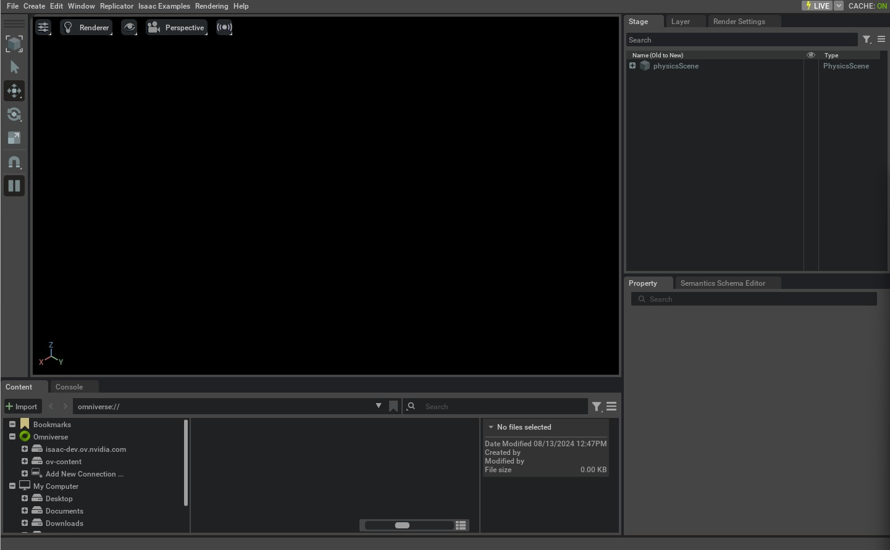

# 创建空场景

本教程演示如何通过一个独立的 Python 脚本启动并控制 Isaac Sim 仿真器：在 Isaac Lab 中搭建一个**空场景**，并介绍框架中最核心的两个类： `app.AppLauncher` 与 `sim.SimulationContext` 。

在开始本教程之前，建议先阅读 [Isaac Sim Workflows](https://docs.isaacsim.omniverse.nvidia.com/latest/introduction/workflows.html)，以便对仿真器的基本工作流建立初步认识。

## 代码

```python
# Copyright (c) 2022-2025, The Isaac Lab Project Developers (https://github.com/isaac-sim/IsaacLab/blob/main/CONTRIBUTORS.md).
# All rights reserved.
#
# SPDX-License-Identifier: BSD-3-Clause

"""This script demonstrates how to create a simple stage in Isaac Sim.

.. code-block:: bash

    # Usage
    ./isaaclab.sh -p scripts/tutorials/00_sim/create_empty.py

"""

"""Launch Isaac Sim Simulator first."""

import argparse

from isaaclab.app import AppLauncher

# create argparser
parser = argparse.ArgumentParser(description="Tutorial on creating an empty stage.")
# append AppLauncher cli args
AppLauncher.add_app_launcher_args(parser)
# parse the arguments
args_cli = parser.parse_args()
# launch omniverse app
app_launcher = AppLauncher(args_cli)
simulation_app = app_launcher.app

"""Rest everything follows."""

from isaaclab.sim import SimulationCfg, SimulationContext

def main():
    """Main function."""

    # Initialize the simulation context
    sim_cfg = SimulationCfg(dt=0.01)
    sim = SimulationContext(sim_cfg)
    # Set main camera
    sim.set_camera_view([2.5, 2.5, 2.5], [0.0, 0.0, 0.0])

    # Play the simulator
    sim.reset()
    # Now we are ready!
    print("[INFO]: Setup complete...")

    # Simulate physics
    while simulation_app.is_running():
        # perform step
        sim.step()

if __name__ == "__main__":
    # run the main function
    main()
    # close sim app
    simulation_app.close()
```

## 代码解析

### 启动仿真器

使用独立脚本时，第一步是启动仿真应用。这一点需要在最开始完成，因为 Isaac Sim 的许多依赖模块只有在仿真 App 运行后才能被导入和使用。

通常做法是导入 `app.AppLauncher` 。该工具类封装了 `isaacsim.SimulationApp` ，用于启动仿真器，并提供通过**命令行参数**与**环境变量**对仿真器进行配置的机制。

在本教程里，我们主要关注如何把命令行选项添加到用户自定义的 `argparse.ArgumentParser` 中：将 parser 传入 `app.AppLauncher.add_app_launcher_args` ，它会自动追加一系列参数，例如：以 headless 模式启动、配置不同的 Livestream 选项、启用离屏渲染（off-screen rendering）等。

```python
import argparse

from isaaclab.app import AppLauncher

# create argparser
parser = argparse.ArgumentParser(description="Tutorial on creating an empty stage.")
# append AppLauncher cli args
AppLauncher.add_app_launcher_args(parser)
# parse the arguments
args_cli = parser.parse_args()
# launch omniverse app
app_launcher = AppLauncher(args_cli)
simulation_app = app_launcher.app
```

### 导入 Python 模块

当仿真 App 运行起来后，就可以导入 Isaac Sim 以及其他库中的模块。本教程中会使用：

* `isaaclab.sim`：Isaac Lab 中与仿真器核心操作相关的子包。

```python
from isaaclab.sim import SimulationCfg, SimulationContext
```

### 配置仿真上下文（Simulation Context）

通过独立脚本启动仿真器时，用户可以完全掌控仿真的播放、暂停与单步推进等行为。这些操作由**仿真上下文（simulation context）**统一管理。它负责时间线（timeline）相关事件，同时也会配置用于仿真的“物理场景（physics scene）”。

在 Isaac Lab 中， `sim.SimulationContext` 继承自 Isaac Sim 的 `isaacsim.core.api.simulation_context.SimulationContext` ，从而支持使用 Python 的 `dataclass` 来配置仿真，并封装了仿真 stepping 过程中的一些细节。

本教程将物理与渲染的时间步长（time step）都设为 `0.01` 秒。这通过构造 `sim.SimulationCfg` 来完成，随后用它创建 `SimulationContext` 实例。

```python
    # Initialize the simulation context
    sim_cfg = SimulationCfg(dt=0.01)
    sim = SimulationContext(sim_cfg)
    # Set main camera
    sim.set_camera_view([2.5, 2.5, 2.5], [0.0, 0.0, 0.0])
```

完成仿真上下文的创建后，我们仅完成了对场景物理属性的配置（例如仿真设备、重力向量以及其他高级求解器参数）。要真正运行仿真，通常还剩下两步：

1. 设计仿真场景：向 stage 中添加传感器、机器人及其他被仿真的对象
2. 运行仿真循环：推进仿真、并与仿真器进行数据读写交互

本教程为了聚焦“仿真控制”本身，会先在**空场景**下演示第 2 步。在后续教程中，将进一步展开第 1 步，以及如何通过仿真句柄与仿真器交互。

### 运行仿真

在完成场景搭建之后，第一件事是调用 `sim.SimulationContext.reset()` 。该方法会播放时间线并初始化仿真器中的物理句柄（physics handles）。第一次 stepping 之前必须先调用它，否则相关句柄可能无法被正确初始化。

> 注意： `sim.SimulationContext.reset()` 与 `sim.SimulationContext.play()` 并不相同。后者只会播放时间线，但**不会**初始化物理句柄。

随后，我们会设置一个简单的仿真循环：只要仿真 App 仍在运行，就不断对仿真器进行 stepping。 `sim.SimulationContext.step()` 接收一个参数 `render` ，用于决定该步是否包含渲染相关事件更新；默认值为 `True` 。

```python
    # Play the simulator
    sim.reset()
    # Now we are ready!
    print("[INFO]: Setup complete...")

    # Simulate physics
    while simulation_app.is_running():
        # perform step
        sim.step()
```

### 退出仿真

最后，通过调用 `isaacsim.SimulationApp.close()` 停止仿真应用并关闭窗口。

```python
    # close sim app
    simulation_app.close()
```

## 运行脚本

阅读完代码解析后，可以运行脚本查看效果：

```bash
./isaaclab.sh -p scripts/tutorials/00_sim/create_empty.py
```

此时仿真应开始播放，stage 也会渲染显示。停止仿真有两种方式：

* 直接关闭窗口
* 在终端按 `Ctrl+C`



将 `--help` 传给脚本，可以看到前面由 `app.AppLauncher` 添加的各类命令行参数。若希望以 headless 模式运行，可执行：

```bash
./isaaclab.sh -p scripts/tutorials/00_sim/create_empty.py --headless
```

至此，你已经掌握了运行一个最基本仿真的方式。接下来可以继续学习后续教程，了解如何向 stage 添加资产（assets）。
