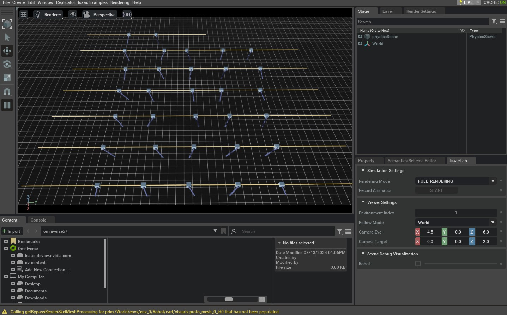

# 创建基于 Manager 的基础环境（Manager-Based Base Environment）

环境（Environment）把仿真的多个关键要素组织在一起——例如场景（scene）、观测与动作空间（observations/actions spaces）、重置事件（reset events）等——从而为不同应用提供一个一致、清晰的交互接口。

在 Isaac Lab 中，“基于 Manager 的环境（manager-based environments）”主要由两类实现：

* `envs.ManagerBasedEnv`
* `envs.ManagerBasedRLEnv`

这两个类非常相似，但用途侧重点不同：

* `envs.ManagerBasedRLEnv` 更适合强化学习任务：它内置了奖励（rewards）、终止条件（terminations）、课程学习（curriculum）以及命令生成（command generation）等机制。
* `envs.ManagerBasedEnv` 更适合传统机器人控制：它不包含奖励与终止逻辑，结构更“纯粹”。

本教程将围绕 `envs.ManagerBasedEnv` 及其配置类 `envs.ManagerBasedEnvCfg` 展开，介绍 manager-based 工作流的基础用法。我们将沿用前面教程中的 cart-pole 示例，来说明如何创建一个新的 `envs.ManagerBasedEnv` 环境，以及其中各个组件扮演的角色。

## 代码

本教程对应 `scripts/tutorials/03_envs` 目录下的 `create_cartpole_base_env.py` （脚本名在官方仓库中可能写作 `create_cartpole_base_env` ）。

下面给出脚本完整代码（已按 Markdown 代码块格式整理）：

```python
# Copyright (c) 2022-2025, The Isaac Lab Project Developers (https://github.com/isaac-sim/IsaacLab/blob/main/CONTRIBUTORS.md).
# All rights reserved.
#
# SPDX-License-Identifier: BSD-3-Clause

"""
This script demonstrates how to create a simple environment with a cartpole. It combines the concepts of
scene, action, observation and event managers to create an environment.

.. code-block:: bash

    ./isaaclab.sh -p scripts/tutorials/03_envs/create_cartpole_base_env.py --num_envs 32

"""

"""Launch Isaac Sim Simulator first."""

import argparse

from isaaclab.app import AppLauncher

# add argparse arguments
parser = argparse.ArgumentParser(description="Tutorial on creating a cartpole base environment.")
parser.add_argument("--num_envs", type=int, default=16, help="Number of environments to spawn.")

# append AppLauncher cli args
AppLauncher.add_app_launcher_args(parser)
# parse the arguments
args_cli = parser.parse_args()

# launch omniverse app
app_launcher = AppLauncher(args_cli)
simulation_app = app_launcher.app

"""Rest everything follows."""

import math
import torch

import isaaclab.envs.mdp as mdp
from isaaclab.envs import ManagerBasedEnv, ManagerBasedEnvCfg
from isaaclab.managers import EventTermCfg as EventTerm
from isaaclab.managers import ObservationGroupCfg as ObsGroup
from isaaclab.managers import ObservationTermCfg as ObsTerm
from isaaclab.managers import SceneEntityCfg
from isaaclab.utils import configclass

from isaaclab_tasks.manager_based.classic.cartpole.cartpole_env_cfg import CartpoleSceneCfg

@configclass
class ActionsCfg:
    """Action specifications for the environment."""

    joint_efforts = mdp.JointEffortActionCfg(asset_name="robot", joint_names=["slider_to_cart"], scale=5.0)

@configclass
class ObservationsCfg:
    """Observation specifications for the environment."""

    @configclass
    class PolicyCfg(ObsGroup):
        """Observations for policy group."""

        # observation terms (order preserved)
        joint_pos_rel = ObsTerm(func=mdp.joint_pos_rel)
        joint_vel_rel = ObsTerm(func=mdp.joint_vel_rel)

        def __post_init__(self) -> None:
            self.enable_corruption = False
            self.concatenate_terms = True

    # observation groups
    policy: PolicyCfg = PolicyCfg()

@configclass
class EventCfg:
    """Configuration for events."""

    # on startup
    add_pole_mass = EventTerm(
        func=mdp.randomize_rigid_body_mass,
        mode="startup",
        params={
            "asset_cfg": SceneEntityCfg("robot", body_names=["pole"]),
            "mass_distribution_params": (0.1, 0.5),
            "operation": "add",
        },
    )

    # on reset
    reset_cart_position = EventTerm(
        func=mdp.reset_joints_by_offset,
        mode="reset",
        params={
            "asset_cfg": SceneEntityCfg("robot", joint_names=["slider_to_cart"]),
            "position_range": (-1.0, 1.0),
            "velocity_range": (-0.1, 0.1),
        },
    )

    reset_pole_position = EventTerm(
        func=mdp.reset_joints_by_offset,
        mode="reset",
        params={
            "asset_cfg": SceneEntityCfg("robot", joint_names=["cart_to_pole"]),
            "position_range": (-0.125 * math.pi, 0.125 * math.pi),
            "velocity_range": (-0.01 * math.pi, 0.01 * math.pi),
        },
    )

@configclass
class CartpoleEnvCfg(ManagerBasedEnvCfg):
    """Configuration for the cartpole environment."""

    # Scene settings
    scene = CartpoleSceneCfg(num_envs=1024, env_spacing=2.5)
    # Basic settings
    observations = ObservationsCfg()
    actions = ActionsCfg()
    events = EventCfg()

    def __post_init__(self):
        """Post initialization."""
        # viewer settings
        self.viewer.eye = [4.5, 0.0, 6.0]
        self.viewer.lookat = [0.0, 0.0, 2.0]
        # step settings
        self.decimation = 4  # env step every 4 sim steps: 200Hz / 4 = 50Hz
        # simulation settings
        self.sim.dt = 0.005  # sim step every 5ms: 200Hz

def main():
    """Main function."""
    # parse the arguments
    env_cfg = CartpoleEnvCfg()
    env_cfg.scene.num_envs = args_cli.num_envs
    env_cfg.sim.device = args_cli.device
    # setup base environment
    env = ManagerBasedEnv(cfg=env_cfg)

    # simulate physics
    count = 0
    while simulation_app.is_running():
        with torch.inference_mode():
            # reset
            if count % 300 == 0:
                count = 0
                env.reset()
                print("-" * 80)
                print("[INFO]: Resetting environment...")
            # sample random actions
            joint_efforts = torch.randn_like(env.action_manager.action)
            # step the environment
            obs, _ = env.step(joint_efforts)
            # print current orientation of pole
            print("[Env 0]: Pole joint: ", obs["policy"][0][1].item())
            # update counter
            count += 1

    # close the environment
    env.close()

if __name__ == "__main__":
    # run the main function
    main()
    # close sim app
    simulation_app.close()
```

## 代码讲解

`envs.ManagerBasedEnv` 的目标，是把“与仿真交互时那些容易让人分心的细节”封装起来，给用户提供更稳定、更一致的调用界面：你用同样的方式 `reset()` / `step()` ，而动作、观测、随机化/重置事件等，则通过一组 manager 来统一组织。

从结构上看，一个 `envs.ManagerBasedEnv` 通常包含下面这些核心组件：

* `scene.InteractiveScene`：仿真场景本体（资产与传感器等实体的集合）。
* `managers.ActionManager`：动作管理器，负责把“策略输出的动作张量”解释成对仿真对象的控制命令。
* `managers.ObservationManager`：观测管理器，负责计算并组织观测字典（可包含分组、拼接、噪声等处理）。
* `managers.EventManager`：事件管理器，负责在特定时机触发一系列操作（例如域随机化），常见触发点包括启动时、重置时、或按固定步数间隔周期执行。

通过配置这些组件，你可以在几乎不改环境主循环的前提下，快速得到“同一环境的不同变体”（例如换控制方式、换观测定义、加/减随机化项等）。下面按模块解释脚本是如何把这些东西“拼起来”的。

### 设计场景（Designing the scene）

创建新环境的第一步通常是配置场景。这个 cart-pole 的场景配置沿用了前面关于 Interactive Scene 的教程，因此这里不再重复。

如果你需要回顾如何配置场景，请参考上一节“使用 Interactive Scene”的教程。

### 定义动作（Defining actions）

在前面的教程里，我们直接调用 `assets.Articulation.set_joint_effort_target` 给 cart-pole 输入控制量。

而在 manager-based 环境中，动作会交由 `managers.ActionManager` 统一处理。Action manager 可以由多个 `managers.ActionTerm` 组成：每个 action term 负责控制环境中的某一部分（例如机械臂可以拆成“关节控制 term + 夹爪控制 term”）。这样的组合方式可以让你更灵活地表达不同控制方案。

对于 cart-pole，我们希望控制“施加在小车上的力”，从而实现平衡杆。对应配置类如下：

```python
@configclass
class ActionsCfg:
    """Action specifications for the environment."""

    joint_efforts = mdp.JointEffortActionCfg(asset_name="robot", joint_names=["slider_to_cart"], scale=5.0)
```

这里使用了 `mdp.JointEffortActionCfg` ：它会把策略输出映射为对指定关节（ `slider_to_cart` ）的力/力矩目标，并通过 `scale` 进行缩放。

### 定义观测（Defining observations）

场景定义了“环境真实的物理状态”，而观测定义了“智能体能看到的状态”。在 Isaac Lab 中，观测由 `managers.ObservationManager` 计算与组织。

与 action manager 类似，observation manager 也可以由多个“观测 term”组成，并进一步被划分为“观测组（observation groups）”。这样做的好处是：你可以为同一环境定义多种观测空间（例如分层控制中可区分高层/低层观测组），并且一般假设同一组内的观测 term 维度是兼容的。

本教程只定义一个名为 `"policy"` 的观测组。虽然名字本身并非强制，但在 Isaac Lab 的一些 wrapper 中，这是一个常见（有时是必要）的约定。

在代码里：

* 观测组通过继承 `managers.ObservationGroupCfg` 来定义
* 每个具体观测项通过继承/实例化 `managers.ObservationTermCfg` 来定义，并在 `func` 中指定“计算该观测的函数或可调用对象”

```python
@configclass
class ObservationsCfg:
    """Observation specifications for the environment."""

    @configclass
    class PolicyCfg(ObsGroup):
        """Observations for policy group."""

        # observation terms (order preserved)
        joint_pos_rel = ObsTerm(func=mdp.joint_pos_rel)
        joint_vel_rel = ObsTerm(func=mdp.joint_vel_rel)

        def __post_init__(self) -> None:
            self.enable_corruption = False
            self.concatenate_terms = True

    # observation groups
    policy: PolicyCfg = PolicyCfg()
```

这里我们使用了两个最基本的观测项：相对关节位置与相对关节速度，并在 `__post_init__` 里关闭噪声（ `enable_corruption = False` ），同时把多个 term 按顺序拼接成单个张量（ `concatenate_terms = True` ）。

### 定义事件（Defining events）

到这里我们已经定义了场景、动作与观测。它们的共同模式是：先写配置类，再把配置交给对应 manager。

事件管理器 `managers.EventManager` 同样遵循这个模式。它负责处理“仿真状态的改变事件”，例如：

* 重置/随机化场景状态
* 随机化物理属性（质量、摩擦等）
* 随机化视觉属性（颜色、纹理等）

每个事件通过 `managers.EventTermCfg` 定义，其中最关键的是：

* `func`：实际执行该事件的函数/可调用对象
* `mode`：该事件在什么时机触发

Isaac Lab 默认提供了三种常见的触发模式：

* `"startup"`：环境启动时只执行一次
* `"reset"`：终止并重置时执行
* `"interval"`：按固定步数间隔周期执行

本例中：

* 在 `startup` 时随机化 pole 的质量（只做一次，避免每次 reset 都做带来开销）
* 在 `reset` 时随机化 cart 与 pole 的初始关节状态

```python
@configclass
class EventCfg:
    """Configuration for events."""

    # on startup
    add_pole_mass = EventTerm(
        func=mdp.randomize_rigid_body_mass,
        mode="startup",
        params={
            "asset_cfg": SceneEntityCfg("robot", body_names=["pole"]),
            "mass_distribution_params": (0.1, 0.5),
            "operation": "add",
        },
    )

    # on reset
    reset_cart_position = EventTerm(
        func=mdp.reset_joints_by_offset,
        mode="reset",
        params={
            "asset_cfg": SceneEntityCfg("robot", joint_names=["slider_to_cart"]),
            "position_range": (-1.0, 1.0),
            "velocity_range": (-0.1, 0.1),
        },
    )

    reset_pole_position = EventTerm(
        func=mdp.reset_joints_by_offset,
        mode="reset",
        params={
            "asset_cfg": SceneEntityCfg("robot", joint_names=["cart_to_pole"]),
            "position_range": (-0.125 * math.pi, 0.125 * math.pi),
            "velocity_range": (-0.01 * math.pi, 0.01 * math.pi),
        },
    )
```

### 把配置“串起来”（Tying it all together）

当场景与各类 manager 的配置都准备好之后，就可以通过 `envs.ManagerBasedEnvCfg` 把它们组装成一个完整的环境配置。

在本例中，我们定义 `CartpoleEnvCfg` 并把 `scene / observations / actions / events` 挂在其字段上。

此外， `envs.ManagerBasedEnvCfg.sim` 用于定义仿真参数（例如时间步长、重力等）。这些参数通常会在 `__post_init__` 中做二次调整，因为该方法会在配置初始化后被调用。

```python
@configclass
class CartpoleEnvCfg(ManagerBasedEnvCfg):
    """Configuration for the cartpole environment."""

    # Scene settings
    scene = CartpoleSceneCfg(num_envs=1024, env_spacing=2.5)
    # Basic settings
    observations = ObservationsCfg()
    actions = ActionsCfg()
    events = EventCfg()

    def __post_init__(self):
        """Post initialization."""
        # viewer settings
        self.viewer.eye = [4.5, 0.0, 6.0]
        self.viewer.lookat = [0.0, 0.0, 2.0]
        # step settings
        self.decimation = 4  # env step every 4 sim steps: 200Hz / 4 = 50Hz
        # simulation settings
        self.sim.dt = 0.005  # sim step every 5ms: 200Hz
```

### 运行仿真（Running the simulation）

最后看仿真主循环。由于环境的动作/观测/事件等大部分细节都已被配置化并封装进环境对象，运行循环会变得更直接：

* `env.reset()`：重置环境
* `env.step(action)`：推进一步，并返回观测与 `info` 字典（可能包含额外诊断信息）

需要注意的是： `envs.ManagerBasedEnv` 本身不包含“终止（termination）”概念（这更偏向 episodic 任务/强化学习工作流）。因此你需要自己决定何时重置。示例中使用“固定步数重置”的方式。

```python
while simulation_app.is_running():
    with torch.inference_mode():
        if count % 300 == 0:
            count = 0
            env.reset()
            print("-" * 80)
            print("[INFO]: Resetting environment...")
        joint_efforts = torch.randn_like(env.action_manager.action)
        obs, _ = env.step(joint_efforts)
        print("[Env 0]: Pole joint: ", obs["policy"][0][1].item())
        count += 1
```

此外，整个仿真循环被包裹在 `torch.inference_mode()` 上下文中。这是因为环境内部大量使用 PyTorch 运算；在推理模式下可以避免 autograd 的额外开销，同时确保不会对仿真操作计算梯度，从而提升执行效率。

## 运行方式

使用下面的命令运行本教程中的基础环境（示例：创建 32 个环境）：

```bash
./isaaclab.sh -p scripts/tutorials/03_envs/create_cartpole_base_env.py --num_envs 32
```

运行后应会打开一个包含地面、光源与多个 cart-pole 的 stage，仿真会以随机动作驱动 cart-pole 运动。此外，界面右下角会出现名为 `"Isaac Lab"` 的 UI 窗口，包含一些用于调试与可视化的工具。



停止仿真可以直接关闭窗口，或在启动脚本的终端中按 `Ctrl+C` 。

## 更多示例

在 `scripts/tutorials/03_envs` 目录下还有更多“基础环境”的例子：

```bash
# Floating cube environment with custom action term for PD control
./isaaclab.sh -p scripts/tutorials/03_envs/create_cube_base_env.py --num_envs 32

# Quadrupedal locomotion environment with a policy that interacts with the environment
./isaaclab.sh -p scripts/tutorials/03_envs/create_quadruped_base_env.py --num_envs 32
```

下一节教程会介绍 `envs.ManagerBasedRLEnv` ，并说明如何用它创建一个马尔可夫决策过程（MDP）。
