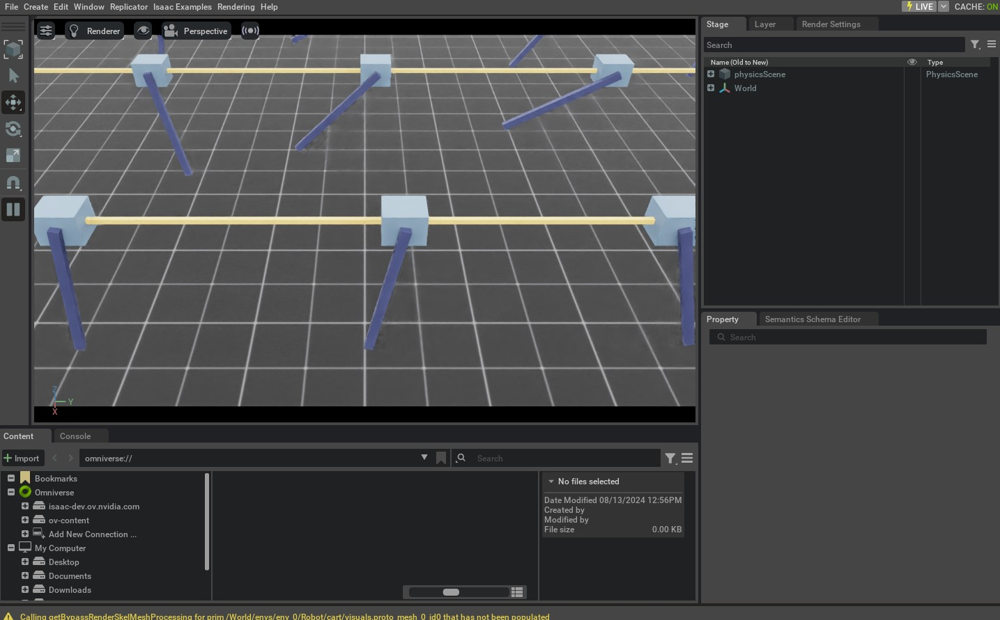

# 使用 Interactive Scene

到目前为止，在这些教程里我们都是手动把资产（assets）生成到仿真中，并创建对象实例来与它们交互。但随着场景复杂度提升，手工完成这些工作会变得越来越繁琐。

本教程将介绍 `scene.InteractiveScene` 类：它为**生成 prim** 以及在仿真中**管理这些 prim** 提供了更便捷的接口。

从高层视角看，Interactive Scene 可以理解为“场景实体（scene entities）的集合”。其中每个实体可以是：

* **非交互 prim**：例如地面、光源
* **交互 prim**：例如关节系统（articulation）、刚体物体（rigid object）
* **传感器**：例如相机、激光雷达

Interactive Scene 提供了一套统一接口，用于生成这些实体并在仿真过程中管理它们。

相较于手动方式，它主要有以下优势：

* 不需要用户逐个生成每个资产（由场景对象隐式处理）。
* 更方便地为多环境（multiple environments）克隆/复制场景 prim。
* 把全部场景实体集中到一个对象里，管理起来更简单。

本教程会沿用“与关节系统（Articulation）交互（tutorial-interact-articulation）”中的 cart-pole 示例，把其中的 `design_scene` 函数替换为一个 `scene.InteractiveScene` 对象。对这个简单示例来说，使用 Interactive Scene 可能看起来有点“杀鸡用牛刀”，但随着更多资产与传感器加入场景，它会越来越有价值。

## 代码

本教程对应 `scripts/tutorials/02_scene` 目录下的 `create_scene.py` 。

```python
# Copyright (c) 2022-2025, The Isaac Lab Project Developers (https://github.com/isaac-sim/IsaacLab/blob/main/CONTRIBUTORS.md).
# All rights reserved.
#
# SPDX-License-Identifier: BSD-3-Clause

"""This script demonstrates how to use the interactive scene interface to setup a scene with multiple prims.

.. code-block:: bash

    # Usage
    ./isaaclab.sh -p scripts/tutorials/02_scene/create_scene.py --num_envs 32

"""

"""Launch Isaac Sim Simulator first."""

import argparse

from isaaclab.app import AppLauncher

# add argparse arguments
parser = argparse.ArgumentParser(description="Tutorial on using the interactive scene interface.")
parser.add_argument("--num_envs", type=int, default=2, help="Number of environments to spawn.")
# append AppLauncher cli args
AppLauncher.add_app_launcher_args(parser)
# parse the arguments
args_cli = parser.parse_args()

# launch omniverse app
app_launcher = AppLauncher(args_cli)
simulation_app = app_launcher.app

"""Rest everything follows."""

import torch

import isaaclab.sim as sim_utils
from isaaclab.assets import ArticulationCfg, AssetBaseCfg
from isaaclab.scene import InteractiveScene, InteractiveSceneCfg
from isaaclab.sim import SimulationContext
from isaaclab.utils import configclass

##
# Pre-defined configs
##
from isaaclab_assets import CARTPOLE_CFG  # isort:skip

@configclass
class CartpoleSceneCfg(InteractiveSceneCfg):
    """Configuration for a cart-pole scene."""

    # ground plane
    ground = AssetBaseCfg(prim_path="/World/defaultGroundPlane", spawn=sim_utils.GroundPlaneCfg())

    # lights
    dome_light = AssetBaseCfg(
        prim_path="/World/Light", spawn=sim_utils.DomeLightCfg(intensity=3000.0, color=(0.75, 0.75, 0.75))
    )

    # articulation
    cartpole: ArticulationCfg = CARTPOLE_CFG.replace(prim_path="{ENV_REGEX_NS}/Robot")

def run_simulator(sim: sim_utils.SimulationContext, scene: InteractiveScene):
    """Runs the simulation loop."""
    # Extract scene entities
    # note: we only do this here for readability.
    robot = scene["cartpole"]
    # Define simulation stepping
    sim_dt = sim.get_physics_dt()
    count = 0
    # Simulation loop
    while simulation_app.is_running():
        # Reset
        if count % 500 == 0:
            # reset counter
            count = 0
            # reset the scene entities
            # root state
            # we offset the root state by the origin since the states are written in simulation world frame
            # if this is not done, then the robots will be spawned at the (0, 0, 0) of the simulation world
            root_state = robot.data.default_root_state.clone()
            root_state[:, :3] += scene.env_origins
            robot.write_root_pose_to_sim(root_state[:, :7])
            robot.write_root_velocity_to_sim(root_state[:, 7:])
            # set joint positions with some noise
            joint_pos, joint_vel = robot.data.default_joint_pos.clone(), robot.data.default_joint_vel.clone()
            joint_pos += torch.rand_like(joint_pos) * 0.1
            robot.write_joint_state_to_sim(joint_pos, joint_vel)
            # clear internal buffers
            scene.reset()
            print("[INFO]: Resetting robot state...")
        # Apply random action
        # -- generate random joint efforts
        efforts = torch.randn_like(robot.data.joint_pos) * 5.0
        # -- apply action to the robot
        robot.set_joint_effort_target(efforts)
        # -- write data to sim
        scene.write_data_to_sim()
        # Perform step
        sim.step()
        # Increment counter
        count += 1
        # Update buffers
        scene.update(sim_dt)

def main():
    """Main function."""
    # Load kit helper
    sim_cfg = sim_utils.SimulationCfg(device=args_cli.device)
    sim = SimulationContext(sim_cfg)
    # Set main camera
    sim.set_camera_view([2.5, 0.0, 4.0], [0.0, 0.0, 2.0])
    # Design scene
    scene_cfg = CartpoleSceneCfg(num_envs=args_cli.num_envs, env_spacing=2.0)
    scene = InteractiveScene(scene_cfg)
    # Play the simulator
    sim.reset()
    # Now we are ready!
    print("[INFO]: Setup complete...")
    # Run the simulator
    run_simulator(sim, scene)

if __name__ == "__main__":
    # run the main function
    main()
    # close sim app
    simulation_app.close()
```

## 代码讲解

代码整体结构与上一节教程相似，但关键差异主要体现在“场景的组织方式”上。下面按模块说明。

### 场景配置（Scene configuration）

Interactive Scene 由一组实体（entities）构成，每个实体都有各自的配置。这些配置集中写在一个继承自 `scene.InteractiveSceneCfg` 的配置类中；随后把该配置类的实例传入 `scene.InteractiveScene` 构造函数，即可创建场景。

在 cart-pole 例子中，我们依然搭建与上一节相同的场景（地面、灯光、cart-pole），但不再手动 spawn，而是把它们写进配置类 `CartpoleSceneCfg` 。

```python
@configclass
class CartpoleSceneCfg(InteractiveSceneCfg):
    """Configuration for a cart-pole scene."""

    # ground plane
    ground = AssetBaseCfg(prim_path="/World/defaultGroundPlane", spawn=sim_utils.GroundPlaneCfg())

    # lights
    dome_light = AssetBaseCfg(
        prim_path="/World/Light", spawn=sim_utils.DomeLightCfg(intensity=3000.0, color=(0.75, 0.75, 0.75))
    )

    # articulation
    cartpole: ArticulationCfg = CARTPOLE_CFG.replace(prim_path="{ENV_REGEX_NS}/Robot")
```

配置类中的“变量名”会作为键（key）用于从 `InteractiveScene` 中访问对应实体。例如，上面把 cart-pole 命名为 `cartpole` ，因此可以通过 `scene["cartpole"]` 访问。

此外需要注意：地面与灯光属于**非交互 prim**，而 cart-pole 属于**交互 prim**。这种差异会体现在配置类型上：

* 地面、灯光使用 `assets.AssetBaseCfg`
* cart-pole 使用 `assets.ArticulationCfg`

任何“不是交互 prim 的东西”（也就是既不是资产，也不是传感器）不会在每个仿真步中被场景对象 *handled*（自动调用更新/写入等流程）。

另一个关键点是 prim path 的写法差异：

* Ground plane：`/World/defaultGroundPlane`
* Light source：`/World/Light`
* Cartpole：`{ENV_REGEX_NS}/Robot`

Omniverse 会在 USD stage 中构建 prim 的图结构，prim path 用于定位节点。地面与灯光使用绝对路径；cart-pole 使用带有 `ENV_REGEX_NS` 的相对路径。 `ENV_REGEX_NS` 是一个特殊占位符，在创建场景时会被替换成环境名。

凡是 prim path 中包含 `ENV_REGEX_NS` 的实体，都会针对每个环境进行克隆：场景对象会把它替换为 `/World/envs/env_{i}` （其中 `i` 是环境索引）。

### 场景实例化（Scene instantiation）

与之前通过 `design_scene` 函数创建场景不同，这里我们直接：

1. 创建 `CartpoleSceneCfg` 实例
2. 将其传入 `InteractiveScene` 构造函数

同时，在创建 `CartpoleSceneCfg` 时通过 `num_envs` 指定要创建多少个环境副本，用于多环境克隆。

```python
# Design scene
scene_cfg = CartpoleSceneCfg(num_envs=args_cli.num_envs, env_spacing=2.0)
scene = InteractiveScene(scene_cfg)
```

### 访问场景元素（Accessing scene elements）

与上一节使用字典存实体类似， `InteractiveScene` 也支持通过 `[]` 运算符按 key 取出实体：

```python
# Extract scene entities
robot = scene["cartpole"]
```

### 运行仿真循环（Running the simulation loop）

脚本剩余部分与之前直接操作 `assets.Articulation` 的流程很像，但有几个方法调用发生了对应替换：

* `assets.Articulation.reset` ⟶ `scene.InteractiveScene.reset`
* `assets.Articulation.write_data_to_sim` ⟶ `scene.InteractiveScene.write_data_to_sim`
* `assets.Articulation.update` ⟶ `scene.InteractiveScene.update`

其底层逻辑是： `scene.InteractiveScene` 的方法会进一步调用场景内各实体对应的方法。

## 运行方式

下面以在场景中仿真 32 个 cart-pole 为例：通过给脚本传入 `--num_envs` 参数即可。

```bash
./isaaclab.sh -p scripts/tutorials/02_scene/create_scene.py --num_envs 32
```

该命令会打开一个包含 32 个 cart-pole 的场景，它们会随机摆动。你可以用鼠标旋转相机，并用方向键在场景中移动。



本教程展示了如何使用 `scene.InteractiveScene` 构建包含多个资产的场景，并通过 `num_envs` 将场景克隆为多个环境。

在 `isaaclab_tasks` 扩展中的各种任务里，还能看到更多 `scene.InteractiveSceneCfg` 的用法示例。建议直接阅读它们的源码，了解更复杂场景的组织方式。
