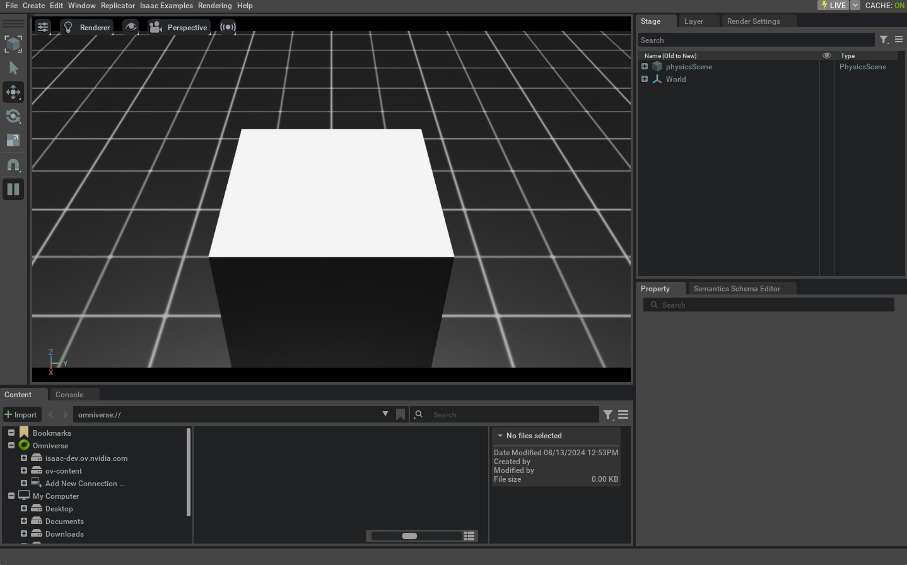

# 深入理解 AppLauncher

本教程将深入介绍 `app.AppLauncher` ：如何通过 **命令行参数（CLI arguments）** 与 **环境变量（environment variables, envars）** 配置仿真器。

我们将重点演示：

* 如何使用 `AppLauncher` 启用 livestreaming
* `AppLauncher` 如何配置其内部封装的 `isaacsim.simulation_app.SimulationApp`
* 如何在不影响用户自定义参数的前提下，把脚本自身的 CLI 参数与 `AppLauncher` 的参数合并使用

`AppLauncher` 是对 `isaacsim.simulation_app.SimulationApp` 的一层封装，目的是简化配置流程。 `SimulationApp` 需要加载许多扩展（extensions）来启用不同能力，而其中一部分扩展在加载顺序上存在依赖关系；此外，像 `headless` 这类启动选项必须在实例化时就确定，并且它与某些扩展（例如 livestreaming 相关扩展）存在隐含的联动关系。

`AppLauncher` 提供了一个更“可移植”的接口：它能在多种使用场景下统一处理扩展与启动选项，同时允许把 `AppLauncher` 的 CLI/envar 配置与用户自定义 CLI 参数合并，并将属于 `SimulationApp` 的参数继续向前传递。

## 代码

本教程对应脚本 `launch_app.py` ，位于 `scripts/tutorials/00_sim` 目录。

```python
# Copyright (c) 2022-2025, The Isaac Lab Project Developers (https://github.com/isaac-sim/IsaacLab/blob/main/CONTRIBUTORS.md).
# All rights reserved.
#
# SPDX-License-Identifier: BSD-3-Clause

"""
This script demonstrates how to run IsaacSim via the AppLauncher

.. code-block:: bash

    # Usage
    ./isaaclab.sh -p scripts/tutorials/00_sim/launch_app.py

"""

"""Launch Isaac Sim Simulator first."""

import argparse

from isaaclab.app import AppLauncher

# create argparser
parser = argparse.ArgumentParser(description="Tutorial on running IsaacSim via the AppLauncher.")
parser.add_argument("--size", type=float, default=1.0, help="Side-length of cuboid")
# SimulationApp arguments https://docs.omniverse.nvidia.com/py/isaacsim/source/isaacsim.simulation_app/docs/index.html?highlight=simulationapp#isaacsim.simulation_app.SimulationApp
parser.add_argument(
    "--width", type=int, default=1280, help="Width of the viewport and generated images. Defaults to 1280"
)
parser.add_argument(
    "--height", type=int, default=720, help="Height of the viewport and generated images. Defaults to 720"
)

# append AppLauncher cli args
AppLauncher.add_app_launcher_args(parser)
# parse the arguments
args_cli = parser.parse_args()
# launch omniverse app
app_launcher = AppLauncher(args_cli)
simulation_app = app_launcher.app

"""Rest everything follows."""

import isaaclab.sim as sim_utils

def design_scene():
    """Designs the scene by spawning ground plane, light, objects and meshes from usd files."""
    # Ground-plane
    cfg_ground = sim_utils.GroundPlaneCfg()
    cfg_ground.func("/World/defaultGroundPlane", cfg_ground)

    # spawn distant light
    cfg_light_distant = sim_utils.DistantLightCfg(
        intensity=3000.0,
        color=(0.75, 0.75, 0.75),
    )
    cfg_light_distant.func("/World/lightDistant", cfg_light_distant, translation=(1, 0, 10))

    # spawn a cuboid
    cfg_cuboid = sim_utils.CuboidCfg(
        size=[args_cli.size] * 3,
        visual_material=sim_utils.PreviewSurfaceCfg(diffuse_color=(1.0, 1.0, 1.0)),
    )
    # Spawn cuboid, altering translation on the z-axis to scale to its size
    cfg_cuboid.func("/World/Object", cfg_cuboid, translation=(0.0, 0.0, args_cli.size / 2))

def main():
    """Main function."""

    # Initialize the simulation context
    sim_cfg = sim_utils.SimulationCfg(dt=0.01, device=args_cli.device)
    sim = sim_utils.SimulationContext(sim_cfg)
    # Set main camera
    sim.set_camera_view([2.0, 0.0, 2.5], [-0.5, 0.0, 0.5])

    # Design scene by adding assets to it
    design_scene()

    # Play the simulator
    sim.reset()
    # Now we are ready!
    print("[INFO]: Setup complete...")

    # Simulate physics
    while simulation_app.is_running():
        # perform step
        sim.step()

if __name__ == "__main__":
    # run the main function
    main()
    # close sim app
    simulation_app.close()
```

## 代码解析

### 向 ArgumentParser 添加参数

`AppLauncher` 的设计目标之一，是在提供统一、可移植的 CLI 接口的同时，仍然兼容用户脚本所需的自定义参数。

本示例中：

* 使用标准的 `argparse.ArgumentParser` 创建 parser
* 定义脚本自身的参数 `--size`
* 额外定义 `--height` 与 `--width`（它们会被 `SimulationApp` 识别并用于配置渲染窗口/视口）

其中， `--size` 并不会被 `AppLauncher` 直接使用，但它可以与 `AppLauncher` 的参数机制无缝合并。

合并方式是调用 `AppLauncher.add_app_launcher_args(parser)` ：该方法会把 `AppLauncher` 相关参数追加到同一个 parser 上。随后用 `parser.parse_args()` 得到 `argparse.Namespace` ，并把它直接传给 `AppLauncher` 进行实例化。

```python
import argparse

from isaaclab.app import AppLauncher

# create argparser
parser = argparse.ArgumentParser(description="Tutorial on running IsaacSim via the AppLauncher.")
parser.add_argument("--size", type=float, default=1.0, help="Side-length of cuboid")
# SimulationApp arguments https://docs.omniverse.nvidia.com/py/isaacsim/source/isaacsim.simulation_app/docs/index.html?highlight=simulationapp#isaacsim.simulation_app.SimulationApp
parser.add_argument(
    "--width", type=int, default=1280, help="Width of the viewport and generated images. Defaults to 1280"
)
parser.add_argument(
    "--height", type=int, default=720, help="Height of the viewport and generated images. Defaults to 720"
)

# append AppLauncher cli args
AppLauncher.add_app_launcher_args(parser)
# parse the arguments
args_cli = parser.parse_args()
# launch omniverse app
app_launcher = AppLauncher(args_cli)
simulation_app = app_launcher.app
```

上面只是向 `AppLauncher` 传参的多种方式之一。更多细节可查阅 `AppLauncher` 的官方 API 文档。

### 理解 `--help` 的输出

运行脚本时传入 `--help` ，你会看到脚本自定义参数与 `AppLauncher` 参数合并后的帮助信息。例如：

```console
./isaaclab.sh -p scripts/tutorials/00_sim/launch_app.py --help

[INFO] Using python from: /isaac-sim/python.sh
[INFO][AppLauncher]: The argument 'width' will be used to configure the SimulationApp.
[INFO][AppLauncher]: The argument 'height' will be used to configure the SimulationApp.
usage: launch_app.py [-h] [--size SIZE] [--width WIDTH] [--height HEIGHT] [--headless] [--livestream {0,1,2}]
                     [--enable_cameras] [--verbose] [--experience EXPERIENCE]

Tutorial on running IsaacSim via the AppLauncher.

options:
-h, --help            show this help message and exit
--size SIZE           Side-length of cuboid
--width WIDTH         Width of the viewport and generated images. Defaults to 1280
--height HEIGHT       Height of the viewport and generated images. Defaults to 720

app_launcher arguments:
--headless            Force display off at all times.
--livestream {0,1,2}
                      Force enable livestreaming. Mapping corresponds to that for the "LIVESTREAM" environment variable.
--enable_cameras      Enable cameras when running without a GUI.
--verbose             Enable verbose terminal logging from the SimulationApp.
--experience EXPERIENCE
                      The experience file to load when launching the SimulationApp.

                      * If an empty string is provided, the experience file is determined based on the headless flag.
                      * If a relative path is provided, it is resolved relative to the `apps` folder in Isaac Sim and
                        Isaac Lab (in that order).
```

这份输出会列出脚本中定义的 `--size` 、 `--height` 、 `--width` ，以及 `AppLauncher` 追加的参数组。

另外，帮助信息前面的 `[INFO]` 日志也会明确提示：哪些参数将被解释为 `SimulationApp` 的配置参数。本例中是 `--height` 与 `--width` 。

之所以会被这样分类，是因为它们与 `SimulationApp` 可处理的参数在**名称与类型**上匹配。更多可被 `SimulationApp` 接收的参数示例，可参考其默认配置规范：

* https://docs.isaacsim.omniverse.nvidia.com/latest/py/source/extensions/isaacsim.simulation_app/docs/index.html#isaacsim.simulation_app.SimulationApp.DEFAULT_LAUNCHER_CONFIG

### 使用环境变量（envars）

如 `--help` 所示， `AppLauncher` 的部分参数（例如 `--livestream` 、 `--headless` ）也有对应的环境变量形式，具体可参考 `isaaclab.app` 文档。

通过 CLI 显式传入这些参数，与在 shell 环境中预先设置对应环境变量的效果等价。

环境变量支持的主要目的，是便于在一个会话内保持一致的配置；你也可以把相关设置写入自己的 shell 启动脚本（例如 `${HOME}/.bashrc` ），从而跨会话持久化。

需要注意：当 CLI 参数与环境变量同时存在时，**CLI 参数优先生效**（本教程稍后会演示）。

这些参数可用于任何使用 `AppLauncher` 启动仿真的脚本，但有一个例外： `--enable_cameras` 。

该选项会将渲染管线切换为离屏渲染（offscreen renderer）。不过，它只与 `isaaclab.sim.SimulationContext` 兼容；若使用 Isaac Sim 原生的 `isaacsim.core.api.simulation_context.SimulationContext` ，则无法正常工作。更多信息请查阅 `AppLauncher` 的 API 文档。

## 运行示例

下面开始运行示例脚本。

### 通过环境变量启用 Livestream

```console
LIVESTREAM=2 ./isaaclab.sh -p scripts/tutorials/00_sim/launch_app.py --size 0.5
```

这会在仿真中生成一个体积为 $0.5^3\, \text{m}^3$ 的立方体（边长 0.5 m）。此时不会弹出 GUI 窗口，这等价于传入了 `--headless` ，因为当 `LIVESTREAM` 环境变量启用时，会隐含进入 headless 行为。

如果需要可视化，可以通过 Isaac 的 WebRTC Livestreaming 获取画面（在容器内运行时，streaming 目前也是唯一受支持的可视化方式）：

* https://docs.isaacsim.omniverse.nvidia.com/latest/installation/manual_livestream_clients.html#isaac-sim-short-webrtc-streaming-client

在启动脚本的终端按 `Ctrl+C` 可终止进程。



### CLI 与环境变量冲突时的优先级

下面演示当环境变量与 CLI 参数冲突时， `AppLauncher` 的处理方式：

```console
LIVESTREAM=0 ./isaaclab.sh -p scripts/tutorials/00_sim/launch_app.py --size 0.5 --livestream 2
```

尽管环境变量设置为 `LIVESTREAM=0` ，但由于 CLI 参数 `--livestream 2` 明确给出了行为指令，因此最终表现与上一条命令相同。这体现了“**CLI 覆盖环境变量**”的优先级规则。

同样可通过 `Ctrl+C` 终止进程。

### 通过 AppLauncher 向 SimulationApp 传递参数

最后，演示如何通过 `AppLauncher` 将参数继续传递给 `SimulationApp` ：

```console
LIVESTREAM=2 ./isaaclab.sh -p scripts/tutorials/00_sim/launch_app.py --size 0.5 --width 1920 --height 1080
```

整体行为与之前一致，但视口将以 1920×1080 的分辨率渲染。这在需要采集更高分辨率视频时很有用；反之，也可以指定更低分辨率以提升仿真性能。按 `Ctrl+C` 可终止进程。
