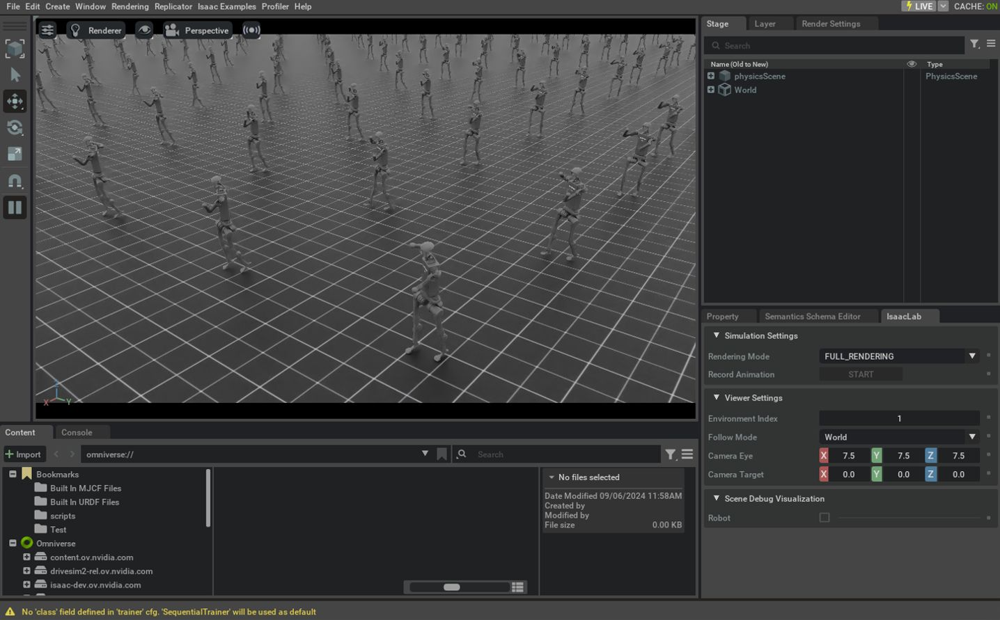

# 修改现有 Direct RL 环境

在学习了如何在 [create-direct-rl-env](create-direct-rl-env.md) 中创建一个任务、在 [register-rl-env-gym](register-rl-env-gym.md) 中注册它，并在 [run-rl-training](run-rl-training.md) 中对其进行训练之后，我们现在来看一看如何对一个已有任务进行一些小幅修改。

有时由于任务复杂度较高，或与现有示例存在差异，我们需要从零开始创建任务。不过在某些情况下，也可以从现有代码出发，逐步引入一些小改动，将其按我们的需求逐步改造。

在本教程中，我们将对 direct 工作流的 Humanoid 任务做一些小改动：在不影响原始代码的前提下，将简单的人形模型替换为宇树（Unitree）H1 人形机器人。

## 基础代码

本教程从 `isaaclab_tasks.direct.humanoid` 模块中定义的 direct 工作流 Humanoid 环境开始。

<details>
<summary>humanoid_env.py 的代码</summary>

```python
# Copyright (c) 2022-2025, The Isaac Lab Project Developers (https://github.com/isaac-sim/IsaacLab/blob/main/CONTRIBUTORS.md).
# All rights reserved.
#
# SPDX-License-Identifier: BSD-3-Clause

from __future__ import annotations

from isaaclab_assets import HUMANOID_CFG

import isaaclab.sim as sim_utils
from isaaclab.assets import ArticulationCfg
from isaaclab.envs import DirectRLEnvCfg
from isaaclab.scene import InteractiveSceneCfg
from isaaclab.sim import SimulationCfg
from isaaclab.terrains import TerrainImporterCfg
from isaaclab.utils import configclass

from isaaclab_tasks.direct.locomotion.locomotion_env import LocomotionEnv

@configclass
class HumanoidEnvCfg(DirectRLEnvCfg):

    # env
    episode_length_s = 15.0
    decimation = 2
    action_scale = 1.0
    action_space = 21
    observation_space = 75
    state_space = 0

    # simulation
    sim: SimulationCfg = SimulationCfg(dt=1 / 120, render_interval=decimation)
    terrain = TerrainImporterCfg(
        prim_path="/World/ground",
        terrain_type="plane",
        collision_group=-1,
        physics_material=sim_utils.RigidBodyMaterialCfg(
            friction_combine_mode="average",
            restitution_combine_mode="average",
            static_friction=1.0,
            dynamic_friction=1.0,
            restitution=0.0,
        ),
        debug_vis=False,
    )

    # scene
    scene: InteractiveSceneCfg = InteractiveSceneCfg(
        num_envs=4096, env_spacing=4.0, replicate_physics=True, clone_in_fabric=True
    )

    # robot
    robot: ArticulationCfg = HUMANOID_CFG.replace(prim_path="/World/envs/env_.*/Robot")
    joint_gears: list = [
        67.5000,  # lower_waist
        67.5000,  # lower_waist
        67.5000,  # right_upper_arm
        67.5000,  # right_upper_arm
        67.5000,  # left_upper_arm
        67.5000,  # left_upper_arm
        67.5000,  # pelvis
        45.0000,  # right_lower_arm
        45.0000,  # left_lower_arm
        45.0000,  # right_thigh: x
        135.0000,  # right_thigh: y
        45.0000,  # right_thigh: z
        45.0000,  # left_thigh: x
        135.0000,  # left_thigh: y
        45.0000,  # left_thigh: z
        90.0000,  # right_knee
        90.0000,  # left_knee
        22.5,  # right_foot
        22.5,  # right_foot
        22.5,  # left_foot
        22.5,  # left_foot
    ]

    heading_weight: float = 0.5
    up_weight: float = 0.1

    energy_cost_scale: float = 0.05
    actions_cost_scale: float = 0.01
    alive_reward_scale: float = 2.0
    dof_vel_scale: float = 0.1

    death_cost: float = -1.0
    termination_height: float = 0.8

    angular_velocity_scale: float = 0.25
    contact_force_scale: float = 0.01

class HumanoidEnv(LocomotionEnv):
    cfg: HumanoidEnvCfg

    def __init__(self, cfg: HumanoidEnvCfg, render_mode: str | None = None, **kwargs):
        super().__init__(cfg, render_mode, **kwargs)
```

</details>

## 修改说明

### 复制文件并注册新任务

为了避免修改已有任务的代码，我们将包含 Python 代码的文件复制一份，并在这份拷贝上进行修改。随后，在 Isaac Lab 项目的 `source/isaaclab_tasks/isaaclab_tasks/direct/humanoid` 文件夹中，我们复制 `humanoid_env.py` 文件并将其重命名为 `h1_env.py` 。

在代码编辑器中打开 `h1_env.py` 文件，将所有 humanoid 任务名称（ `HumanoidEnv` ）及其配置（ `HumanoidEnvCfg` ）的实例分别替换为 `H1Env` 与 `H1EnvCfg` 。
这样做是为了在注册环境时导入模块，避免发生命名冲突。

完成名称替换后，我们继续添加一个新的条目，将该任务注册为 `Isaac-H1-Direct-v0` 。
为此，我们修改同一工作目录中的 `__init__.py` 文件，并添加如下条目。
关于环境注册的更多细节，请参考 [register-rl-env-gym](register-rl-env-gym.md)。

> **提示：**
>
> 如果对任务的改动很小，那么很可能可以继续使用同一套 RL 库的智能体配置来完成训练。
> 否则，建议创建新的配置文件（在注册时通过 `kwargs` 参数调整其名称），以避免修改原始配置。

```rst
.. literalinclude:: ../../refs/snippets/tutorial_modify_direct_rl_env.py
   :language: python
   :start-after: [start-init-import]
   :end-before: [end-init-import]
```

```rst
.. literalinclude:: ../../refs/snippets/tutorial_modify_direct_rl_env.py
   :language: python
   :start-after: [start-init-register]
   :end-before: [end-init-register]
```

### 更换机器人

`H1EnvCfg` 类（位于新创建的 `h1_env.py` 文件中）封装了环境的配置值，其中包含需要实例化的资产（assets）。在本示例中， `robot` 属性持有目标关节体（articulation）的配置。

由于 Unitree H1 机器人已包含在 Isaac Lab 的资产扩展（ `isaaclab_assets` ）中，我们只需将其导入，然后直接在 `H1EnvCfg.robot` 属性下进行替换即可，如下所示。注意，我们也需要修改 `joint_gears` 属性，因为它保存了与机器人相关的特定配置值。

[franka-direct-link]: https://github.com/isaac-sim/IsaacLab/blob/main/source/isaaclab_tasks/isaaclab_tasks/direct/franka_cabinet/franka_cabinet_env.py

> **提示：**
>
> 如果目标机器人不在 Isaac Lab 资产扩展中，可以使用 `isaaclab.assets.ArticulationCfg` 类从 USD 文件加载并配置。
>
> - 可参考 [Isaac-Franka-Cabinet-Direct-v0][franka-direct-link] 源码，了解如何从 USD 文件加载并配置机器人。
> - 关于如何从 URDF 或 MJCF 文件等格式导入资产，请参考 Importing a New Asset 教程。

```rst
.. literalinclude:: ../../refs/snippets/tutorial_modify_direct_rl_env.py
   :language: python
   :start-after: [start-h1_env-import]
   :end-before: [end-h1_env-import]
```

```rst
.. literalinclude:: ../../refs/snippets/tutorial_modify_direct_rl_env.py
   :language: python
   :start-after: [start-h1_env-robot]
   :end-before: [end-h1_env-robot]
```

机器人被更换后，例如需要控制的关节数量，或组成该关节体的刚体数量等都会随之变化。
因此，还需要调整环境配置中依赖机器人特性的其他参数，例如观测空间与动作空间中元素的数量。

```rst
.. literalinclude:: ../../refs/snippets/tutorial_modify_direct_rl_env.py
   :language: python
   :start-after: [start-h1_env-spaces]
   :end-before: [end-h1_env-spaces]
```

## 代码运行

完成上述小改动后，与前一个教程类似，我们可以使用该任务可用的某一种 RL 工作流进行训练。

```bash
./isaaclab.sh -p scripts/reinforcement_learning/rl_games/train.py --task Isaac-H1-Direct-v0 --headless
```

训练完成后，可以使用下述命令对结果进行可视化。
要停止仿真，你可以直接关闭窗口，或在启动仿真的终端中按下 `Ctrl+C` 。

```bash
./isaaclab.sh -p scripts/reinforcement_learning/rl_games/play.py --task Isaac-H1-Direct-v0 --num_envs 64
```



在本教程中，我们学习了如何在不影响原始代码的前提下，对已有环境进行小幅修改。

不过需要注意的是，即便需要做的改动看似不大，也并不一定能一次就成功运行，因为被修改的环境可能对原始资产存在更深层次的依赖。
在这种情况下，建议对现有示例的代码进行更细致的分析，从而做出合适的调整。
