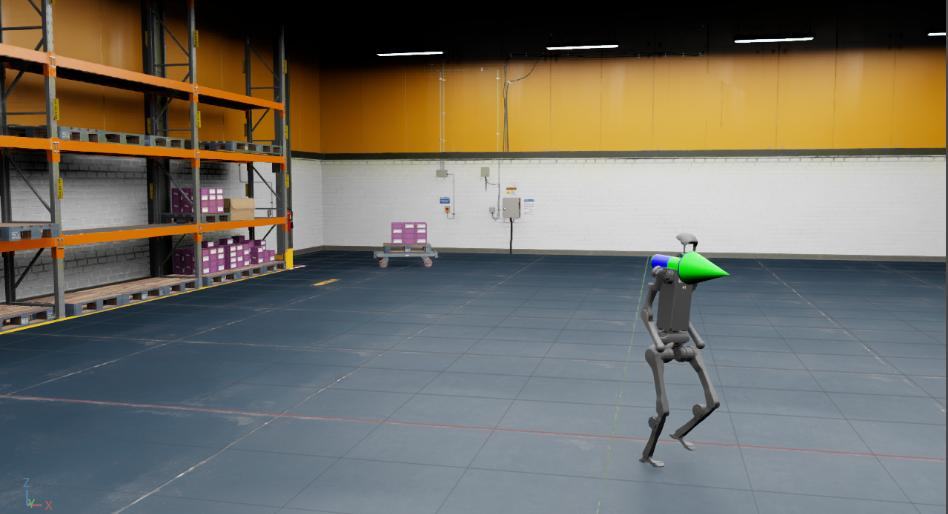

# 在 USD 环境中进行策略推理

在学习了如何在 [modify-direct-rl-env](modify-direct-rl-env.md) 中修改一个任务之后，我们现在来看一看如何在一个预先搭建好的 USD 场景中运行已训练好的策略。

在本教程中，我们将使用 RSL RL 库，并在一个简单的仓库（warehouse）USD 场景中运行 Humanoid Rough Terrain 任务 `Isaac-Velocity-Rough-H1-v0` 训练得到的策略。

## 教程代码

在本教程中，我们使用导出为 jit 的已训练策略 checkpoint（jit 是策略的离线版本）。

`H1RoughEnvCfg_PLAY` 配置（cfg）封装了推理环境的配置值，其中包含需要实例化的资产（assets）。

为了使用一个预先搭建好的 USD 环境，而不是使用指定的地形生成器，我们在将配置传入 `ManagerBasedRLEnv` 之前，对配置做如下修改。

<details>
<summary>policy_inference_in_usd.py 的代码</summary>

```python
# Copyright (c) 2022-2025, The Isaac Lab Project Developers (https://github.com/isaac-sim/IsaacLab/blob/main/CONTRIBUTORS.md).
# All rights reserved.
#
# SPDX-License-Identifier: BSD-3-Clause

"""
This script demonstrates policy inference in a prebuilt USD environment.

In this example, we use a locomotion policy to control the H1 robot. The robot was trained
using Isaac-Velocity-Rough-H1-v0. The robot is commanded to move forward at a constant velocity.

.. code-block:: bash

    # Run the script
    ./isaaclab.sh -p scripts/tutorials/03_envs/policy_inference_in_usd.py --checkpoint /path/to/jit/checkpoint.pt

"""

"""Launch Isaac Sim Simulator first."""

import argparse

from isaaclab.app import AppLauncher

# add argparse arguments
parser = argparse.ArgumentParser(description="Tutorial on inferencing a policy on an H1 robot in a warehouse.")
parser.add_argument("--checkpoint", type=str, help="Path to model checkpoint exported as jit.", required=True)

# append AppLauncher cli args
AppLauncher.add_app_launcher_args(parser)
# parse the arguments
args_cli = parser.parse_args()

# launch omniverse app
app_launcher = AppLauncher(args_cli)
simulation_app = app_launcher.app

"""Rest everything follows."""
import io
import os
import torch

import omni

from isaaclab.envs import ManagerBasedRLEnv
from isaaclab.terrains import TerrainImporterCfg
from isaaclab.utils.assets import ISAAC_NUCLEUS_DIR

from isaaclab_tasks.manager_based.locomotion.velocity.config.h1.rough_env_cfg import H1RoughEnvCfg_PLAY

def main():

    """Main function."""
    # load the trained jit policy
    policy_path = os.path.abspath(args_cli.checkpoint)
    file_content = omni.client.read_file(policy_path)[2]
    file = io.BytesIO(memoryview(file_content).tobytes())
    policy = torch.jit.load(file, map_location=args_cli.device)

    # setup environment
    env_cfg = H1RoughEnvCfg_PLAY()
    env_cfg.scene.num_envs = 1
    env_cfg.curriculum = None
    env_cfg.scene.terrain = TerrainImporterCfg(
        prim_path="/World/ground",
        terrain_type="usd",
        usd_path=f"{ISAAC_NUCLEUS_DIR}/Environments/Simple_Warehouse/warehouse.usd",
    )
    env_cfg.sim.device = args_cli.device
    if args_cli.device == "cpu":
        env_cfg.sim.use_fabric = False

    # create environment
    env = ManagerBasedRLEnv(cfg=env_cfg)

    # run inference with the policy
    obs, _ = env.reset()
    with torch.inference_mode():
        while simulation_app.is_running():
            action = policy(obs["policy"])
            obs, _, _, _, _ = env.step(action)

if __name__ == "__main__":
    main()
    simulation_app.close()
```

</details>

注意，我们将设备（device）设置为 `CPU` ，并在推理时禁用了 Fabric。
这是因为在模拟环境数量较少时，CPU 仿真往往可以比 GPU 仿真更快。

## 代码运行

首先，我们需要通过运行如下命令来训练 `Isaac-Velocity-Rough-H1-v0` 任务：

```bash
./isaaclab.sh -p scripts/reinforcement_learning/rsl_rl/train.py --task Isaac-Velocity-Rough-H1-v0 --headless
```

训练完成后，可以使用如下命令对结果进行可视化。
要停止仿真，你可以直接关闭窗口，或在启动仿真的终端中按下 `Ctrl+C` 。

```bash
./isaaclab.sh -p scripts/reinforcement_learning/rsl_rl/play.py --task Isaac-Velocity-Rough-H1-v0 --num_envs 64 --checkpoint logs/rsl_rl/h1_rough/EXPERIMENT_NAME/POLICY_FILE.pt
```

运行 play 脚本后，策略将被导出为 jit 和 onnx 文件，并存放在实验日志（experiment logs）目录下。
请注意，并非所有学习库都支持将策略导出为 jit 或 onnx 文件。
对于当前不支持该功能的库，请参考该库对应的 `play.py` 脚本，了解如何初始化策略。

随后，我们可以加载仓库资产，并使用导出的 jit 策略（ `exported/` 目录中的 `policy.pt` 文件）在 H1 机器人上运行推理。

```bash
./isaaclab.sh -p scripts/tutorials/03_envs/policy_inference_in_usd.py --checkpoint logs/rsl_rl/h1_rough/EXPERIMENT_NAME/exported/policy.pt
```



在本教程中，我们学习了如何对现有环境配置做一些小幅修改，以便在一个预先搭建好的 USD 环境中运行策略推理。
