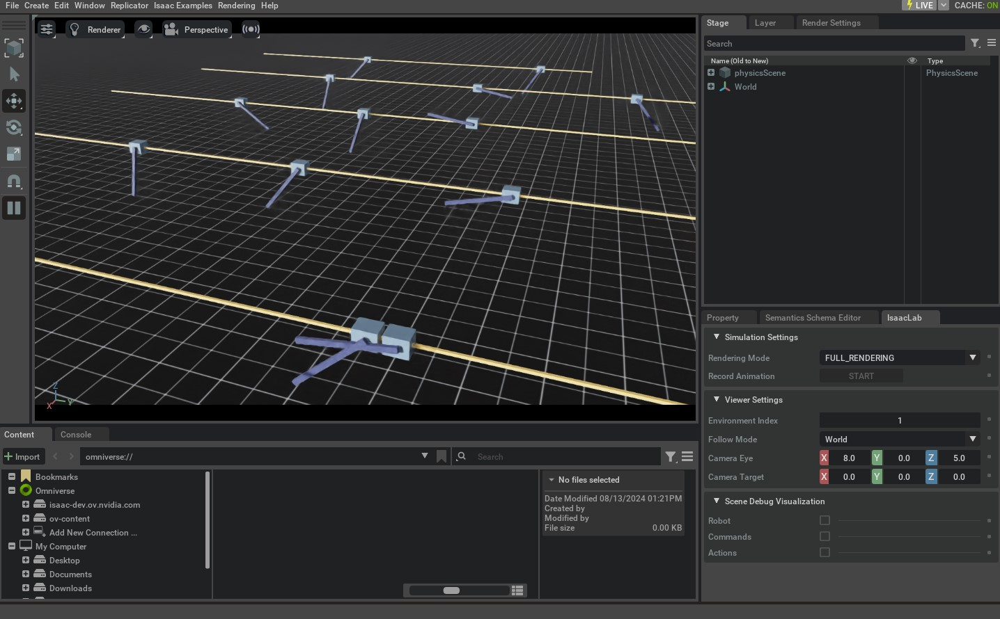

# 注册环境（Registering an Environment）

在上一节教程中，我们已经学会了如何创建自定义的 cartpole 环境。当时我们采用的是“手动导入环境类与配置类，然后直接实例化环境”的方式。

```python
    # create environment configuration
    env_cfg = CartpoleEnvCfg()
    env_cfg.scene.num_envs = args_cli.num_envs
    env_cfg.sim.device = args_cli.device
    # setup RL environment
    env = ManagerBasedRLEnv(cfg=env_cfg)
```

这种写法直观、好理解，但在“环境数量很多”的情况下并不方便维护：每个任务都需要你记住导入路径、配置类名称、实例化方式等细节。

本教程将介绍如何使用 `gymnasium.register` 把环境注册到 `gymnasium` 的 registry 中。注册之后，我们就可以用统一的 `gymnasium.make` 来创建环境实例。

```python
from isaaclab_tasks.utils import parse_env_cfg

# PLACEHOLDER: Extension template (do not remove this comment)

def main():
    """Random actions agent with Isaac Lab environment."""
    # create environment configuration
    env_cfg = parse_env_cfg(
        args_cli.task, device=args_cli.device, num_envs=args_cli.num_envs, use_fabric=not args_cli.disable_fabric
    )
    # create environment
```

## 代码

```python
# Copyright (c) 2022-2025, The Isaac Lab Project Developers (https://github.com/isaac-sim/IsaacLab/blob/main/CONTRIBUTORS.md).
# All rights reserved.
#
# SPDX-License-Identifier: BSD-3-Clause

"""Script to an environment with random action agent."""

"""Launch Isaac Sim Simulator first."""

import argparse

from isaaclab.app import AppLauncher

# add argparse arguments
parser = argparse.ArgumentParser(description="Random agent for Isaac Lab environments.")
parser.add_argument(
    "--disable_fabric",
    action="store_true",
    default=False,
    help="Disable fabric and use USD I/O operations.",
)
parser.add_argument("--num_envs", type=int, default=None, help="Number of environments to simulate.")
parser.add_argument("--task", type=str, default=None, help="Name of the task.")
# append AppLauncher cli args
AppLauncher.add_app_launcher_args(parser)
# parse the arguments
args_cli = parser.parse_args()

# launch omniverse app
app_launcher = AppLauncher(args_cli)
simulation_app = app_launcher.app

"""Rest everything follows."""

import gymnasium as gym
import torch

import isaaclab_tasks  # noqa: F401
from isaaclab_tasks.utils import parse_env_cfg

# PLACEHOLDER: Extension template (do not remove this comment)

def main():
    """Random actions agent with Isaac Lab environment."""
    # create environment configuration
    env_cfg = parse_env_cfg(
        args_cli.task,
        device=args_cli.device,
        num_envs=args_cli.num_envs,
        use_fabric=not args_cli.disable_fabric,
    )
    # create environment
    env = gym.make(args_cli.task, cfg=env_cfg)

    # print info (this is vectorized environment)
    print(f"[INFO]: Gym observation space: {env.observation_space}")
    print(f"[INFO]: Gym action space: {env.action_space}")
    # reset environment
    env.reset()
    # simulate environment
    while simulation_app.is_running():
        # run everything in inference mode
        with torch.inference_mode():
            # sample actions from -1 to 1
            actions = 2 * torch.rand(env.action_space.shape, device=env.unwrapped.device) - 1
            # apply actions
            env.step(actions)

    # close the simulator
    env.close()

if __name__ == "__main__":
    # run the main function
    main()
    # close sim app
    simulation_app.close()
```

## 代码讲解

`envs.ManagerBasedRLEnv` 继承自 `gymnasium.Env` ，因此遵循 Gym 的标准接口。但与传统的 Gym 环境不同的是， `envs.ManagerBasedRLEnv` 实现的是**向量化（vectorized）环境**：

* 同一个进程内同时运行多个环境实例。
* 返回的数据以 batch 形式组织（例如观测、奖励、done 等都是批量张量）。

类似地，direct workflow 的 `envs.DirectRLEnv` 也继承自 `gymnasium.Env` ，因此同样可以通过 Gym 的方式创建和使用。

对于 `envs.DirectMARLEnv` ，尽管它并不直接继承自 Gymnasium，但依然可以用类似方式注册与创建。

## 使用 Gym registry（Using the gym registry）

要注册一个环境，我们使用 `gymnasium.register` 。注册时通常需要提供：

* 环境名（environment id）
* 环境类的 entry point
* 环境配置的 entry point

> **Note**
> `gymnasium` 的 registry 是全局的，因此环境名必须唯一；否则在注册时会因为重名而报错。

### Manager-Based 环境

对于 manager-based 环境，以 `isaaclab_tasks.manager_based.classic.cartpole` 中的 cartpole 为例，官方教程引用了该子包 `__init__.py` 里对环境的注册代码。

```python
import gymnasium as gym

from . import agents

##
# Register Gym environments.
##

gym.register(
    id="Isaac-Cartpole-v0",
    entry_point="isaaclab.envs:ManagerBasedRLEnv",
    disable_env_checker=True,
    kwargs={
        "env_cfg_entry_point": f"{__name__}.cartpole_env_cfg:CartpoleEnvCfg",
        "rl_games_cfg_entry_point": f"{agents.__name__}:rl_games_ppo_cfg.yaml",
        "rsl_rl_cfg_entry_point": f"{agents.__name__}.rsl_rl_ppo_cfg:CartpolePPORunnerCfg",
        "rsl_rl_with_symmetry_cfg_entry_point": f"{agents.__name__}.rsl_rl_ppo_cfg:CartpolePPORunnerWithSymmetryCfg",
        "skrl_cfg_entry_point": f"{agents.__name__}:skrl_ppo_cfg.yaml",
        "sb3_cfg_entry_point": f"{agents.__name__}:sb3_ppo_cfg.yaml",
    },
)

gym.register(
    id="Isaac-Cartpole-RGB-v0",
    entry_point="isaaclab.envs:ManagerBasedRLEnv",
    disable_env_checker=True,
    kwargs={
        "env_cfg_entry_point": f"{__name__}.cartpole_camera_env_cfg:CartpoleRGBCameraEnvCfg",
        "rl_games_cfg_entry_point": f"{agents.__name__}:rl_games_camera_ppo_cfg.yaml",
    },
)

gym.register(
    id="Isaac-Cartpole-Depth-v0",
    entry_point="isaaclab.envs:ManagerBasedRLEnv",
    disable_env_checker=True,
    kwargs={
        "env_cfg_entry_point": f"{__name__}.cartpole_camera_env_cfg:CartpoleDepthCameraEnvCfg",
        "rl_games_cfg_entry_point": f"{agents.__name__}:rl_games_camera_ppo_cfg.yaml",
    },
)

gym.register(
    id="Isaac-Cartpole-RGB-ResNet18-v0",
    entry_point="isaaclab.envs:ManagerBasedRLEnv",
    disable_env_checker=True,
    kwargs={
        "env_cfg_entry_point": f"{__name__}.cartpole_camera_env_cfg:CartpoleResNet18CameraEnvCfg",
        "rl_games_cfg_entry_point": f"{agents.__name__}:rl_games_feature_ppo_cfg.yaml",
    },
)

gym.register(
    id="Isaac-Cartpole-RGB-TheiaTiny-v0",
    entry_point="isaaclab.envs:ManagerBasedRLEnv",
    disable_env_checker=True,
    kwargs={
        "env_cfg_entry_point": f"{__name__}.cartpole_camera_env_cfg:CartpoleTheiaTinyCameraEnvCfg",
        "rl_games_cfg_entry_point": f"{agents.__name__}:rl_games_feature_ppo_cfg.yaml",
    },
)
```

在注册参数中：

* `id`：环境名称。通常约定使用 `Isaac-` 作为统一前缀，便于在 registry 中搜索。
  环境名一般按“任务名 + 机器人名 + 版本号”的方式组织。例如：ANYmal C 在平地速度跟踪的环境可命名为 `Isaac-Velocity-Flat-Anymal-C-v0` 。
  其中版本号 `v<N>` 用于表示同一任务的不同变体，避免名字过长。
* `entry_point`：环境类入口，格式通常为 `<module>:<class>`。
  对 cartpole 的 manager-based 环境而言，entry point 是 `isaaclab.envs:ManagerBasedRLEnv` 。
* `env_cfg_entry_point`：环境默认配置入口。默认配置通常通过 `isaaclab_tasks.utils.parse_env_cfg` 加载，再传给 `gymnasium.make` 用于创建环境实例。
  配置入口既可以是 YAML 文件，也可以是 Python 配置类。

### Direct 环境

direct workflow 的环境注册方式与上面类似，但有两个常见差异：

* `entry_point` 注册的是环境的“具体实现类”，而不是统一的 `ManagerBasedRLEnv`。
* 环境名通常会加上 `-Direct` 后缀，用于与 manager-based 实现区分。

官方教程同样引用了 `isaaclab_tasks.direct.cartpole` 子包 `__init__.py` 中的注册代码；当前工作区无法读取该源码，因此按要求保留 RST 原文引用：

```python
import gymnasium as gym

from . import agents

##
# Register Gym environments.
##

gym.register(
    id="Isaac-Cartpole-Direct-v0",
    entry_point=f"{__name__}.cartpole_env:CartpoleEnv",
    disable_env_checker=True,
    kwargs={
        "env_cfg_entry_point": f"{__name__}.cartpole_env:CartpoleEnvCfg",
        "rl_games_cfg_entry_point": f"{agents.__name__}:rl_games_ppo_cfg.yaml",
        "rsl_rl_cfg_entry_point": f"{agents.__name__}.rsl_rl_ppo_cfg:CartpolePPORunnerCfg",
        "skrl_cfg_entry_point": f"{agents.__name__}:skrl_ppo_cfg.yaml",
        "sb3_cfg_entry_point": f"{agents.__name__}:sb3_ppo_cfg.yaml",
    },
)

gym.register(
```

## 创建环境（Creating the environment）

为了让 `gym` registry 知道 `isaaclab_tasks` 扩展提供了哪些环境，脚本需要在开头导入 `isaaclab_tasks` 。这会触发其 `__init__.py` 执行，从而遍历子包并注册环境。

```python
import isaaclab_tasks  # noqa: F401
```

在本教程里，任务名从命令行读取：它既用于解析默认配置，也用于创建环境实例。同时，诸如环境数量、仿真设备、是否渲染等参数，会用于覆盖默认配置。

对应关键代码如下：

```python
    # create environment configuration
    env_cfg = parse_env_cfg(
        args_cli.task, device=args_cli.device, num_envs=args_cli.num_envs, use_fabric=not args_cli.disable_fabric
    )
    # create environment
    env = gym.make(args_cli.task, cfg=env_cfg)
```

完成环境创建后，其余流程就回到了标准的 `reset()` / `step()` 循环。

## 运行方式（The Code Execution）

读完代码后，我们可以直接运行脚本验证效果，例如创建 32 个并行环境：

```bash
./isaaclab.sh -p scripts/environments/random_agent.py --task Isaac-Cartpole-v0 --num_envs 32
```

运行后会打开一个与《[创建基于 Manager 的强化学习环境](create-manager-rl-envs.md)》类似的 stage。
要停止仿真，可以直接关闭窗口，或在启动脚本的终端中按 `Ctrl+C` 。



此外，你也可以通过显式设置 `--device` 把仿真设备从 GPU 切换到 CPU：

```bash
./isaaclab.sh -p scripts/environments/random_agent.py --task Isaac-Cartpole-v0 --num_envs 32 --device cpu
```

当使用 `--device cpu` 时，仿真会在 CPU 上运行，这对调试很有帮助；但速度通常会显著慢于 GPU。
