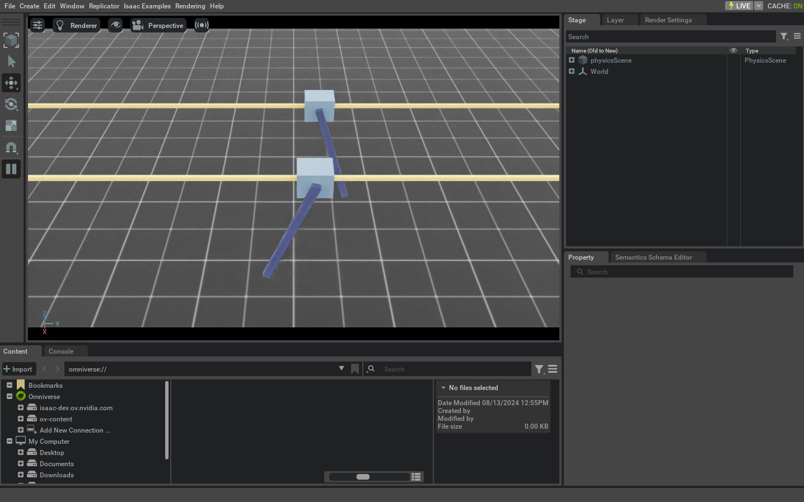

# 与关节系统（Articulation）交互

本教程演示如何在仿真中与一个**关节式机器人（articulated robot）**交互。它是“与刚体物体交互（tutorial-interact-rigid-object）”教程的延续：在上一节中，我们学习了如何与刚体物体交互；在此基础上，这一节会进一步介绍如何为关节式机器人设置**根状态（root state）**、设置**关节状态（joint state）**，并向机器人施加控制命令。

## 代码

本教程对应 `scripts/tutorials/01_assets` 目录下的 `run_articulation.py` 脚本。

```python
# Copyright (c) 2022-2025, The Isaac Lab Project Developers (https://github.com/isaac-sim/IsaacLab/blob/main/CONTRIBUTORS.md).
# All rights reserved.
#
# SPDX-License-Identifier: BSD-3-Clause

"""This script demonstrates how to spawn a cart-pole and interact with it.

.. code-block:: bash

    # Usage
    ./isaaclab.sh -p scripts/tutorials/01_assets/run_articulation.py

"""

"""Launch Isaac Sim Simulator first."""

import argparse

from isaaclab.app import AppLauncher

# add argparse arguments
parser = argparse.ArgumentParser(description="Tutorial on spawning and interacting with an articulation.")
# append AppLauncher cli args
AppLauncher.add_app_launcher_args(parser)
# parse the arguments
args_cli = parser.parse_args()

# launch omniverse app
app_launcher = AppLauncher(args_cli)
simulation_app = app_launcher.app

"""Rest everything follows."""

import torch

import isaaclab.sim as sim_utils
import isaaclab.sim.utils.prims as prim_utils
from isaaclab.assets import Articulation
from isaaclab.sim import SimulationContext

##
# Pre-defined configs
##
from isaaclab_assets import CARTPOLE_CFG  # isort:skip

def design_scene() -> tuple[dict, list[list[float]]]:
    """Designs the scene."""
    # Ground-plane
    cfg = sim_utils.GroundPlaneCfg()
    cfg.func("/World/defaultGroundPlane", cfg)
    # Lights
    cfg = sim_utils.DomeLightCfg(intensity=3000.0, color=(0.75, 0.75, 0.75))
    cfg.func("/World/Light", cfg)

    # Create separate groups called "Origin1", "Origin2"
    # Each group will have a robot in it
    origins = [[0.0, 0.0, 0.0], [-1.0, 0.0, 0.0]]
    # Origin 1
    prim_utils.create_prim("/World/Origin1", "Xform", translation=origins[0])
    # Origin 2
    prim_utils.create_prim("/World/Origin2", "Xform", translation=origins[1])

    # Articulation
    cartpole_cfg = CARTPOLE_CFG.copy()
    cartpole_cfg.prim_path = "/World/Origin.*/Robot"
    cartpole = Articulation(cfg=cartpole_cfg)

    # return the scene information
    scene_entities = {"cartpole": cartpole}
    return scene_entities, origins

def run_simulator(sim: sim_utils.SimulationContext, entities: dict[str, Articulation], origins: torch.Tensor):
    """Runs the simulation loop."""
    # Extract scene entities
    # note: we only do this here for readability. In general, it is better to access the entities directly from
    #   the dictionary. This dictionary is replaced by the InteractiveScene class in the next tutorial.
    robot = entities["cartpole"]
    # Define simulation stepping
    sim_dt = sim.get_physics_dt()
    count = 0
    # Simulation loop
    while simulation_app.is_running():
        # Reset
        if count % 500 == 0:
            # reset counter
            count = 0
            # reset the scene entities
            # root state
            # we offset the root state by the origin since the states are written in simulation world frame
            # if this is not done, then the robots will be spawned at the (0, 0, 0) of the simulation world
            root_state = robot.data.default_root_state.clone()
            root_state[:, :3] += origins
            robot.write_root_pose_to_sim(root_state[:, :7])
            robot.write_root_velocity_to_sim(root_state[:, 7:])
            # set joint positions with some noise
            joint_pos, joint_vel = robot.data.default_joint_pos.clone(), robot.data.default_joint_vel.clone()
            joint_pos += torch.rand_like(joint_pos) * 0.1
            robot.write_joint_state_to_sim(joint_pos, joint_vel)
            # clear internal buffers
            robot.reset()
            print("[INFO]: Resetting robot state...")
        # Apply random action
        # -- generate random joint efforts
        efforts = torch.randn_like(robot.data.joint_pos) * 5.0
        # -- apply action to the robot
        robot.set_joint_effort_target(efforts)
        # -- write data to sim
        robot.write_data_to_sim()
        # Perform step
        sim.step()
        # Increment counter
        count += 1
        # Update buffers
        robot.update(sim_dt)

def main():
    """Main function."""
    # Load kit helper
    sim_cfg = sim_utils.SimulationCfg(device=args_cli.device)
    sim = SimulationContext(sim_cfg)
    # Set main camera
    sim.set_camera_view([2.5, 0.0, 4.0], [0.0, 0.0, 2.0])
    # Design scene
    scene_entities, scene_origins = design_scene()
    scene_origins = torch.tensor(scene_origins, device=sim.device)
    # Play the simulator
    sim.reset()
    # Now we are ready!
    print("[INFO]: Setup complete...")
    # Run the simulator
    run_simulator(sim, scene_entities, scene_origins)

if __name__ == "__main__":
    # run the main function
    main()
    # close sim app
    simulation_app.close()
```

## 代码讲解

### 设计场景

与上一节教程类似，我们先在场景中加入地面（ground plane）和一个环境光（dome light）。不同的是：上一节生成的是刚体物体，而这里我们会从 USD 文件中生成一个**倒立摆小车（cart-pole）**关节系统（articulation）。这个 cart-pole 机器人由一个小车和连接在其上的一根杆组成：小车可以沿 x 轴自由移动，杆可以绕小车旋转。它对应的 USD 文件中包含了机器人几何、关节以及其他物理属性。

对于 cart-pole，我们使用它预先定义好的配置对象（configuration object），它是 `assets.ArticulationCfg` 的一个实例。该配置对象描述了关节系统的生成策略、默认初始状态、各关节的执行器模型（actuator model）以及其他元信息。关于如何编写这类配置对象，更深入的说明可参考 “how-to-write-articulation-config” 教程。

和上一节相同，我们通过把配置对象传给构造函数来创建 `assets.Articulation` 实例，从而把关节系统生成到场景中。

```python
# Create separate groups called "Origin1", "Origin2"
# Each group will have a robot in it
origins = [[0.0, 0.0, 0.0], [-1.0, 0.0, 0.0]]
# Origin 1
prim_utils.create_prim("/World/Origin1", "Xform", translation=origins[0])
# Origin 2
prim_utils.create_prim("/World/Origin2", "Xform", translation=origins[1])

# Articulation
cartpole_cfg = CARTPOLE_CFG.copy()
cartpole_cfg.prim_path = "/World/Origin.*/Robot"
cartpole = Articulation(cfg=cartpole_cfg)
```

### 运行仿真循环

延续上一节的思路，我们会在固定的时间间隔内重置仿真，设置关节系统的控制命令，推进仿真步进，并更新关节系统内部缓冲区（buffers）。

#### 重置仿真

与刚体类似，关节系统同样具有**根状态（root state）**，它对应关节树（articulation tree）中的根刚体。除此之外，关节系统还具有**关节状态（joint state）**，对应各关节的位置与速度。

要重置关节系统，我们先通过 `Articulation.write_root_pose_to_sim` 和 `Articulation.write_root_velocity_to_sim` 设置根状态；再通过 `Articulation.write_joint_state_to_sim` 设置关节位置与速度。最后调用 `Articulation.reset` ，用于清空内部缓冲与缓存。

```python
# reset the scene entities
# root state
# we offset the root state by the origin since the states are written in simulation world frame
# if this is not done, then the robots will be spawned at the (0, 0, 0) of the simulation world
root_state = robot.data.default_root_state.clone()
root_state[:, :3] += origins
robot.write_root_pose_to_sim(root_state[:, :7])
robot.write_root_velocity_to_sim(root_state[:, 7:])
# set joint positions with some noise
joint_pos, joint_vel = robot.data.default_joint_pos.clone(), robot.data.default_joint_vel.clone()
joint_pos += torch.rand_like(joint_pos) * 0.1
robot.write_joint_state_to_sim(joint_pos, joint_vel)
# clear internal buffers
robot.reset()
```

#### 推进仿真（Stepping）

向关节系统施加控制命令通常分两步：

1. **设置关节目标（joint targets）**：为关节系统设置期望的关节位置、速度或力矩/力（effort）目标。
2. **把数据写入仿真（write to simulation）**：根据关节系统的配置完成必要的执行器转换（actuation conversions），并把转换后的数据写入 PhysX 的缓冲区。

在本教程里，我们使用**关节 effort 命令**来控制关节系统。要让这种控制方式按预期工作，通常需要把关节系统的刚度（stiffness）和阻尼（damping）参数设置为 0；这一步已经在 cart-pole 的预定义配置对象中提前完成。

每个仿真步里，我们会随机采样一组关节 effort，并通过 `Articulation.set_joint_effort_target` 设为目标；随后调用 `Articulation.write_data_to_sim` 把目标写入 PhysX 缓冲区；最后推进仿真一步。

```python
# Apply random action
# -- generate random joint efforts
efforts = torch.randn_like(robot.data.joint_pos) * 5.0
# -- apply action to the robot
robot.set_joint_effort_target(efforts)
# -- write data to sim
robot.write_data_to_sim()
```

#### 更新状态

每个关节系统对象都包含一个 `assets.ArticulationData` ，用于存放关节系统的状态。要让内部缓冲区同步到最新仿真状态，需要调用 `assets.Articulation.update` 。

```python
# Update buffers
robot.update(sim_dt)
```

## 运行方式

要运行脚本并查看效果，可以在终端执行：

```bash
./isaaclab.sh -p scripts/tutorials/01_assets/run_articulation.py
```

该命令会打开一个包含地面、灯光以及两个 cart-pole 的场景，它们会以随机方式运动。要停止仿真，可以直接关闭窗口，或在终端按下 `Ctrl+C` 。



在本教程中，我们学习了如何创建并与一个简单的关节系统交互：包括如何设置关节系统的状态（根状态与关节状态）、如何对其施加控制命令，以及如何更新缓冲区以读取最新状态。

除本教程外，我们还提供了一些用于生成不同机器人的脚本，位于 `scripts/demos` 目录。你可以通过以下命令运行：

```bash
# Spawn many different single-arm manipulators
./isaaclab.sh -p scripts/demos/arms.py

# Spawn many different quadrupeds
./isaaclab.sh -p scripts/demos/quadrupeds.py
```
