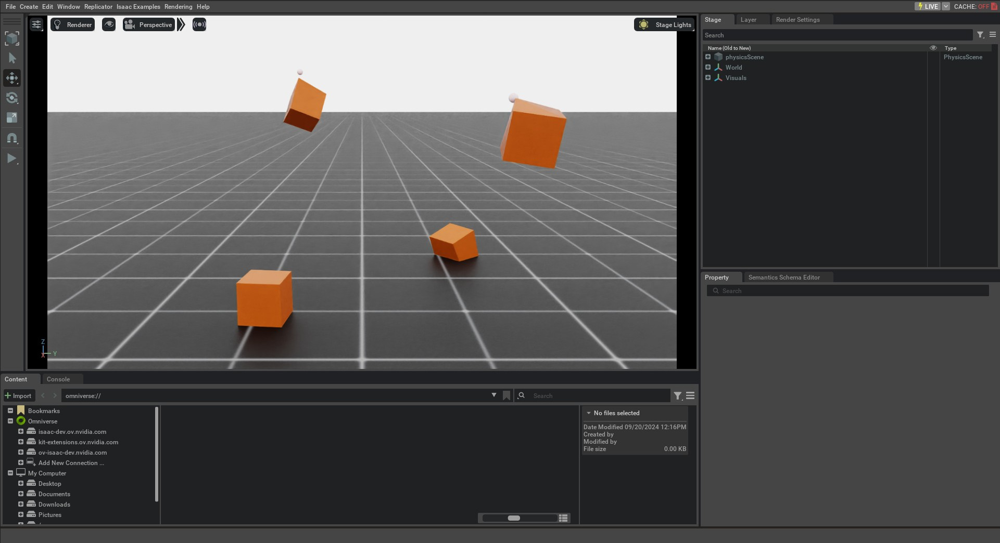

# 与可变形物体（Deformable Object）交互

虽然“可变形物体（deformable object）”有时也会泛指更广的一类对象（例如布料、流体与软体），但在 PhysX 的语境中，**deformable objects 在语义上对应软体（soft bodies）**。与刚体不同，软体会在外力与碰撞作用下发生形变。

PhysX 中的软体使用有限元方法（Finite Element Method, FEM）进行仿真。一个软体由两套四面体网格（tetrahedral meshes）构成：**仿真网格（simulation mesh）**与**碰撞网格（collision mesh）**。仿真网格用于计算软体的形变，碰撞网格用于检测它与场景中其他物体的碰撞。更多细节可参考 [PhysX 文档](https://nvidia-omniverse.github.io/PhysX/physx/5.4.1/docs/SoftBodies.html)。

本教程演示如何在仿真中与可变形物体交互。我们会生成一组软体立方体，并展示如何设置它们的**节点（node）位置与速度**，以及如何对网格节点施加**运动学（kinematic）**命令，从而驱动软体运动。

## 代码

本教程对应 `scripts/tutorials/01_assets` 目录下的 `run_deformable_object.py` 脚本。

```python
# Copyright (c) 2022-2025, The Isaac Lab Project Developers (https://github.com/isaac-sim/IsaacLab/blob/main/CONTRIBUTORS.md).
# All rights reserved.
#
# SPDX-License-Identifier: BSD-3-Clause

"""
This script demonstrates how to work with the deformable object and interact with it.

.. code-block:: bash

    # Usage
    ./isaaclab.sh -p scripts/tutorials/01_assets/run_deformable_object.py

"""

"""Launch Isaac Sim Simulator first."""

import argparse

from isaaclab.app import AppLauncher

# add argparse arguments
parser = argparse.ArgumentParser(description="Tutorial on interacting with a deformable object.")
# append AppLauncher cli args
AppLauncher.add_app_launcher_args(parser)
# parse the arguments
args_cli = parser.parse_args()

# launch omniverse app
app_launcher = AppLauncher(args_cli)
simulation_app = app_launcher.app

"""Rest everything follows."""

import torch

import isaaclab.sim as sim_utils
import isaaclab.sim.utils.prims as prim_utils
import isaaclab.utils.math as math_utils
from isaaclab.assets import DeformableObject, DeformableObjectCfg
from isaaclab.sim import SimulationContext

def design_scene():
    """Designs the scene."""
    # Ground-plane
    cfg = sim_utils.GroundPlaneCfg()
    cfg.func("/World/defaultGroundPlane", cfg)
    # Lights
    cfg = sim_utils.DomeLightCfg(intensity=2000.0, color=(0.8, 0.8, 0.8))
    cfg.func("/World/Light", cfg)

    # Create separate groups called "Origin1", "Origin2", "Origin3"
    # Each group will have a robot in it
    origins = [[0.25, 0.25, 0.0], [-0.25, 0.25, 0.0], [0.25, -0.25, 0.0], [-0.25, -0.25, 0.0]]
    for i, origin in enumerate(origins):
        prim_utils.create_prim(f"/World/Origin{i}", "Xform", translation=origin)

    # Deformable Object
    cfg = DeformableObjectCfg(
        prim_path="/World/Origin.*/Cube",
        spawn=sim_utils.MeshCuboidCfg(
            size=(0.2, 0.2, 0.2),
            deformable_props=sim_utils.DeformableBodyPropertiesCfg(rest_offset=0.0, contact_offset=0.001),
            visual_material=sim_utils.PreviewSurfaceCfg(diffuse_color=(0.5, 0.1, 0.0)),
            physics_material=sim_utils.DeformableBodyMaterialCfg(poissons_ratio=0.4, youngs_modulus=1e5),
        ),
        init_state=DeformableObjectCfg.InitialStateCfg(pos=(0.0, 0.0, 1.0)),
        debug_vis=True,
    )
    cube_object = DeformableObject(cfg=cfg)

    # return the scene information
    scene_entities = {"cube_object": cube_object}
    return scene_entities, origins

def run_simulator(sim: sim_utils.SimulationContext, entities: dict[str, DeformableObject], origins: torch.Tensor):
    """Runs the simulation loop."""
    # Extract scene entities
    # note: we only do this here for readability. In general, it is better to access the entities directly from
    #   the dictionary. This dictionary is replaced by the InteractiveScene class in the next tutorial.
    cube_object = entities["cube_object"]
    # Define simulation stepping
    sim_dt = sim.get_physics_dt()
    sim_time = 0.0
    count = 0

    # Nodal kinematic targets of the deformable bodies
    nodal_kinematic_target = cube_object.data.nodal_kinematic_target.clone()

    # Simulate physics
    while simulation_app.is_running():
        # reset
        if count % 250 == 0:
            # reset counters
            sim_time = 0.0
            count = 0

            # reset the nodal state of the object
            nodal_state = cube_object.data.default_nodal_state_w.clone()
            # apply random pose to the object
            pos_w = torch.rand(cube_object.num_instances, 3, device=sim.device) * 0.1 + origins
            quat_w = math_utils.random_orientation(cube_object.num_instances, device=sim.device)
            nodal_state[..., :3] = cube_object.transform_nodal_pos(nodal_state[..., :3], pos_w, quat_w)

            # write nodal state to simulation
            cube_object.write_nodal_state_to_sim(nodal_state)

            # Write the nodal state to the kinematic target and free all vertices
            nodal_kinematic_target[..., :3] = nodal_state[..., :3]
            nodal_kinematic_target[..., 3] = 1.0
            cube_object.write_nodal_kinematic_target_to_sim(nodal_kinematic_target)

            # reset buffers
            cube_object.reset()

            print("----------------------------------------")
            print("[INFO]: Resetting object state...")

        # update the kinematic target for cubes at index 0 and 3
        # we slightly move the cube in the z-direction by picking the vertex at index 0
        nodal_kinematic_target[[0, 3], 0, 2] += 0.001
        # set vertex at index 0 to be kinematically constrained
        # 0: constrained, 1: free
        nodal_kinematic_target[[0, 3], 0, 3] = 0.0
        # write kinematic target to simulation
        cube_object.write_nodal_kinematic_target_to_sim(nodal_kinematic_target)

        # write internal data to simulation
        cube_object.write_data_to_sim()
        # perform step
        sim.step()
        # update sim-time
        sim_time += sim_dt
        count += 1
        # update buffers
        cube_object.update(sim_dt)
        # print the root position
        if count % 50 == 0:
            print(f"Root position (in world): {cube_object.data.root_pos_w[:, :3]}")

def main():
    """Main function."""
    # Load kit helper
    sim_cfg = sim_utils.SimulationCfg(device=args_cli.device)
    sim = SimulationContext(sim_cfg)
    # Set main camera
    sim.set_camera_view(eye=[3.0, 0.0, 1.0], target=[0.0, 0.0, 0.5])
    # Design scene
    scene_entities, scene_origins = design_scene()
    scene_origins = torch.tensor(scene_origins, device=sim.device)
    # Play the simulator
    sim.reset()
    # Now we are ready!
    print("[INFO]: Setup complete...")
    # Run the simulator
    run_simulator(sim, scene_entities, scene_origins)

if __name__ == "__main__":
    # run the main function
    main()
    # close sim app
    simulation_app.close()
```

## 代码讲解

### 设计场景

与“与刚体物体交互（tutorial-interact-rigid-object）”教程类似，我们先在场景中加入地面和光源。除此之外，本教程还会使用 `assets.DeformableObject` 类把一个可变形物体加入场景。该类负责在指定路径生成对应的 prim，并初始化与之对应的可变形体物理句柄（physics handles）。

在本教程中，我们用与 “Spawn Objects（tutorial-spawn-prims）” 教程中“可变形立方体”相似的生成配置（spawn configuration）来创建一个立方体软体。不同之处在于：这里我们会把生成配置包装进 `assets.DeformableObjectCfg` 中。 `assets.DeformableObjectCfg` 记录了资产的生成策略与默认初始状态；当把该配置传给 `assets.DeformableObject` 后，物体会在仿真开始（play）时生成，并初始化对应的物理句柄。

> **Note**
> 可变形物体仅支持 GPU 仿真，并且要求生成的是网格（mesh）对象，且该对象带有可变形体（deformable body）的物理属性。

与刚体教程中的做法类似，我们通过把配置对象传入构造函数来创建 `assets.DeformableObject` 实例，从而把可变形物体生成到场景中。

```python
# Create separate groups called "Origin1", "Origin2", "Origin3"
# Each group will have a robot in it
origins = [[0.25, 0.25, 0.0], [-0.25, 0.25, 0.0], [0.25, -0.25, 0.0], [-0.25, -0.25, 0.0]]
for i, origin in enumerate(origins):
    prim_utils.create_prim(f"/World/Origin{i}", "Xform", translation=origin)

# Deformable Object
cfg = DeformableObjectCfg(
    prim_path="/World/Origin.*/Cube",
    spawn=sim_utils.MeshCuboidCfg(
        size=(0.2, 0.2, 0.2),
        deformable_props=sim_utils.DeformableBodyPropertiesCfg(rest_offset=0.0, contact_offset=0.001),
        visual_material=sim_utils.PreviewSurfaceCfg(diffuse_color=(0.5, 0.1, 0.0)),
        physics_material=sim_utils.DeformableBodyMaterialCfg(poissons_ratio=0.4, youngs_modulus=1e5),
    ),
    init_state=DeformableObjectCfg.InitialStateCfg(pos=(0.0, 0.0, 1.0)),
    debug_vis=True,
)
cube_object = DeformableObject(cfg=cfg)
```

### 运行仿真循环

延续刚体教程的思路，我们会按固定间隔重置仿真状态，对可变形体施加运动学命令（kinematic commands），推进仿真步进，并更新可变形物体的内部缓冲区。

#### 重置仿真状态

与刚体和关节系统（articulation）不同，可变形物体的状态表示方式不同：它的状态由网格的**节点（nodal）位置与速度**定义。节点位置与速度以**仿真世界坐标系（simulation world frame）**表示，并存放在 `assets.DeformableObject.data` 中。

我们通过 `assets.DeformableObject.data.default_nodal_state_w` 获取已生成 prim 的默认节点状态。默认状态可由 `assets.DeformableObjectCfg.init_state` 配置；在本教程里我们把它保持为单位（identity）设置。

> **注意**
> 配置 `assets.DeformableObjectCfg` 中的初始状态描述的是“生成时刻”可变形物体的位姿。仿真第一次开始运行（play）时，会基于这个初始位姿推导出默认节点状态。

为了随机化可变形物体的初始状态，我们会对节点位置施加变换。

```python
# reset the nodal state of the object
nodal_state = cube_object.data.default_nodal_state_w.clone()
# apply random pose to the object
pos_w = torch.rand(cube_object.num_instances, 3, device=sim.device) * 0.1 + origins
quat_w = math_utils.random_orientation(cube_object.num_instances, device=sim.device)
nodal_state[..., :3] = cube_object.transform_nodal_pos(nodal_state[..., :3], pos_w, quat_w)
```

重置可变形物体时，我们先调用 `assets.DeformableObject.write_nodal_state_to_sim` 写入节点状态到仿真缓冲区。随后，我们还会通过 `assets.DeformableObject.write_nodal_kinematic_target_to_sim` 释放上一仿真步对节点设置过的运动学目标（kinematic target）；下一小节会解释 kinematic target 的含义。最后调用 `assets.DeformableObject.reset` 清空内部缓冲与缓存。

```python
# write nodal state to simulation
cube_object.write_nodal_state_to_sim(nodal_state)

# Write the nodal state to the kinematic target and free all vertices
nodal_kinematic_target[..., :3] = nodal_state[..., :3]
nodal_kinematic_target[..., 3] = 1.0
cube_object.write_nodal_kinematic_target_to_sim(nodal_kinematic_target)

# reset buffers
cube_object.reset()
```

#### 推进仿真（Stepping）

可变形体支持“用户驱动的运动学控制”：用户可以为部分网格节点指定位置目标，其余节点则由 FEM 求解器进行仿真。这种 **partial kinematic（部分运动学）** 控制在需要以可控方式与软体交互的场景中非常有用。更多说明见 [partial kinematic](https://nvidia-omniverse.github.io/PhysX/physx/5.4.1/docs/SoftBodies.html#kinematic-soft-bodies)。

在本教程中，我们会对场景中的四个立方体中的两个施加运动学命令：将节点索引 0（立方体的左下角）作为控制点，让立方体沿 z 轴方向移动。

每个仿真步，我们都会把该节点的运动学位置目标增加一个很小的量，并同时设置标记位，表示该节点在仿真缓冲区中应被当作运动学目标节点处理。最后通过 `assets.DeformableObject.write_nodal_kinematic_target_to_sim` 将这些目标写入仿真。

```python
# update the kinematic target for cubes at index 0 and 3
# we slightly move the cube in the z-direction by picking the vertex at index 0
nodal_kinematic_target[[0, 3], 0, 2] += 0.001
# set vertex at index 0 to be kinematically constrained
# 0: constrained, 1: free
nodal_kinematic_target[[0, 3], 0, 3] = 0.0
# write kinematic target to simulation
cube_object.write_nodal_kinematic_target_to_sim(nodal_kinematic_target)
```

与刚体/关节系统类似，在推进仿真之前我们也会调用 `assets.DeformableObject.write_data_to_sim` 。对于可变形物体而言，这个方法在当前实现中不会向物体施加外力，但保留该调用有利于保持流程完整，并便于后续扩展。

```python
# write internal data to simulation
cube_object.write_data_to_sim()
```

#### 更新状态

推进仿真后，我们需要更新可变形物体 prim 的内部缓冲区，让 `assets.DeformableObject.data` 反映新的状态。这可以通过 `assets.DeformableObject.update` 完成。

另外，我们会以固定间隔把“根位置”输出到终端。需要注意的是：可变形物体并不存在严格意义上的 root state；这里的根位置是通过**对网格所有节点的位置取平均**来计算的。

```python
# update buffers
cube_object.update(sim_dt)
# print the root position
if count % 50 == 0:
    print(f"Root position (in world): {cube_object.data.root_pos_w[:, :3]}")
```

## 运行方式

了解完代码后，可以运行脚本观察效果：

```bash
./isaaclab.sh -p scripts/tutorials/01_assets/run_deformable_object.py
```

该命令会打开一个包含地面、灯光以及若干绿色立方体的场景。其中四个立方体里应有两个从高处落下并最终落在地面上，另外两个沿 z 轴方向移动。你还会看到一个标记（marker），用于显示立方体左下角节点的运动学目标位置。要停止仿真，可以关闭窗口，或在终端按下 `Ctrl+C` 。



本教程展示了如何生成可变形物体，并将其封装到 `DeformableObject` 类中以初始化物理句柄，从而可以读写其状态；同时也演示了如何通过运动学命令以可控方式驱动网格节点运动。在下一节教程中，我们将介绍如何使用 `InteractiveScene` 类来构建场景。
