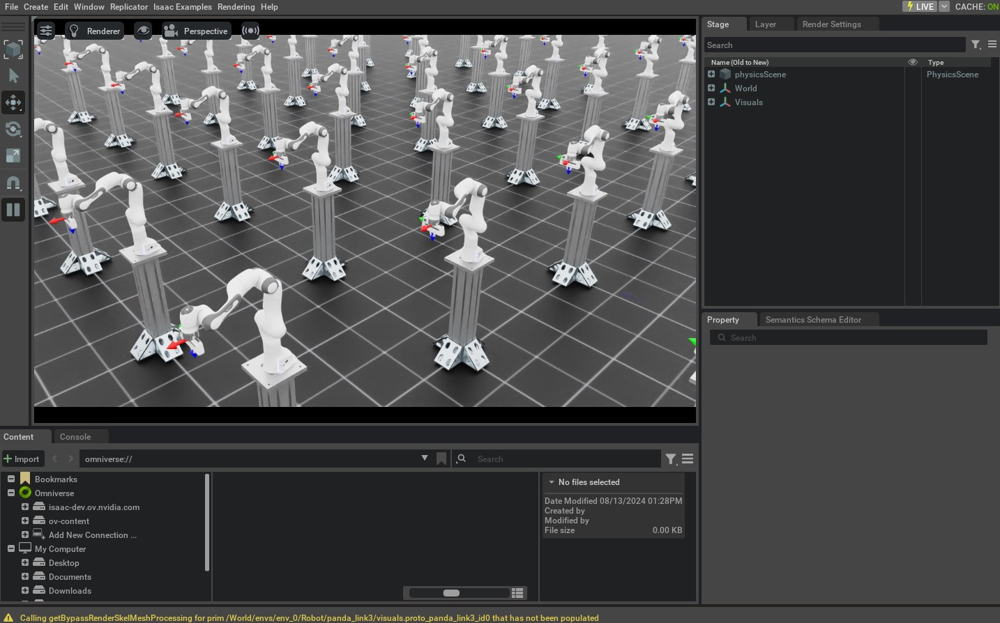

# 使用任务空间控制器

在之前的教程中，我们使用的是关节空间（joint-space）控制器来控制机器人。但在很多情况下，使用任务空间（task-space）控制器来控制机器人会更直观。例如，如果我们希望对机器人进行遥操作（teleoperate），相比指定期望的关节位置，直接指定期望的末端执行器（end-effector）位姿往往更容易。

在本教程中，我们将学习如何使用任务空间控制器来控制机器人。
我们将使用 `controllers.DifferentialIKController` 类来跟踪期望的末端执行器位姿指令。

## 代码

本教程对应 `scripts/tutorials/05_controllers` 目录下的 `run_diff_ik.py` 脚本。

<details>
<summary>run_diff_ik.py 的代码</summary>

```python
# Copyright (c) 2022-2025, The Isaac Lab Project Developers (https://github.com/isaac-sim/IsaacLab/blob/main/CONTRIBUTORS.md).
# All rights reserved.
#
# SPDX-License-Identifier: BSD-3-Clause

"""
This script demonstrates how to use the differential inverse kinematics controller with the simulator.

The differential IK controller can be configured in different modes. It uses the Jacobians computed by
PhysX. This helps perform parallelized computation of the inverse kinematics.

.. code-block:: bash

    # Usage
    ./isaaclab.sh -p scripts/tutorials/05_controllers/run_diff_ik.py

"""

"""Launch Isaac Sim Simulator first."""

import argparse

from isaaclab.app import AppLauncher

# add argparse arguments
parser = argparse.ArgumentParser(description="Tutorial on using the differential IK controller.")
parser.add_argument("--robot", type=str, default="franka_panda", help="Name of the robot.")
parser.add_argument("--num_envs", type=int, default=128, help="Number of environments to spawn.")
# append AppLauncher cli args
AppLauncher.add_app_launcher_args(parser)
# parse the arguments
args_cli = parser.parse_args()

# launch omniverse app
app_launcher = AppLauncher(args_cli)
simulation_app = app_launcher.app

"""Rest everything follows."""

import torch

import isaaclab.sim as sim_utils
from isaaclab.assets import AssetBaseCfg
from isaaclab.controllers import DifferentialIKController, DifferentialIKControllerCfg
from isaaclab.managers import SceneEntityCfg
from isaaclab.markers import VisualizationMarkers
from isaaclab.markers.config import FRAME_MARKER_CFG
from isaaclab.scene import InteractiveScene, InteractiveSceneCfg
from isaaclab.utils import configclass
from isaaclab.utils.assets import ISAAC_NUCLEUS_DIR
from isaaclab.utils.math import subtract_frame_transforms

##
# Pre-defined configs
##
from isaaclab_assets import FRANKA_PANDA_HIGH_PD_CFG, UR10_CFG  # isort:skip

@configclass
class TableTopSceneCfg(InteractiveSceneCfg):

    """Configuration for a cart-pole scene."""

    # ground plane
    ground = AssetBaseCfg(
        prim_path="/World/defaultGroundPlane",
        spawn=sim_utils.GroundPlaneCfg(),
        init_state=AssetBaseCfg.InitialStateCfg(pos=(0.0, 0.0, -1.05)),
    )

    # lights
    dome_light = AssetBaseCfg(
        prim_path="/World/Light", spawn=sim_utils.DomeLightCfg(intensity=3000.0, color=(0.75, 0.75, 0.75))
    )

    # mount
    table = AssetBaseCfg(
        prim_path="{ENV_REGEX_NS}/Table",
        spawn=sim_utils.UsdFileCfg(
            usd_path=f"{ISAAC_NUCLEUS_DIR}/Props/Mounts/Stand/stand_instanceable.usd", scale=(2.0, 2.0, 2.0)
        ),
    )

    # articulation
    if args_cli.robot == "franka_panda":
        robot = FRANKA_PANDA_HIGH_PD_CFG.replace(prim_path="{ENV_REGEX_NS}/Robot")
    elif args_cli.robot == "ur10":
        robot = UR10_CFG.replace(prim_path="{ENV_REGEX_NS}/Robot")
    else:
        raise ValueError(f"Robot {args_cli.robot} is not supported. Valid: franka_panda, ur10")

def run_simulator(sim: sim_utils.SimulationContext, scene: InteractiveScene):

    """Runs the simulation loop."""
    # Extract scene entities
    # note: we only do this here for readability.
    robot = scene["robot"]

    # Create controller
    diff_ik_cfg = DifferentialIKControllerCfg(command_type="pose", use_relative_mode=False, ik_method="dls")
    diff_ik_controller = DifferentialIKController(diff_ik_cfg, num_envs=scene.num_envs, device=sim.device)

    # Markers
    frame_marker_cfg = FRAME_MARKER_CFG.copy()
    frame_marker_cfg.markers["frame"].scale = (0.1, 0.1, 0.1)
    ee_marker = VisualizationMarkers(frame_marker_cfg.replace(prim_path="/Visuals/ee_current"))
    goal_marker = VisualizationMarkers(frame_marker_cfg.replace(prim_path="/Visuals/ee_goal"))

    # Define goals for the arm
    ee_goals = [
        [0.5, 0.5, 0.7, 0.707, 0, 0.707, 0],
        [0.5, -0.4, 0.6, 0.707, 0.707, 0.0, 0.0],
        [0.5, 0, 0.5, 0.0, 1.0, 0.0, 0.0],
    ]
    ee_goals = torch.tensor(ee_goals, device=sim.device)
    # Track the given command
    current_goal_idx = 0
    # Create buffers to store actions
    ik_commands = torch.zeros(scene.num_envs, diff_ik_controller.action_dim, device=robot.device)
    ik_commands[:] = ee_goals[current_goal_idx]

    # Specify robot-specific parameters
    if args_cli.robot == "franka_panda":
        robot_entity_cfg = SceneEntityCfg("robot", joint_names=["panda_joint.*"], body_names=["panda_hand"])
    elif args_cli.robot == "ur10":
        robot_entity_cfg = SceneEntityCfg("robot", joint_names=[".*"], body_names=["ee_link"])
    else:
        raise ValueError(f"Robot {args_cli.robot} is not supported. Valid: franka_panda, ur10")
    # Resolving the scene entities
    robot_entity_cfg.resolve(scene)
    # Obtain the frame index of the end-effector
    # For a fixed base robot, the frame index is one less than the body index. This is because
    # the root body is not included in the returned Jacobians.
    if robot.is_fixed_base:
        ee_jacobi_idx = robot_entity_cfg.body_ids[0] - 1
    else:
        ee_jacobi_idx = robot_entity_cfg.body_ids[0]

    # Define simulation stepping
    sim_dt = sim.get_physics_dt()
    count = 0
    # Simulation loop
    while simulation_app.is_running():
        # reset
        if count % 150 == 0:
            # reset time
            count = 0
            # reset joint state
            joint_pos = robot.data.default_joint_pos.clone()
            joint_vel = robot.data.default_joint_vel.clone()
            robot.write_joint_state_to_sim(joint_pos, joint_vel)
            robot.reset()
            # reset actions
            ik_commands[:] = ee_goals[current_goal_idx]
            joint_pos_des = joint_pos[:, robot_entity_cfg.joint_ids].clone()
            # reset controller
            diff_ik_controller.reset()
            diff_ik_controller.set_command(ik_commands)
            # change goal
            current_goal_idx = (current_goal_idx + 1) % len(ee_goals)
        else:
            # obtain quantities from simulation
            jacobian = robot.root_physx_view.get_jacobians()[:, ee_jacobi_idx, :, robot_entity_cfg.joint_ids]
            ee_pose_w = robot.data.body_pose_w[:, robot_entity_cfg.body_ids[0]]
            root_pose_w = robot.data.root_pose_w
            joint_pos = robot.data.joint_pos[:, robot_entity_cfg.joint_ids]
            # compute frame in root frame
            ee_pos_b, ee_quat_b = subtract_frame_transforms(
                root_pose_w[:, 0:3], root_pose_w[:, 3:7], ee_pose_w[:, 0:3], ee_pose_w[:, 3:7]
            )
            # compute the joint commands
            joint_pos_des = diff_ik_controller.compute(ee_pos_b, ee_quat_b, jacobian, joint_pos)

        # apply actions
        robot.set_joint_position_target(joint_pos_des, joint_ids=robot_entity_cfg.joint_ids)
        scene.write_data_to_sim()
        # perform step
        sim.step()
        # update sim-time
        count += 1
        # update buffers
        scene.update(sim_dt)

        # obtain quantities from simulation
        ee_pose_w = robot.data.body_state_w[:, robot_entity_cfg.body_ids[0], 0:7]
        # update marker positions
        ee_marker.visualize(ee_pose_w[:, 0:3], ee_pose_w[:, 3:7])
        goal_marker.visualize(ik_commands[:, 0:3] + scene.env_origins, ik_commands[:, 3:7])

def main():

    """Main function."""
    # Load kit helper
    sim_cfg = sim_utils.SimulationCfg(dt=0.01, device=args_cli.device)
    sim = sim_utils.SimulationContext(sim_cfg)
    # Set main camera
    sim.set_camera_view([2.5, 2.5, 2.5], [0.0, 0.0, 0.0])
    # Design scene
    scene_cfg = TableTopSceneCfg(num_envs=args_cli.num_envs, env_spacing=2.0)
    scene = InteractiveScene(scene_cfg)
    # Play the simulator
    sim.reset()
    # Now we are ready!
    print("[INFO]: Setup complete...")
    # Run the simulator
    run_simulator(sim, scene)

if __name__ == "__main__":
    # run the main function
    main()
    # close sim app
    simulation_app.close()
```

</details>

## 代码讲解

在使用任何任务空间控制器时，务必确保提供的量处于正确的坐标系中。当我们并行化多个环境实例时，它们都处于同一个唯一的仿真世界坐标系中。不过通常我们希望每个环境都有自己的局部坐标系。这可以通过 `scene.InteractiveScene.env_origins` 属性获取。

在我们的 API 中，坐标系记号使用如下约定：

* 仿真世界坐标系（记为 `w`），即整个仿真的坐标系。
* 环境局部坐标系（记为 `e`），即局部环境的坐标系。
* 机器人基座坐标系（记为 `b`），即机器人 base link 的坐标系。

由于资产实例并不会“感知”环境局部坐标系，因此它们会在仿真世界坐标系中返回自身状态。于是我们需要把获取到的量转换到环境局部坐标系中。这可以通过从获取到的量中减去环境局部原点来实现。

### 创建 IK 控制器

`controllers.DifferentialIKController` 类用于计算机器人达到期望末端执行器位姿时所需的关节目标位置。该实现采用批处理（batched）方式，并使用 PyTorch 运算。它支持多种逆运动学（inverse kinematics）求解器，包括阻尼最小二乘（damped least-squares）方法与伪逆（pseudo-inverse）方法。这些求解器可以通过 `controllers.DifferentialIKControllerCfg.ik_method` 参数指定。此外，控制器也支持相对位姿与绝对位姿两种指令形式。

在本教程中，我们将使用阻尼最小二乘方法来计算期望的关节位置。同时，由于我们希望跟踪期望的末端执行器位姿，因此将使用绝对位姿指令模式。

```python
# Create controller
diff_ik_cfg = DifferentialIKControllerCfg(command_type="pose", use_relative_mode=False, ik_method="dls")
diff_ik_controller = DifferentialIKController(diff_ik_cfg, num_envs=scene.num_envs, device=sim.device)
```

### 获取机器人关节与刚体索引

IK 控制器的实现是一个纯计算（computation-only）类。因此，它需要用户提供机器人的必要信息，包括机器人关节位置、当前末端执行器位姿以及雅可比矩阵（Jacobian matrix）。

尽管 `assets.ArticulationData.joint_pos` 属性提供了关节位置，但我们只需要机器人机械臂部分的关节位置，而不需要夹爪（gripper）。类似地，尽管 `assets.ArticulationData.body_state_w` 提供了机器人所有刚体的状态，但我们只需要末端执行器的状态。因此，我们需要对这些数组进行索引，才能获得所需的量。

为此，Articulation 类提供了 `assets.Articulation.find_joints` 与 `assets.Articulation.find_bodies` 方法。这些方法接收关节与刚体的名称，并返回对应的索引。

尽管你可以直接使用这些方法获取索引，但我们推荐使用 `managers.SceneEntityCfg` 来解析索引。该类在 API 的多处用于从场景实体中提取特定信息；其内部会调用上述方法来获取索引，同时还会进行额外检查以确保传入名称有效，因此是更安全的选择。

```python
# Specify robot-specific parameters
if args_cli.robot == "franka_panda":

    robot_entity_cfg = SceneEntityCfg("robot", joint_names=["panda_joint.*"], body_names=["panda_hand"])
elif args_cli.robot == "ur10":
    robot_entity_cfg = SceneEntityCfg("robot", joint_names=[".*"], body_names=["ee_link"])
else:
    raise ValueError(f"Robot {args_cli.robot} is not supported. Valid: franka_panda, ur10")
# Resolving the scene entities
robot_entity_cfg.resolve(scene)
# Obtain the frame index of the end-effector
# For a fixed base robot, the frame index is one less than the body index. This is because
# the root body is not included in the returned Jacobians.
if robot.is_fixed_base:
    ee_jacobi_idx = robot_entity_cfg.body_ids[0] - 1
else:
    ee_jacobi_idx = robot_entity_cfg.body_ids[0]
```

### 计算机器人指令

IK 控制器将“设置期望指令”与“计算期望关节位置”这两个操作分开。这样做是为了允许用户以不同于机器人控制频率的频率运行 IK 控制器。

`controllers.DifferentialIKController.set_command` 方法以一个批处理数组的形式接收期望的末端执行器位姿。位姿在机器人基座坐标系中表示。

```python
# reset controller
diff_ik_controller.reset()
diff_ik_controller.set_command(ik_commands)
```

随后，我们可以使用 `controllers.DifferentialIKController.compute` 方法计算期望关节位置。
该方法接收当前末端执行器位姿（基座坐标系中）、雅可比矩阵以及当前关节位置。我们从机器人的数据中读取雅可比矩阵；该雅可比由物理引擎计算得到。

```python
# obtain quantities from simulation
jacobian = robot.root_physx_view.get_jacobians()[:, ee_jacobi_idx, :, robot_entity_cfg.joint_ids]
ee_pose_w = robot.data.body_pose_w[:, robot_entity_cfg.body_ids[0]]
root_pose_w = robot.data.root_pose_w
joint_pos = robot.data.joint_pos[:, robot_entity_cfg.joint_ids]
# compute frame in root frame
ee_pos_b, ee_quat_b = subtract_frame_transforms(
    root_pose_w[:, 0:3], root_pose_w[:, 3:7], ee_pose_w[:, 0:3], ee_pose_w[:, 3:7]
)
# compute the joint commands
joint_pos_des = diff_ik_controller.compute(ee_pos_b, ee_quat_b, jacobian, joint_pos)
```

计算出的关节位置目标随后即可像之前的教程那样应用到机器人上。

```python
# apply actions
robot.set_joint_position_target(joint_pos_des, joint_ids=robot_entity_cfg.joint_ids)
scene.write_data_to_sim()
```

## 代码运行

现在我们已经过了一遍代码，接下来运行脚本并查看结果：

```bash
./isaaclab.sh -p scripts/tutorials/05_controllers/run_diff_ik.py --robot franka_panda --num_envs 128
```

该脚本会启动一个包含 128 台机器人的仿真。机器人将使用 IK 控制器进行控制。
当前与目标末端执行器位姿应会通过坐标系标记（frame markers）进行显示。
当机器人到达目标位姿后，指令应会切换到脚本中指定的下一个目标位姿。



要停止仿真，你可以直接关闭窗口，或在终端中按下 `Ctrl+C` 。
