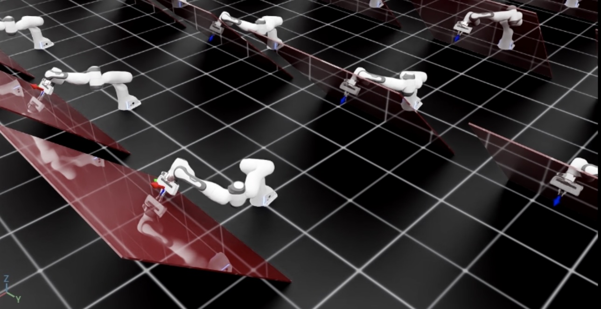

# 使用操作空间控制器（Operational Space Controller, OSC）

有时，仅使用差分 IK 控制器来控制机器人末端执行器（end-effector）的位姿并不够。例如，我们可能希望在任务空间中强制施加非常特定的位姿跟踪误差动态，使用关节力/力矩（effort/torque）命令驱动机器人，或者在控制其他方向运动的同时，在某个特定方向施加接触力（例如用抹布擦洗桌面）。在这类任务中，我们可以使用操作空间控制器（OSC）。

**操作空间控制（Operational Space Control）的参考文献：**

1. O Khatib. A unified approach for motion and force control of robot manipulators: The operational space formulation. *IEEE Journal of Robotics and Automation*, 3(1):43–53, 1987. URL http://dx.doi.org/10.1109/JRA.1987.1087068.
2. Robot Dynamics Lecture Notes by Marco Hutter (ETH Zurich). URL https://ethz.ch/content/dam/ethz/special-interest/mavt/robotics-n-intelligent-systems/rsl-dam/documents/RobotDynamics2017/RD_HS2017script.pdf

在本教程中，我们将学习如何使用 OSC 来控制机器人。
我们将使用 `controllers.OperationalSpaceController` 类，在跟踪其他方向期望末端位姿的同时，对倾斜墙面表面施加一个垂直方向的恒定力。

## 代码

本教程对应于 `scripts/tutorials/05_controllers` 目录下的 `run_osc.py` 脚本。

<details>
<summary>run_osc.py 的代码</summary>

```python
# Copyright (c) 2022-2025, The Isaac Lab Project Developers (https://github.com/isaac-sim/IsaacLab/blob/main/CONTRIBUTORS.md).
# All rights reserved.
#
# SPDX-License-Identifier: BSD-3-Clause

"""
This script demonstrates how to use the operational space controller (OSC) with the simulator.

The OSC controller can be configured in different modes. It uses the dynamical quantities such as Jacobians and
mass matricescomputed by PhysX.

.. code-block:: bash

    # Usage
    ./isaaclab.sh -p scripts/tutorials/05_controllers/run_osc.py

"""

"""Launch Isaac Sim Simulator first."""

import argparse

from isaaclab.app import AppLauncher

# add argparse arguments
parser = argparse.ArgumentParser(description="Tutorial on using the operational space controller.")
parser.add_argument("--num_envs", type=int, default=128, help="Number of environments to spawn.")
# append AppLauncher cli args
AppLauncher.add_app_launcher_args(parser)
# parse the arguments
args_cli = parser.parse_args()

# launch omniverse app
app_launcher = AppLauncher(args_cli)
simulation_app = app_launcher.app

"""Rest everything follows."""

import torch

import isaaclab.sim as sim_utils
from isaaclab.assets import Articulation, AssetBaseCfg
from isaaclab.controllers import OperationalSpaceController, OperationalSpaceControllerCfg
from isaaclab.markers import VisualizationMarkers
from isaaclab.markers.config import FRAME_MARKER_CFG
from isaaclab.scene import InteractiveScene, InteractiveSceneCfg
from isaaclab.sensors import ContactSensorCfg
from isaaclab.utils import configclass
from isaaclab.utils.math import (
    combine_frame_transforms,
    matrix_from_quat,
    quat_apply_inverse,
    quat_inv,
    subtract_frame_transforms,
)

##
# Pre-defined configs
##
from isaaclab_assets import FRANKA_PANDA_HIGH_PD_CFG  # isort:skip

@configclass
class SceneCfg(InteractiveSceneCfg):
    """Configuration for a simple scene with a tilted wall."""

    # ground plane
    ground = AssetBaseCfg(
        prim_path="/World/defaultGroundPlane",
        spawn=sim_utils.GroundPlaneCfg(),
    )

    # lights
    dome_light = AssetBaseCfg(
        prim_path="/World/Light", spawn=sim_utils.DomeLightCfg(intensity=3000.0, color=(0.75, 0.75, 0.75))
    )

    # Tilted wall
    tilted_wall = AssetBaseCfg(
        prim_path="{ENV_REGEX_NS}/TiltedWall",
        spawn=sim_utils.CuboidCfg(
            size=(2.0, 1.5, 0.01),
            collision_props=sim_utils.CollisionPropertiesCfg(),
            visual_material=sim_utils.PreviewSurfaceCfg(diffuse_color=(1.0, 0.0, 0.0), opacity=0.1),
            rigid_props=sim_utils.RigidBodyPropertiesCfg(kinematic_enabled=True),
            activate_contact_sensors=True,
        ),
        init_state=AssetBaseCfg.InitialStateCfg(
            pos=(0.6 + 0.085, 0.0, 0.3), rot=(0.9238795325, 0.0, -0.3826834324, 0.0)
        ),
    )

    contact_forces = ContactSensorCfg(
        prim_path="/World/envs/env_.*/TiltedWall",
        update_period=0.0,
        history_length=2,
        debug_vis=False,
    )

    robot = FRANKA_PANDA_HIGH_PD_CFG.replace(prim_path="{ENV_REGEX_NS}/Robot")
    robot.actuators["panda_shoulder"].stiffness = 0.0
    robot.actuators["panda_shoulder"].damping = 0.0
    robot.actuators["panda_forearm"].stiffness = 0.0
    robot.actuators["panda_forearm"].damping = 0.0
    robot.spawn.rigid_props.disable_gravity = True

def run_simulator(sim: sim_utils.SimulationContext, scene: InteractiveScene):
    """Runs the simulation loop.

    Args:
        sim: (SimulationContext) Simulation context.
        scene: (InteractiveScene) Interactive scene.
    """

    # Extract scene entities for readability.
    robot = scene["robot"]
    contact_forces = scene["contact_forces"]

    # Obtain indices for the end-effector and arm joints
    ee_frame_name = "panda_leftfinger"
    arm_joint_names = ["panda_joint.*"]
    ee_frame_idx = robot.find_bodies(ee_frame_name)[0][0]
    arm_joint_ids = robot.find_joints(arm_joint_names)[0]

    # Create the OSC
    osc_cfg = OperationalSpaceControllerCfg(
        target_types=["pose_abs", "wrench_abs"],
        impedance_mode="variable_kp",
        inertial_dynamics_decoupling=True,
        partial_inertial_dynamics_decoupling=False,
        gravity_compensation=False,
        motion_damping_ratio_task=1.0,
        contact_wrench_stiffness_task=[0.0, 0.0, 0.1, 0.0, 0.0, 0.0],
        motion_control_axes_task=[1, 1, 0, 1, 1, 1],
        contact_wrench_control_axes_task=[0, 0, 1, 0, 0, 0],
        nullspace_control="position",
    )
    osc = OperationalSpaceController(osc_cfg, num_envs=scene.num_envs, device=sim.device)

    # Markers
    frame_marker_cfg = FRAME_MARKER_CFG.copy()
    frame_marker_cfg.markers["frame"].scale = (0.1, 0.1, 0.1)
    ee_marker = VisualizationMarkers(frame_marker_cfg.replace(prim_path="/Visuals/ee_current"))
    goal_marker = VisualizationMarkers(frame_marker_cfg.replace(prim_path="/Visuals/ee_goal"))

    # Define targets for the arm
    ee_goal_pose_set_tilted_b = torch.tensor(
        [
            [0.6, 0.15, 0.3, 0.0, 0.92387953, 0.0, 0.38268343],
            [0.6, -0.3, 0.3, 0.0, 0.92387953, 0.0, 0.38268343],
            [0.8, 0.0, 0.5, 0.0, 0.92387953, 0.0, 0.38268343],
        ],
        device=sim.device,
    )
    ee_goal_wrench_set_tilted_task = torch.tensor(
        [
            [0.0, 0.0, 10.0, 0.0, 0.0, 0.0],
            [0.0, 0.0, 10.0, 0.0, 0.0, 0.0],
            [0.0, 0.0, 10.0, 0.0, 0.0, 0.0],
        ],
        device=sim.device,
    )
    kp_set_task = torch.tensor(
        [
            [360.0, 360.0, 360.0, 360.0, 360.0, 360.0],
            [420.0, 420.0, 420.0, 420.0, 420.0, 420.0],
            [320.0, 320.0, 320.0, 320.0, 320.0, 320.0],
        ],
        device=sim.device,
    )
    ee_target_set = torch.cat([ee_goal_pose_set_tilted_b, ee_goal_wrench_set_tilted_task, kp_set_task], dim=-1)

    # Define simulation stepping
    sim_dt = sim.get_physics_dt()

    # Update existing buffers
    # Note: We need to update buffers before the first step for the controller.
    robot.update(dt=sim_dt)

    # Get the center of the robot soft joint limits
    joint_centers = torch.mean(robot.data.soft_joint_pos_limits[:, arm_joint_ids, :], dim=-1)

    # get the updated states
    (
        jacobian_b,
        mass_matrix,
        gravity,
        ee_pose_b,
        ee_vel_b,
        root_pose_w,
        ee_pose_w,
        ee_force_b,
        joint_pos,
        joint_vel,
    ) = update_states(sim, scene, robot, ee_frame_idx, arm_joint_ids, contact_forces)

    # Track the given target command
    current_goal_idx = 0  # Current goal index for the arm
    command = torch.zeros(
        scene.num_envs, osc.action_dim, device=sim.device
    )  # Generic target command, which can be pose, position, force, etc.
    ee_target_pose_b = torch.zeros(scene.num_envs, 7, device=sim.device)  # Target pose in the body frame
    ee_target_pose_w = torch.zeros(scene.num_envs, 7, device=sim.device)  # Target pose in the world frame (for marker)

    # Set joint efforts to zero
    zero_joint_efforts = torch.zeros(scene.num_envs, robot.num_joints, device=sim.device)
    joint_efforts = torch.zeros(scene.num_envs, len(arm_joint_ids), device=sim.device)

    count = 0
    # Simulation loop
    while simulation_app.is_running():
        # reset every 500 steps
        if count % 500 == 0:
            # reset joint state to default
            default_joint_pos = robot.data.default_joint_pos.clone()
            default_joint_vel = robot.data.default_joint_vel.clone()
            robot.write_joint_state_to_sim(default_joint_pos, default_joint_vel)
            robot.set_joint_effort_target(zero_joint_efforts)  # Set zero torques in the initial step
            robot.write_data_to_sim()
            robot.reset()
            # reset contact sensor
            contact_forces.reset()
            # reset target pose
            robot.update(sim_dt)
            _, _, _, ee_pose_b, _, _, _, _, _, _ = update_states(
                sim, scene, robot, ee_frame_idx, arm_joint_ids, contact_forces
            )  # at reset, the jacobians are not updated to the latest state
            command, ee_target_pose_b, ee_target_pose_w, current_goal_idx = update_target(
                sim, scene, osc, root_pose_w, ee_target_set, current_goal_idx
            )
            # set the osc command
            osc.reset()
            command, task_frame_pose_b = convert_to_task_frame(osc, command=command, ee_target_pose_b=ee_target_pose_b)
            osc.set_command(command=command, current_ee_pose_b=ee_pose_b, current_task_frame_pose_b=task_frame_pose_b)
        else:
            # get the updated states
            (
                jacobian_b,
                mass_matrix,
                gravity,
                ee_pose_b,
                ee_vel_b,
                root_pose_w,
                ee_pose_w,
                ee_force_b,
                joint_pos,
                joint_vel,
            ) = update_states(sim, scene, robot, ee_frame_idx, arm_joint_ids, contact_forces)
            # compute the joint commands
            joint_efforts = osc.compute(
                jacobian_b=jacobian_b,
                current_ee_pose_b=ee_pose_b,
                current_ee_vel_b=ee_vel_b,
                current_ee_force_b=ee_force_b,
                mass_matrix=mass_matrix,
                gravity=gravity,
                current_joint_pos=joint_pos,
                current_joint_vel=joint_vel,
                nullspace_joint_pos_target=joint_centers,
            )
            # apply actions
            robot.set_joint_effort_target(joint_efforts, joint_ids=arm_joint_ids)
            robot.write_data_to_sim()

        # update marker positions
        ee_marker.visualize(ee_pose_w[:, 0:3], ee_pose_w[:, 3:7])
        goal_marker.visualize(ee_target_pose_w[:, 0:3], ee_target_pose_w[:, 3:7])

        # perform step
        sim.step(render=True)
        # update robot buffers
        robot.update(sim_dt)
        # update buffers
        scene.update(sim_dt)
        # update sim-time
        count += 1

# Update robot states
def update_states(
    sim: sim_utils.SimulationContext,
    scene: InteractiveScene,
    robot: Articulation,
    ee_frame_idx: int,
    arm_joint_ids: list[int],
    contact_forces,
):
    """Update the robot states.

    Args:
        sim: (SimulationContext) Simulation context.
        scene: (InteractiveScene) Interactive scene.
        robot: (Articulation) Robot articulation.
        ee_frame_idx: (int) End-effector frame index.
        arm_joint_ids: (list[int]) Arm joint indices.
        contact_forces: (ContactSensor) Contact sensor.

    Returns:
        jacobian_b (torch.tensor): Jacobian in the body frame.
        mass_matrix (torch.tensor): Mass matrix.
        gravity (torch.tensor): Gravity vector.
        ee_pose_b (torch.tensor): End-effector pose in the body frame.
        ee_vel_b (torch.tensor): End-effector velocity in the body frame.
        root_pose_w (torch.tensor): Root pose in the world frame.
        ee_pose_w (torch.tensor): End-effector pose in the world frame.
        ee_force_b (torch.tensor): End-effector force in the body frame.
        joint_pos (torch.tensor): The joint positions.
        joint_vel (torch.tensor): The joint velocities.

    Raises:
        ValueError: Undefined target_type.
    """
    # obtain dynamics related quantities from simulation
    ee_jacobi_idx = ee_frame_idx - 1
    jacobian_w = robot.root_physx_view.get_jacobians()[:, ee_jacobi_idx, :, arm_joint_ids]
    mass_matrix = robot.root_physx_view.get_generalized_mass_matrices()[:, arm_joint_ids, :][:, :, arm_joint_ids]
    gravity = robot.root_physx_view.get_gravity_compensation_forces()[:, arm_joint_ids]
    # Convert the Jacobian from world to root frame
    jacobian_b = jacobian_w.clone()
    root_rot_matrix = matrix_from_quat(quat_inv(robot.data.root_quat_w))
    jacobian_b[:, :3, :] = torch.bmm(root_rot_matrix, jacobian_b[:, :3, :])
    jacobian_b[:, 3:, :] = torch.bmm(root_rot_matrix, jacobian_b[:, 3:, :])

    # Compute current pose of the end-effector
    root_pos_w = robot.data.root_pos_w
    root_quat_w = robot.data.root_quat_w
    ee_pos_w = robot.data.body_pos_w[:, ee_frame_idx]
    ee_quat_w = robot.data.body_quat_w[:, ee_frame_idx]
    ee_pos_b, ee_quat_b = subtract_frame_transforms(root_pos_w, root_quat_w, ee_pos_w, ee_quat_w)
    root_pose_w = torch.cat([root_pos_w, root_quat_w], dim=-1)
    ee_pose_w = torch.cat([ee_pos_w, ee_quat_w], dim=-1)
    ee_pose_b = torch.cat([ee_pos_b, ee_quat_b], dim=-1)

    # Compute the current velocity of the end-effector
    ee_vel_w = robot.data.body_vel_w[:, ee_frame_idx, :]  # Extract end-effector velocity in the world frame
    root_vel_w = robot.data.root_vel_w  # Extract root velocity in the world frame
    relative_vel_w = ee_vel_w - root_vel_w  # Compute the relative velocity in the world frame
    ee_lin_vel_b = quat_apply_inverse(robot.data.root_quat_w, relative_vel_w[:, 0:3])  # From world to root frame
    ee_ang_vel_b = quat_apply_inverse(robot.data.root_quat_w, relative_vel_w[:, 3:6])
    ee_vel_b = torch.cat([ee_lin_vel_b, ee_ang_vel_b], dim=-1)

    # Calculate the contact force
    ee_force_w = torch.zeros(scene.num_envs, 3, device=sim.device)
    sim_dt = sim.get_physics_dt()
    contact_forces.update(sim_dt)  # update contact sensor
    # Calculate the contact force by averaging over last four time steps (i.e., to smoothen) and
    # taking the max of three surfaces as only one should be the contact of interest
    ee_force_w, _ = torch.max(torch.mean(contact_forces.data.net_forces_w_history, dim=1), dim=1)

    # This is a simplification, only for the sake of testing.
    ee_force_b = ee_force_w

    # Get joint positions and velocities
    joint_pos = robot.data.joint_pos[:, arm_joint_ids]
    joint_vel = robot.data.joint_vel[:, arm_joint_ids]

    return (
        jacobian_b,
        mass_matrix,
        gravity,
        ee_pose_b,
        ee_vel_b,
        root_pose_w,
        ee_pose_w,
        ee_force_b,
        joint_pos,
        joint_vel,
    )

# Update the target commands
def update_target(
    sim: sim_utils.SimulationContext,
    scene: InteractiveScene,
    osc: OperationalSpaceController,
    root_pose_w: torch.tensor,
    ee_target_set: torch.tensor,
    current_goal_idx: int,
):
    """Update the targets for the operational space controller.

    Args:
        sim: (SimulationContext) Simulation context.
        scene: (InteractiveScene) Interactive scene.
        osc: (OperationalSpaceController) Operational space controller.
        root_pose_w: (torch.tensor) Root pose in the world frame.
        ee_target_set: (torch.tensor) End-effector target set.
        current_goal_idx: (int) Current goal index.

    Returns:
        command (torch.tensor): Updated target command.
        ee_target_pose_b (torch.tensor): Updated target pose in the body frame.
        ee_target_pose_w (torch.tensor): Updated target pose in the world frame.
        next_goal_idx (int): Next goal index.

    Raises:
        ValueError: Undefined target_type.
    """

    # update the ee desired command
    command = torch.zeros(scene.num_envs, osc.action_dim, device=sim.device)
    command[:] = ee_target_set[current_goal_idx]

    # update the ee desired pose
    ee_target_pose_b = torch.zeros(scene.num_envs, 7, device=sim.device)
    for target_type in osc.cfg.target_types:
        if target_type == "pose_abs":
            ee_target_pose_b[:] = command[:, :7]
        elif target_type == "wrench_abs":
            pass  # ee_target_pose_b could stay at the root frame for force control, what matters is ee_target_b
        else:
            raise ValueError("Undefined target_type within update_target().")

    # update the target desired pose in world frame (for marker)
    ee_target_pos_w, ee_target_quat_w = combine_frame_transforms(
        root_pose_w[:, 0:3], root_pose_w[:, 3:7], ee_target_pose_b[:, 0:3], ee_target_pose_b[:, 3:7]
    )
    ee_target_pose_w = torch.cat([ee_target_pos_w, ee_target_quat_w], dim=-1)

    next_goal_idx = (current_goal_idx + 1) % len(ee_target_set)

    return command, ee_target_pose_b, ee_target_pose_w, next_goal_idx

# Convert the target commands to the task frame
def convert_to_task_frame(osc: OperationalSpaceController, command: torch.tensor, ee_target_pose_b: torch.tensor):
    """Converts the target commands to the task frame.

    Args:
        osc: OperationalSpaceController object.
        command: Command to be converted.
        ee_target_pose_b: Target pose in the body frame.

    Returns:
        command (torch.tensor): Target command in the task frame.
        task_frame_pose_b (torch.tensor): Target pose in the task frame.

    Raises:
        ValueError: Undefined target_type.
    """
    command = command.clone()
    task_frame_pose_b = ee_target_pose_b.clone()

    cmd_idx = 0
    for target_type in osc.cfg.target_types:
        if target_type == "pose_abs":
            command[:, :3], command[:, 3:7] = subtract_frame_transforms(
                task_frame_pose_b[:, :3], task_frame_pose_b[:, 3:], command[:, :3], command[:, 3:7]
            )
            cmd_idx += 7
        elif target_type == "wrench_abs":
            # These are already defined in target frame for ee_goal_wrench_set_tilted_task (since it is
            # easier), so not transforming
            cmd_idx += 6
        else:
            raise ValueError("Undefined target_type within _convert_to_task_frame().")

    return command, task_frame_pose_b

def main():
    """Main function."""
    # Load kit helper
    sim_cfg = sim_utils.SimulationCfg(dt=0.01, device=args_cli.device)
    sim = sim_utils.SimulationContext(sim_cfg)
    # Set main camera
    sim.set_camera_view([2.5, 2.5, 2.5], [0.0, 0.0, 0.0])
    # Design scene
    scene_cfg = SceneCfg(num_envs=args_cli.num_envs, env_spacing=2.0)
    scene = InteractiveScene(scene_cfg)
    # Play the simulator
    sim.reset()
    # Now we are ready!
    print("[INFO]: Setup complete...")
    # Run the simulator
    run_simulator(sim, scene)

if __name__ == "__main__":
    # run the main function
    main()
    # close sim app
    simulation_app.close()
```

</details>

## 创建操作空间控制器

`controllers.OperationalSpaceController` 类会为机器人计算关节力/力矩（efforts/torques），使其能够在任务空间中同时进行运动控制与力控制。

该任务空间的参考坐标系可以是欧式空间中的任意坐标系。默认情况下，它是机器人的基座（base）坐标系。然而，在某些情况下，使用另一个参考系来定义目标坐标会更方便。此时，需要在 `set_command` 方法的 `current_task_frame_pose_b` 参数中提供该任务参考系相对于机器人基座坐标系的位姿。例如，在本教程中，将目标命令定义在一个与墙面平行的坐标系下更合理，因为这样力控制方向就只会在该坐标系的 z 轴上非零。本教程中使用的任务坐标系候选是目标位姿：它被设置为与墙面具有相同的朝向，并作为本教程中的任务坐标系。因此， `controllers.OperationalSpaceControllerCfg` 的所有参数都应当在这个任务参考系的语境下进行设置。

对于运动控制，任务空间目标可以是绝对的（即相对于机器人基座定义， `target_types: "pose_abs"` ），也可以是相对于末端执行器当前位姿的相对量（即 `target_types: "pose_rel"` ）。对于力控制，任务空间目标可以是绝对的（即相对于机器人基座定义， `target_types: "force_abs"` ）。如果希望同时施加位姿控制与力控制，则 `target_types` 应当是类似 `[` "pose_abs" `, ` "wrench_abs" `]` 或 `[` "pose_rel" `, ` "wrench_abs" `]` 的列表。

运动控制与力控制分别施加在哪些轴上，可以通过 `motion_control_axes_task` 和 `force_control_axes_task` 参数来指定。它们都应当为包含 6 个轴（位置 + 旋转）的 0/1 列表，并且两者应当互补（例如对 x 轴而言，如果 `motion_control_axes_task` 为 `0` ，则 `force_control_axes_task` 应当为 `1` ）。

对运动控制轴而言，可以使用 `motion_control_stiffness` 与 `motion_damping_ratio_task` 来指定期望的刚度与阻尼比。它们可以是标量（对所有轴使用相同的值），也可以是由 6 个标量组成的列表（每个轴一个值）。如果需要，刚度与阻尼比也可以作为命令参数（例如用 RL 学习，或运行时动态调整）。为此， `impedance_mode` 应当设置为 `"variable_kp"` （将刚度值包含在命令中）或 `"variable"` （将刚度与阻尼比都包含在命令中）。在这些情况下，还需要设置 `motion_stiffness_limits_task` 与 `motion_damping_limits_task` ，以给刚度与阻尼比施加边界。

对于接触力控制，可以在不设置 `contact_wrench_stiffness_task` 的情况下使用开环力控制；也可以通过设置 `contact_wrench_stiffness_task` （可为标量或 6 个标量的列表）来实现闭环力控制（带前馈项）。请注意，目前闭环控制只考虑接触力矩（wrench）的线性部分（因此是 `contact_wrench_stiffness_task` 的前三个元素），因为旋转部分无法通过接触传感器测量。

对于运动控制，如果希望使用机器人的惯性矩阵对任务空间中的期望加速度进行解耦，应将 `inertial_dynamics_decoupling` 设置为 `True` 。这对运动控制的准确性很重要，尤其是在快速运动时。该惯性解耦会考虑 6 个运动轴之间的耦合。如果希望忽略平移轴与旋转轴之间的惯性耦合，则可以将 `partial_inertial_dynamics_decoupling` 设置为 `True` 。

如果希望在操作空间命令中包含重力补偿，则应将 `gravity_compensation` 设置为 `True` 。

关于操作空间控制的最后一个考虑点，是如何处理冗余机器人的零空间（null-space）。零空间是关节空间中不会影响任务空间坐标的子空间。如果不对零空间进行控制，机器人的关节可能会在不移动末端执行器的情况下“漂浮”。这可能是不希望的（例如关节可能接近其限位），因此可能希望在零空间内约束机器人的行为。一种方式是将 `nullspace_control` 设置为 `"position"` （默认是 `"none"` ），从而引入一个零空间 PD 控制器，在不影响任务空间的前提下将关节吸引到期望目标。该零空间控制器的行为可通过 `nullspace_stiffness` 与 `nullspace_damping_ratio` 来定义。请注意，只有当 `inertial_dynamics_decoupling` 为 `True` 且 `partial_inertial_dynamics_decoupling` 为 `False` 时，零空间与任务空间加速度才可能在理论上实现解耦。

所提供的 OSC 实现以批处理（batched）的形式执行计算，并使用 PyTorch 运算。

在本教程中，我们将使用 `"pose_abs"` 来控制除 z 轴以外的所有轴的运动，并使用 `"wrench_abs"` 来控制 z 轴上的力。此外，我们会在运动控制中启用完整的惯性解耦，并且不启用重力补偿，因为机器人配置中已禁用重力。我们将阻抗模式设为 `"variable_kp"` 以动态改变刚度值（ `motion_damping_ratio_task` 设为 `1` ：kd 会根据 kp 自适应，以维持临界阻尼响应）。最后，将 `nullspace_control` 设置为使用 `"position"` ，其中关节设定点被设置为关节位置软限位的中心。

```python
    # Create the OSC
    osc_cfg = OperationalSpaceControllerCfg(
        target_types=["pose_abs", "wrench_abs"],
        impedance_mode="variable_kp",
        inertial_dynamics_decoupling=True,
        partial_inertial_dynamics_decoupling=False,
        gravity_compensation=False,
        motion_damping_ratio_task=1.0,
        contact_wrench_stiffness_task=[0.0, 0.0, 0.1, 0.0, 0.0, 0.0],
        motion_control_axes_task=[1, 1, 0, 1, 1, 1],
        contact_wrench_control_axes_task=[0, 0, 1, 0, 0, 0],
        nullspace_control="position",
    )
    osc = OperationalSpaceController(osc_cfg, num_envs=scene.num_envs, device=sim.device)
```

## 更新机器人的状态

OSC 的实现是一个纯计算（computation-only）类。因此，它需要用户提供与机器人有关的必要信息，包括：机器人的雅可比矩阵、质量/惯性矩阵、末端执行器位姿、速度、接触力（全部在根（root）坐标系下），以及关节位置与关节速度。此外，如果需要，用户还应提供重力补偿向量与零空间关节位置目标。

```python
# Update robot states
def update_states(
    sim: sim_utils.SimulationContext,
    scene: InteractiveScene,
    robot: Articulation,
    ee_frame_idx: int,
    arm_joint_ids: list[int],
    contact_forces,
):
    """Update the robot states.

    Args:
        sim: (SimulationContext) Simulation context.
        scene: (InteractiveScene) Interactive scene.
        robot: (Articulation) Robot articulation.
        ee_frame_idx: (int) End-effector frame index.
        arm_joint_ids: (list[int]) Arm joint indices.
        contact_forces: (ContactSensor) Contact sensor.

    Returns:
        jacobian_b (torch.tensor): Jacobian in the body frame.
        mass_matrix (torch.tensor): Mass matrix.
        gravity (torch.tensor): Gravity vector.
        ee_pose_b (torch.tensor): End-effector pose in the body frame.
        ee_vel_b (torch.tensor): End-effector velocity in the body frame.
        root_pose_w (torch.tensor): Root pose in the world frame.
        ee_pose_w (torch.tensor): End-effector pose in the world frame.
        ee_force_b (torch.tensor): End-effector force in the body frame.
        joint_pos (torch.tensor): The joint positions.
        joint_vel (torch.tensor): The joint velocities.

    Raises:
        ValueError: Undefined target_type.
    """
    # obtain dynamics related quantities from simulation
    ee_jacobi_idx = ee_frame_idx - 1
    jacobian_w = robot.root_physx_view.get_jacobians()[:, ee_jacobi_idx, :, arm_joint_ids]
    mass_matrix = robot.root_physx_view.get_generalized_mass_matrices()[:, arm_joint_ids, :][:, :, arm_joint_ids]
    gravity = robot.root_physx_view.get_gravity_compensation_forces()[:, arm_joint_ids]
    # Convert the Jacobian from world to root frame
    jacobian_b = jacobian_w.clone()
    root_rot_matrix = matrix_from_quat(quat_inv(robot.data.root_quat_w))
    jacobian_b[:, :3, :] = torch.bmm(root_rot_matrix, jacobian_b[:, :3, :])
    jacobian_b[:, 3:, :] = torch.bmm(root_rot_matrix, jacobian_b[:, 3:, :])

    # Compute current pose of the end-effector
    root_pos_w = robot.data.root_pos_w
    root_quat_w = robot.data.root_quat_w
    ee_pos_w = robot.data.body_pos_w[:, ee_frame_idx]
    ee_quat_w = robot.data.body_quat_w[:, ee_frame_idx]
    ee_pos_b, ee_quat_b = subtract_frame_transforms(root_pos_w, root_quat_w, ee_pos_w, ee_quat_w)
    root_pose_w = torch.cat([root_pos_w, root_quat_w], dim=-1)
    ee_pose_w = torch.cat([ee_pos_w, ee_quat_w], dim=-1)
    ee_pose_b = torch.cat([ee_pos_b, ee_quat_b], dim=-1)

    # Compute the current velocity of the end-effector
    ee_vel_w = robot.data.body_vel_w[:, ee_frame_idx, :]  # Extract end-effector velocity in the world frame
    root_vel_w = robot.data.root_vel_w  # Extract root velocity in the world frame
    relative_vel_w = ee_vel_w - root_vel_w  # Compute the relative velocity in the world frame
    ee_lin_vel_b = quat_apply_inverse(robot.data.root_quat_w, relative_vel_w[:, 0:3])  # From world to root frame
    ee_ang_vel_b = quat_apply_inverse(robot.data.root_quat_w, relative_vel_w[:, 3:6])
    ee_vel_b = torch.cat([ee_lin_vel_b, ee_ang_vel_b], dim=-1)

    # Calculate the contact force
    ee_force_w = torch.zeros(scene.num_envs, 3, device=sim.device)
    sim_dt = sim.get_physics_dt()
    contact_forces.update(sim_dt)  # update contact sensor
    # Calculate the contact force by averaging over last four time steps (i.e., to smoothen) and
    # taking the max of three surfaces as only one should be the contact of interest
    ee_force_w, _ = torch.max(torch.mean(contact_forces.data.net_forces_w_history, dim=1), dim=1)

    # This is a simplification, only for the sake of testing.
    ee_force_b = ee_force_w

    # Get joint positions and velocities
    joint_pos = robot.data.joint_pos[:, arm_joint_ids]
    joint_vel = robot.data.joint_vel[:, arm_joint_ids]

    return (
        jacobian_b,
        mass_matrix,
        gravity,
        ee_pose_b,
        ee_vel_b,
        root_pose_w,
        ee_pose_w,
        ee_force_b,
        joint_pos,
        joint_vel,
    )
```

## 计算机器人命令

OSC 将“设置期望命令”和“计算期望关节位置”的操作分离开来。
要设置期望命令，用户应提供命令向量（command vector），其中包含目标命令（即按 OSC 配置中 `target_types` 参数里出现的顺序排列），以及当 impedance_mode 设置为 `"variable_kp"` 或 `"variable"` 时所需的期望刚度与阻尼比数值。它们都应当处在与任务坐标系相同的坐标系中（例如用 `_task` 下标表示），并拼接在一起。

在本教程中，期望的 wrench 已经是相对于任务坐标系定义的，而期望的 pose 会按如下方式转换到任务坐标系：

```python
# Convert the target commands to the task frame
def convert_to_task_frame(osc: OperationalSpaceController, command: torch.tensor, ee_target_pose_b: torch.tensor):
    """Converts the target commands to the task frame.

    Args:
        osc: OperationalSpaceController object.
        command: Command to be converted.
        ee_target_pose_b: Target pose in the body frame.

    Returns:
        command (torch.tensor): Target command in the task frame.
        task_frame_pose_b (torch.tensor): Target pose in the task frame.

    Raises:
        ValueError: Undefined target_type.
    """
    command = command.clone()
    task_frame_pose_b = ee_target_pose_b.clone()

    cmd_idx = 0
    for target_type in osc.cfg.target_types:
        if target_type == "pose_abs":
            command[:, :3], command[:, 3:7] = subtract_frame_transforms(
                task_frame_pose_b[:, :3], task_frame_pose_b[:, 3:], command[:, :3], command[:, 3:7]
            )
            cmd_idx += 7
        elif target_type == "wrench_abs":
            # These are already defined in target frame for ee_goal_wrench_set_tilted_task (since it is
            # easier), so not transforming
            cmd_idx += 6
        else:
            raise ValueError("Undefined target_type within _convert_to_task_frame().")

    return command, task_frame_pose_b
```

OSC 的命令会使用任务坐标系下的命令向量、基座坐标系下的末端位姿，以及基座坐标系下的任务（参考）坐标系位姿来设置，形式如下。之所以需要这些信息，是因为内部计算是在基座坐标系中完成的。

```python
            # set the osc command
            osc.reset()
            command, task_frame_pose_b = convert_to_task_frame(osc, command=command, ee_target_pose_b=ee_target_pose_b)
            osc.set_command(command=command, current_ee_pose_b=ee_pose_b, current_task_frame_pose_b=task_frame_pose_b)
```

关节力/力矩值会使用所提供的机器人状态与期望命令按如下方式计算：

```python
            # compute the joint commands
            joint_efforts = osc.compute(
                jacobian_b=jacobian_b,
                current_ee_pose_b=ee_pose_b,
                current_ee_vel_b=ee_vel_b,
                current_ee_force_b=ee_force_b,
                mass_matrix=mass_matrix,
                gravity=gravity,
                current_joint_pos=joint_pos,
                current_joint_vel=joint_vel,
                nullspace_joint_pos_target=joint_centers,
            )
```

随后即可将计算得到的关节力/力矩目标施加到机器人上。

```python
            # apply actions
            robot.set_joint_effort_target(joint_efforts, joint_ids=arm_joint_ids)
            robot.write_data_to_sim()
```

## 代码执行

现在你可以运行脚本并查看结果：

```bash
./isaaclab.sh -p scripts/tutorials/05_controllers/run_osc.py --num_envs 128
```

脚本会启动一个包含 128 个机器人的仿真，并使用 OSC 控制这些机器人。
除了红色倾斜墙面之外，当前与期望的末端位姿还会通过坐标系标记（frame markers）显示出来。
你应当能看到机器人在对墙面施加恒定的垂直力的同时，达到期望的位姿。



要停止仿真，你可以关闭窗口，或在终端中按下 `Ctrl+C` 。
