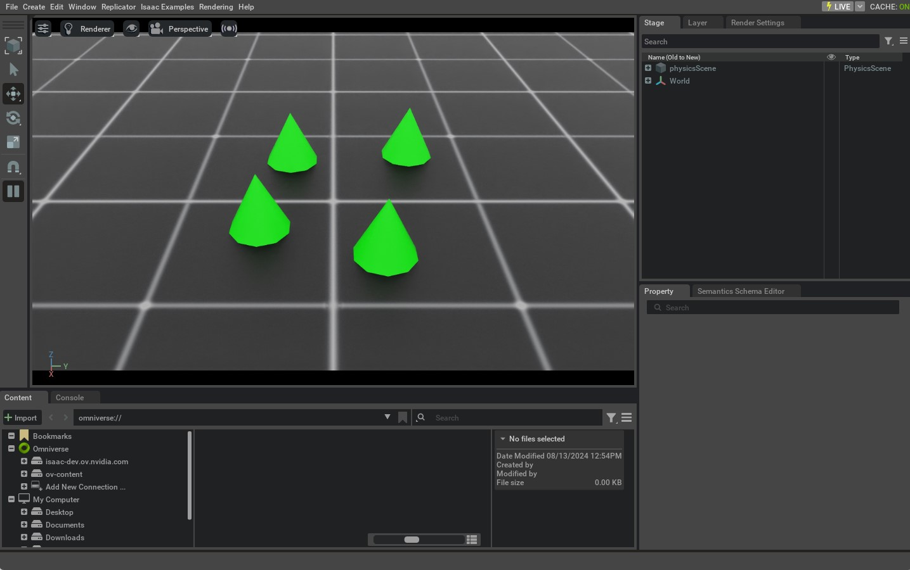

# 与刚体物体交互

在前面的教程中，我们学习了独立脚本的基本工作方式，以及如何将不同的对象（或 *prims*）生成到仿真中。本教程将展示如何创建并与一个刚体物体交互。为此，我们将使用 Isaac Lab 提供的 `assets.RigidObject` 类。

## 代码

本教程对应的是 `scripts/tutorials/01_assets` 目录下的 `run_rigid_object.py` 脚本。

```python
# Copyright (c) 2022-2025, The Isaac Lab Project Developers (https://github.com/isaac-sim/IsaacLab/blob/main/CONTRIBUTORS.md).
# All rights reserved.
#
# SPDX-License-Identifier: BSD-3-Clause

"""
This script demonstrates how to create a rigid object and interact with it.

.. code-block:: bash

    # Usage
    ./isaaclab.sh -p scripts/tutorials/01_assets/run_rigid_object.py

"""

"""Launch Isaac Sim Simulator first."""

import argparse

from isaaclab.app import AppLauncher

# add argparse arguments
parser = argparse.ArgumentParser(description="Tutorial on spawning and interacting with a rigid object.")
# append AppLauncher cli args
AppLauncher.add_app_launcher_args(parser)
# parse the arguments
args_cli = parser.parse_args()

# launch omniverse app
app_launcher = AppLauncher(args_cli)
simulation_app = app_launcher.app

"""Rest everything follows."""

import torch

import isaaclab.sim as sim_utils
import isaaclab.sim.utils.prims as prim_utils
import isaaclab.utils.math as math_utils
from isaaclab.assets import RigidObject, RigidObjectCfg
from isaaclab.sim import SimulationContext

def design_scene():
    """Designs the scene."""
    # Ground-plane
    cfg = sim_utils.GroundPlaneCfg()
    cfg.func("/World/defaultGroundPlane", cfg)
    # Lights
    cfg = sim_utils.DomeLightCfg(intensity=2000.0, color=(0.8, 0.8, 0.8))
    cfg.func("/World/Light", cfg)

    # Create separate groups called "Origin1", "Origin2", "Origin3"
    # Each group will have a robot in it
    origins = [[0.25, 0.25, 0.0], [-0.25, 0.25, 0.0], [0.25, -0.25, 0.0], [-0.25, -0.25, 0.0]]
    for i, origin in enumerate(origins):
        prim_utils.create_prim(f"/World/Origin{i}", "Xform", translation=origin)

    # Rigid Object
    cone_cfg = RigidObjectCfg(
        prim_path="/World/Origin.*/Cone",
        spawn=sim_utils.ConeCfg(
            radius=0.1,
            height=0.2,
            rigid_props=sim_utils.RigidBodyPropertiesCfg(),
            mass_props=sim_utils.MassPropertiesCfg(mass=1.0),
            collision_props=sim_utils.CollisionPropertiesCfg(),
            visual_material=sim_utils.PreviewSurfaceCfg(diffuse_color=(0.0, 1.0, 0.0), metallic=0.2),
        ),
        init_state=RigidObjectCfg.InitialStateCfg(),
    )
    cone_object = RigidObject(cfg=cone_cfg)

    # return the scene information
    scene_entities = {"cone": cone_object}
    return scene_entities, origins

def run_simulator(sim: sim_utils.SimulationContext, entities: dict[str, RigidObject], origins: torch.Tensor):
    """Runs the simulation loop."""
    # Extract scene entities
    # note: we only do this here for readability. In general, it is better to access the entities directly from
    #   the dictionary. This dictionary is replaced by the InteractiveScene class in the next tutorial.
    cone_object = entities["cone"]
    # Define simulation stepping
    sim_dt = sim.get_physics_dt()
    sim_time = 0.0
    count = 0
    # Simulate physics
    while simulation_app.is_running():
        # reset
        if count % 250 == 0:
            # reset counters
            sim_time = 0.0
            count = 0
            # reset root state
            root_state = cone_object.data.default_root_state.clone()
            # sample a random position on a cylinder around the origins
            root_state[:, :3] += origins
            root_state[:, :3] += math_utils.sample_cylinder(
                radius=0.1, h_range=(0.25, 0.5), size=cone_object.num_instances, device=cone_object.device
            )
            # write root state to simulation
            cone_object.write_root_pose_to_sim(root_state[:, :7])
            cone_object.write_root_velocity_to_sim(root_state[:, 7:])
            # reset buffers
            cone_object.reset()
            print("----------------------------------------")
            print("[INFO]: Resetting object state...")
        # apply sim data
        cone_object.write_data_to_sim()
        # perform step
        sim.step()
        # update sim-time
        sim_time += sim_dt
        count += 1
        # update buffers
        cone_object.update(sim_dt)
        # print the root position
        if count % 50 == 0:
            print(f"Root position (in world): {cone_object.data.root_pos_w}")

def main():
    """Main function."""
    # Load kit helper
    sim_cfg = sim_utils.SimulationCfg(device=args_cli.device)
    sim = SimulationContext(sim_cfg)
    # Set main camera
    sim.set_camera_view(eye=[1.5, 0.0, 1.0], target=[0.0, 0.0, 0.0])
    # Design scene
    scene_entities, scene_origins = design_scene()
    scene_origins = torch.tensor(scene_origins, device=sim.device)
    # Play the simulator
    sim.reset()
    # Now we are ready!
    print("[INFO]: Setup complete...")
    # Run the simulator
    run_simulator(sim, scene_entities, scene_origins)

if __name__ == "__main__":
    # run the main function
    main()
    # close sim app
    simulation_app.close()
```

## 代码讲解

在这个脚本中，我们把 `main` 函数拆分为两个独立的函数，用来突出在仿真器中设置任何仿真时的两个主要步骤：

1. **设计场景**：顾名思义，这一部分负责把所有 prim 添加到场景中。
2. **运行仿真**：这一部分负责对仿真器进行步进，并与场景中的 prim 交互，例如改变它们的位姿，以及向它们施加任何命令。

区分这两步是必要的，因为第二步只会在第一步完成并且仿真器被重置之后才会发生。一旦仿真器被重置（它会自动开始播放仿真），就不应该再向场景中添加新的（启用物理的）prim，因为这可能导致不可预期的行为。不过，可以通过各自的句柄（handle）与这些 prim 进行交互。

### 设计场景

与上一节教程类似，我们用地面平面和光源来填充场景。此外，我们使用 `assets.RigidObject` 类向场景中添加一个刚体物体。该类负责在输入路径处生成 prim，并初始化它们对应的刚体物理句柄。

在本教程中，我们使用与 “生成对象（Spawn Objects）” 教程中刚体圆锥类似的 spawn 配置，创建一个圆锥形的刚体物体。唯一的区别是：现在我们把生成配置封装进 `assets.RigidObjectCfg` 类中。该类包含资产的生成策略、默认初始状态以及其他元信息。当把这个类传给 `assets.RigidObject` 类时，它会生成该对象，并在仿真开始播放时初始化相应的物理句柄。

作为一个“多次生成刚体物体 prim”的例子，我们创建它的父级 Xform prim： `/World/Origin{i}` ，它们对应不同的生成位置。当把正则表达式 `/World/Origin.*/Cone` 传给 `assets.RigidObject` 类时，它会在每个 `/World/Origin{i}` 位置处生成刚体物体 prim。例如，如果场景中存在 `/World/Origin1` 和 `/World/Origin2` ，那么刚体物体 prim 将分别生成在 `/World/Origin1/Cone` 和 `/World/Origin2/Cone` 。

```python
    # Create separate groups called "Origin1", "Origin2", "Origin3"
    # Each group will have a robot in it
    origins = [[0.25, 0.25, 0.0], [-0.25, 0.25, 0.0], [0.25, -0.25, 0.0], [-0.25, -0.25, 0.0]]
    for i, origin in enumerate(origins):
        prim_utils.create_prim(f"/World/Origin{i}", "Xform", translation=origin)

    # Rigid Object
    cone_cfg = RigidObjectCfg(
        prim_path="/World/Origin.*/Cone",
        spawn=sim_utils.ConeCfg(
            radius=0.1,
            height=0.2,
            rigid_props=sim_utils.RigidBodyPropertiesCfg(),
            mass_props=sim_utils.MassPropertiesCfg(mass=1.0),
            collision_props=sim_utils.CollisionPropertiesCfg(),
            visual_material=sim_utils.PreviewSurfaceCfg(diffuse_color=(0.0, 1.0, 0.0), metallic=0.2),
        ),
        init_state=RigidObjectCfg.InitialStateCfg(),
    )
    cone_object = RigidObject(cfg=cone_cfg)
```

由于我们希望与刚体物体交互，我们把这个实体返回给主函数。随后，在仿真循环中将使用该实体与刚体物体交互。在后续教程中，我们将看到一种更便捷的方式：使用 `scene.InteractiveScene` 类来处理多个场景实体。

```python
    # return the scene information
    scene_entities = {"cone": cone_object}
    return scene_entities, origins
```

### 运行仿真循环

我们对仿真循环做了修改，以便与刚体物体交互，包含三个步骤——以固定间隔重置仿真状态、步进仿真，以及更新刚体物体的内部缓冲。为了便于本教程讲解，我们从场景字典中取出刚体物体的实体，并将其存入一个变量。

#### 重置仿真状态

为了重置已生成的刚体物体 prim 的仿真状态，我们需要设置它们的位姿和速度。二者共同定义了这些刚体物体的根状态（root state）。需要注意的是，这个状态是定义在**仿真世界坐标系（simulation world frame）**下的，而不是定义在它们父级 Xform prim 的坐标系下。这是因为物理引擎只理解世界坐标系，而不理解父级 Xform prim 的坐标系。因此，在设置状态之前，我们需要把刚体物体 prim 的期望状态转换到世界坐标系中。

我们使用 `assets.RigidObject.data.default_root_state` 属性来获取已生成刚体物体 prim 的默认根状态。这个默认状态可以通过 `assets.RigidObjectCfg.init_state` 属性进行配置；在本教程中我们把它保留为单位（identity）状态。然后我们对根状态的平移进行随机化，并使用 `assets.RigidObject.write_root_pose_to_sim` 与 `assets.RigidObject.write_root_velocity_to_sim` 方法来设置刚体物体 prim 的期望状态。顾名思义，该方法会把刚体物体 prim 的根状态写入仿真缓冲区。

```python
            # reset root state
            root_state = cone_object.data.default_root_state.clone()
            # sample a random position on a cylinder around the origins
            root_state[:, :3] += origins
            root_state[:, :3] += math_utils.sample_cylinder(
                radius=0.1, h_range=(0.25, 0.5), size=cone_object.num_instances, device=cone_object.device
            )
            # write root state to simulation
            cone_object.write_root_pose_to_sim(root_state[:, :7])
            cone_object.write_root_velocity_to_sim(root_state[:, 7:])
            # reset buffers
            cone_object.reset()
```

#### 步进仿真

在步进仿真之前，我们调用 `assets.RigidObject.write_data_to_sim` 方法。该方法会把其他数据（例如外力）写入仿真缓冲区。在本教程中，我们并没有对刚体物体施加任何外力，因此这个方法并非必需。不过，为了完整性起见，仍将其保留。

```python
        # apply sim data
        cone_object.write_data_to_sim()
```

#### 更新状态

在步进仿真之后，我们更新刚体物体 prim 的内部缓冲，使其在 `assets.RigidObject.data` 属性中反映新的状态。这通过调用 `assets.RigidObject.update` 方法实现。

```python
        # update buffers
        cone_object.update(sim_dt)
```

## 运行代码

现在我们已经过了一遍代码，让我们运行脚本并查看结果：

```bash
./isaaclab.sh -p scripts/tutorials/01_assets/run_rigid_object.py
```

这应该会打开一个包含地面平面、光照以及若干绿色圆锥的场景。圆锥会从随机高度落下并最终在地面上稳定下来。要停止仿真，你可以关闭窗口，或点击 UI 中的 `STOP` 按钮，或在终端按下 `Ctrl+C` 。



本教程展示了如何生成刚体对象，并把它们封装到 `RigidObject` 类中，以初始化它们的物理句柄；这样就可以设置并获取它们的状态。在下一节教程中，我们将了解如何与一个关节连接的刚体集合（即关节物体 / articulated object）交互。
