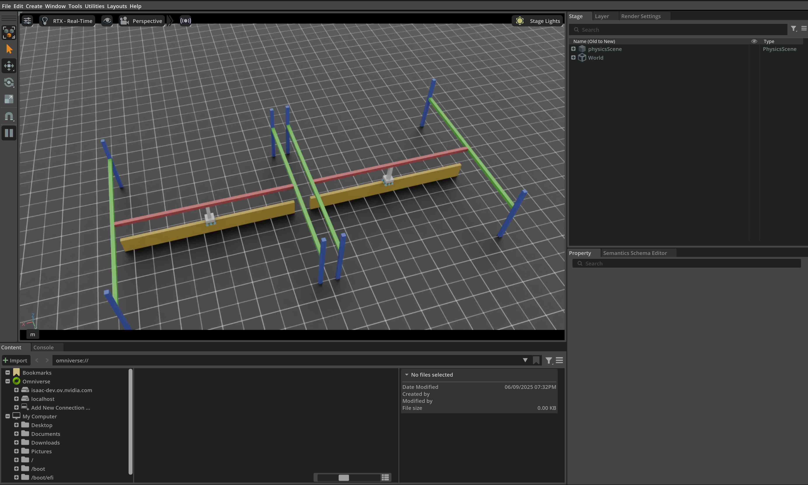

# 与表面夹爪（Surface Gripper）交互

本教程演示如何在仿真中与“末端执行器上装有表面夹爪（surface gripper）”的关节式机器人（articulated robot）交互。它是“与关节系统（Articulation）交互（tutorial-interact-articulation）”教程的延续：在上一节中，我们学习了如何与关节式机器人交互。

需要注意的是：从 IsaacSim 5.0 开始，**surface gripper 仅在 CPU 后端支持**。

## 代码

本教程对应 `scripts/tutorials/01_assets` 目录下的 `run_surface_gripper.py` 脚本。

```python
# Copyright (c) 2022-2025, The Isaac Lab Project Developers (https://github.com/isaac-sim/IsaacLab/blob/main/CONTRIBUTORS.md).
# All rights reserved.
#
# SPDX-License-Identifier: BSD-3-Clause

"""This script demonstrates how to spawn a pick-and-place robot equipped with a surface gripper and interact with it.

.. code-block:: bash

    # Usage
    ./isaaclab.sh -p scripts/tutorials/01_assets/run_surface_gripper.py --device=cpu

When running this script make sure the --device flag is set to cpu. This is because the surface gripper is
currently only supported on the CPU.
"""

"""Launch Isaac Sim Simulator first."""

import argparse

from isaaclab.app import AppLauncher

# add argparse arguments
parser = argparse.ArgumentParser(description="Tutorial on spawning and interacting with a Surface Gripper.")
# append AppLauncher cli args
AppLauncher.add_app_launcher_args(parser)
# parse the arguments
args_cli = parser.parse_args()

# launch omniverse app
app_launcher = AppLauncher(args_cli)
simulation_app = app_launcher.app

"""Rest everything follows."""

import torch

import isaaclab.sim as sim_utils
import isaaclab.sim.utils.prims as prim_utils
from isaaclab.assets import Articulation, SurfaceGripper, SurfaceGripperCfg
from isaaclab.sim import SimulationContext

##
# Pre-defined configs
##
from isaaclab_assets import PICK_AND_PLACE_CFG  # isort:skip

def design_scene():
    """Designs the scene."""
    # Ground-plane
    cfg = sim_utils.GroundPlaneCfg()
    cfg.func("/World/defaultGroundPlane", cfg)
    # Lights
    cfg = sim_utils.DomeLightCfg(intensity=3000.0, color=(0.75, 0.75, 0.75))
    cfg.func("/World/Light", cfg)

    # Create separate groups called "Origin1", "Origin2"
    # Each group will have a robot in it
    origins = [[2.75, 0.0, 0.0], [-2.75, 0.0, 0.0]]
    # Origin 1
    prim_utils.create_prim("/World/Origin1", "Xform", translation=origins[0])
    # Origin 2
    prim_utils.create_prim("/World/Origin2", "Xform", translation=origins[1])

    # Articulation: First we define the robot config
    pick_and_place_robot_cfg = PICK_AND_PLACE_CFG.copy()
    pick_and_place_robot_cfg.prim_path = "/World/Origin.*/Robot"
    pick_and_place_robot = Articulation(cfg=pick_and_place_robot_cfg)

    # Surface Gripper: Next we define the surface gripper config
    surface_gripper_cfg = SurfaceGripperCfg()
    # We need to tell the View which prim to use for the surface gripper
    surface_gripper_cfg.prim_path = "/World/Origin.*/Robot/picker_head/SurfaceGripper"
    # We can then set different parameters for the surface gripper, note that if these parameters are not set,
    # the View will try to read them from the prim.
    surface_gripper_cfg.max_grip_distance = 0.1  # [m] (Maximum distance at which the gripper can grasp an object)
    surface_gripper_cfg.shear_force_limit = 500.0  # [N] (Force limit in the direction perpendicular direction)
    surface_gripper_cfg.coaxial_force_limit = 500.0  # [N] (Force limit in the direction of the gripper's axis)
    surface_gripper_cfg.retry_interval = 0.1  # seconds (Time the gripper will stay in a grasping state)
    # We can now spawn the surface gripper
    surface_gripper = SurfaceGripper(cfg=surface_gripper_cfg)

    # return the scene information
    scene_entities = {"pick_and_place_robot": pick_and_place_robot, "surface_gripper": surface_gripper}
    return scene_entities, origins

def run_simulator(

    sim: sim_utils.SimulationContext, entities: dict[str, Articulation | SurfaceGripper], origins: torch.Tensor
):
    """Runs the simulation loop."""
    # Extract scene entities
    robot: Articulation = entities["pick_and_place_robot"]
    surface_gripper: SurfaceGripper = entities["surface_gripper"]

    # Define simulation stepping
    sim_dt = sim.get_physics_dt()
    count = 0
    # Simulation loop
    while simulation_app.is_running():
        # Reset
        if count % 500 == 0:
            # reset counter
            count = 0
            # reset the scene entities
            # root state
            # we offset the root state by the origin since the states are written in simulation world frame
            # if this is not done, then the robots will be spawned at the (0, 0, 0) of the simulation world
            root_state = robot.data.default_root_state.clone()
            root_state[:, :3] += origins
            robot.write_root_pose_to_sim(root_state[:, :7])
            robot.write_root_velocity_to_sim(root_state[:, 7:])
            # set joint positions with some noise
            joint_pos, joint_vel = robot.data.default_joint_pos.clone(), robot.data.default_joint_vel.clone()
            joint_pos += torch.rand_like(joint_pos) * 0.1
            robot.write_joint_state_to_sim(joint_pos, joint_vel)
            # clear internal buffers
            robot.reset()
            print("[INFO]: Resetting robot state...")
            # Opens the gripper and makes sure the gripper is in the open state
            surface_gripper.reset()
            print("[INFO]: Resetting gripper state...")

        # Sample a random command between -1 and 1.
        gripper_commands = torch.rand(surface_gripper.num_instances) * 2.0 - 1.0
        # The gripper behavior is as follows:
        # -1 < command < -0.3 --> Gripper is Opening
        # -0.3 < command < 0.3 --> Gripper is Idle
        # 0.3 < command < 1 --> Gripper is Closing
        print(f"[INFO]: Gripper commands: {gripper_commands}")
        mapped_commands = [
            "Opening" if command < -0.3 else "Closing" if command > 0.3 else "Idle" for command in gripper_commands
        ]
        print(f"[INFO]: Mapped commands: {mapped_commands}")
        # Set the gripper command
        surface_gripper.set_grippers_command(gripper_commands)
        # Write data to sim
        surface_gripper.write_data_to_sim()
        # Perform step
        sim.step()
        # Increment counter
        count += 1
        # Read the gripper state from the simulation
        surface_gripper.update(sim_dt)
        # Read the gripper state from the buffer
        surface_gripper_state = surface_gripper.state
        # The gripper state is a list of integers that can be mapped to the following:
        # -1 --> Open
        # 0 --> Closing
        # 1 --> Closed
        # Print the gripper state
        print(f"[INFO]: Gripper state: {surface_gripper_state}")
        mapped_commands = [
            "Open" if state == -1 else "Closing" if state == 0 else "Closed" for state in surface_gripper_state.tolist()
        ]
        print(f"[INFO]: Mapped commands: {mapped_commands}")

def main():

    """Main function."""
    # Load kit helper
    sim_cfg = sim_utils.SimulationCfg(device=args_cli.device)
    sim = SimulationContext(sim_cfg)
    # Set main camera
    sim.set_camera_view([2.75, 7.5, 10.0], [2.75, 0.0, 0.0])
    # Design scene
    scene_entities, scene_origins = design_scene()
    scene_origins = torch.tensor(scene_origins, device=sim.device)
    # Play the simulator
    sim.reset()
    # Now we are ready!
    print("[INFO]: Setup complete...")
    # Run the simulator
    run_simulator(sim, scene_entities, scene_origins)

if __name__ == "__main__":
    # run the main function
    main()
    # close sim app
    simulation_app.close()
```

## 代码讲解

### 设计场景

与上一节教程类似，我们先在场景中加入地面与远处光源（distant light），随后从 USD 文件生成一个关节系统（articulation）。这一次生成的是一个取放（pick-and-place）机器人：它是一个具有 3 个驱动轴的简易机器人，龙门（gantry）结构使其能沿 x、y 方向移动，并可沿 z 方向上下运动。与此同时，机器人的末端执行器上还安装了一个表面夹爪（surface gripper）。

取放机器人的 USD 文件除了包含几何、关节与其他物理属性之外，也包含表面夹爪的相关内容。在你将类似夹爪集成到自己的机器人之前，建议先查看 IsaacLab Nucleus 上该夹爪对应的 USD 文件作为参考。

对于取放机器人，我们使用其预定义的配置对象（更多背景可参考 “how-to-write-articulation-config” 教程）。而对于表面夹爪，我们同样需要创建一个配置对象：通过实例化 `assets.SurfaceGripperCfg` 并填写必要参数即可。

可用参数包括：

* `max_grip_distance`：夹爪能够抓取物体的最大距离。
* `shear_force_limit`：夹爪轴线的**垂直方向**可施加的最大力。
* `coaxial_force_limit`：沿夹爪轴线方向可施加的最大力。
* `retry_interval`：夹爪保持“抓取尝试”状态的时间。

与上一节一致，我们通过将配置对象传给 `assets.Articulation` 构造函数来生成关节系统。表面夹爪也遵循相同原则：把 `assets.SurfaceGripperCfg` 传给 `assets.SurfaceGripper` 构造函数即可创建夹爪并加入场景。需要注意的是：在实际运行中，对象通常会在按下 play 后才完成初始化。

```python
# Create separate groups called "Origin1", "Origin2"
# Each group will have a robot in it
origins = [[2.75, 0.0, 0.0], [-2.75, 0.0, 0.0]]
# Origin 1
prim_utils.create_prim("/World/Origin1", "Xform", translation=origins[0])
# Origin 2
prim_utils.create_prim("/World/Origin2", "Xform", translation=origins[1])

# Articulation: First we define the robot config
pick_and_place_robot_cfg = PICK_AND_PLACE_CFG.copy()
pick_and_place_robot_cfg.prim_path = "/World/Origin.*/Robot"
pick_and_place_robot = Articulation(cfg=pick_and_place_robot_cfg)

# Surface Gripper: Next we define the surface gripper config
surface_gripper_cfg = SurfaceGripperCfg()
surface_gripper_cfg.prim_path = "/World/Origin.*/Robot/picker_head/SurfaceGripper"
surface_gripper_cfg.max_grip_distance = 0.1
surface_gripper_cfg.shear_force_limit = 500.0
surface_gripper_cfg.coaxial_force_limit = 500.0
surface_gripper_cfg.retry_interval = 0.1
surface_gripper = SurfaceGripper(cfg=surface_gripper_cfg)
```

### 运行仿真循环

延续上一节教程，我们会以固定间隔重置仿真，为机器人设置指令，推进仿真步进，并更新内部缓冲区。

#### 重置仿真

重置表面夹爪只需调用 `SurfaceGripper.reset` ，即可重置其内部缓冲与缓存。

```python
# Opens the gripper and makes sure the gripper is in the open state
surface_gripper.reset()
```

#### 推进仿真（Stepping）

给表面夹爪施加命令一般分两步：

1. **设置期望命令**：设置夹爪期望行为（Open / Close / Idle）。
2. **写入仿真**：根据夹爪配置，将数据写入 PhysX 缓冲区。

本教程中，我们随机采样一个命令值来驱动夹爪。夹爪行为映射关系如下：

* $-1 < command < -0.3$：夹爪处于“打开中（Opening）”
* $-0.3 < command < 0.3$：夹爪处于“空闲（Idle）”
* $0.3 < command < 1$：夹爪处于“闭合中（Closing）”

每个仿真步，我们会随机采样命令并通过 `SurfaceGripper.set_grippers_command` 设置到夹爪，然后调用 `SurfaceGripper.write_data_to_sim` 写入 PhysX 缓冲区，最后推进仿真。

```python
# Sample a random command between -1 and 1.
gripper_commands = torch.rand(surface_gripper.num_instances) * 2.0 - 1.0

# Set the gripper command
surface_gripper.set_grippers_command(gripper_commands)

# Write data to sim
surface_gripper.write_data_to_sim()
```

#### 更新状态

要获取表面夹爪的当前状态，可以查询 `assets.SurfaceGripper.state` 属性。它返回一个形状为 `[num_envs]` 的张量，其中每个元素取值为 `-1` 、 `0` 或 `1` ，分别对应不同的夹爪状态。该属性会在每次调用 `assets.SurfaceGripper.update` 时更新。

* `-1`：夹爪已打开（Open）
* `0`：夹爪闭合中（Closing）
* `1`：夹爪已闭合（Closed）

```python
# Read the gripper state from the simulation
surface_gripper.update(sim_dt)

# Read the gripper state from the buffer
surface_gripper_state = surface_gripper.state
```

## 运行方式

要运行脚本并查看效果，在终端执行：

```bash
./isaaclab.sh -p scripts/tutorials/01_assets/run_surface_gripper.py --device cpu
```

该命令会打开一个包含地面、灯光与两台取放机器人的场景。终端会持续打印夹爪状态与命令。要停止仿真，可以关闭窗口，或在终端按下 `Ctrl+C` 。



本教程中，我们学习了如何创建并与表面夹爪交互：包括如何设置命令、如何查询夹爪状态，以及如何更新缓冲区以读取最新状态。

此外，我们还提供了一些用于生成不同机器人的脚本，位于 `scripts/demos` 目录。例如：

```bash
# Spawn many pick-and-place robots and perform a pick-and-place task
./isaaclab.sh -p scripts/demos/pick_and_place.py
```

需要补充说明的是：在实际工程中，通常会把 `assets.SurfaceGripper` 实例注册到 `isaaclab.InteractiveScene` 中，由它自动管理 `assets.SurfaceGripper.write_data_to_sim` 与 `assets.SurfaceGripper.update` 的调用。

```python
# Create a scene
scene = InteractiveScene()

# Register the surface gripper
scene.surface_grippers["gripper"] = surface_gripper
```
