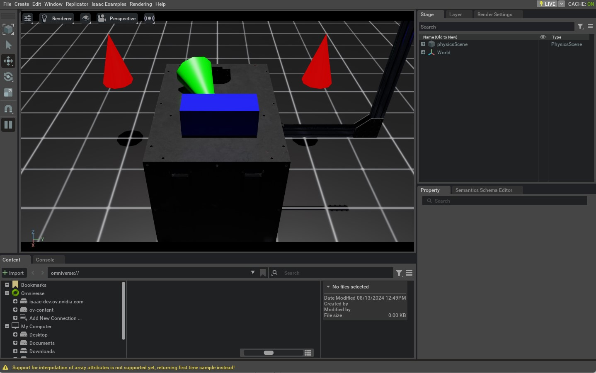

# 在场景中生成 Prim（Spawning Prims）

本教程介绍如何在 Isaac Lab 中通过 Python 向场景（stage）中生成（spawn）各种对象（也称 prim）。它基于上一节“使用独立脚本运行仿真器”的内容，进一步演示如何生成：地面、灯光、基础几何体，以及从 USD 文件加载的网格（mesh）资产。

## 代码

本教程对应脚本 `spawn_prims.py` ，位于 `scripts/tutorials/00_sim` 目录。

```python
# Copyright (c) 2022-2025, The Isaac Lab Project Developers (https://github.com/isaac-sim/IsaacLab/blob/main/CONTRIBUTORS.md).
# All rights reserved.
#
# SPDX-License-Identifier: BSD-3-Clause

"""This script demonstrates how to spawn prims into the scene.

.. code-block:: bash

    # Usage
    ./isaaclab.sh -p scripts/tutorials/00_sim/spawn_prims.py

"""

"""Launch Isaac Sim Simulator first."""

import argparse

from isaaclab.app import AppLauncher

# create argparser
parser = argparse.ArgumentParser(description="Tutorial on spawning prims into the scene.")
# append AppLauncher cli args
AppLauncher.add_app_launcher_args(parser)
# parse the arguments
args_cli = parser.parse_args()
# launch omniverse app
app_launcher = AppLauncher(args_cli)
simulation_app = app_launcher.app

"""Rest everything follows."""

import isaaclab.sim as sim_utils
import isaaclab.sim.utils.prims as prim_utils
from isaaclab.utils.assets import ISAAC_NUCLEUS_DIR

def design_scene():
    """Designs the scene by spawning ground plane, light, objects and meshes from usd files."""
    # Ground-plane
    cfg_ground = sim_utils.GroundPlaneCfg()
    cfg_ground.func("/World/defaultGroundPlane", cfg_ground)

    # spawn distant light
    cfg_light_distant = sim_utils.DistantLightCfg(
        intensity=3000.0,
        color=(0.75, 0.75, 0.75),
    )
    cfg_light_distant.func("/World/lightDistant", cfg_light_distant, translation=(1, 0, 10))

    # create a new xform prim for all objects to be spawned under
    prim_utils.create_prim("/World/Objects", "Xform")
    # spawn a red cone
    cfg_cone = sim_utils.ConeCfg(
        radius=0.15,
        height=0.5,
        visual_material=sim_utils.PreviewSurfaceCfg(diffuse_color=(1.0, 0.0, 0.0)),
    )
    cfg_cone.func("/World/Objects/Cone1", cfg_cone, translation=(-1.0, 1.0, 1.0))
    cfg_cone.func("/World/Objects/Cone2", cfg_cone, translation=(-1.0, -1.0, 1.0))

    # spawn a green cone with colliders and rigid body
    cfg_cone_rigid = sim_utils.ConeCfg(
        radius=0.15,
        height=0.5,
        rigid_props=sim_utils.RigidBodyPropertiesCfg(),
        mass_props=sim_utils.MassPropertiesCfg(mass=1.0),
        collision_props=sim_utils.CollisionPropertiesCfg(),
        visual_material=sim_utils.PreviewSurfaceCfg(diffuse_color=(0.0, 1.0, 0.0)),
    )
    cfg_cone_rigid.func(
        "/World/Objects/ConeRigid", cfg_cone_rigid, translation=(-0.2, 0.0, 2.0), orientation=(0.5, 0.0, 0.5, 0.0)
    )

    # spawn a blue cuboid with deformable body
    cfg_cuboid_deformable = sim_utils.MeshCuboidCfg(
        size=(0.2, 0.5, 0.2),
        deformable_props=sim_utils.DeformableBodyPropertiesCfg(),
        visual_material=sim_utils.PreviewSurfaceCfg(diffuse_color=(0.0, 0.0, 1.0)),
        physics_material=sim_utils.DeformableBodyMaterialCfg(),
    )
    cfg_cuboid_deformable.func("/World/Objects/CuboidDeformable", cfg_cuboid_deformable, translation=(0.15, 0.0, 2.0))

    # spawn a usd file of a table into the scene
    cfg = sim_utils.UsdFileCfg(usd_path=f"{ISAAC_NUCLEUS_DIR}/Props/Mounts/SeattleLabTable/table_instanceable.usd")
    cfg.func("/World/Objects/Table", cfg, translation=(0.0, 0.0, 1.05))

def main():
    """Main function."""

    # Initialize the simulation context
    sim_cfg = sim_utils.SimulationCfg(dt=0.01, device=args_cli.device)
    sim = sim_utils.SimulationContext(sim_cfg)
    # Set main camera
    sim.set_camera_view([2.0, 0.0, 2.5], [-0.5, 0.0, 0.5])
    # Design scene
    design_scene()
    # Play the simulator
    sim.reset()
    # Now we are ready!
    print("[INFO]: Setup complete...")

    # Simulate physics
    while simulation_app.is_running():
        # perform step
        sim.step()

if __name__ == "__main__":
    # run the main function
    main()
    # close sim app
    simulation_app.close()
```

## 代码解析

在 Omniverse 中进行场景设计，核心围绕 USD（Universal Scene Description）这一软件体系与文件格式展开。USD 支持以层级化的方式描述三维场景，形式上很像文件系统目录树。USD 本身是一个覆盖面很广的框架，建议阅读官方的 [USD 文档](https://graphics.pixar.com/usd/docs/index.html) 以深入了解。

为了让本教程自洽，这里先简要介绍几个必须掌握的 USD 概念：

* **Primitives（Prims）**：USD 场景的基本构建单元，可理解为场景图（scene graph）中的节点。每个节点可以是网格、灯光、相机、变换（transform），也可以是一个包含多个子 prim 的“组”。
* **Attributes（属性）**：prim 的属性，可类比为键值对。例如，一个 prim 可以有名为 `color` 的属性，其值为 `red`。
* **Relationships（关系）**：prim 之间的连接关系，可类比为指向其他 prim 的“指针”。例如，一个 mesh prim 可以通过 relationship 关联到 material prim，用于着色（shading）。

由这些 prim 及其属性、关系组成的整体称为 **USD stage**。可以把它理解为“场景容器”：当我们说“在设计场景”时，本质上是在编辑这份 stage。

虽然直接使用 USD 的底层 API 非常灵活，但学习与使用成本也更高。为降低门槛，Isaac Lab 在 USD API 之上提供了**配置驱动（configuration-driven）**的 prim 生成接口，相关内容集中在 `sim.spawners` 模块中。

在 Isaac Lab 中生成 prim 时，通常需要：

1. 创建一个配置类实例（用于描述 prim 的属性与关系，例如材质/着色信息等）
2. 将该配置传入对应的 spawner 函数，并指定 prim 的路径、名字，以及位姿/缩放等变换参数

整体流程可以概括为：

```python
# 创建配置对象
cfg = MyPrimCfg()
prim_path = "/path/to/prim"

# 通过对应的 spawner 函数生成 prim
spawn_my_prim(
    prim_path,
    cfg,
    translation=[0, 0, 0],
    orientation=[1, 0, 0, 0],
    scale=[1, 1, 1],
)

# 或者：直接使用配置对象中绑定的 func
cfg.func(
    prim_path,
    cfg,
    translation=[0, 0, 0],
    orientation=[1, 0, 0, 0],
    scale=[1, 1, 1],
)
```

本教程会展示多种 prim 的生成方式。更多可用的 spawner，请参考 Isaac Lab 的 `sim.spawners` 模块。

> 注意：**所有场景设计工作都应在仿真开始前完成**。一旦仿真开始，建议保持场景结构“冻结”，只修改现有 prim 的属性。对 GPU 仿真尤为重要：仿真过程中新增 prim 可能会改变 GPU 上的物理仿真缓冲区（buffers），从而导致不可预期的行为。

### 生成地面（Ground Plane）

`sim.spawners.from_files.GroundPlaneCfg` 可用于配置一个带网格纹理的地面，并可调整外观、尺寸等属性。

```python
    # Ground-plane
    cfg_ground = sim_utils.GroundPlaneCfg()
    cfg_ground.func("/World/defaultGroundPlane", cfg_ground)
```

### 生成灯光（Lights）

你可以在 stage 中生成不同类型的 light prim（例如 distant light、sphere light、disk light、cylinder light 等）。本教程生成的是 **distant light**：可以理解为来自无限远处、沿单一方向照射的光源。

关于不同光源类型的直观介绍，可参考视频链接：[different light prims](https://youtu.be/c7qyI8pZvF4?feature=shared)。

```python
    # spawn distant light
    cfg_light_distant = sim_utils.DistantLightCfg(
        intensity=3000.0,
        color=(0.75, 0.75, 0.75),
    )
    cfg_light_distant.func("/World/lightDistant", cfg_light_distant, translation=(1, 0, 10))
```

### 生成基础几何体（Primitive Shapes）

在生成几何体之前，需要先理解 **Transform prim（Xform）** 的概念。Xform prim 仅包含变换属性（位姿/缩放等），常用于把多个子 prim 组织到同一父节点下，从而可以作为一个整体被移动或变换。

在脚本中，会先创建一个 Xform prim（例如 `/World/Objects` ），把后续生成的基础几何体统一放在这个节点下面。

```python
    # create a new xform prim for all objects to be spawned under
    prim_utils.create_prim("/World/Objects", "Xform")
```

接下来会使用 `sim.spawners.shapes.ConeCfg` 生成圆锥（cone）。你可以指定圆锥的半径、高度、物理属性与材质属性等；默认情况下，物理与材质相关配置是关闭的。

脚本中首先生成的两个圆锥（例如 `Cone1` 、 `Cone2` ）仅用于可视化，**不启用物理**。

```python
    # spawn a red cone
    cfg_cone = sim_utils.ConeCfg(
        radius=0.15,
        height=0.5,
        visual_material=sim_utils.PreviewSurfaceCfg(diffuse_color=(1.0, 0.0, 0.0)),
    )
    cfg_cone.func("/World/Objects/Cone1", cfg_cone, translation=(-1.0, 1.0, 1.0))
    cfg_cone.func("/World/Objects/Cone2", cfg_cone, translation=(-1.0, -1.0, 1.0))
```

随后会生成第三个圆锥（例如 `ConeRigid` ），并在配置中启用刚体（rigid body）物理属性。通过这些属性可以设置质量、摩擦系数、恢复系数等；若不指定，则使用 USD Physics 的默认值。

```python
    # spawn a green cone with colliders and rigid body
    cfg_cone_rigid = sim_utils.ConeCfg(
        radius=0.15,
        height=0.5,
        rigid_props=sim_utils.RigidBodyPropertiesCfg(),
        mass_props=sim_utils.MassPropertiesCfg(mass=1.0),
        collision_props=sim_utils.CollisionPropertiesCfg(),
        visual_material=sim_utils.PreviewSurfaceCfg(diffuse_color=(0.0, 1.0, 0.0)),
    )
    cfg_cone_rigid.func(
        "/World/Objects/ConeRigid", cfg_cone_rigid, translation=(-0.2, 0.0, 2.0), orientation=(0.5, 0.0, 0.5, 0.0)
    )

```

最后会生成一个包含可变形体（deformable body）物理属性的长方体（例如 `CuboidDeformable` ）。与刚体不同，可变形体允许网格顶点之间发生相对运动，适合模拟布料、橡胶或果冻等“软体”。需要注意：可变形体**仅支持 GPU 仿真**，并且通常要求使用网格对象来启用相应的可变形体物理属性。

```python
    # spawn a blue cuboid with deformable body
    cfg_cuboid_deformable = sim_utils.MeshCuboidCfg(
        size=(0.2, 0.5, 0.2),
        deformable_props=sim_utils.DeformableBodyPropertiesCfg(),
        visual_material=sim_utils.PreviewSurfaceCfg(diffuse_color=(0.0, 0.0, 1.0)),
        physics_material=sim_utils.DeformableBodyMaterialCfg(),
    )
    cfg_cuboid_deformable.func("/World/Objects/CuboidDeformable", cfg_cuboid_deformable, translation=(0.15, 0.0, 2.0))

```

### 从外部文件生成（Spawning from Another File）

除了上述程序化生成的 prim 之外，也可以从其他文件格式生成对象，例如 USD、URDF 或 OBJ 等。本教程会把一个“桌子（table）”的 USD 文件生成到场景中。

该桌子是一个 mesh prim，并关联了材质 prim；这些信息都存储在对应的 USD 文件中。

```python
    # spawn a usd file of a table into the scene
    cfg = sim_utils.UsdFileCfg(usd_path=f"{ISAAC_NUCLEUS_DIR}/Props/Mounts/SeattleLabTable/table_instanceable.usd")
    cfg.func("/World/Objects/Table", cfg, translation=(0.0, 0.0, 1.05))
```

这里的桌子是以 **reference（引用）** 的方式加入场景的。通俗地说：加入 stage 的不是“把资产内容拷贝进来”，而是加入一个指向资产的“引用/指针”。这样做的好处是非破坏性的（non-destructive）：你可以修改桌子资产本身，并让改动在场景中自动体现；例如更换材质时，往往不需要直接修改原始资产文件，而只需在 stage 中记录覆盖（override）信息即可。

## 运行脚本

与上一节教程类似，运行脚本使用：

```bash
./isaaclab.sh -p scripts/tutorials/00_sim/spawn_prims.py
```

仿真启动后，你应该能看到包含地面、灯光、多个圆锥以及桌子的窗口。启用刚体物理的绿色圆锥会下落，并与桌子和地面发生碰撞；其余圆锥仅用于可视化展示，不会运动。停止仿真可以关闭窗口，或在终端按 `Ctrl+C` 。



本教程为在 Isaac Lab 中生成多种 prim 提供了一个基础起点。虽然示例较为简单，但它涵盖了 Isaac Lab 场景设计与 spawner 使用的关键概念。接下来的教程将进一步讲解如何与场景及仿真过程进行交互。
