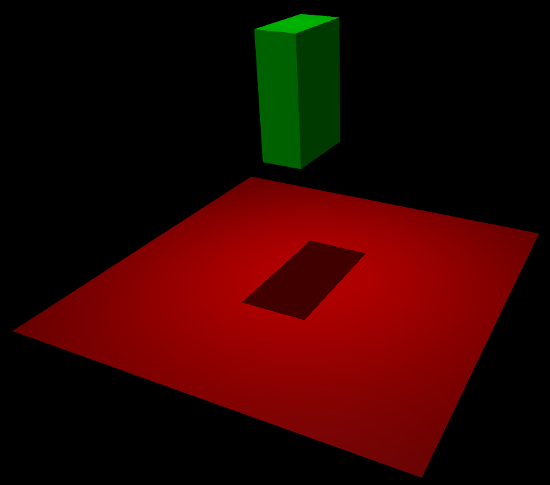
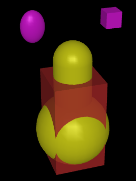

# 概要

## 简介

MuJoCo 是"多关节动力学与接触"(Multi-Joint dynamics with Contact)的缩写。它是一款通用物理引擎，旨在促进机器人学、生物力学、图形和动画、机器学习以及其他需要快速准确模拟关节结构与环境交互的领域的研究与开发。MuJoCo 最初由 Roboti LLC 开发，于2021年10月被 DeepMind 收购并免费提供，并于2022年5月实现开源。MuJoCo 代码库可在 GitHub 的 google-deepmind/mujoco 仓库中获取。

MuJoCo 是一个面向研究人员和开发者的 C/C++ 库，提供 C 语言应用程序接口。其运行时模拟模块经过优化以实现最高性能，并在内置 XML 解析器和编译器预分配的低级数据结构上运行。用户可以使用原生的 MJCF 场景描述语言（一种设计得尽可能人类可读和可编辑的 XML 文件格式）定义模型。该库还支持加载 URDF 模型文件，并包含通过 OpenGL 渲染的原生图形界面进行交互式可视化。此外，MuJoCo 还提供大量用于计算物理相关量的实用功能。

MuJoCo 可用于实现基于模型的计算，如控制合成、状态估计、系统识别、机构设计、通过逆向动力学进行数据分析，以及为机器学习应用进行并行采样。它也可以作为更传统的模拟器使用，包括用于游戏和交互式虚拟环境。

## 核心功能

MuJoCo 具有众多特性，以下是其最显著的功能：

* 广义坐标与现代接触动力学的结合

    传统物理引擎通常分为两类。机器人学和生物力学引擎使用高效且精确的递归算法，基于广义坐标或关节坐标系统。然而，这类引擎要么忽略接触动力学，要么依赖于需要极小时间步长的传统弹簧-阻尼方法。游戏引擎则采用更现代的方法，通过求解优化问题来计算接触力。但它们往往使用过度指定的笛卡尔表示法，通过数值方法施加关节约束，这在复杂的运动结构中会导致不准确性和不稳定性。MuJoCo 是第一个将两种方法优势结合的通用引擎：在广义坐标下进行模拟，同时采用基于优化的接触动力学。其他模拟器最近也开始采用 MuJoCo 的方法，但由于它们的设计初衷不同，这种适配通常无法与其所有功能兼容。习惯于游戏引擎的用户可能会初始觉得广义坐标不太直观，详见下文"说明"部分。

* 柔性、凸性且可解析求逆的接触动力学

    在现代接触动力学方法中，摩擦接触产生的力或冲量通常被定义为线性或非线性互补问题(LCP 或 NCP)的解，这两种问题都是 NP 难的。MuJoCo 基于不同的接触物理学公式，将问题简化为凸优化问题，详见"计算"章节。我们的模型允许柔性接触和其他约束，并具有唯一定义的逆解，便于数据分析和控制应用。用户可选择不同的优化算法，包括一种可处理椭圆摩擦锥的投影高斯-赛德尔方法的推广。求解器统一处理各种约束，包括摩擦接触（含扭转和滚动摩擦）、无摩擦接触、关节和肌腱限制、关节和肌腱中的干摩擦，以及各种等式约束。

* 肌腱几何

    MuJoCo 能够建模肌腱的三维几何结构——这些肌腱是遵循包裹和经由点约束的最小路径长度弦。该机制类似于 OpenSim 中的机制，但实现了更受限的闭合形式包裹选项以加速计算。它还提供机器人学特有的结构，如滑轮和耦合自由度。肌腱可用于驱动，也可用于对肌腱长度施加不等式或等式约束。

* 通用驱动模型

    设计一个足够丰富的驱动模型，同时使用与模型无关的 API 是一项挑战。MuJoCo 通过采用抽象驱动模型实现了这一目标，该模型可以具有不同类型的传动、力生成和内部动态特性（即使整体动力学成为三阶的状态变量）。这些组件可以实例化，以统一的方式建模电机、气动和液压缸、PD 控制器、生物肌肉等多种驱动器。

* 可重构的计算流程

    MuJoCo 有一个顶层步进函数 mj_step，它运行整个前向动力学并推进模拟状态。然而，在许多超出模拟的应用中，能够运行计算流程中的选定部分是有益的。为此，MuJoCo 提供了大量可以任意组合设置的标志，允许用户根据需要重新配置流程，除了通过选项选择算法和算法参数外。此外，许多低级函数可以直接调用。用户定义的回调可以实现自定义力场、驱动器、碰撞例程和反馈控制器。

* 模型编译
    如前所述，用户在称为 MJCF 的 XML 文件格式中定义 MuJoCo 模型。然后，内置编译器将此模型编译成针对运行时计算优化的低级数据结构 mjModel。编译后的模型也可以保存为二进制 MJB 文件。

* 模型与数据分离
    MuJoCo 在运行时将模拟参数分为两个数据结构（C 结构体）：

    - `mjModel` 包含模型描述，预期保持不变。其中嵌入了包含模拟和可视化选项的其他结构，这些选项需要偶尔更改，但这由用户完成。
    - `mjData` 包含所有动态变量和中间结果。它用作一个暂存区，所有函数在其中读取输入并写入输出——这些输出随后成为模拟流程中后续阶段的输入。它还包含一个预分配和内部管理的堆栈，因此运行时模块在模型初始化后不需要调用内存分配函数。

    `mjModel` 由编译器构建。 `mjData` 在运行时根据 `mjModel` 构建。这种分离使得模拟多个模型以及每个模型的多个状态和控制变得容易，进而便于多线程采样和有限差分。顶层 API 函数反映了这种基本分离，格式如下：

    ```c++
    void mj_step(const mjModel* m, mjData* d);
    ```

* 交互式模拟和可视化

    原生 3D 可视化器提供网格和几何图元的渲染、纹理、反射、阴影、雾效、透明度、线框、天空盒、立体视觉（在支持四缓冲 OpenGL 的显卡上）。这些功能用于生成 3D 渲染，帮助用户深入了解物理模拟，包括自动生成的模型骨架、等效惯性盒、接触位置和法线、可分离为法向和切向分量的接触力、外部扰动力、局部坐标系、关节和驱动器轴以及文本标签等视觉辅助工具。可视化器需要具有 OpenGL 渲染上下文的通用窗口，从而允许用户采用自己选择的 GUI 库。随 MuJoCo 分发的代码示例 simulate.cc 展示了如何使用 GLFW 库实现这一点。相关的易用性功能是能够"伸入"模拟中，推动物体并观察物理响应。用户选择施加外部力和扭矩的物体，并实时查看扰动及其动态后果的渲染。这可用于视觉调试模型、测试反馈控制器的响应，或将模型配置为所需姿态。

* 强大而直观的建模语言

    MuJoCo 拥有自己的建模语言 MJCF。MJCF 的目标是提供对 MuJoCo 所有计算能力的访问，同时使用户能够快速开发新模型并进行实验。这一目标在很大程度上是通过一种类似于 HTML 内联 CSS 的广泛默认设置机制实现的。虽然 MJCF 有许多元素和属性，但用户在任何给定模型中只需设置少量参数。这使 MJCF 文件比许多其他格式更简短、更易读。

* 复合柔性对象的自动生成

    MuJoCo 的软约束可用于建模绳索、布料和可变形 3D 对象。这需要大量常规物体、关节、肌腱和约束协同工作。建模语言具有高级宏，模型编译器会自动将其展开为必要的标准模型元素集合。重要的是，这些生成的柔性对象能够与模拟的其余部分完全交互。

## 模型实例

在 MuJoCo 中，有几种不同实体被称为"模型"。用户首先在 MJCF 或 URDF 格式的 XML 文件中定义模型。然后，软件可以在不同媒介（文件或内存）和不同描述级别（高级或低级）中创建同一模型的多个实例。如下表所示，所有组合都是可能的：

|	|高级描述|	低级描述|
|---|---|----|
|文件形式|	MJCF/URDF (XML)|	MJB (二进制)|
内存形式|	mjSpec (C 结构体)|	mjModel (C 结构体)|

### 示例

以下是 MuJoCo 的 MJCF 格式的一个简单模型。它定义了一个固定在世界中的平面，一个用于更好地照亮物体并投射阴影的光源，以及一个具有 6 个自由度的浮动盒子（这就是"free"关节的作用）。

```xml
<mujoco>
  <worldbody>
    <light diffuse=".5 .5 .5" pos="0 0 3" dir="0 0 -1"/>
    <geom type="plane" size="1 1 0.1" rgba=".9 0 0 1"/>
    <body pos="0 0 1">
      <joint type="free"/>
      <geom type="box" size=".1 .2 .3" rgba="0 .9 0 1"/>
    </body>
  </worldbody>
</mujoco>
```

内置的 OpenGL 可视化器将此模型渲染为：



如果对此模型进行模拟，盒子将会落在地面上。以下是不包含渲染的基本被动动力学模拟代码。

```c++
#include "mujoco.h"
#include "stdio.h"

char error[1000];
mjModel* m;
mjData* d;

int main(void) {
  // load model from file and check for errors
  m = mj_loadXML("hello.xml", NULL, error, 1000);
  if (!m) {
    printf("%s\n", error);
    return 1;
  }

  // make data corresponding to model
  d = mj_makeData(m);

  // run simulation for 10 seconds
  while (d->time < 10)
    mj_step(m, d);

  // free model and data
  mj_deleteData(d);
  mj_deleteModel(m);

  return 0;
}
```

这从技术上讲是一个 C 文件，但它也是一个合法的 C++ 文件。实际上，MuJoCo API 同时兼容 C 和 C++。通常用户代码会用 C++ 编写，因为它更加方便，而且不会牺牲效率，因为计算瓶颈在于已经高度优化的模拟器部分。

函数 `mj_step` 是顶层函数，它将模拟状态推进一个时间步长。当然，这个例子只是一个被动动力学系统。当用户指定控制或施加力并开始与系统交互时，情况会变得更加有趣。

接下来我们提供一个更详细的例子，展示 MJCF 的几个特性。请看以下 `example.xml`：

```xml
<mujoco model="example">
  <default>
    <geom rgba=".8 .6 .4 1"/>
  </default>

  <asset>
    <texture type="skybox" builtin="gradient" rgb1="1 1 1" rgb2=".6 .8 1" width="256" height="256"/>
  </asset>

  <worldbody>
    <light pos="0 1 1" dir="0 -1 -1" diffuse="1 1 1"/>
    <body pos="0 0 1">
      <joint type="ball"/>
      <geom type="capsule" size="0.06" fromto="0 0 0  0 0 -.4"/>
      <body pos="0 0 -0.4">
        <joint axis="0 1 0"/>
        <joint axis="1 0 0"/>
        <geom type="capsule" size="0.04" fromto="0 0 0  .3 0 0"/>
        <body pos=".3 0 0">
          <joint axis="0 1 0"/>
          <joint axis="0 0 1"/>
          <geom pos=".1 0 0" size="0.1 0.08 0.02" type="ellipsoid"/>
          <site name="end1" pos="0.2 0 0" size="0.01"/>
        </body>
      </body>
    </body>

    <body pos="0.3 0 0.1">
      <joint type="free"/>
      <geom size="0.07 0.1" type="cylinder"/>
      <site name="end2" pos="0 0 0.1" size="0.01"/>
    </body>
  </worldbody>

  <tendon>
    <spatial limited="true" range="0 0.6" width="0.005">
      <site site="end1"/>
      <site site="end2"/>
    </spatial>
  </tendon>
</mujoco>
```

这个模型是一个 7 自由度的机械臂，"握持"着一根连接着圆柱体的绳索。绳索通过带有长度限制的肌腱实现。肩部有一个球关节，肘部和腕部各有一对铰链关节。圆柱体内的盒子表示一个自由"关节"。XML 中的外层 body 元素是必需的 worldbody。注意，在两个刚体之间使用多个关节不需要创建虚拟刚体。

MJCF 文件包含指定模型所需的最少信息。胶囊体通过空间中的线段定义——在这种情况下，只需要指定胶囊体的半径。刚体框架的位置和方向是从属于它们的几何体推断出来的。惯性特性是在均匀密度假设下从几何体形状推断出来的。两个站点（site）被命名是因为肌腱定义需要引用它们，但其他元素没有被命名。关节轴只为铰链关节定义，而不为球关节定义。碰撞规则是自动定义的。摩擦属性、重力、模拟时间步长等都设置为默认值。在顶部指定的默认几何体颜色适用于所有几何体。

除了将编译后的模型保存为二进制 MJB 格式外，我们还可以将其保存为 MJCF 或人类可读的文本格式；分别参见 example_saved.xml 和 example_saved.txt。XML 版本与原始版本相似，而文本版本包含 mjModel 中的所有信息。将文本版本与 XML 版本进行比较，可以发现模型编译器为我们完成了多少工作。

<iframe
src="https://mujoco.readthedocs.io/en/stable/_static/example.mp4"
scrolling="no"
border="0"
frameborder="no"
framespacing="0"
allowfullscreen="true"
style="width: 100%; height: 500px;">
</iframe>

## 模型元素

本节简要介绍可以包含在 MuJoCo 模型中的所有元素。后续我们将更详细地解释底层计算、在 MJCF 中指定这些元素的方式，以及它们在 mjModel 中的表示形式。

### 选项

每个模型都包含以下三组选项。这些选项始终存在。如果在 XML 文件中未指定其值，将使用默认值。这些选项的设计允许用户在每个模拟时间步之前更改其值。但在一个时间步内，不应更改任何选项。

#### mjOption

该结构包含所有影响物理模拟的选项。它用于选择算法并设置其参数，启用和禁用模拟流程的不同部分，以及调整重力等系统级物理属性。

#### mjVisual

该结构包含所有可视化选项。还有其他 OpenGL 渲染选项，但这些是会话相关的，不属于模型的一部分。

#### mjStatistic

该结构包含由编译器计算的模型统计数据：平均刚体质量、模型的空间范围等。它既用于提供信息，也因为可视化器使用它进行自动缩放而包含在内。

### 资源

资源本身不是模型元素。模型元素可以引用它们，这样资源就会以某种方式改变引用元素的属性。一个资源可以被多个模型元素引用。由于包含资源的唯一目的是引用它，并且引用只能通过名称进行，因此每个资源都有一个名称（在适用的情况下可能是从文件名推断出来的）。相比之下，常规元素的名称可以不定义。

#### 网格

MuJoCo 可以从 OBJ 文件和二进制 STL 加载三角化网格。可以使用 MeshLab 等软件从其他格式转换。虽然任何三角形集合都可以作为网格加载和可视化，但碰撞检测器使用凸包进行工作。编译时有多种选项用于缩放网格以及将基本几何形状拟合到网格上。网格还可以用于自动推断惯性属性——通过将其视为三角形金字塔的集合并组合它们的质量和惯性。注意，网格本身没有颜色，而是使用引用它的几何体的材质属性来着色。相反，所有空间属性都由网格数据决定。MuJoCo 支持 OBJ 和用于法线和纹理坐标的自定义二进制文件格式。网格也可以直接嵌入到 XML 中。

#### 皮肤

蒙皮网格（或皮肤）是可以在运行时变形的网格。它们的顶点附着在刚体（在这种情况下称为骨骼）上，每个顶点可以属于多个骨骼，从而实现皮肤的平滑变形。皮肤纯粹是可视化对象，不影响物理过程，但它们能够显著增强视觉真实感。皮肤可以从自定义二进制文件加载，或者与网格类似，直接嵌入到 XML 中。在自动生成复合柔性对象时，模型编译器还会为这些对象生成皮肤。

#### 高度场

高度场可以从 PNG 文件（内部转换为灰度）或自定义二进制格式文件加载。高度场是一个矩形网格的高程数据。编译器将数据标准化到 [0-1] 范围内。高度场的实际空间范围由引用它的几何体的尺寸参数确定。高度场只能从附着到世界刚体的几何体引用。为了渲染和碰撞检测，网格矩形会自动三角化，因此高度场被视为三角形棱柱的集合。原则上，与这种复合对象的碰撞检测可能会为单个几何体对生成大量接触点。如果发生这种情况，只保留前 64 个接触点。这样设计的理由是，高度场应该用于建模空间特征相对于模拟中其他对象较大的地形图，因此对于设计良好的模型，接触数量应该较小。

#### 纹理

纹理可以从 PNG 文件加载或由编译器基于用户定义的程序参数合成。还可以选择在模型创建时保留纹理为空，然后在运行时更改它——以便在 MuJoCo 模拟中渲染视频或创建其他动态效果。可视化器支持两种类型的纹理映射：2D 和立方体。2D 映射适用于平面和高度场。立方体映射适用于在不必指定纹理坐标的情况下将纹理"收缩包装"到 3D 对象上。它也用于创建天空盒。立方体贴图的六个面可以从单独的图像文件加载，或从一个复合图像文件加载，或通过重复同一图像生成。与所有其他直接从模型元素引用的资源不同，纹理只能从另一个资源（即材质）引用，然后由模型元素引用该材质。

#### 材质

材质用于控制几何体、站点和肌腱的外观。这是通过从相应的模型元素引用材质来实现的。外观包括纹理映射以及与下面的 OpenGL 灯光交互的其他属性：RGBA、镜面反射、光泽度、发光。材质还可以用于使对象具有反射性。目前，反射仅在平面和盒子的 Z+ 面上渲染。请注意，模型元素也可以有用于设置颜色的局部 RGBA 参数。如果同时指定了材质和局部 RGBA，则局部定义优先。

### 运动学树

MuJoCo 模拟的是一组刚体的动力学，这些刚体的运动通常受到约束。系统状态以关节坐标表示，刚体明确组织成运动学树。除了顶层"世界"刚体外，每个刚体都有唯一的父级。不允许运动学循环；如果需要环路关节，应使用等式约束对其建模。因此，MuJoCo 模型的骨架是由嵌套刚体定义形成的一个或多个运动学树；一个孤立的浮动刚体也算作一棵树。下面列出的其他几个元素是在刚体内定义的，属于该刚体。这与后面列出的独立元素形成对比，后者不能与单个刚体关联。

#### 刚体

刚体具有质量和惯性属性，但没有任何几何属性。相反，几何形状（或几何体）附着在刚体上。每个刚体有两个坐标系：用于定义它以及相对于它定位其他元素的坐标系，以及以刚体质心为中心并与其惯性主轴对齐的惯性坐标系。因此，刚体惯性矩阵在这个坐标系中是对角的。在每个时间步，MuJoCo 递归计算前向运动学，得出所有刚体在全局笛卡尔坐标中的位置和方向。这为所有后续计算提供了基础。

#### 关节

关节在刚体内定义。它们在刚体与其父级之间创建运动自由度（DOF）。在没有关节的情况下，刚体会被焊接到其父级上。这与游戏引擎使用过度指定的笛卡尔坐标相反，在那里关节是移除自由度而不是添加自由度。有四种类型的关节：球关节、滑动关节、铰链关节和"自由关节"，后者创建浮动刚体。一个刚体可以有多个关节。通过这种方式，可以自动创建复合关节，而无需定义虚拟刚体。球关节和自由关节的方向分量表示为单位四元数，MuJoCo 中的所有计算都尊重四元数的属性。

#### 关节参考

参考姿态是存储在 mjModel.qpos0 中的关节位置向量。它对应于模型处于初始配置时关节的数值。在我们先前的例子中，肘部以 90° 角的弯曲配置创建。但 MuJoCo 不知道什么是肘部，因此默认情况下，它将此关节配置视为数值为 0。我们可以使用关节的 ref 属性覆盖默认行为，并指定初始配置对应于 90°。所有关节的参考值都组装到向量 mjModel.qpos0 中。每当模拟重置时，关节配置 mjData.qpos 都设置为 mjModel.qpos0。在运行时，关节位置向量相对于参考姿态进行解释。特别是，关节应用的空间变换量是 mjData.qpos - mjModel.qpos0。这种变换是对存储在 mjModel 的刚体元素中的父子平移和旋转偏移的补充。ref 属性仅适用于标量关节（滑动和铰链）。对于球关节，保存在 mjModel.qpos0 中的四元数始终是 (1,0,0,0)，对应于零旋转。对于自由关节，浮动刚体的全局 3D 位置和四元数保存在 mjModel.qpos0 中。

#### 弹簧参考

这是所有关节和肌腱弹簧达到静止长度的姿态。当关节配置偏离弹簧参考姿态时，会产生弹簧力，并且这些力与偏离量成线性关系。弹簧参考姿态保存在 mjModel.qpos_spring 中。对于滑动和铰链关节，弹簧参考通过 springref 属性指定。对于球关节和自由关节，弹簧参考对应于初始模型配置。

#### 自由度

自由度（DOF）与关节密切相关，但不是一一对应的，因为球关节和自由关节具有多个自由度。可以将关节视为指定位置信息，而将自由度视为指定速度和力信息。更正式地说，关节位置是系统配置流形上的坐标，而关节速度是这个流形在当前位置的切空间上的坐标。自由度具有与速度相关的属性，如摩擦损失、阻尼、电枢惯性。作用于系统的所有广义力都在自由度空间中表示。相比之下，关节具有与位置相关的属性，如限制和弹簧刚度。用户不直接指定自由度，而是由编译器根据关节创建。

#### 几何体

几何体（几何图元的简称）用于指定外观和碰撞几何形状。每个几何体都属于一个刚体，并牢固地附着在该刚体上。多个几何体可以附着在同一个刚体上。这特别有用，因为 MuJoCo 的碰撞检测器假设所有几何体都是凸的（如果网格不是凸的，它会在内部将网格替换为其凸包）。因此，如果要建模非凸形状，必须将其分解为凸几何体的组合，并将它们全部附着到同一个刚体上。

几何体也可以在 XML 中指定密度或质量值，模型编译器使用这些值来计算父刚体的质量和惯性。质量要么被指定，要么从几何体的体积和密度计算。惯性是根据质量、形状和均匀密度假设计算的。如果设置了 shellinertia 标志，则假定质量均匀分布在表面上，密度被解释为每单位面积的质量，并相应地计算对父刚体的惯性贡献。在实际被模拟的 mjModel 中，几何体没有惯性属性。

#### 站点

站点是轻量级几何体。它们具有相同的外观属性，但不能参与碰撞检测，也不能用于推断刚体质量。另一方面，站点可以做几何体不能做的事情：它们可以指定触摸传感器的体积、IMU 传感器的附着、空间肌腱的路径、滑块-曲柄执行器的端点。这些都是空间量，但它们不对应于应该有质量或与其他实体碰撞的实体——这就是创建站点元素的原因。站点还可用于指定用户感兴趣的点（或更确切地说是坐标系）。

以下示例说明了多个站点和几何体可以附着到同一个刚体的要点：在这种情况下，两个站点和两个几何体附着到一个刚体上。

```xml
<mujoco>
  <worldbody>
    <body pos="0 0 0">
      <geom type="sphere" size=".1" rgba=".9 .9 .1 1"/>
      <geom type="capsule" pos="0 0 .1" size=".05 .1" rgba=".9 .9 .1 1"/>
      <site type="box" pos="0 -.1 .3" size=".02 .02 .02" rgba=".9 .1 .9 1"/>
      <site type="ellipsoid" pos="0 .1 .3" size=".02 .03 .04" rgba=".9 .1 .9 1"/>
    </body>
  </worldbody>
</mujoco>
```

这个模型由 OpenGL 可视化器渲染为：

注意红色盒子。这是刚体惯性属性的等效惯性盒渲染，由 MuJoCo 内部生成。该盒子覆盖了几何体但没有覆盖站点。这是因为只有几何体被用来（自动）推断刚体的惯性属性。如果我们恰好知道后者，当然可以直接指定它们。但通常更方便的做法是让模型编译器使用均匀密度假设（几何体密度可以在 XML 中指定；默认值是水的密度）从附着在刚体上的几何体推断这些刚体属性。

#### 关节坐标

MuJoCo 与游戏引擎的关键区别之一是，MuJoCo 在广义坐标或关节坐标中运行，而大多数游戏引擎在笛卡尔坐标中运行。这两种方法的区别可以总结如下：

**关节坐标：**

- 最适合复杂的运动学结构，如机器人；
- 关节在默认情况下会被焊接在一起的刚体之间添加自由度；
- 关节约束隐含在表示中，不能被违反；
- 模拟刚体的位置和方向是通过前向运动学从广义坐标获得的，不能直接操作（根刚体除外）。

**笛卡尔坐标：**

- 最适合相互弹开的许多刚体，如分子动力学和堆叠盒子；
- 关节移除默认情况下自由浮动的刚体之间的自由度；
- 关节约束通过数值方法强制执行，可能被违反；
- 模拟刚体的位置和方向被明确表示，可以直接操作，尽管这可能会引入进一步的关节约束违反。

当处理作为同时包含运动学树的模型一部分的自由浮动刚体时，关节坐标可能特别令人困惑。下面将对此进行澄清。

#### 浮动对象

在关节坐标中工作时，不能简单地将任意刚体的位置和方向设置为想要的任何值。要达到这种效果，需要实现某种形式的逆运动学，它计算一组（不一定唯一的）关节坐标，通过前向运动学将刚体放置在想要的位置。

对于浮动刚体，情况不同，即通过自由关节连接到世界的刚体。这些刚体的位置和方向以及线性和角速度在 mjData.qpos 和 mjData.qvel 中明确表示，因此可以直接操作。

自由关节的语义如下。位置数据是 7 个数字（3D 位置后跟单位四元数），而速度数据是 6 个数字（3D 线性速度后跟 3D 角速度）。自由关节的线性位置在全局坐标系中，线性速度也是如此。自由关节的方向（四元数）也在全局坐标系中。然而，自由关节的旋转速度在局部刚体坐标系中。这不是设计决策，而是四元数拓扑的正确使用。角速度存在于四元数切空间中，该空间是为特定方向局部定义的，因此以坐标系局部的角速度是自然的参数化。加速度的定义与相应的速度在同一空间中。

自由关节总是在刚体坐标系中定义，但将这个坐标系与刚体的惯性对齐在计算上是有利的。有关此选项的更多信息，请阅读 freejoint/align 属性的文档。

### 独立元素

这里我们描述不属于单个刚体的模型元素，因此在运动学树之外描述。

#### 肌腱

肌腱是标量长度元素，可用于驱动、施加限制和等式约束，或创建弹簧阻尼器和摩擦损失。有两种类型的肌腱：固定肌腱和空间肌腱。固定肌腱是（标量）关节位置的线性组合。它们对建模机械耦合很有用。空间肌腱被定义为通过一系列指定站点（或经由点）或绕指定几何体缠绕的最短路径。只有球体和圆柱体可作为缠绕几何体，并且为了缠绕目的，圆柱体被视为具有无限长度。为了避免肌腱从缠绕几何体的一侧突然跳到另一侧，用户还可以指定首选侧面。如果肌腱路径中有多个缠绕几何体，它们之间必须有站点分隔，以避免需要迭代求解器。空间肌腱还可以使用滑轮分成多个分支。

#### 执行器

MuJoCo 提供了一个灵活的执行器模型，有三个可以独立指定的组件。它们共同决定执行器的工作方式。通过协调地指定这些组件，可以获得常见的执行器类型。这三个组件是传动装置、激活动力学和力生成。传动装置指定执行器如何附着到系统的其余部分；可用类型有关节、肌腱和滑块-曲柄。激活动力学可用于建模气动或液压缸以及生物肌肉的内部激活状态；使用这些执行器使整个系统动力学成为三阶的。力生成机制确定如何将提供给执行器的标量控制信号映射到标量力，然后通过从传动装置推断的力矩臂将其映射到广义力。

#### 传感器

MuJoCo 可以生成保存在全局数组 mjData.sensordata 中的模拟传感器数据。结果不用于任何内部计算；之所以提供它，是因为用户可能需要它进行自定义计算或数据分析。可用的传感器类型包括触摸传感器、惯性测量单元（IMU）、力-扭矩传感器、关节和肌腱位置和速度传感器、执行器位置、速度和力传感器、运动捕捉标记位置和四元数以及磁力计。其中一些需要额外的计算，而其他的则从 mjData 的相应字段复制。还有一个用户传感器，允许用户代码在传感器数据数组中插入任何其他感兴趣的量。MuJoCo 还具有离屏渲染功能，使模拟彩色和深度相机传感器变得简单直观。这不包括在标准传感器模型中，而必须以编程方式完成，如代码示例 simulate.cc 所示。

#### 等式约束

等式约束可以施加除运动学树结构和其中定义的关节/自由度已经施加的约束之外的额外约束。它们可用于创建环路关节，或通常用于建模机械耦合。强制执行这些约束的内部力与所有其他约束力一起计算。可用的等式约束类型有：在一点连接两个刚体（在运动学树外创建球关节）；将两个刚体焊接在一起；固定关节或肌腱的位置；通过三次多项式耦合两个关节或两个肌腱的位置；将柔性体（即可变形网格）的边缘约束到它们的初始长度。

#### 柔性体

柔性体是在 MuJoCo 3.0 中添加的。它们表示可以是 1、2 或 3 维的可变形网格（因此它们的元素是胶囊体、三角形或四面体）。与静态地牢固附着在单个刚体上的几何体不同，柔性体的元素是可变形的：它们通过连接多个刚体构建，因此刚体位置和方向在运行时决定柔性体元素的形状。这些可变形元素支持碰撞和接触力，并生成被动和约束力，软性地保持可变形实体的形状。提供了自动化功能，可以从文件加载网格，构建对应于网格顶点的刚体，构建对应于网格面（或线或四面体，取决于维度）的柔性体元素，并获得相应的可变形网格。

#### 接触对

MuJoCo 中的接触生成是一个复杂的过程。检查接触的几何体对可以来自两个来源：自动接近度测试和其他统称为"动态"的过滤器，以及模型中提供的几何体对的显式列表。后者是一种单独的模型元素类型。由于接触涉及两个几何体的组合，因此显式指定允许用户以动态机制无法实现的方式定义接触参数。它对于微调接触模型也很有用，特别是添加被激进过滤方案移除的接触对。接触机制现在扩展到柔性体元素，它们可以在两个以上的刚体之间创建接触交互。但是，这类碰撞是自动化的，无法使用接触对进行微调。

#### 接触排除

这与接触对相反：它指定应从候选接触对生成中排除的刚体对（而不是几何体）。它对于禁用几何形状导致不希望的永久接触的刚体之间的接触很有用。请注意，MuJoCo 有其他机制来处理这种情况（特别是如果几何体属于同一个刚体或父刚体和子刚体，它们就不能碰撞），但有时这些自动机制不足，需要明确排除。

#### 自定义数值

在 MuJoCo 模拟中有三种方式输入自定义数字。首先，可以在 XML 中定义全局数值字段。它们有一个名称和一个实数值数组。其次，某些模型元素的定义可以通过元素特定的自定义数组进行扩展。这是通过在 XML 元素大小中设置属性 nuser_XXX 来完成的。第三，有一个数组 mjData.userdata，它不被任何 MuJoCo 计算使用。用户可以在那里存储自定义计算的结果；请记住，随时间变化的所有内容都应存储在 mjData 中，而不是 mjModel 中。

#### 自定义文本

自定义文本字段可以保存在模型中。它们可以用于自定义计算——要么指定关键字命令，要么提供其他文本信息。但不要将它们用于注释；在编译后的模型中保存注释没有好处。XML 有自己的注释机制（被 MuJoCo 的解析器和编译器忽略），这更适合。

#### 自定义元组

自定义元组是 MuJoCo 模型元素的列表，可能包括其他元组。模拟器不使用它们，但可用于指定用户代码所需的元素组。例如，可以使用元组为自定义接触处理定义刚体对。

#### 关键帧

关键帧是模拟状态变量的快照。它包含关节位置向量、关节速度向量、执行器激活（如果存在）和模拟时间。模型可以包含一个关键帧库。它们对于将系统状态重置到感兴趣的点很有用。请注意，关键帧不适用于在模型中存储轨迹数据；应该使用外部文件来实现这一目的。

## 说明

读者可能有使用其他物理模拟器和相关惯例的经验，以及与 MuJoCo 不一致的一般编程实践。这有可能导致混淆。本节的目的是预先澄清最可能引起混淆的方面；它介于常见问题解答和选定主题的教程之间。我们需要引用文档后面的材料，但尽管如此，下面的文本尽可能地独立和入门。

### 发散

模拟的发散是指状态元素迅速趋向无穷大。在 MuJoCo 中，这通常表现为 mjWARN_BADQACC 警告。发散是所有物理模拟中固有的，并不一定表明模型有问题或模拟器有错误，而是暗示时间步长对于给定的积分器选择来说太大了。在物理模拟中，速度（大时间步长）和稳定性（小时间步长）之间总是存在张力。针对速度调优良好的模型具有不发散的最大可能时间步长，这通常意味着在极端条件下它可能会发散。在这个意义上，罕见的发散情况实际上可能表明模型调优良好。在所有情况下，都应该可以通过减小时间步长和/或切换到更稳定的积分器来防止发散。如果失败，那么问题出在别处。例如，在刚体初始化为相互穿透的模型中，大的排斥力可能会推开它们并导致发散。

### 单位未指定

MuJoCo 不指定基本物理单位。用户可以根据自己的选择解释单位系统，只要它是一致的。要理解这一点，考虑一个例子：一艘 1 米长、重 1 千克、有一个 1 牛顿推进器的宇宙飞船的动力学与一艘 1 厘米长、重 1 克、有一个 1 达因推进器的宇宙飞船的动力学相同。这是因为 MKS 和 CGS 都是一致的单位系统。这个特性允许用户根据需要缩放他们的模型，这在模拟非常小或非常大的事物时很有用，可以改善模拟的数值特性。

话虽如此，我们鼓励用户使用 MKS，因为 MuJoCo 在两个地方使用类似 MKS 的默认值：

重力的默认值是 (0, 0, -9.81)，对应于 MKS 中的地球表面重力。请注意，这并不真正指定 MKS 单位系统，因为我们可能在恩克拉多斯上使用 CGS。

几何体密度的默认值（用于推断刚体质量和惯性）是 1000，对应于 MKS 中水的密度。

一旦选择了一致的基本单位系统（长度、质量、时间），所有派生单位都对应于该系统，如维度分析中所述。例如，如果我们的模型被解释为 MKS，则力和扭矩分别以牛顿和牛顿-米表示。

角度：虽然角度可以使用度在 MJCF 中指定（实际上度是默认值），但 mjModel 和 mjData 中的所有角度量都以弧度表示。因此，例如，如果我们使用 MKS，陀螺仪报告的角速度将以 rad/s 为单位，而铰链关节的刚度将以 Nm/rad 为单位。

### 令人意外的碰撞

MuJoCo 默认排除属于具有直接父子关系的刚体对的几何体之间的碰撞。例如，考虑上面示例部分中的手臂模型：尽管胶囊几何体正在穿透，但"肘部"没有碰撞，因为前臂是上臂的直接子级。

但是，如果父级是静态刚体，即世界刚体，或相对于世界刚体没有任何自由度的刚体，则不应用这种排除。这种行为，在碰撞检测部分有文档记录，防止物体穿过地板或穿过墙壁。然而，这种行为经常导致以下情况：

用户注释掉浮动基座模型的根关节，也许是为了防止它掉落；现在基座刚体被视为静态，出现了以前不存在的新碰撞，用户感到困惑。有两种简单的方法可以避免这个问题：

不要删除根关节。也许只需禁用重力，可能还要添加一些流体粘度，以防止模型四处移动太多。

使用碰撞过滤明确禁用不需要的碰撞，可以通过设置相关的 contype 和 conaffinity 属性，或使用 contact exclude 指令。

### 非面向对象

面向对象编程是一种非常有用的抽象，建立在更基本（更接近硬件）的数据结构与操作它们的函数的概念之上。对象是对应于一个语义实体的数据结构和函数的集合，因此它们之间的依赖关系比与应用程序的其余部分的依赖关系更强。我们在这里不使用这种方法的原因是，依赖结构使得整个物理模拟器成为自然实体。我们没有使用对象，而是有少量数据结构和大量操作它们的函数。

我们仍然使用一种分组，但它与面向对象的方法不同。我们将模型(mjModel)与数据(mjData)分开。这两者都是数据结构。模型包含描述所建模物理系统的常量属性所需的一切，而数据包含随时间变化的状态和内部计算的可重用中间结果。所有顶层函数都期望 mjModel 和 mjData 的指针作为参数。通过这种方式，我们避免了污染工作空间并干扰多线程的全局变量，但我们以一种与面向对象编程实现相同效果的不同方式来做到这一点。

### 柔性和滑动

正如我们将在计算章节中详细解释的那样，MuJoCo 基于接触和其他约束物理学的数学模型。这个模型本质上是柔性的，这意味着对约束施加更大的力总是会导致更大的加速度，因此逆动力学可以被唯一地定义。这是可取的，因为它产生一个凸优化问题，并使依赖逆动力学的分析成为可能，此外，我们在实践中需要建模的大多数接触都有一定的柔性。然而，一旦我们允许柔性约束，我们实际上就创造了一种新型的动力学——即变形动力学——现在我们必须指定这些动力学如何表现。这需要对接触和其他约束进行详细参数化，涉及可以按约束设置的属性 solref 和 solimp，稍后将对其进行描述。

这种柔性模型的一个经常令人困惑的方面是，无法避免渐进的接触滑动。同样，摩擦关节会在重力下逐渐屈服。这不是因为求解器无法防止滑动，就摩擦锥或摩擦损失限制而言，而是因为它一开始就没有试图防止滑动。回想一下，对给定约束施加更大的力必须导致更大的加速度。如果完全抑制滑动，这个关键属性就必须被违反。因此，如果你在模拟中看到渐进滑动，直观的解释可能是摩擦不足，但在 MuJoCo 中这种情况很少见。相反，需要调整 solref 和 solimp 参数向量以减少这种效果。增加约束阻抗（solimp 的前两个元素）以及全局 mjModel.opt.impratio 设置可能特别有效。这种调整通常需要更小的时间步长来保持模拟稳定，因为它们使非线性动力学在数值上更难以积分。滑动也可以通过 Newton 求解器减少，它通常更准确。

对于需要完全抑制滑动的情况，有一个二次 noslip 求解器，它在主求解器之后运行。它通过忽略约束柔性来更新摩擦维度中的接触力。然而，当使用这个选项时，MuJoCo 不再解决它设计要解决的凸优化问题，模拟可能变得不那么稳健。因此，推荐的减少滑动的方法是使用具有椭圆摩擦锥和大 impratio 值的 Newton 求解器。有关更详细的建议，请参阅建模章节中的防止滑动部分。

### 类型、名称、ID

MuJoCo 支持大量模型元素，如前面总结的那样。每种元素类型在 mjModel 中都有一个相应的部分列出其各种属性。例如，关节限制数据在数组中

```c
mjtNum* jnt_range;             // 关节限制       (njnt x 2)
```

每个数组的大小（在这种情况下是 njnt）也在 mjModel 中给出。第一个关节的限制首先包括，然后是第二个关节的限制，依此类推。这种排序反映了 MuJoCo 中所有矩阵都是行主序格式的事实。

可用的元素类型在 mjmodel.h 中定义，在枚举类型 mjtObj 中。这些枚举主要在内部使用。一个例外是 MuJoCo API 中的函数 mj_name2id 和 mj_id2name，它们将元素名称映射到整数 ID 和反之亦然。这些函数将元素类型作为输入。

在 XML 中命名模型元素是可选的。两个相同类型的元素（例如两个关节）不能有相同的名称。只有当给定元素需要在模型的其他地方被引用时才需要命名；XML 中的引用只能通过名称进行。一旦模型被编译，名称仍然存储在 mjModel 中供用户方便使用，尽管它们对模拟没有进一步的影响。名称对于查找相应的整数 ID 以及渲染很有用：例如，如果你启用关节标签，将在每个关节旁边显示一个字符串（未定义名称的元素标记为"关节 N"，其中 N 是 ID）。

元素的整数 ID 对于索引 MuJoCo 数据数组至关重要。ID 是从 0 开始的，遵循 C 约定。假设我们已经有了 mjModel* m。要打印名为"elbow"的关节的范围，请执行以下操作：

```c
int jntid = mj_name2id(m, mjOBJ_JOINT, "elbow");
if (jntid >= 0)
   printf("(%f, %f)\n", m->jnt_range[2*jntid], m->jnt_range[2*jntid+1]);
```

如果找不到名称，函数返回 -1，这就是为什么应该始终检查 id>=0。

### 刚体、几何体、站点

刚体、几何体和站点是大致对应物理世界中刚体的 MuJoCo 元素。那么为什么它们是分开的呢？这里解释了语义和计算原因。

首先是相似之处。刚体、几何体和站点都有附着在它们上面的空间坐标系（尽管刚体还有第二个坐标系，它以刚体质心为中心并与惯性主轴对齐）。这些坐标系的位置和方向在每个时间步通过前向运动学从 mjData.qpos 计算。前向运动学的结果在 mjData 中可用，作为刚体的 xpos、xquat 和 xmat，几何体的 geom_xpos 和 geom_xmat，站点的 site_xpos 和 site_xmat。

现在是不同之处。刚体用于构建运动学树，是其他元素的容器，包括几何体和站点。刚体有一个空间坐标系、惯性属性，但没有与外观或碰撞几何相关的属性。这是因为这些属性不影响物理（当然，除了接触，但这些是单独处理的）。如果你见过机器人学教科书中的运动学树图，刚体通常被画成无定形的形状——以强调它们的实际形状与物理无关。

几何体（几何图元的简称）用于指定外观和碰撞几何形状。每个几何体都属于一个刚体，并牢固地附着在该刚体上。多个几何体可以附着在同一个刚体上。这特别有用，因为 MuJoCo 的碰撞检测器假设所有几何体都是凸的（如果网格不是凸的，它会在内部将网格替换为其凸包）。因此，如果你想建模一个非凸形状，你必须将其分解为凸几何体的并集，并将它们全部附着到同一个刚体上。

几何体也可以在 XML 中指定密度或质量值，模型编译器使用这些值来计算父刚体的质量和惯性。质量要么被指定，要么从几何体的体积和密度计算。惯性是根据质量、形状和均匀密度假设计算的。如果设置了 shellinertia 标志，则假定质量均匀分布在表面上，密度被解释为每单位面积的质量，并相应地计算对父刚体的惯性贡献。在实际被模拟的 mjModel 中，几何体没有惯性属性。

站点是轻量级几何体。它们具有相同的外观属性，但不能参与碰撞，也不能用于推断刚体质量。另一方面，站点可以做几何体不能做的事情：它们可以指定触摸传感器的体积、IMU 传感器的附着、空间肌腱的路由、滑块-曲柄执行器的端点。这些都是空间量，但它们不对应于应该有质量或与其他实体碰撞的实体——这就是创建站点元素的原因。站点还可用于指定用户感兴趣的点（或更确切地说是坐标系）。

以下示例说明了多个站点和几何体可以附着到同一个刚体的要点：在这种情况下，两个站点和两个几何体附着到一个刚体上。

```xml
<mujoco>
  <worldbody>
    <body pos="0 0 0">
      <geom type="sphere" size=".1" rgba=".9 .9 .1 1"/>
      <geom type="capsule" pos="0 0 .1" size=".05 .1" rgba=".9 .9 .1 1"/>
      <site type="box" pos="0 -.1 .3" size=".02 .02 .02" rgba=".9 .1 .9 1"/>
      <site type="ellipsoid" pos="0 .1 .3" size=".02 .03 .04" rgba=".9 .1 .9 1"/>
    </body>
  </worldbody>
</mujoco>
```

这个模型由 OpenGL 可视化器渲染为：



注意红色盒子。这是刚体惯性属性的等效惯性盒渲染，由 MuJoCo 内部生成。该盒子覆盖了几何体但没有覆盖站点。这是因为只有几何体被用来（自动）推断刚体的惯性属性。如果我们恰好知道后者，当然可以直接指定它们。但通常更方便的做法是让模型编译器使用均匀密度假设（几何体密度可以在 XML 中指定；默认值是水的密度）从附着在刚体上的几何体推断这些刚体属性。

### 关节坐标

MuJoCo 与游戏引擎之间的关键区别之一在于，MuJoCo 使用广义坐标或关节坐标进行操作，而大多数游戏引擎则使用笛卡尔坐标。这两种方法的差异可以归纳如下：

关节坐标：

* 最适合复杂的运动学结构，如机器人；
* 关节在默认情况下被焊接在一起的刚体之间增加了自由度；
* 关节约束隐含在表示中，不会被违反；
* 模拟刚体的位置和方向通过前向运动学从广义坐标获得，不能直接操作（根刚体除外）。

笛卡尔坐标：

* 最适合相互碰撞的多个刚体，如分子动力学和堆积箱子的场景；
* 关节移除了默认情况下自由浮动的刚体之间的自由度；
* 关节约束通过数值方法强制执行，可能会被违反；
* 模拟刚体的位置和方向被显式表示，可以直接操作，尽管这可能导致进一步的关节约束违反。
* 当处理同时包含运动学树的模型中的自由浮动刚体时，关节坐标可能特别令人困惑。以下内容对此进行了澄清。

### 浮动物体

在使用关节坐标时，你不能简单地将任意刚体的位置和方向设置为你想要的任何值。要实现这种效果，你需要实现某种形式的逆运动学，计算一组（不一定唯一的）关节坐标，使前向运动学将刚体放置在你希望的位置。

对于浮动刚体，即通过自由关节与世界相连的刚体，情况则不同。这类刚体的位置、方向以及线性和角速度在 mjData.qpos 和 mjData.qvel 中被显式表示，因此可以直接操作。

自由关节的语义如下：位置数据由 7 个数字组成（3D 位置后跟单位四元数），而速度数据由 6 个数字组成（3D 线性速度后跟 3D 角速度）。自由关节的线性位置在全局坐标系中，线性速度也是如此。自由关节的方向（四元数）同样在全局坐标系中。然而，自由关节的旋转速度则在局部刚体坐标系中。这并非设计决策，而是四元数拓扑的正确使用。角速度存在于四元数切空间中，该空间对特定方向是局部定义的，因此基于坐标系局部的角速度是自然的参数化方式。加速度的定义与相应速度处于相同的空间。

自由关节始终在刚体坐标系中定义，但从计算角度来看，将此坐标系与刚体的惯性对齐是有利的。关于此选项的更多信息，请参阅 freejoint/align 属性的文档。
