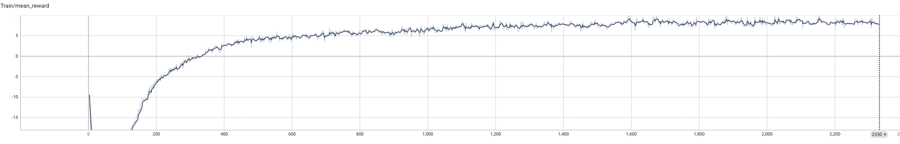

# 陆吾

## IsaacLab 四足速度任务说明（Observations / Actions / Rewards）

本文整理以下配置与实现：

* 环境配置：`source/luwu/luwu/tasks/locomotion/robots/velocity_env_cfg.py`
* 本地 MDP 扩展：`source/luwu/luwu/tasks/locomotion/mdp/rewards.py`
* IsaacLab 通用项：`isaaclab/envs/mdp/{observations,rewards,actions}`
* IsaacLab 速度任务项：`isaaclab_tasks/manager_based/locomotion/velocity/mdp/rewards.py`

## 1. 符号约定

* 机体基座线速度：$\mathbf{v}_b = [v_x, v_y, v_z]^\top$
* 机体角速度：$\boldsymbol{\omega}_b = [\omega_x, \omega_y, \omega_z]^\top$
* 关节位置/速度/力矩：$\mathbf{q}, \dot{\mathbf{q}}, \boldsymbol{\tau}$
* 关节默认位置/速度：$\mathbf{q}_0, \dot{\mathbf{q}}_0$
* 命令速度：$\mathbf{c} = [v_x^{cmd}, v_y^{cmd}, \omega_z^{cmd}]^\top$
* 投影重力向量：$\mathbf{g}_b$

强化学习每步总回报为加权和：

$$
R_t = \sum_k w_k \cdot r_k
$$

其中 $w_k$ 来自 `RewardsCfg` 的 `weight` 。

## 2. Observations

该环境包含两个观测组： `policy` 与 `critic` 。

### 2.1 共享物理量定义

* 基座线速度：$\mathbf{o}_{lin} = \mathbf{v}_b$
* 基座角速度：$\mathbf{o}_{ang} = \boldsymbol{\omega}_b$
* 投影重力：$\mathbf{o}_{g} = \mathbf{g}_b$
* 速度命令：$\mathbf{o}_{cmd} = \mathbf{c}$
* 关节相对位置：$\mathbf{o}_{q} = \mathbf{q} - \mathbf{q}_0$
* 关节相对速度：$\mathbf{o}_{\dot q} = \dot{\mathbf{q}} - \dot{\mathbf{q}}_0$
* 关节输出力矩：$\mathbf{o}_{\tau} = \boldsymbol{\tau}_{applied}$
* 上一控制步动作缓存：$\mathbf{o}_{a^-} = \mathbf{a}_{last}$

### 2.2 Policy 观测（带噪声）

`policy` 组启用 `enable_corruption=True` ，并将所有项拼接（ `concatenate_terms=True` ）。

| 观测项 | 物理含义 | 额外处理 |
| --- | --- | --- |
| `base_lin_vel` | 基座线速度 $\mathbf{v}_b$ | 噪声 $\epsilon \sim U(-0.1, 0.1)$ |
| `base_ang_vel` | 基座角速度 $\boldsymbol{\omega}_b$ | `scale=0.2` ，噪声 $U(-0.2, 0.2)$， `clip=(-100,100)` |
| `projected_gravity` | 机体系重力投影 $\mathbf{g}_b$ | 噪声 $U(-0.05, 0.05)$， `clip=(-100,100)` |
| `velocity_commands` | 速度命令 $[v_x^{cmd}, v_y^{cmd}, \omega_z^{cmd}]$ | `clip=(-100,100)` |
| `joint_pos_rel` | 关节偏移 $\mathbf{q}-\mathbf{q}_0$ | 噪声 $U(-0.01, 0.01)$， `clip=(-100,100)` |
| `joint_vel_rel` | 关节相对速度 $\dot{\mathbf{q}}-\dot{\mathbf{q}}_0$ | `scale=0.05` ，噪声 $U(-1.5, 1.5)$， `clip=(-100,100)` |
| `last_action` | 上一控制步动作 | `clip=(-100,100)` |

> 维度（本任务）约为：$3+3+3+3+12+12+12=48$。

### 2.3 Critic 观测（无噪声）

`critic` 使用更“干净”的状态，并额外包含力矩观测：

* 与 `policy` 共享：`base_lin_vel`、`base_ang_vel(scale=0.2)`、`projected_gravity`、`velocity_commands`、`joint_pos_rel`、`joint_vel_rel(scale=0.05)`、`last_action`
* 额外项：`joint_effort(scale=0.01)`，即 $\boldsymbol{\tau}_{applied}$

> 维度（本任务）约为：$48+12=60$。

## 3. Actions

当前动作项为 `JointPositionAction` ，控制 12 个关节（FR/FL/RR/RL 的 hip/thigh/calf）。

### 3.1 动作映射

IsaacLab 关节动作预处理为仿射变换：

$$
\mathbf{a}_{proc} = \mathbf{a}_{raw} \odot \mathbf{s} + \mathbf{o}
$$

本任务配置：

* `scale = 0.25`
* `use_default_offset = True`，即 $\mathbf{o} = \mathbf{q}_0$
* `clip = [-100, 100]`

因此每个关节目标位置可写为：

$$
q_i^{target} = \mathrm{clip}\left(q_{0, i} + 0.25\, a_i, \, -100, \, 100\right)
$$

然后通过 `set_joint_position_target(...)` 下发给低层控制器。

## 4. Rewards

下表给出 `RewardsCfg` 中实际启用项。

| 奖励项 | 权重 $w_k$ | 物理含义 | 公式（未乘权重） |
| --- | ---: | --- | --- |
| `track_lin_vel_xy` | `+2.0` | 跟踪 $x, y$ 线速度命令 | $r=\exp\left(-\frac{\lVert \mathbf{v}^{cmd}_{xy}-\mathbf{v}_{b, xy}\rVert_2^2}{\sigma^2}\right), \; \sigma=0.5$ |
| `track_ang_vel_z` | `+1.5` | 跟踪偏航角速度命令 | $r=\exp\left(-\frac{(\omega_z^{cmd}-\omega_{b, z})^2}{\sigma^2}\right), \; \sigma=0.5$ |
| `base_linear_velocity` | `-2.0` | 抑制机体竖直窜动 | $p=v_{b, z}^2$ |
| `base_angular_velocity` | `-0.05` | 抑制横滚/俯仰角速度 | $p=\omega_{b, x}^2+\omega_{b, y}^2$ |
| `joint_vel` | `-0.001` | 抑制关节高速摆动 | $p=\sum_i \dot q_i^2$ |
| `joint_torques` | `-2\times10^{-4}` | 抑制大力矩输出 | $p=\sum_i \tau_i^2$ |
| `action_rate` | `-0.1` | 抑制动作抖动 | $p=\sum_i (a_i-a_i^-)^2$ |
| `dof_pos_limits` | `-1.0` | 惩罚超出软限位 | $p=\sum_i\Big[\max(q_i^{min}-q_i, 0)+\max(q_i-q_i^{max}, 0)\Big]$ |
| `energy` | `-2\times10^{-5}` | 近似机械功率惩罚 | $p=\sum_i |\dot q_i|\, |\tau_i|$ |
| `flat_orientation_l2` | `-2.5` | 保持机体水平 | $p=g_{b, x}^2+g_{b, y}^2$ |
| `joint_pos` | `-0.7` | 静止时约束回默认位 | $p=\lVert \mathbf{q}-\mathbf{q}_0\rVert_2$，当 $\lVert\mathbf{c}\rVert\le0$ 且 $\lVert\mathbf{v}_{b, xy}\rVert\le0.3$ 时放大为 $5p$ |
| `feet_air_time` | `+2.0` | 鼓励足端有效腾空步态 | $r=\sum_i (t^{last}_{air, i}-0.5)\, \mathbb{1}^{first\_contact}_i$，且仅在 $\lVert\mathbf{c}_{xy}\rVert>0.1$ 时生效 |
| `air_time_variance` | `-1.0` | 惩罚四足相间时间差异过大 | $p=\mathrm{Var}(\mathrm{clip}(t^{last}_{air}, \max=0.5))+\mathrm{Var}(\mathrm{clip}(t^{last}_{contact}, \max=0.5))$ |
| `feet_slide` | `-0.1` | 惩罚触地滑移 | $p=\sum_i \lVert \mathbf{v}^{foot_i}_{xy}\rVert_2\, \mathbb{1}(\lVert\mathbf{F}^{foot_i}\rVert>1.0)$ |
| `undesired_contacts` | `-1.0` | 惩罚机身/大腿等非足端碰撞 | $p=\sum_{j\in\mathcal{B}} \mathbb{1}(\max_t\lVert\mathbf{F}_j(t)\rVert>1.0)$ |

其中 `undesired_contacts` 的 $\mathcal{B}$ 为： `head.*` , `.*_hip` , `.*_thigh` , `.*_calf` 。

## 5. `RobotRoughEnvCfg` 覆写（与基类差异）

`RobotRoughEnvCfg` 会对奖励做以下调整：

* `feet_air_time.weight`: `2.0 -> 0.01`
* `undesired_contacts`: 关闭（`None`）
* `dof_pos_limits.weight`: `-1.0 -> -0.0002`
* `track_lin_vel_xy.weight`: `2.0 -> 1.5`
* `track_ang_vel_z.weight`: `1.5 -> 0.75`

即粗糙地形下更强调“速度跟踪稳定性”，弱化足端腾空和限位惩罚强度。

## 6. Sim2Real

### 6.1 动力学域随机化（Domain Randomization）

#### (1) 接触材质随机化（摩擦/恢复系数）

在 `startup` 事件中，先生成材质桶，再随机分配到各个几何体：

$$
[\mu_s, \mu_d, e]^{(k)} \sim \mathcal U\big([l_s, l_d, l_e], [u_s, u_d, u_e]\big), \quad k=1, \dots, K
$$

$$
b_{n, j}\sim \mathrm{Unif}\{1, \dots, K\}, \quad [\mu_s, \mu_d, e]_{n, j}=[\mu_s, \mu_d, e]^{(b_{n, j})}
$$

覆盖地面摩擦不确定性、触地回弹差异。

#### (2) 基座质量随机化（载荷不确定性）

质量更新为：

$$
\Delta m \sim \mathcal U(m_{min}, m_{max}), \quad m' = \max(m_0 + \Delta m, \; m_{\mathrm{floor}})
$$

惯量按质量比缩放：

$$
r = \frac{m'}{m_0}, \quad \mathbf I' = r\, \mathbf I_0
$$

覆盖电池/外设/背载带来的总质量与惯量变化。

#### (3) 基座质心随机化（装配偏差）

$$
\Delta \mathbf c=[\Delta x, \Delta y, \Delta z], \quad
\Delta x\sim\mathcal U(-0.05, 0.05), \; \Delta y\sim\mathcal U(-0.05, 0.05), \; \Delta z\sim\mathcal U(-0.01, 0.01)
$$

$$
\mathbf c' = \mathbf c_0 + \Delta \mathbf c
$$

覆盖机体内部配重和装配误差导致的质心漂移。

### 6.2 重置随机化（Initial-State Randomization）

#### (1) 根状态随机化

$$
\mathbf p' = \mathbf p_0 + \mathbf o_{env} + \Delta \mathbf p, 
\quad
\Delta \mathbf p\sim\mathcal U(\text{pose\_range}_{x, y, z})
$$

$$
\mathbf q' = \mathbf q_0 \otimes \mathrm{quat}(\Delta\phi, \Delta\theta, \Delta\psi)
$$

$$
\mathbf v' = \mathbf v_0 + \Delta\mathbf v, 
\quad
\Delta\mathbf v\sim\mathcal U(\text{velocity\_range})
$$

覆盖上电姿态偏差、初始速度偏差、放置误差。

#### (2) 关节状态随机化（按比例）

$$
\mathbf q' = \mathrm{clip}(\mathbf q_0 \odot \mathbf s_q, \; \mathbf q_{min}, \mathbf q_{max}), 
\quad
\mathbf s_q\sim\mathcal U(0.5, 1.5)
$$

$$
\dot{\mathbf q}' = \mathrm{clip}(\dot{\mathbf q}_0 \odot \mathbf s_{\dot q}, \; -\dot{\mathbf q}_{max}, \dot{\mathbf q}_{max}), 
\quad
\mathbf s_{\dot q}\sim\mathcal U(0, 0)
$$

覆盖编码器零点偏差与初始构型偏差。

### 6.3 扰动注入（Disturbance Injection）

#### (1) 周期性“推搡”扰动（速度脉冲）

每隔 10–15s 注入一次根速度增量：

$$
\Delta v_x, \Delta v_y \sim \mathcal U(-0.5, 0.5), \quad
\mathbf v_{root} \leftarrow \mathbf v_{root}+\Delta\mathbf v
$$

模拟外力冲击和不可建模扰动，提高恢复能力。

#### (2) 外力/外力矩注入接口

$$
\mathbf f, \boldsymbol\tau \sim \mathcal U([f_{min}, \tau_{min}], [f_{max}, \tau_{max}])
$$

可模拟持续外载。

### 6.4 观测噪声注入（Sensor/Estimator Gap）

对 `policy` 观测施加均匀噪声：

$$
\tilde{\mathbf o} = \mathrm{clip}(s\mathbf o + \boldsymbol\epsilon, \; o_{min}, o_{max}), 
\quad
\epsilon_i\sim\mathcal U(n_{min}, n_{max})
$$

模拟 IMU、关节状态估计噪声，降低对理想仿真状态的过拟合。具体噪声区间见上文第 2 节（ `base_lin_vel` 、 `base_ang_vel` 、 `projected_gravity` 、 `joint_pos_rel` 、 `joint_vel_rel` ）。

### 6.5 命令分布随机化（Task Randomization）

命令每 10s 重采样：

$$
v_x^{cmd}, v_y^{cmd}, \omega_z^{cmd}\sim\mathcal U(-1, 1)
$$

并以概率 $p_{stand}=0.02$ 置零：

$$
\mathbf c = \mathbf 0 \quad (\text{with prob. }0.02)
$$

覆盖更广运动分布（起停/转向/侧移），提升泛化。

### 6.6 地形课程学习（Progressive Curriculum）

当启用 `terrain_levels` 时，按行走效果调节地形难度（ `terrain_levels_vel` ）：

$$
d = \|\mathbf p_{xy}-\mathbf o_{xy}\|_2
$$

$$
\text{move up: } d > \frac{L_{terrain}}{2}
$$

$$
\text{move down: } d < 0.5\, \|\mathbf c_{xy}\|_2\, T
$$

从易到难逐步暴露地形复杂度，减少策略在真实粗糙地面失稳。

### 6.7 执行器友好正则（间接 Sim2Real）

通过奖励抑制硬件不友好的控制行为：

$$
\mathcal L_{rate}=\sum_i (a_i-a_i^-)^2, 
\quad
\mathcal L_{\tau}=\sum_i \tau_i^2, 
\quad
\mathcal L_{energy}=\sum_i |\dot q_i|\, |\tau_i|
$$

降低高频抖动、过大力矩和高功耗动作，减小电机饱和与热负载风险。

## 训练

训练迭代 2300 多步后的 mean reward 曲线如下：

